### 第一个案例：温童凯

这个案例是我今天所有案例里，我自己最感慨的。来自于我们一堂的同学，温童凯，大家都叫温校长。

温校长在山西一个三四线城市的大学城，依赖大学生推广、做针对大学生的**驾校培训业务**，已经做了十几年，业务做的有声有色。

咱们今天就来看看，就这么一个传统得不能再传统的业务，他是怎么用 AI 的。

温校长的起点可能是全场案例里最低的——**一个从来没编过程、打字都用两个指头的山西驾校校长**，愣是自己一个人、几个月时间，给公司捣鼓出一个系统，让上百个学生代理天天用。他自己说：**"我们好像已经成了山西唯一一个有小程序的学生组织"。**

直播间的很多同学，基础条件要比温校长强得多，但是可能很多都还迟迟没动手 vibe coding 出一个像样的东西，甚至在一堂，我反复和内部强调，也还是有很多同学没有迈出第一步。

所以，这个案例你们好好听，我来带你们感受一下，一个人怎么从"完全门外汉"，走到敢做"自己以前想都不敢想的事"。

温校长在山西做驾校。他第一次正式想用 AI做事，是从"龙虾"开始的——当时大家都在聊，openclaw、vibe coding、skill、agent这些词他一个也听不懂。但是他发现很多一堂同学，都拿龙虾做了很多高级的事情。

他心里偶尔也会想，"大家都在用，我是不是也得尝试一下？"但是总是因为这样那样的借口没有动起来。

你们刚开始接触AI的时候是什么感觉？我观察很多人，一边觉得 AI 一定是未来，一边又觉得学习AI很难，于是就一直观望，一直没有动手，然后就越来越焦虑。

真正让温校长焦虑的，是26 年一堂春季马拉松要讲10小时大课" AI 操作系统"。他怕 10 小时跟不上课程，**提前花两周时间补各种名词解释，虽然懵懵懂懂，但是大概对什么是 API、什么是上下文、什么是RAG这些，稍微有了一些了解。**

后来在一堂城市中心线下听课时，好多人都是蒙的，他说："他也是咬着牙听完的，这还得多亏他提前了解了这些基础常识和专业术语"。

补完课他上手试，上来就先栽了个跟头。

飞书的龙虾出来，他抓了好几只，让它给自己搭多维表格。做了一上午，下午再问，全忘了。他跟龙虾吵了好半天："明明在上面，你为什么忘了呢？"**最后实在无奈，觉得确实不好用。**

这次失败没让他退场，他去四处找人问，有人告诉他，要用AI就用国外最好的模型，目前工作上最好用的模型就是Claude。

他当时想，如果连最好的模型都不好用，那可能AI是真不行，所以就打定主意试一试。

但为了用上Claude，他说自己花了一两个星期的时间，处理一大堆"鸡零狗碎"：**IP问题、账号、充值、网络稳定，全是障碍。终于装上了，Claude 还动不动蹦英文。**

其实，我们教研同学当年也卡在类似这一堆问题上，但一堂毕竟有技术团队，安装的问题很多都提前解决了，但温校长跟前没有人。

他说自己有一两个星期，**每天干到凌晨三四点，什么大的业务上也没进展，就是去解决这些鸡零狗碎的问题。人哪不懂，就截图问AI，问完操作完再截图问，就是来来回回的搬砖。**讲到那段日子他自己都笑："你让我现在想，我都不知道自己当时是不是疯了，怎么那么执着。"

哈哈，这里真的忍不住给大家讲个有意思的细节。温校长访谈的时候提到，他一直**以为大家嘴里的龙虾Claw（克劳），就是 Claude（克劳德），**因为"龙虾这个词和克劳德还挺像"。

所以，AI First 不是遇到一个大问题就让 AI 一次性解决，实际上，刚开始很可能就是这么碎、这么笨：看不懂就问，说不清就截图，用AI把一个个小卡点解掉。

鸡零狗碎处理完，他开始往业务上用。

驾校获客靠大学生团队，因为一届一届流动，已经加入的老员工还需要持续发展新人加入，所以温校长需要持续培训团队。

他每周六日要给学生做六个小时培训——上午讲一堂的转化率课，下午让学生跟真人练，找学校小网红聊、扩充校园代理，现场遇卡点现场解决。

以前这个练习环节，他也模仿一堂线下，做小组共创，但最终要落在业务上，所以最后他会给出他的解法。但是学生们问题很多，他一次最多分析三四个人，多了就顶不住。

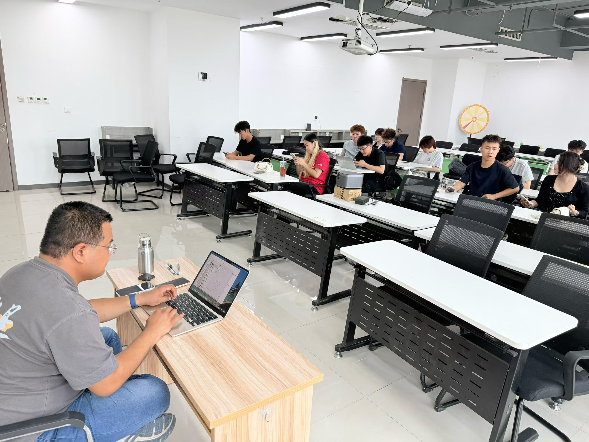

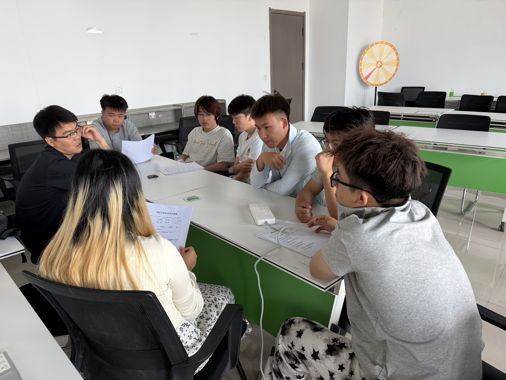

这一回他换了个动作：**把一堂转化率的课，一页一页截图，整段喂给 Claude，跟它说"你是转化率专家，擅长一堂工具的使用"。培训现场，团队把和转化对象的真实聊天被卡住的截图发过来，他直接扔给 Claude 分析。**

他回忆，当时让他特别意外的一个分析。Claude 会说"你看他发了这个表情，证明他对你并不反感，你可以继续跟他去聊"。温校长说，**自己肯定是做不到这么细颗粒度的洞察和分析的。**

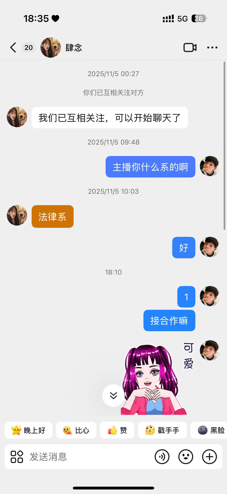

Claude不仅分析的细致，还很快。他说当时自己的虚荣心都起来了，让大家尽量多聊，尽量多说自己的卡点。当时就觉得，"**好像AI把自己放大了好多倍，好像自己解答能力很强，速度很快，其实是 AI 解答的**"。

这就是温校长第一次体验到AI的震撼，瞬间觉得**"世界都变了"。**飞轮也就这么启动了。爽感一起，信心就外溢。他甚至有过一个念头："**带人太累，我和 AI 就足够了，学生们只是干我和AI干不过来的、最基础的活就行**"。

马拉松大课学完，他发现大家都在用 AI 编程，自己却还停在 Chat 时代，**"我也想让他干活，并且我手里边的活还挺多。"**

他在想，能不能给自己的业务想做个系统，开放给自己的上百号学生团队，可以做业务管理、培训、结算等等一系列功能。5月份的MBA 初阶营，他当助教，和现场的同学交流，结果有同学跟他说"**这个复杂度特别高，你大概率做不出来**"。

被打击了一波，他并没有多大的信心，但他还是回去试了，他说**"不行就不行呗，反正试一试也没啥"。**

哈哈，接下来这段，如果不是温校长自己说，我作为一个计算机专业的人，可能真想不到他会遇到这么多的卡点。

不会 Claude Code 之前，他靠的是"**传话式编程**"：**每写一句话截个图，Claude 发一段，他再复制进终端，来来回回。**

我不知道大家有没有用过终端，很多时候你打开他的你输入完了界面多了一些字符然后不动了，温校长对着这个界面，不知道是它跑着跑着不动了坏了，还是已经完成了，最后还是问豆包才知道"你只要看它出现% 的时候，应该就完成了"。

后来，他总在视频号上看到别人的claude都能自己自动编程，不用自己来回截图、复制粘贴，他就有点好奇，跑去问自己的claude："**为啥他们的claude能干，你不能干**？"

Claude 告诉他："我是 Claude，不是 ClaudeCode，你编程需要下载ClaudeCode。"

于是，**他就在 Claude 帮助下一步步装上 ClaudeCode。**

哈哈哈，温校长的表达特别有意思，他说：**"ClaudeCode 一装上，世界就变了。他从一个站在你旁边说的角色，变成帮你干的角色。**"

有了ClaudeCode，以为就顺手很多，结果还是问题不断。

当时一通鼓捣，编程出来了一个页面，但是点来点去，发现根本不能运行。结果AI告诉他，**需要做后端**。他说当时自己都蒙了，**问AI啥是后端，AI跟他说是做数据管理。**

一听是数据，温校长想都没想，就问能不能放到飞书表格上，因为看到一堂这样的先进团队都用飞书，应该以后会有很大价值。

AI说可以，但是新问题又来了，因为涉及到一个新的工具，Claude 说"我不能帮你干"，他就又开始自己上。飞书机器人、API、域名、版本号，**每一步又回到截图问的老办法。**

费劲千辛万苦，终于把第一版弄出来了，虽然功能只是大家登陆以后，能够看到团队里有哪些人。他逼全员上系统，谁有问题发截图、他转给 AI 修，三五天之后终于彻底解决了登录问题。他说自己到现在不敢轻易打开，**"我害怕给它改乱了"**。

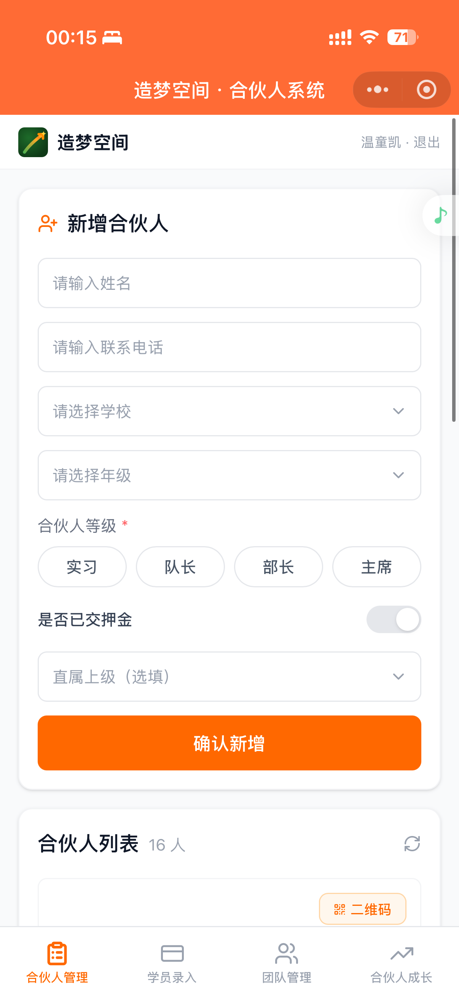

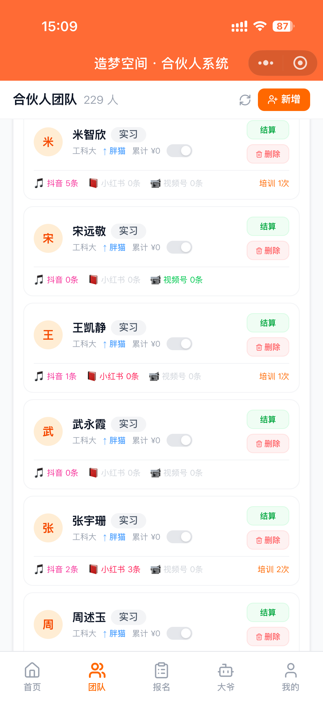

但是不管怎么说，当初同学说不可能的想法已经确确实实用最笨的方法做出来了，他说**当时觉得"全世界自己都能做出来"。**

第一版系统，其实只能登录、看个组织架构，多一个有用的功能也没有。有了前面的尝试，温校长决定要把这个系统做得更有用一些。

他最先做的功能是AI客服。当时，客服主管准备离职，无心工作，处理问题质量下滑，新招的客服还没能很好的接手，有驾校学员来投诉，团队解决不了，问题最后全堆到温校长这儿。

他决定自己上，做个AI客服。他先接 DeepSeek，然后自己试着把投诉问题发给AI，结果发现回答很差，想了想意识到这是因为**AI不懂自己的业务**。

这个阶段，也是一堂双三角第一次在他这儿落地。他开始从双三角的角度想，自己能怎么提高AI客服的水平：

- AI不明确场景，他就告诉他，他们是做什么的、客服功能要解决什么问题
- AI不会做客服，他就让 AI 参考淘宝京东的客服 + 非暴力沟通承接情绪
- AI缺真实数据，他把最近3-5天的真实聊天记录喂进去，发现回答开始变好，又花钱把半年企业微信聊天记录买回来一次性扔进去
- ……

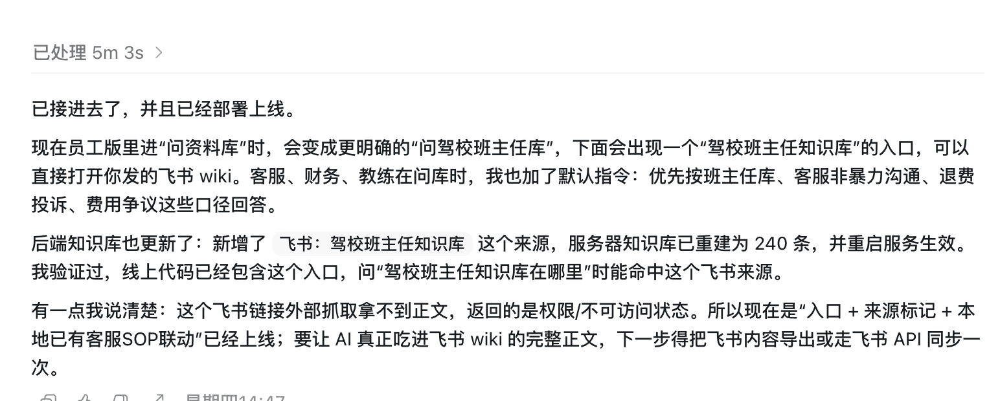

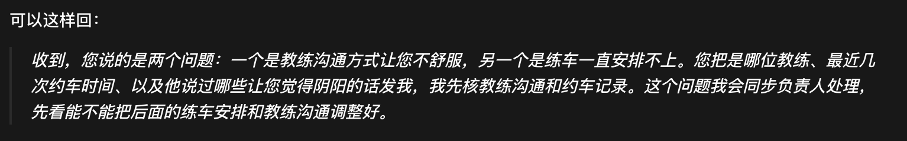

这是他第一次意识到双三角的价值，他说：**"如果没有双三角，我就是乱打，有了双三角，可能我刚开始会慢，但是我加速度一定会快"。**

后来，**信心越来越足，温校长又开发了数据提报、招生排行的功能。**每天学生需要自己在系统里提报自己聊了多少人，有多少人在跟进，有多人已经成功转化，如果不提交，系统的机器人还会触发提醒。

他当时觉得这个功能特别好，对于了解业务进程一目了然。但是功能做出来，大家都不用、有的虽然用，也是胡编乱造，数据造假，他试过让大家加截图加链接，但是大家就更不爱用了。

直到看到那阵子很火的《置身钉内》那篇长文，他突然意识到一件事，他把自己的系统当成一个大钉钉了，**只盯着结果监工，但是没给大家作业务的抓手。要让大家愿意用，系统得先对大家有价值。**

他又想到了之前线下培训的场景，能不能做一个功能，让大家把问题截图丢到系统里，然后AI可以帮助分析、解答呢？

于是，他开始加问答功能，只要上传截图，说出困扰，AI就给下一步的指导。这样既能让大家填一个结果，也能真正帮助大家解决业务问题；同时，他又加了激励机制，鼓励大家持续使用。

结果，大家的使用积极性大大提高，一个暑假，**几百个人的成交聊天截图喂进去，有效的聊天话术被沉淀了，而且基于这些话术，AI还能提出更多的可能性，形成了假设池。**用温校长自己的话说："**没想到我们自己就把自己的AI销售教练给练出来了**"**。**

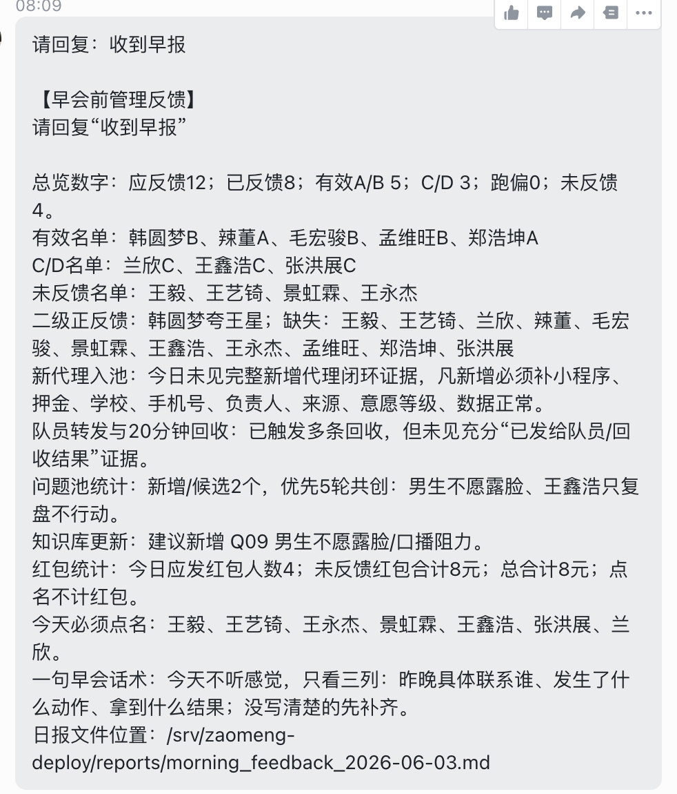

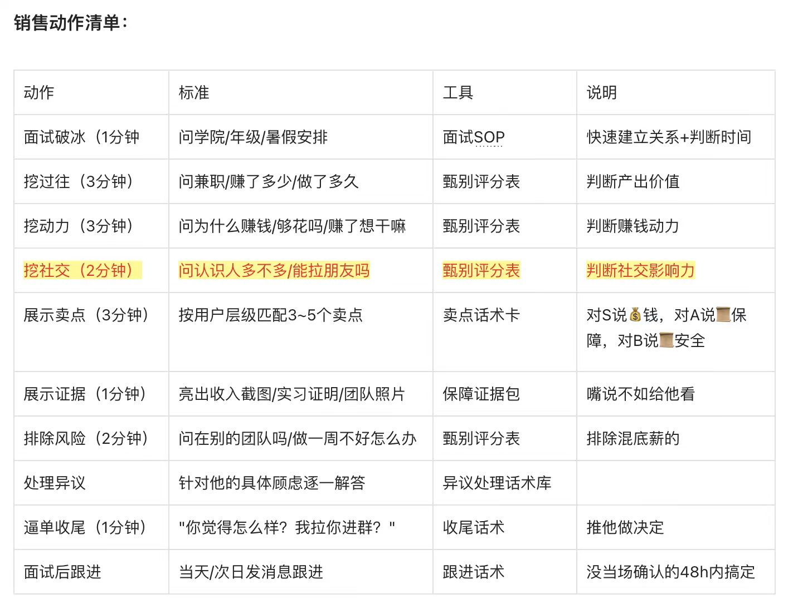

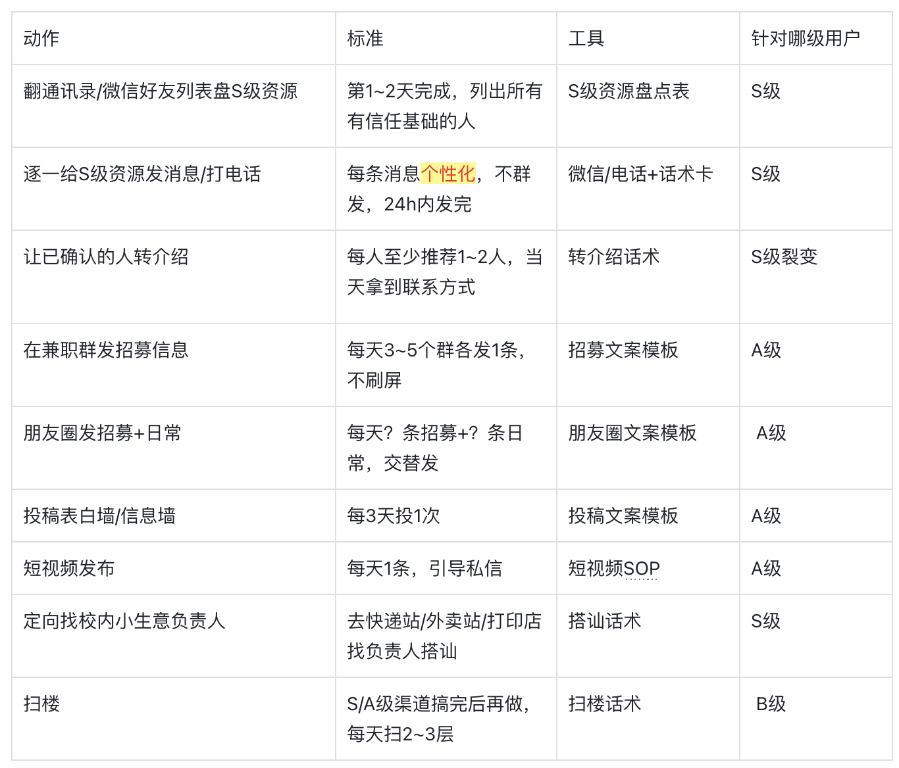

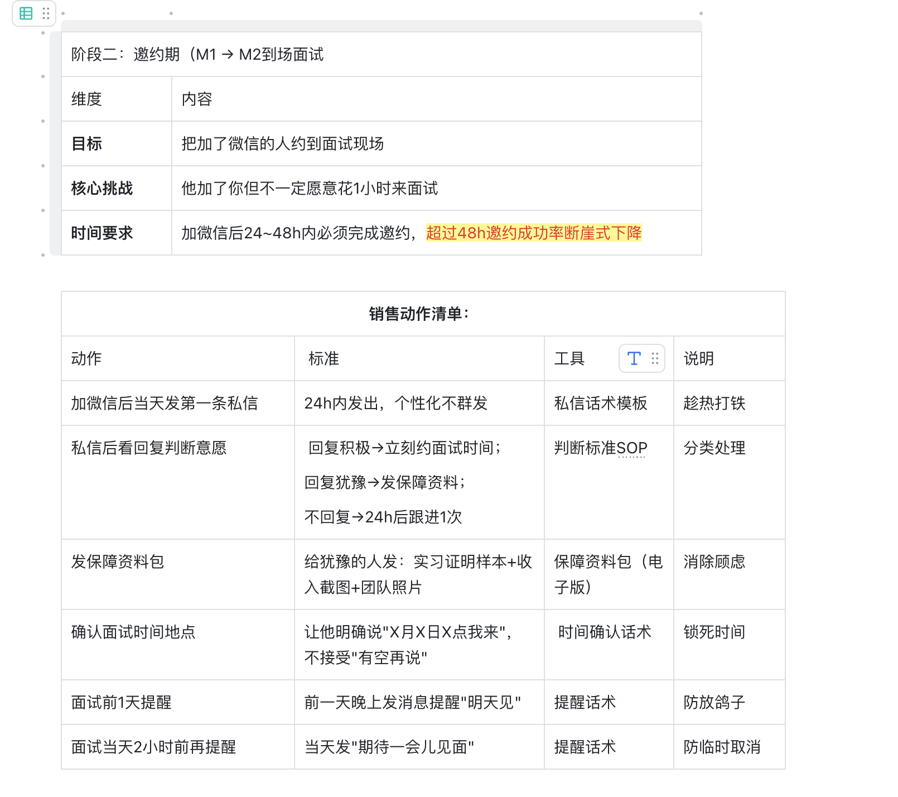

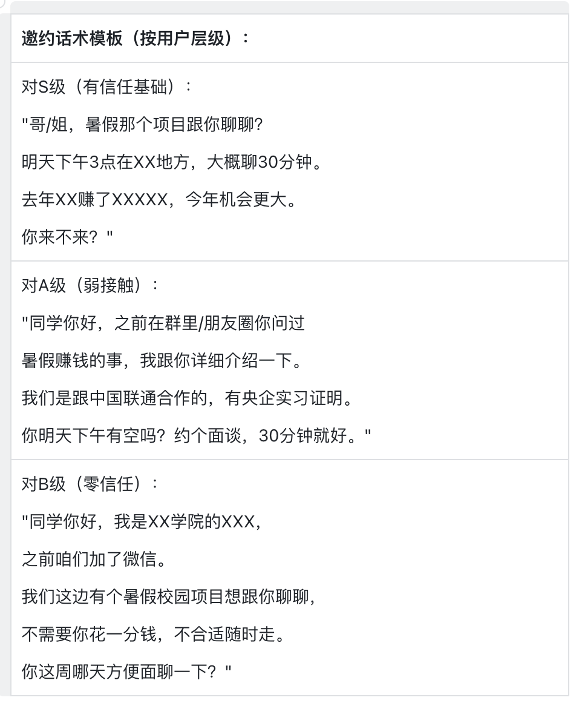

温校长越来越有信心，开始做了更多的双三角的积累东西，尤其是学了一堂的AI数据第一课，最近又做了一件事，就是"**把数据存下来**"。他告诉我们，他的电脑现在每天是全天24小时不关机，会把他办公室射程范围内所有的音都给录下来，然后再让AI去处理，去积累原始沉数据的沉淀。

现在，温校长的系统升级成了校园合伙人平台，除了驾校业务，他们还新增了校园卡、电话卡的业务。

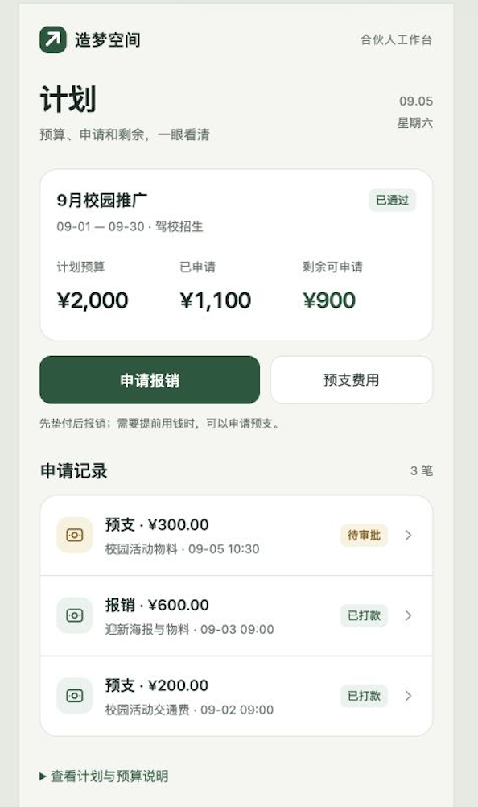

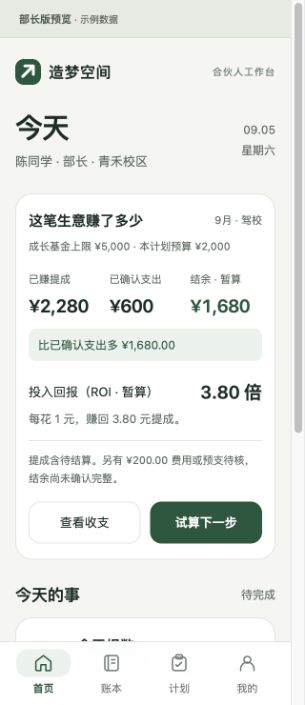

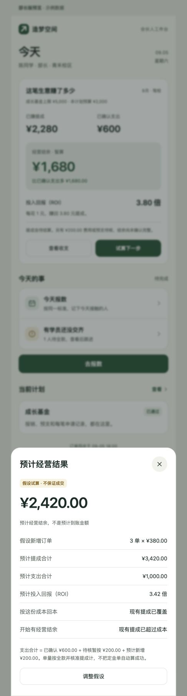

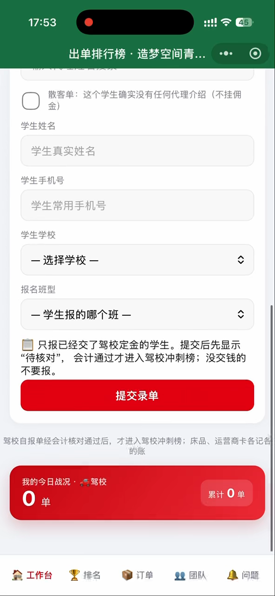

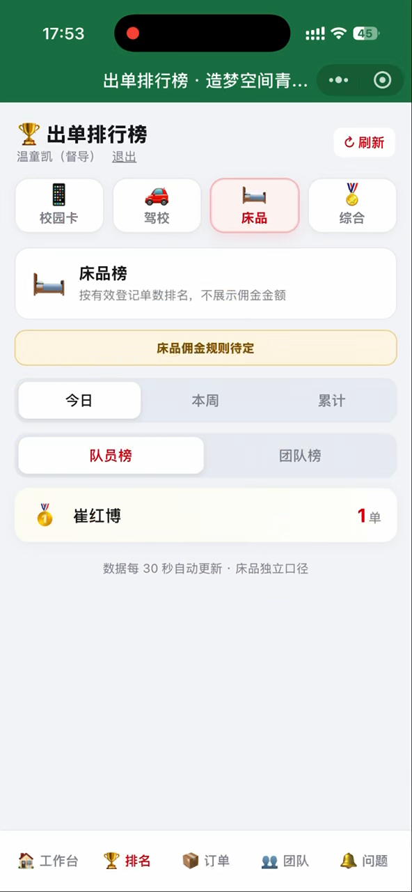

访谈的时候，温校长说，**如果以前靠自己做，那是绝对不可能的**，**如果找别人做，不知道要花多长时间、多少钱**。他也没想到，就靠着这么一点一点往前拱，他一个人，从 5 月开始做到暑假，先把一个能用的版本做了出来。

现在，他不仅是山西第一个有小程序的学生组织，甚至前不久，他还顺手帮一堂另一个同学 vibecoding了一个小工具，而且还收到了很好的反馈。

回头来看，温校长这一路，飞轮是怎么转起来的？

最开始，一旦下决心要做，就耐着性子去磨，而不是做两下不成就放弃了。**不懂概念就用AI补概念、不会安装用AI教自己装工具**，用 AI 在培训现场拿到爽感，感觉自己被"放大好多倍"，建立信心觉得"世界都变了"。

因为有了信心，他敢去挑战别人说"大概率做不出来"的系统。**用最笨的方法，"对话-执行-截图"的方式**，先做出了前端。当页面真的出现了，他又获得了更大的爽感，觉得**"世界都能做"**。

接着，他又开始**从最小的功能开始做起**，开始尝试用双三角去思考，开始补审美、补基本功、补真实数据，把 AI 变成客服和销售教练，让平台真正进入团队的业务过程。

温校长这一路，就是这样，信心被一次次真实结果推起来，飞轮才真正转起来。