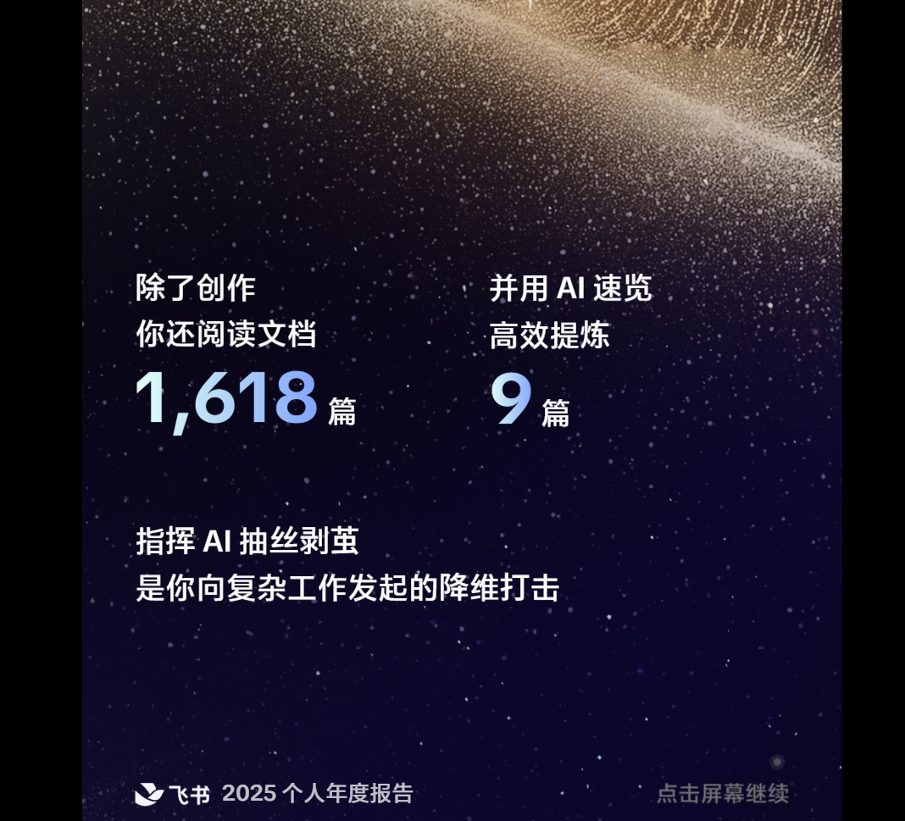

### 第二个案例：张伟强

接下来这个案例，来自于我们一堂的同学，叫张伟强。

这个案例，在我们今天所有的马拉松案例里，可以算**是最特别的。**我自己最感慨的，就是他在条件不占优势的情况下，在 AI 上取得了非常大的突破。

伟强不是程序员、不是互联网公司的员工，也不是想用AI做一人公司的创业者。他在体制内做招商和企业研判，是个AI爱好者，但身边几乎没有人天天跟他讨论 AI，也没有一个团队在后面推着他练。

就是这样一个人，现在在当地体制内的系统里，已经被周围人认为是**最会用 AI 的人**。他从一开始只会打开网页聊几句，到后来把自己的企业研判方法拆成流程、规则、知识库和 Skill，做深度报告、批量建档，甚至开始带着别人一起用。

这个案例最值得学的，不是最后用了哪个模型，用了什么工具，而是在一个没有AI土壤和环境的情况下，一个人的信心是怎么被一次次真实结果推起来的。

所以今天我不只是给你们介绍伟强做了什么。我想带你们感受一下：一个人怎么从“相信 AI 是趋势”，走到“相信 AI 对我的核心工作真的有用”；又怎么把这份信心，变成规则、数据、工作流和持续的产能。

伟强在体制内，工作之一是做招商。简单说，就是各种企业想落地到当地、想跟政府合作，他负责对这些企业做背景研判，判断项目靠不靠谱、值不值得跟进。

大家感受一下这个工作的麻烦程度：

- **调研信息散乱：**信息散落在无数个平台—— 企查查、专利检索、官网、公开报道，各个信源对不上是常态。
- **判断分析很难：**即便这么费劲，最后给出的结论，很多时候还是"感觉上行、感觉上不行"——很难给出真正有论据、有依据的科学判断。
- **数量多跨度大：**一个月要看二十几个项目，涉及各行各业，其中有一半的项目可能都要做深度的研究，并且出企业的调研报告。

这样的复杂程度，**非常依赖人的经验、调研能力、行业的知识储备**，不同的人来做差别很大。伟强算是比较有经验的，但即便是这样，他做一个企业的调研报告，至少也需要**一周左右**的时间，遇到复杂的项目，时间可能要更长。

关键是，这种判断要很谨慎，判断错了，后面招商、合作和资源投入都可能跟着错。

伟强其实很早就相信 AI。他觉得 AI 会带来类似工业革命的生产力变化，甚至可能比工业革命更深，因为工业革命主要替代批量制造，而 AI 会进入很多更高阶、更复杂的白领工作。

所以 GPT-3.5 出来的时候，他就想尽办法试过。他当时有一个很自然的想法：我把企业材料给 AI，再提几个问题，它是不是就能替我完成产业研究，给我一个有论据的判断？

但现实给他浇了一盆冷水。**模型回复慢，内容短，对话也不稳定，有时还会突然飙英文。**

这中间有一个很大的矛盾：一方面觉得 AI 一定是未来，另一方面每次真正动手，结果又没有那么好。

这是不是你们很多人的状态？看到短视频、公众号里别人用得很漂亮，可是一到自己的真实工作里，就没用到过什么高价值的场景。这个时候你们会怎么做？我观察，**很多人就放弃了，很快又回到原来的做法**。

伟强有一个很重要的地方不一样：结果不好，他还是会试，各种场景都先会试着让 AI 走一遍。他当时的心态就是，反正这一步也耽误不了多少时间，我先让 AI 做一轮，再决定接下来怎么做。

这个动作后来变成了他的** AI First 习惯**。

但是，到2024 年底，对他来说，实际AI有效的场景，主要还是**用AI搜集信息、整理内容、写通知和标准化公文**。

大约在 2025 年初，伟强接到一份《年产 1000 吨锑（tī）化镓生产基地建设项目》的材料，让他在**一周内**判断项目是否靠谱、是否值得继续跟进。

我估摸着咱们现场绝大多数人拿到这材料都得懵。“锑（tī）化镓”这三个字，普通人连念都不一定念得对。材料里有**大量专业术语，方向又窄，公开资料很少，短时间内也不知道应该找哪位专家。**

如果是以前，伟强可能要先花很长时间补课，可他连从哪里开始补都不确定。于是他做了一个很简单的动作：**把材料交给 AI，让 AI 从产业角度看这份项目说明是否自洽，指出可能的问题和需要进一步核实的地方。**

AI 很快给了他几个硬伤：

- 报告说产能 1000 吨，实际上全球需求量就几十吨，典型的供大于求；
- 这种原料要从矿渣里提纯，提纯比例极低，产能大概率达不到；
- 材料说 6500 万投资能产生 11 到 15 亿产值，但这完全取决于纯度和应用场景，很可能远没那么值钱。

一个原本完全没有入口的问题，突然有了可以继续查的方向。伟强沿着这些线索去找研究报告和公开数据，再做人工复核，发现其中几个硬伤基本抓得很准。**两天内**，就给这个项目出了一份报告。

伟强访谈的时候，跟我们说，如果没有AI，**这不是能不能提效的问题，是根本找不到切入点，解不了的难题**，所以可以称得上是他用AI**第一次真正意义上的"爽"**。

真正的爽，不仅仅是因为用AI提效，而是他发现AI能够**快速帮他提升能力**，让他在短时间吃透一个陌生行业，跟企业、跟行业专家平等对话。

后来，他要去拜访企业，遇到不懂的行业，就提前让AI快速做一轮研究，落成几页纸的要点，方便拜访的路上快速阅读和了解，大大缓解了拜访过程中对话驴唇不对马嘴、低效的情况。

你们感受一下这次转折背后的爽：之前他只是觉得 AI 可能很重要；这一次，是他用 AI 两年多以来，AI 不再只是写通知的工具，不再只是一个问答器，是第一次真真切切用AI在陌生产业研究里帮他找到突破口。

这个“爽感”非常重要**。很多人学 AI 学不下去，其实就是以为一直没有拿到过这种真实的正反馈**。你试了很多工具，却没有一次结果能让你觉得“它真的帮我解决了一个有价值的重要问题”。

有了第一次结果，伟强对 AI 的兴趣更浓了。他开始看公众号、视频和各种课程，看到新的工具和场景，就自己试一试。

正好那时候一堂开始AI 大航海活动，带大家一起用3个月时间学AI，把学的内容转化成“**一页纸教程**”。当时每周都会产生200-300篇教程。负责人于陆开始招募志愿者帮大家看稿、建知识库。

伟强二话不说直接报名了。

我们教研同学访谈他，还特别好奇：**为什么要报名？直接看最终入选知识库的精品，不是更高效吗？**

他说了一个特别打动我的原因：他在体制内，身边没人讨论 AI，学习只能靠线上教程。但教程展示的大多是完美的结果，他更想看大家背后**真实的过程**——能接触到一手的一页纸，价值巨大。

这个阶段他看了**1000+份**一页纸。什么概念？整个活动一共提交了 4000 多篇，最终知识库收录了 1900 多篇。我自己也就看了前200-300份。

关键是，他不但看得多，还**对着一页纸里的教程一步一步复刻**；遇到跳步的、跑不通的，就加上教程作者本人去请教。

你们再猜一下，看别人的一页纸，哪个环节对他的帮助最大？

其实不是那些光鲜的成功案例。恰恰是大量同学写的"我踩了个坑，后来这么解的"，或者"这事儿我搞不定"。

一做就成、一做就对的案例，看着爽，但往往会让你失望——因为你自己上手就不是这样。真实的体感，一定在探索的卡点里。大航海的一页纸，刚好全是这个。

半年看下来，两个大收获。

**第一，场景想象力被彻底打开了。**原来同学里有拿 AI 写歌的、做 PPT 的、哄娃的、帮孩子学习的……他也跟着做各种尝试，自己写了10+份一页纸。

**第二，也是更重要的，提升了自己的基本功。**他一边评审、一边复刻、一边踩坑，慢慢就明白了：

- 要让 AI 出好结果，首先你自己得知道什么是好的；
- 然后得能把做这件事的工作流拆清楚；
- 再复杂一点的任务，要给 AI 充分的上下文和清晰的提示词；
- 而且不同的模型、不同的工具，干同一件事的效果差别巨大。

我特别想把这一点讲给正在学 AI 的同学：你如果只看成功案例，很容易得到一种错觉，好像别人一上手就成了。其实真正能让你建立能力的，往往是那些“我这里踩了个坑”“这一步为什么不工作”“后来我怎么改”的过程。

基本功上来了，伟强不满足于只在聊天框里小打小闹了，他开始挑战当时极其火爆的 Coze（扣子）复杂工作流。

为了让招商研判的质量绝对稳定，他做了三个动作：

**第一，拆角色与工作流**：把研判拆成基础调研、信息核验、风险评估、报告输出四个阶段，让不同 Agent 协作。

**第二，把踩坑经验封装成规则**：以前发现 AI 容易被企业宣发材料带偏，他就改成“先跑公开数据，再交叉验证企业材料”；以前 AI 喜欢胡编财报，他就强制提示词要求“所有关键数据必须附带原始信源，并且信源分级”。

**第三，搭建专属数据库**：他自己硬生生搭了本地政策库、企查查信息库、历史报告库，给 AI 喂饱了精准的上下文。

虽然很努力，但结果折腾一大圈，演示效果不错，实际交付还是不行。每一步都是封装好的提示词，出了问题根本不知道哪个环节错了，只能反复调试做实验，ROI 很低。

但是，伟强有了双三角，心里倒是越来越踏实：每一个做过的动作都没有浪费。**那些有意识输入的审美、拆解的体系、喂养的数据，构成了他极其扎实的基本功底座。**

所以到了后来，当出现 Claude Code、 WorkBuddy 时，伟强就能比较顺利地把自己的招商研判能力，直接封装成 AI 的 Skill，甚至多模型解耦、批量并行跑。

那现在的伟强是什么状态？他现在已经是部门的**疑难杂症处理中心**。

企业研判，不管是多复杂的产业背景，交给他一个人半天时间就能搞定，而且不是简单的行不行，还会给出哪里有风险，下一步该怎么做。他还补充说，关键用 AI可以并行，所以半天只是运行时间，不代表他半天只能出一份，和原来动辄十天半个月比起来，效率不知道翻了多少倍。

咱们大家回过头来看看伟强的全过程，他的飞轮是怎么转起来的？

他在马拉松征文里写了一句话：

他的飞轮，不是靠什么天才顿悟，而是源于：

- **一个 AI First 的习惯，**换来了**第一次真实的爽感；**
- 带着爽感与好奇，在大航海**深度投入去阅读、去复刻、去踩坑**，提升了基本功，**有了AI 审美和体系拆解力**；
- 有了审美和体系，才真正**有底气去挑战复杂工作流、封装 Skill、建数据库**。

结果越好，他越笃定；越笃定，他越敢投入；越敢投入，他就越能做成过去想都不敢想的事。

伟强是从最开始只能在网页版随便聊聊的初学者，变成了现在整个体制内系统里最会用 AI 的专业高手。