### 第三个案例：蒋之之

这个案例的主人公叫蒋之之，是一位刚加入一堂**半年左右**的**新学员**。她现在在做日本跨境电商，2 年时间已经有了超千万的营业额。

很多人面对一些新工具，比如扣子的工作流，或者一些涉及到低代码平台的 Dify，试一下就放弃了。但是之之给我们带来的感动，**是她一次次地测试、发现不行，一次次地不放弃、依旧在往前探索。**

所以，在这个案例中大家可以**重点观察几个点：**
1. 她第一次是怎么感受到 AI 有价值的？
2. 接下来她每一次试错、每次学新工具以后，究竟留下了什么？
3. 她是怎么一步步给自己攒牌的？

大家可以在这个案例中体会一下，**她是怎么一路坚持到最后的。**

好，那我们先回到她最开始的工作现场。其实一开始，她对 AI 的理解也非常浅，只会跟 AI 聊天，也不会写代码。

她的业务背景就是做日本跨境电商的创业者。她自己的团队每天都要处理**几十条日文的售后信息**。员工要去查订单、查物流，判断客户的情绪，再决定要做什么样的处理

到底是退货还是退款，换货还是补发，最终是要用日文做回复的。

启动关键期，你们第一次动手的时候，怎么找一个特别小又特别容易建立信心的场景？

————————

之之刚开始接触 AI 的感受就是：“哇，AI 好厉害呀！”她巴不得想把自己所有的业务环节，比如选品、作图、上架、运营、售后，全部交给 AI。但是这个想法那么大，在她自己又一窍不通的情况下，根本不知道从哪下手。

她心想，可能一上来解决全部问题不太现实，要不尝试用这么一个小场景**让小闭环先跑起来**。

所以，她只能自己**尝试把问题缩小，再次缩小，缩到最小，**选择了**从售后里最小的“取消订单”这个场景开始**。

选择这个场景的原因是：它的规则相对明确，重复性也比较高，平时消耗员工和她自己的时间比较多。

选定场景之后，**她每周都在听 AI 俱乐部的分享**。当时于陆给很多小白的建议是：大家不用着急去使用各种各样的工具（比如龙虾什么的），而是要把**基本功练好，去好好练习系统提示词。**

第一次动手封装了一个几十句话的提示词给 AI，发现出来的效果一般；

于是，她也开始去听**《人工智能入门 -提示词必修课》**

接着，她就慢慢按照课里的**提示词的框架**，把更多细节给到 AI。

以前处理取消订单的**很多状态**其实是在脑子里的。通过这次系统提示词的打磨，**她拆出了业务本身的一些状态分类**，比如：还没有下单、已经下单但没发货、正在发货、已经发货了等环节，慢慢把脑子里的各种情况写清楚。

她把体系拆出来以后，提示词的效果，更好了一些。

接着，她还会跟**大模型讨论，不断优化提示词**，还用上了我们**一堂同学的 Agent 提示词优化助手**。反正就是通过各种手段，把提示词打磨到了一个**相对比较满意**的状态。效果也越来越好，基本上能够达到一个优秀的售后客服的水平。

**居然就这么一个小场景，提示词高达 5000 多字！**

大家猜结果怎么样？

**结果还不错，她封装到扣子里，真的跑通了**，让她感觉挺高兴的。

在做系统提示词的时候，她的一些**隐性知识认知、逻辑判断以及一些“ know-how ”就给挖出来了**。

其实里头大部分是她平时**跟员工说的那些很碎的东西**，现在因为使用 AI 的关系，倒逼她萃取出来了。

所以，经过这么一个小场景的跑通，通过封装提示词，她觉得使用 AI 好像没自己想象中的那么难了，好像自己确实能够做得到。**获得了一次真实的成功体验。她已经有了第一步的信心。**

之之启动有两个很好的点：

**第一，找到了一个最小的场景。**

**第二，找到了一个最简单的工作环境**，使用**提示词。**没有一上来就用各种复杂的工具。

所以，**就是用“最小场景”乘以“最小 Feature”做的**。于是信心增强了，她决定投入了更多的资源。

> Feature是一堂定义的，提升AI解题水平的的最小实践单位。

基本上，客服单纯地回应对方取消订单，在扣子上这 5000  字的提示词已经初步能实现了，还不错，但在真正的业务上没法用。主要存在两个最大的问题：

客户来找的时候，你并不知道对方是不是要取消订单，还是要退款，也可能是问快递或者问别的，你无法判断对方的意图，所以 5000 字的提示词覆盖不了。

取消订单的系统提示词得 5000字，再 做一个退款的，再做一个答疑的，还得查快递的，好几个场景下来，那就几万字了。但是相互之间是没法相互调用的。

虽然它表面上实现了 1.0，但在退换货这个场景里面是不能直接用的，**意图识别分类过程中的流转很重要**，**所以系统提示词这一层是不够的。**

因为解决不了所有的售后场景，**她开始往工作流升级了。**

> 因为她在使用扣子（Coze）的过程中，知道好像有工作流这么一个东西。

大家有没有使用过扣子工作流，**感受到它过程的繁琐吗？**

因为扣子工作流涉及到**输入输出、各种节点插件**，很多人尝试了一下，**因为繁琐而放弃了**。

但之之没有放弃。她自己去** B 站找各种课程**，**看官方的教材，**即便官方教程里**没有特别契合**自己场景的方法。

所以**她也靠自己一点点去测试。**

大家也可以看看，搭建出来的工作流是不是还挺吓人的。她也不知道用什么快捷的方式，**老老实实把每一个节点都做成了一个工作流**。所以这么一看，**有几十条工作流，几百个节点。**

 质量问题工作流

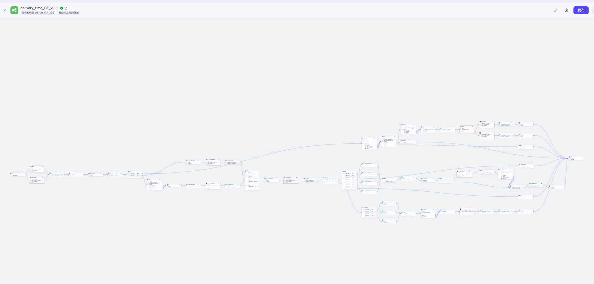

问期货工作流

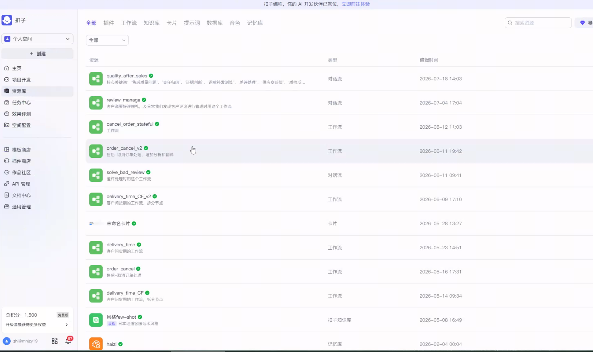

恰好碰到了 AI 俱乐部的专家花总分享，花总讲了一些工作流**并联、串联的逻辑**，所以她**又开始去优化这个工作流。**

同时你会发现，又按照刚才的经验，**把流程、认知、都显性化**，**中间还加了意图识别，**用户说的哪些话就流到了哪个工作流里，这套东西就串起来了。

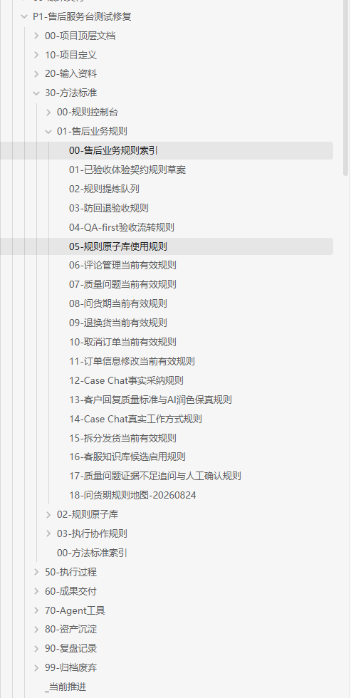

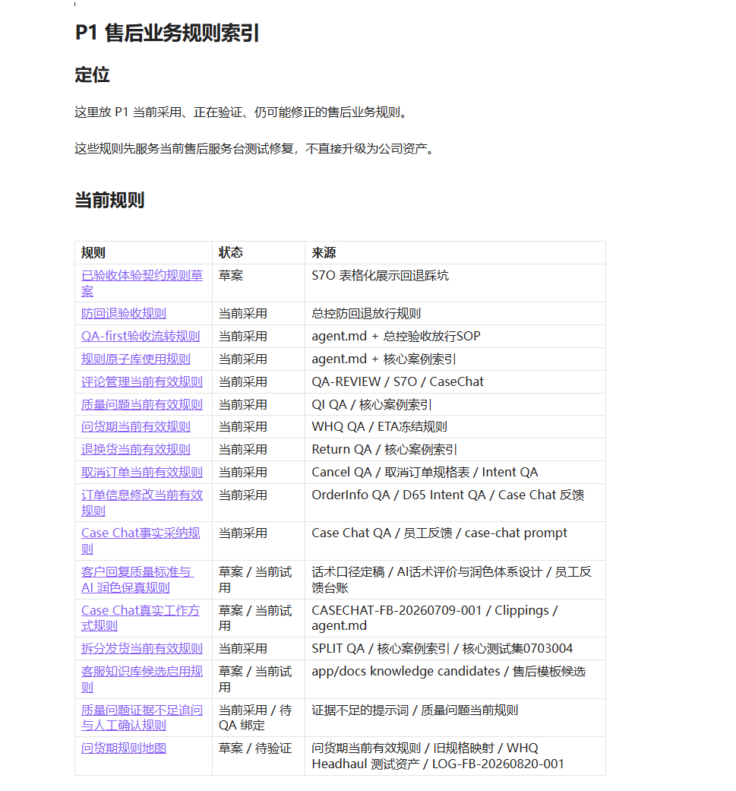

大家发现了没有？她的 AI 基本功也在不断提升，比如她懂了怎么写提示词、怎么搭工作流，怎么去用一些代码插件去解决不确定性的问题，**基本功一直在进步。**

同时，这些她沉淀下来的规则，也变成了**她的数据**，所以“**AI 双三角”好像慢慢越凑越多**。

这段时间，她自己**又跑通了一些场景，信心进一步增强了**。

感觉这一个半月过去了，自己好像还是能解决一些问题的，以前想都不敢想的一些基本功，居然自己好像也能做出来。

但是这段时间也很苦啊，她跟教研同学说，早上 8 点开始工作到晚上 11 点半，几乎完全 all in 在 AI 的学习与实践上了。

她自己虽然花了很多时间精力，但是测试结果和积累一点一点地在变强，**她信心也一点一点在增加。能一点点地接近她想要的结果。**

扣子初步已经形成了一个**基本的框架**，能够处理用户接待各个场景的流程。但这时候遇到了更大的问题，**就是扣子平台跟业务的适配性还是太弱了**。她的具体需求是：

- 支持多员工、多窗口使用；
- 数据在自己的平台上能够相对安全和稳定；
- 需要一定程度地做到更精准的权限管理。

**扣子都做不到**，所以她又开始去尝试一些别的工具，比如 **本地私有化部署的Dify、龙虾…**…都试着迁移过去，发现都没那么好用。

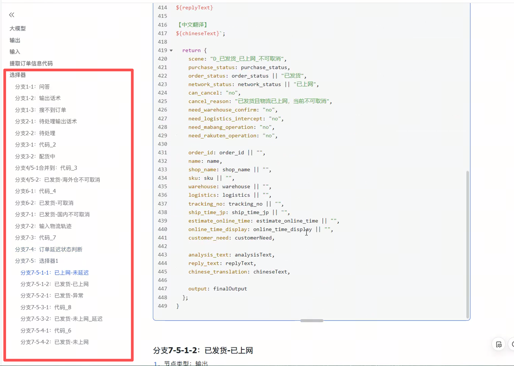

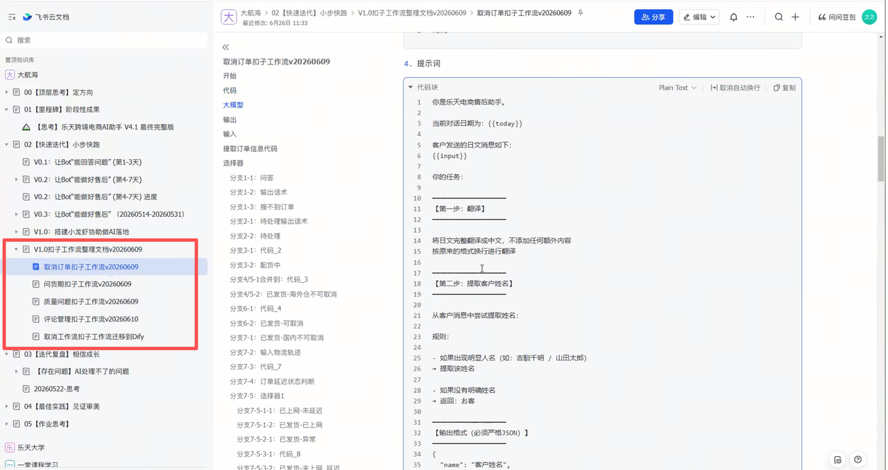

这些工具方案做出来，虽然有时候测试发现不够好，但是**她的每一次学习和测试都留下了新的东西**，帮助自己继续迭代：比如业务流程、代码节点，以及积累的一些错误案例和员工在实际场景中的使用要求等。

她这个阶段的感受，**是又受挫又有信心**：**一会儿觉得怎么这个也不行**、那个也不行，同时，**又不断地看到希望**。

她每一次上手都比上一次多了一些东西，不再是从零开始了，**而是带着已经梳理好的规则、流程和经验继续往前走。**

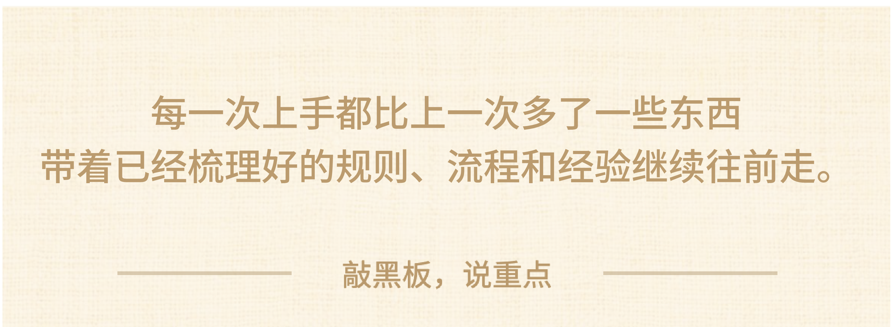

她在这2 个月的时间，尝试**各个工具都有这个那个的弊端**，她有一点卡住了**，甚至感到有些疲惫和崩溃。**

于是她又跟 ChatGPT 聊，问到底有没有什么工具，可以让她整个业务逻辑迁移到某一个系统里面。

ChatGPT 给了她答案，说可以搭一个**工作台。**

**【互动🙋‍♀️】**大家想象中一下，一个没有太多程序经验的人，如果想搭一个所谓的服务工作台，难度大不大？

——————————————

事实上，她的难度比别人**已经小了很多了。**

因为她之前的那些工作，该做的都做完了：之前的提示词、工作流、任务识别，还有 know-how 的知识库都是现成的。所以，她拿来做工作台，其实相比别人顺得特别多。

她也**感受到了工具增强之后带来的冲击**：可能就一两个晚上，把过往的逻辑放进去，就能出一个还不错的工作台，

而且能满足员工真实业务的使用场景。

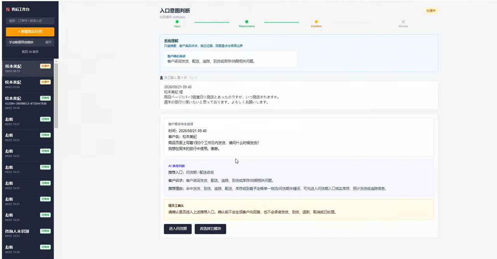

但是，**依然有一些问题**。这个工作台背后的逻辑不像工作流那么明显，**前台变黑盒，变成了一大团自己还看不懂的代码**。

哪里出了问题，她只能跟**它说这里不对、那里不对，你得改一下**；改了这里，那里又错了。

她用已有的资产，重新构建前台和模块化的后台；**尤其后端的系统，拆成了自己能够看得懂的业务模块。**

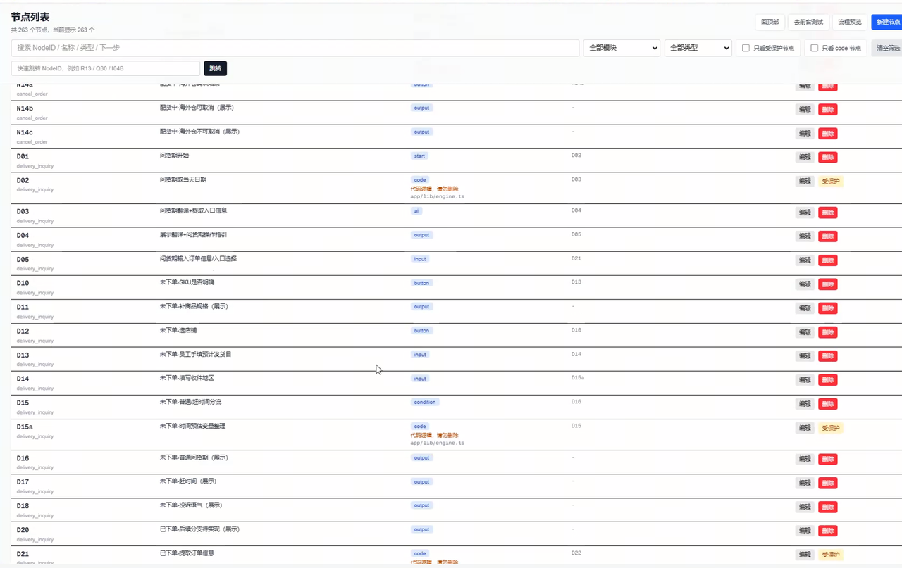

所以这个时候的之之，走到了这一步，已经是一个能够参与**判断系统结构和问题的AI操盘手了**。

前面那些看似弯路的各种尝试、**所有的积累，终于也被迁移到了一个更大的系统里面了**。

这个阶段，她终于做出了一个员工可以使用的售后工作台。

里面覆盖了取消订单、问货期、质量问题、退换货、评论管理等场景，员工处理售后的整体时间，**从两个多小时直接降到了半个小时，而且再也没有人频繁地就一些基础问题来烦她了。**

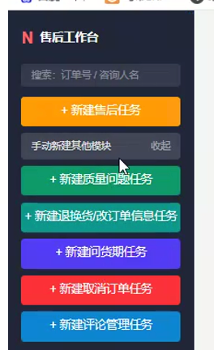

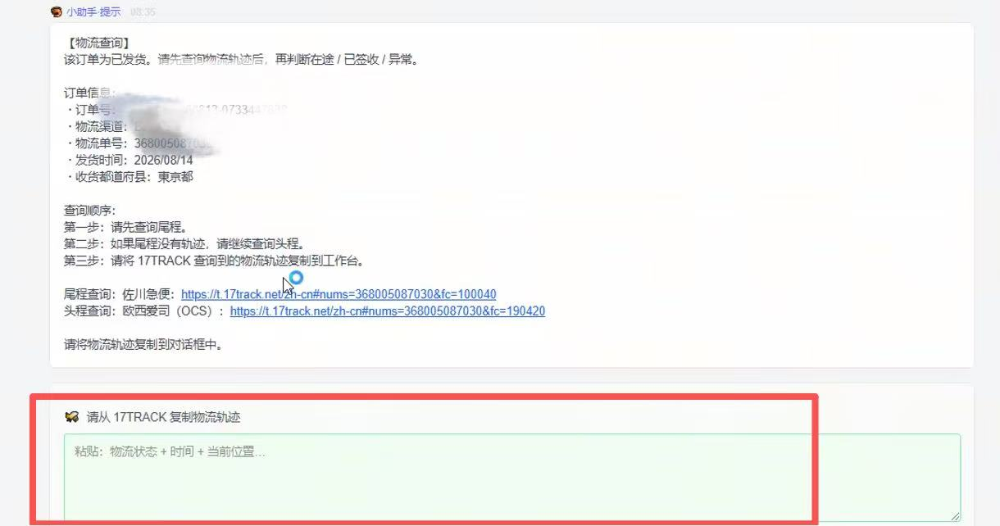

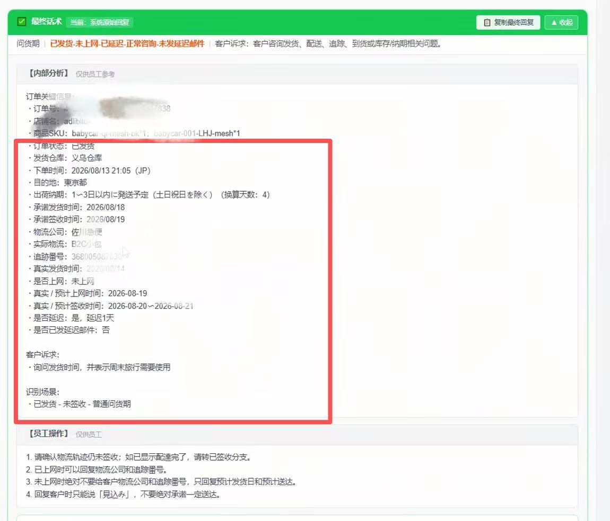

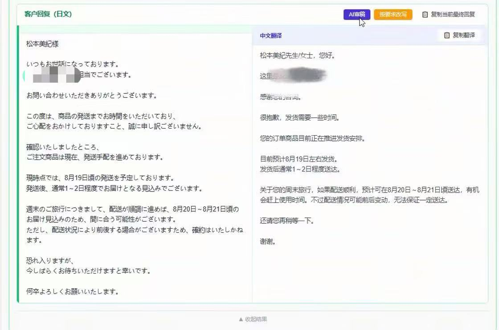

这个阶段，她终于**把前面攒下的牌一起带到了这个 coding 里头**。

回头来看，之之这一路，飞轮是怎么开始启动起来的？

**最开始，她也是一个AI小白，只会跟AI聊天**，巴不得把选品、作图、上架、运营、售后全部交给AI，但一窍不通，根本不知道从哪下手。

**她做对的第一件事，**是**把问题缩小、再缩小，缩到最小**——从售后里最小的"取消订单"这个场景开始，用最简单的提示词，跑通了第一个小闭环。5000字的提示词封装到扣子里，真的跑通了，她获得了第一次真实的成功体验，觉得"使用AI好像没自己想象中的那么难"。

**因为有了信心，她敢投入更多资源，去挑战更复杂的多场景串联。**扣子工作流几十条、几百个节点，繁琐到很多人试一下就放弃，但她没有。她去B站找课、看官方教材、靠自己一点点测试，把流程、认知、意图识别全部显性化。

**再往后，扣子不够用了，她试Dify、试龙虾，一个个工具迁移，一次次看起来像推翻重做。**但站在双三角的角度看，**每一步都没有浪费**：提示词是基本功、工作流是体系、业务规则库是数据、**对产品好坏的判断是审美——所有尝试过的东西，都变成了她的牌。**

**所以最后搭工作台的时候，别人觉得难，她反而顺得特别多，因为该攒的牌都攒齐了。**一两个晚上把过往逻辑放进去，就出了一个员工能用的售后工作台，处理时间从两个多小时直接降到半个小时。

在别人眼里，她是反复试错；但只有她自己知道，**她一路都在攒牌**。AI在进步，她也在进步，一步一步接近她想要解决的目标。

之之就是这样，从一个只会跟AI聊天的小白，变成了一个能判断系统结构、能拆解业务模块的AI操盘手。

大家感受到吗？那我们来看下一个案例。