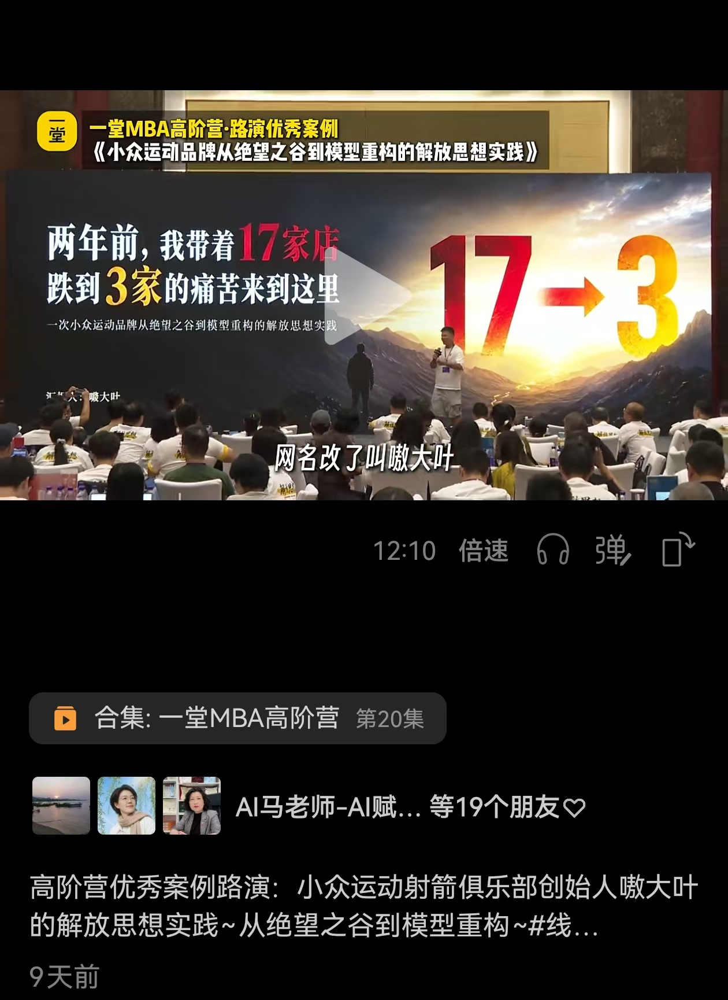
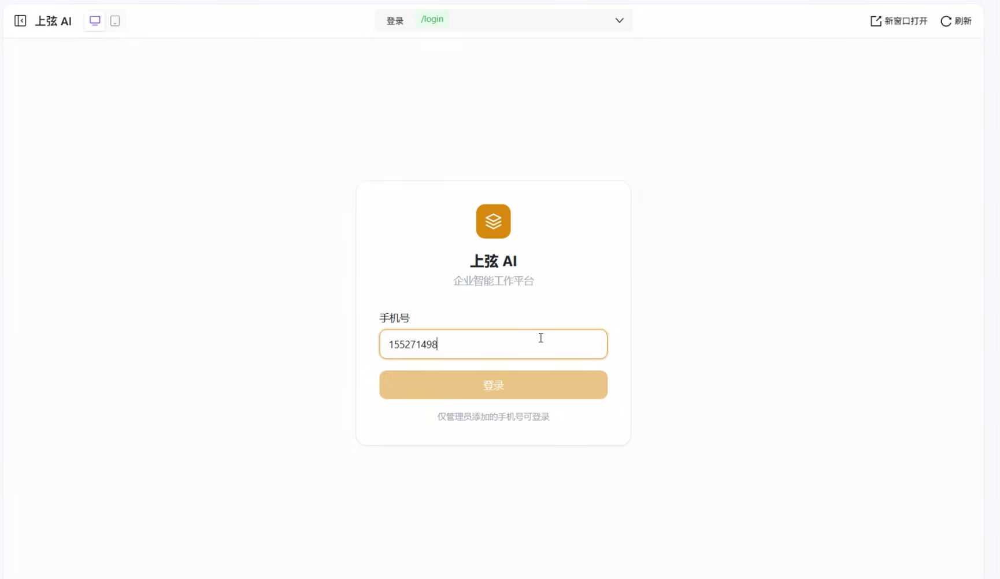
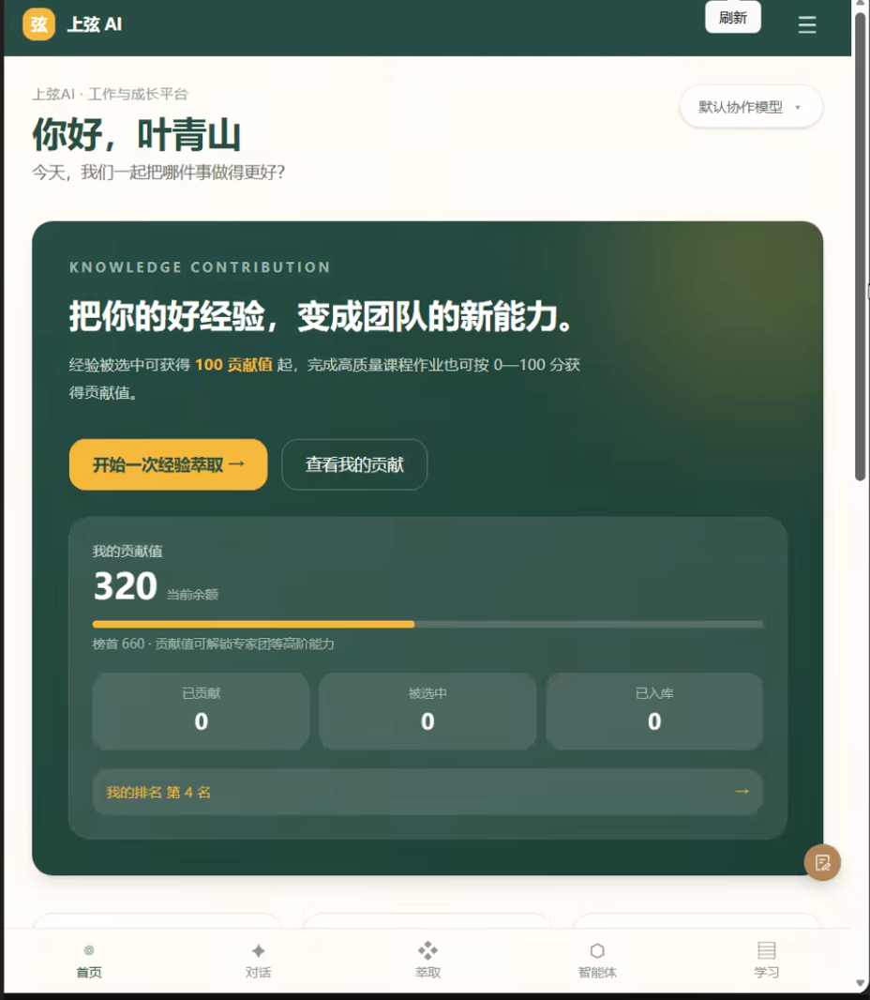
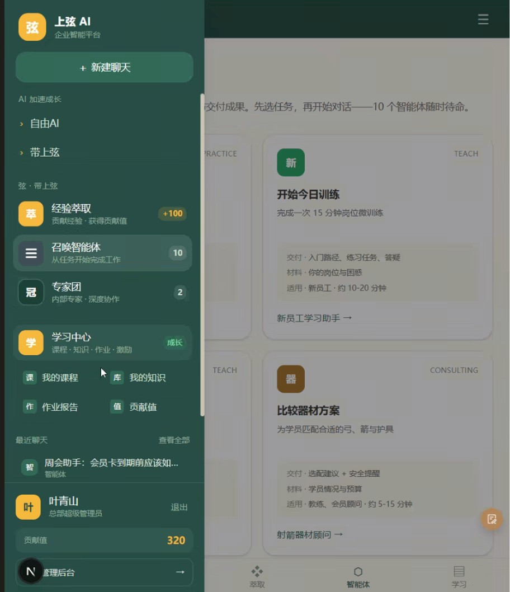
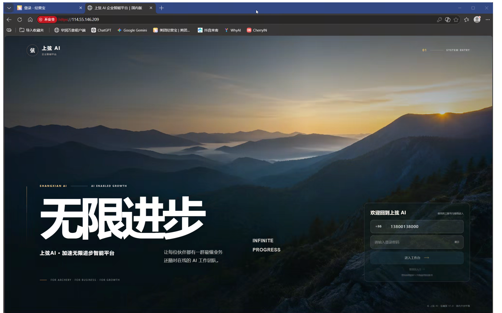
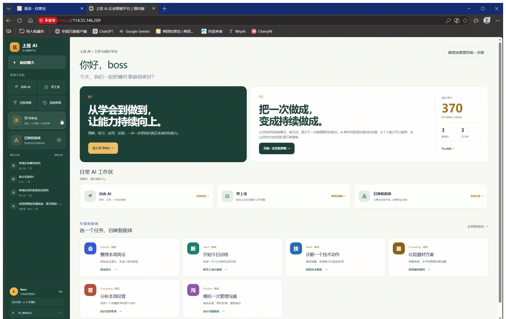
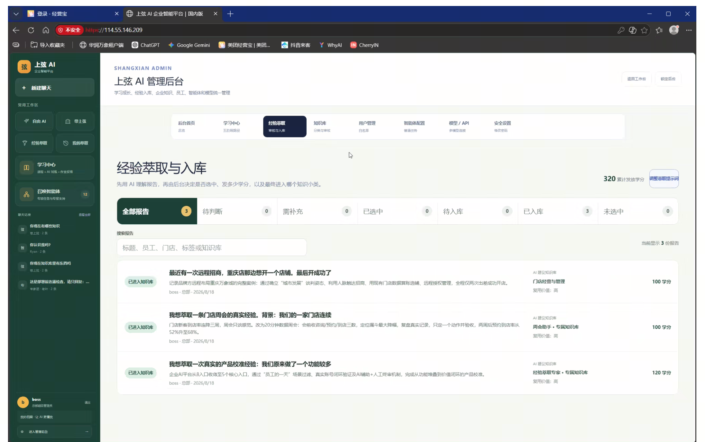
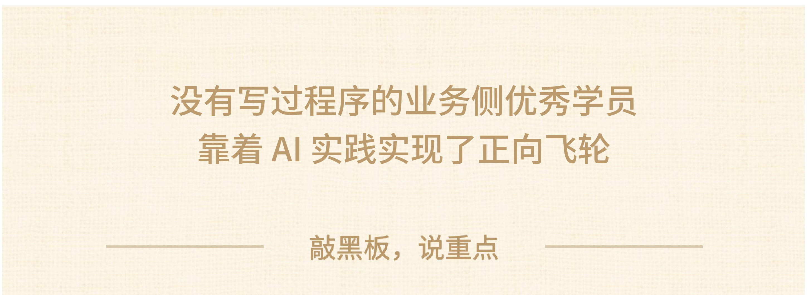

### 第四个案例：叶文彬

今天这个案例，我想直接问大家一个问题：在座有多少同学，**未来 1~3 年**想给**自己或者带着团队**做一个** AI 学习和成长的工作台？**

如果条件允许，也希望自己能搭出来，想过这件事情的可以**扣个“1”。**

——————————————

下面这个案例，是大家应该相对熟悉的一个案主。

考虑到第一次来的朋友不熟悉，我还是简单介绍一下他的背景：

**叶文彬，他上过马拉松**，也参加每一次3 天2夜的训练，**拿过很多 MVP。**

**业务现状：**

他经营的是射箭馆。大家应该也知道，**射箭馆这个业务其实想做连锁是挺难的**，因为门店运营比较重，教练和课程也非常依赖个人。这些年他每天就盯着经营的那些店，不断在里面提假设、做各种业务尝试，用“一堂”的各种方法去验证什么方式有效。

目前业务做得还不错，在疫情期间很难做连锁的情况下，**也开到了 17 家店。是国内很少有的能够做到跨城市连锁的。他未来还想继续开到 100 家。**

所以大家能感受到，**他是很典型的业务型选手**，**不是技术出身的**。

我也没想到这次在做案例挖掘的时候，**发现他的 AI 结果还挺好**。

所以今天想给大家分享：**一个原本做事非常科学、非常擅长做业务的人，是怎么把业务经验变成 AI 能力的。**

**这个案例大家重点听两个点：**
1. 很多人在给团队做 AI 训练或者搭工作台时，一直不知道怎么**上手**，所以大家可以重点听一下他是怎么解这个题的。
2. 一个非常典型的业务型选手，是怎么在这么短的时间内变成公司的** AI 操盘手，**并在解决真实问题的过程中把 AI 能力给长出来的。

好，那我们回到他的业务。

**过去**，他给团队的各种培训方式是录课放到飞书里，让员工自己主动地看视频和写作业。

大家也能感受到这个效果是怎么样的，对吧？

——————————

**全靠大家自觉**。中间过程中没有互动也没有练习，缺少反馈。而且里面还有一个弊端，就是**单向输出。**

优秀员工在各个门店里成功的一些经验，他是没有办法稳定地去萃取并让其他人用的，也没有沉淀到知识库。

所以，他想解决的就是：**怎么让每个员工能够通过一套系统，在里面学习、练习、获得反馈，并且沉淀这些优秀的经验。**

过去两年，他一直局限在跟 ChatGPT 对话这一层。他也见过其他人用 Vibe Coding 出各种各样的东西，但是他自己没写过程序，所以一直没敢启动。

这一次，**他大着胆子试着让 AI 做一个网页**，**发现效果很差**，他一度觉得，是不是因为自己不是技术出身，也不懂产品，导致做不出来。后来就放弃，一直搁置了。**他觉得自己就是一个 vibe Coding 的纯外行。**

直到有一次，听我分享“一堂”的官网是怎么做出来的，他才意识到：原来自己缺那么多流程，从双三角的角度，缺一堆要素呢：没有审美，没有积累数据，缺少体系，也缺少AI基本功……

他开始换了工作思维之后，双三角飞轮第一次启动，**参照“一堂”的工作流**，去找了迪士尼、耐克等各种最佳实践，自己建审美，加数据，探索新工具等。

结果发现，AI 真的帮忙做出了自己想要的射箭馆官网的 demo 页面。

他发现原来coding一个网页，这并不复杂啊，而且这时候心态发生了转变：

以前他觉得这种开发肯定是技术人员的事情，**现在他知道自己也可以做出来。**

**原来做网页不一定要从写代码开始，也不一定要先找软件公司。**

这个过程，把他一些模糊的想法变成了可以看得见的页面。

获得了第一次 Vibe Coding 成功的感受，他非常开心，**感觉自己对AI的信心强了一些。**

因为初步建立了信心，所以他开始系统地做这件事情，**开始投入资源。**

他开始把 Vibe Coding 的一些尝试带进真正的业务场景。

因为网页能做出来，那工作台是不是也可以尝试一下？

**第一个是花钱**。他买了一圈市面上的coding 工具，充了最高版本的会员。因为自己都能做官网了，就不用找外部程序员了吧。他把扣子、千问什么都试了一遍，最终选择了 Codex。

做工作台的过程，也是他遇到问题、解决问题的过程：

**工作台太丑，他又投入更多资源，解决 UI 审美问题**：去小红书上找各种工作台的最佳实践，建立自己的 UI 审美。后来发现，前端设计的颜色和版式越来越贴近他想要的样子，他的信心又加强了一些。

之前他连前端、后端都分不清楚。**但页面不太能“动”起来**，**数据没办法沉淀。**

于是自己开始**像程序员一样，学习前端后端，**

遇到工程化瓶颈，他还去找了三四家**外包公司去聊**，询问做这么一个系统需要多少钱以及多少周期。

外包公司给他的回复是**至少要 10 万，至少要 3 个月**。他心里有数了，慢慢地，他也部署了后端系统，他的系统已经能让员工在线上上课，而且有了作业系统。

这又再一次建立了信心，他发现：“**居然我也能做出一个有前后端的系统”。**

**这个阶段，他已经觉得自己是一个 Vibe Coding 的入门选手了。**

然而，出现了一些小波折。**在不断往里加功能的时候，系统做崩了**，跟大模型的对话记录，还有他之前做的 Demo 网页在 Codex上找不到了。

**【互动🙋‍♀️】**如果这个时候你遇到这个情况，你会怎么办？过往所有的讨论对话也找不回来了，连做出来的一个 demo 都丢了。

——————————

他说，如果是原本的他，早就放弃了。

但是前面一次次地增强信心，激发了他不能放弃的战斗精神。

他觉得大不了就重新再来，可以做得到。

出了事故以后，他又继续去研究**专业的程序工程**的一些管理方法，比如版本要保存，数据要备份，系统要能回退；

开始往里面加各种 Agent，加各种不同的功能**，已经做成了一套系统：**
1. 员工能在里面直接做**知识问答。**
2. 员工能在**里面听课**，且有写作业的反馈页面，并由 **AI 教练做纠偏。**
3. 员工能通过里面的 **AI 知识萃取**，把一些优秀经验留到系统里，再由人工审核判断是否进入知识库。
4. 员工能提交使用反馈：使用遇到任何系统问题，可以直接提交问题或截图。在后台可以让 Codex 直接拿着这些问题清单去自行修复。

他发现，随着自己慢慢投入，把功能一次次慢慢叠加进去，他的心态也发生了变化。

**他不再期待 AI 一次性把东西全部做完，而是已经能像产品负责人一样去管理需求、判断质量、检查风险，并进行一次次的动态迭代。**

**关键模块的功能实现了，小闭环完成，他的信心更强了。**

所以大家感受到了吗？

你会发现，一个人从完全不懂，到每次动手看到一些结果，就会有了更强的信心，**敢于去解更难的题**。

熬了几个通宵之后，自己不知不觉地已经做出了心中比较想要的那个版本的样子。

目前的阶段性成果是，他的工作台**已经申请了域名并上线了**。已经推广到全公司/所有门店，员工可以登录这个学习平台进行使用。

他很骄傲地说，"我居然自己把10万块给省下来了"。但比省钱更重要的是，**他从一个"觉得这种事肯定是技术人员的事"的业务老板，变成了一个能自己搭系统、能管AI迭代的Vibe Coding“架构工程师”。**

这就是一个**没有写过程序的业务侧优秀学员的故事，靠着 AI 实践实现了正向飞轮。**

一个非常擅长做业务的人，把自己的业务经验，一点点变成了AI能力。目前已经在规划自己的第二、第三、第四个系统。

我们来看下一个案例。