### 第五个案例：廖廖

下面给大家分享一个小案例。我们平时讲得很少的，就是**员工视角是如何做 AI 的。**

今天分享的这位案主叫做廖廖（liao），一个在日企边缘养老岗、担心被 AI 替代的同学，**如何在一年之内，找到了对 AI 的自信和新的职业自信。**

一年前，她觉得 AI 跟自己没关系，自己工作也相对比较固定。

一个最大契机就是正好有AI大航海；在启动会上被Truman点燃了。

她突然有了危机感。自己工作又高度依赖 SOP，如果再不行动，就有可能被 AI 替代了**。**

**所以她当时判断，这个岗位 5 年内会消失，她必须提升自己的核心能力。**

最初的廖廖，基础真的还挺弱的：跟大模型对话都不太多。飞书多维表格等各种智能表格都不会用。

她们公司其实在 2024 年就开始部署 AI 了，但是培训主要面向骨干员工，并没有轮到她。

她没有坐等公司给机会，**而是报名了“一堂 AI 大航海”，**跟着自己小组做项目，慢慢有了上手 AI 的机会。

当时她所在的小组是**短视频AI提效小组**，组里有很多大牛，她也通过一次次开会，跟着大牛学习各种工具。当一次最简单的**视频号沉淀到飞书多维表格的流程跑通时，她发现：“原来我也是可以的。”**

后来，公司终于开放了企业微信智能工具的培训，她立刻报名了。

为了快速补齐基本功，**她同时学习两套系统：**
1. 在公司里练习**企微的智能表格；**
2. 在“AI 大航海”里练习**飞书的多维表格。**

通过不断地反复比较和实践，她的 AI 基本功增强了一些，也逐渐理解了不同工具的**数据结构和应用逻辑**。

这次行动带来的正反馈，**让她从不敢动手变成了“先做再说”。**

有了第一次的成功，她就敢投入更多的时间去挑战**真正的业务问题。**

她自己的工作岗位是销售服务部，其实存在着大量**重复的提问**。因为对接的销售区域多，人员流动大，只要换一个新员工，都会反复地问一些重复的问题。

而且部门各种不同的档案跟资料散落在不同的地方，没有整理成知识库，

所以每一次去回复这些重复的问题，每个至少都需要 13 分钟。

怎么解决呢？**她想要让 AI 实现的第一个场景，就是做一个销售服务部的知识库机器人**，能够解决重复回复的问题，并且帮忙找出不同的制度跟文档。

**第一版使用企业嵌入的微信智能工具机器人，原本效果很差，不能用。**

因为建立了信心，她开始投入时间和精力，做了更多的事：比如跟AI聊方案，补系统提示词基本功。

除了增加AI基本功外，同时也在补自己人的双三角：收集各个部门的模板、梳理工作业务流程、划定业务域、定义边界、整理知识库等等。

一点点去凑齐自己的审美、体系，并且沉淀资料变成AI的数据。

机器人第一次测试能够跑通，她还挺兴奋的。但是第二次测试的时候失败了，

所以她又只好不断再去优化**，比如修改提示词、调数据和做测试**。由于时间关系，这个实验的过程，我就省略了。

但是她也逐步积累了各种能力，比如数据、流程模板和业务判断，**并且搭建了机器人的后端数据库。**

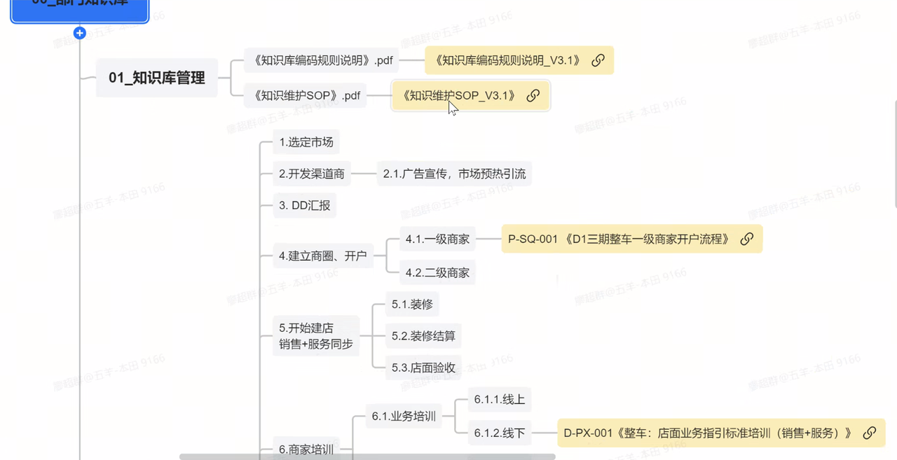

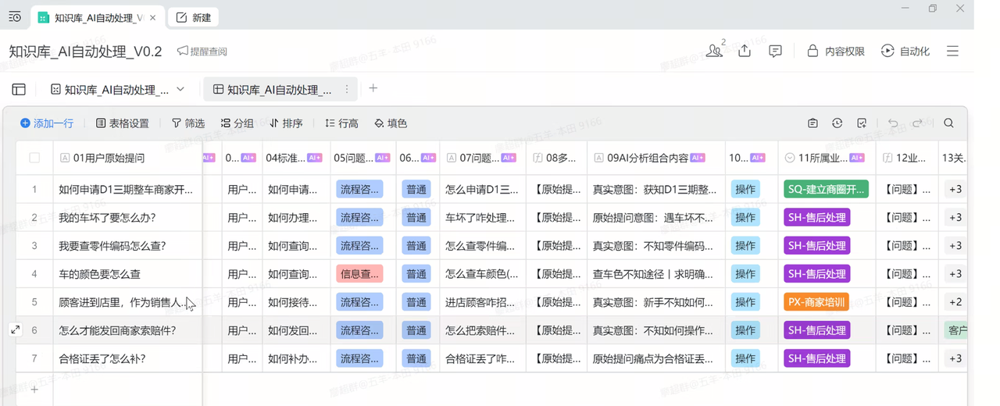

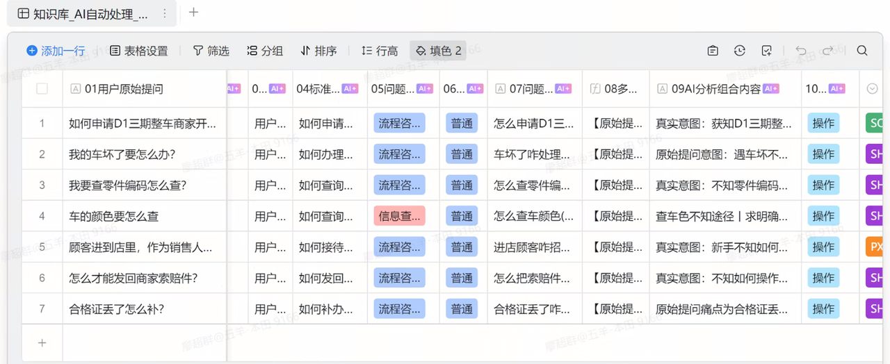

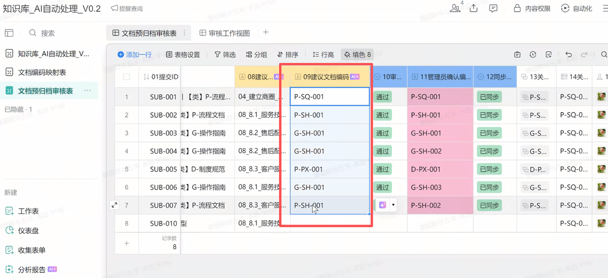

目前她这个项目的整体方案已经跑通了，并且效果不错：

**效率提升**：过去需要 13 分钟才能解决的问题，**现在 5 秒钟**机器人就能给出处理步骤和填写指引，还能够返回对应的文档链接，并且调用的准确率超过了 85%。

**经验系统化**：机器人可以** 7×24 小时在线**，原来只存在于员工脑子里的各种经验，终于变成了一套可以被机器人调用的系统。

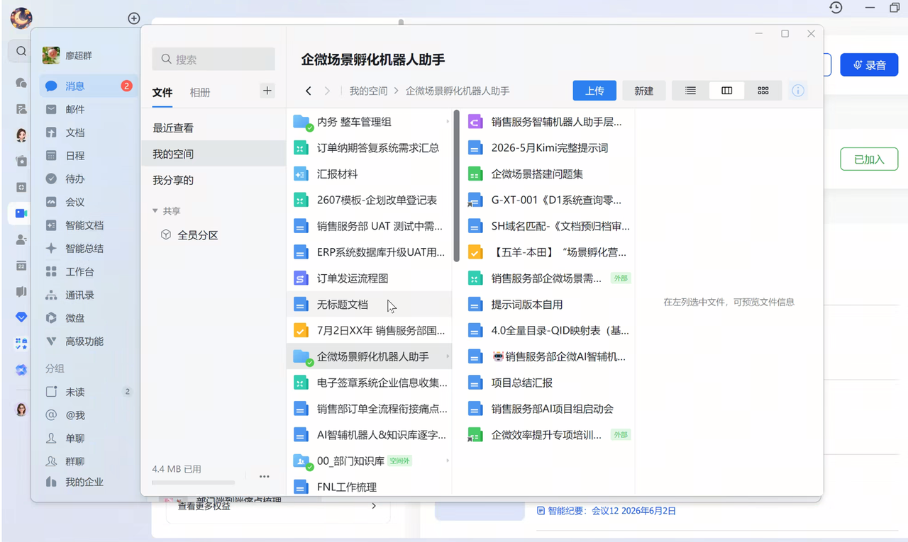

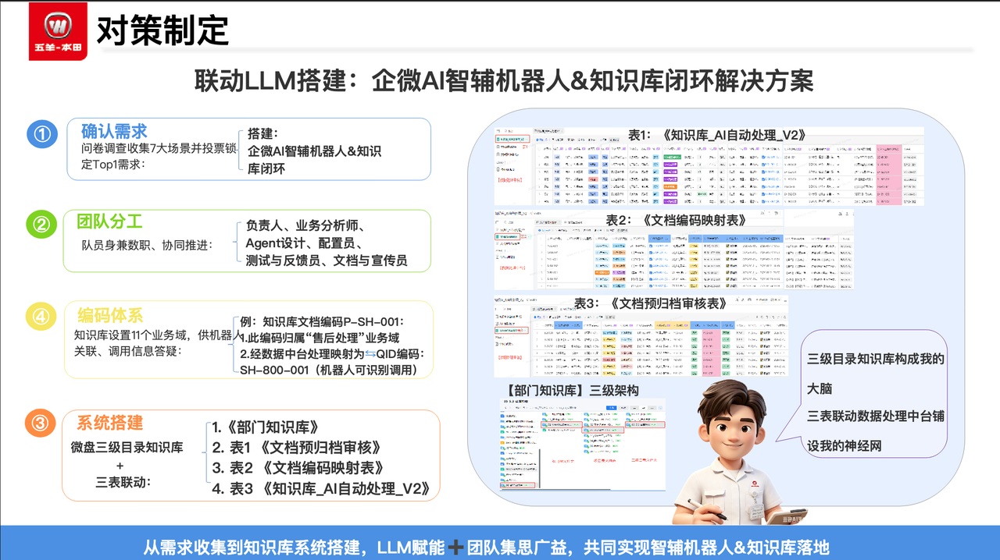

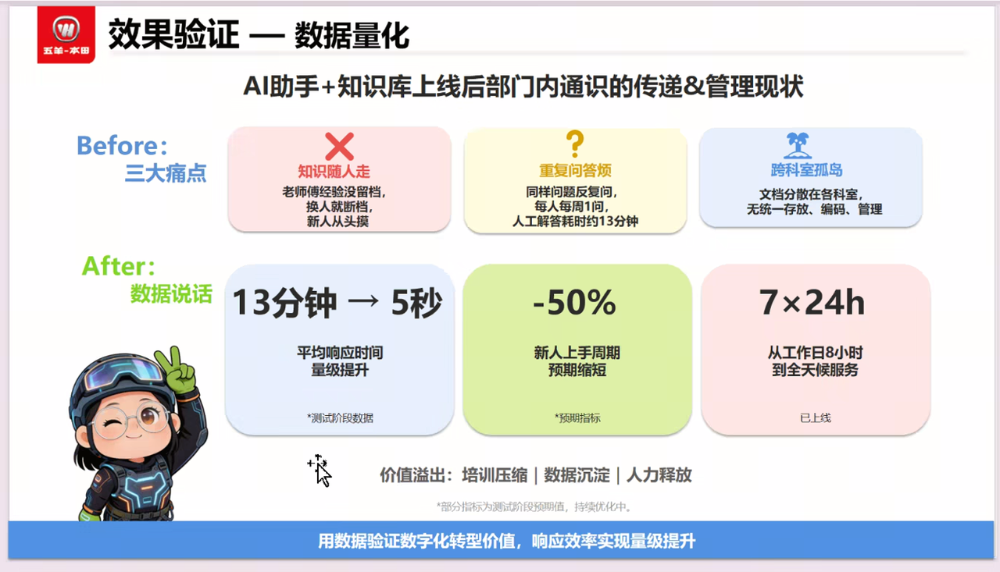

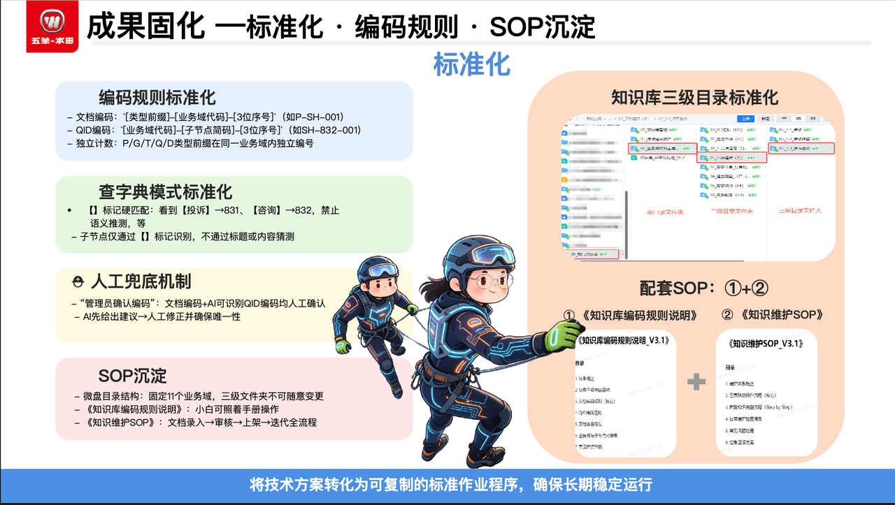

今年 4 月，她带着这个项目参加了公司的比赛，**获得了一等奖**。她的能力因此被领导看见，直接从 12 级升到了 10 级。**而且她当时预判部门 5 年内会被裁掉，不到一年就被裁撤了。**

因为这次参赛，她没受裁员影响，她被调到了另外一个更有影响力的部门。

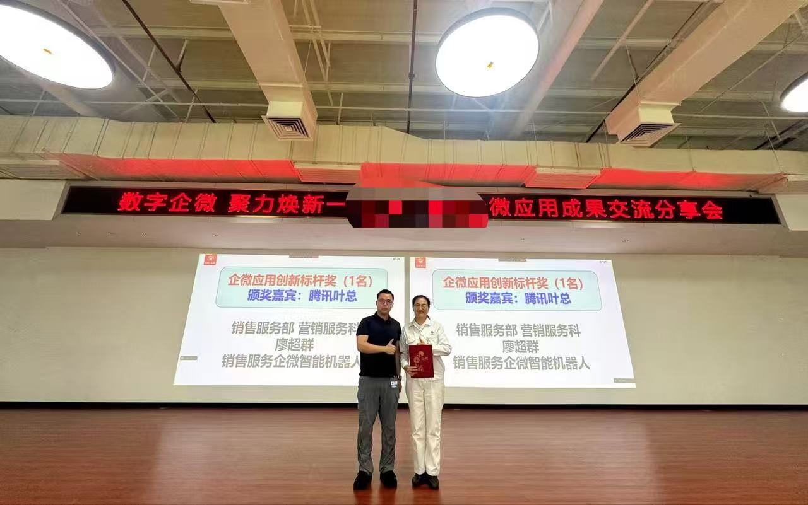

但是，比获奖和升职更重要的是，**她真正相信了 AI 不是技术人员的专利，普通人只要敢动手、持续积累，也能够独立用AI解决问题**。

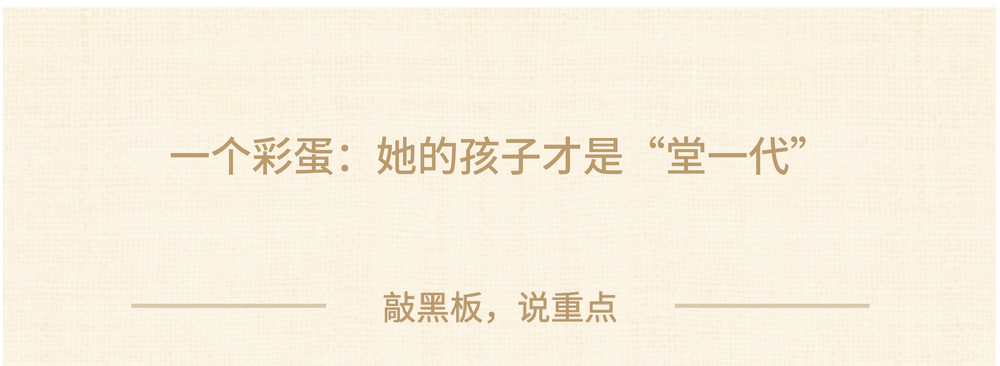

🎁**彩蛋**：其实她真正开始学AI的契机，不是参加大航海，而是被她的孩子引导加入了一堂。

孩子在 15 岁快中考的时候，学了复盘营成为一堂会员，学了刻意练习，学习知识库管理、学习 IPO。结果中考时成**绩大幅提升**，考进了过去够不着的学校。**上高中以后又从班级的后 10 名冲到了前 5 名。**

我之前一直很好奇，如果从高中时我就开始严格地刻意练习，高考能多考多少分？她的孩子一定程度上证明了，**刻意练习对学习的帮助还挺大的。**

孩子就把这个课推给妈妈，说：“你也该上上了……”

廖廖被孩子激励了，才来一堂学习，并且参加了大航海。两个人会一起学习，聊商业，聊 AI。

**家庭氛围也更好了。**

过去总是父母推动孩子学习，现在却是孩子推动妈妈重新成长。

廖廖说，一堂带给她的变化，**就是让她拥有在这个时代独立成长的底气。**

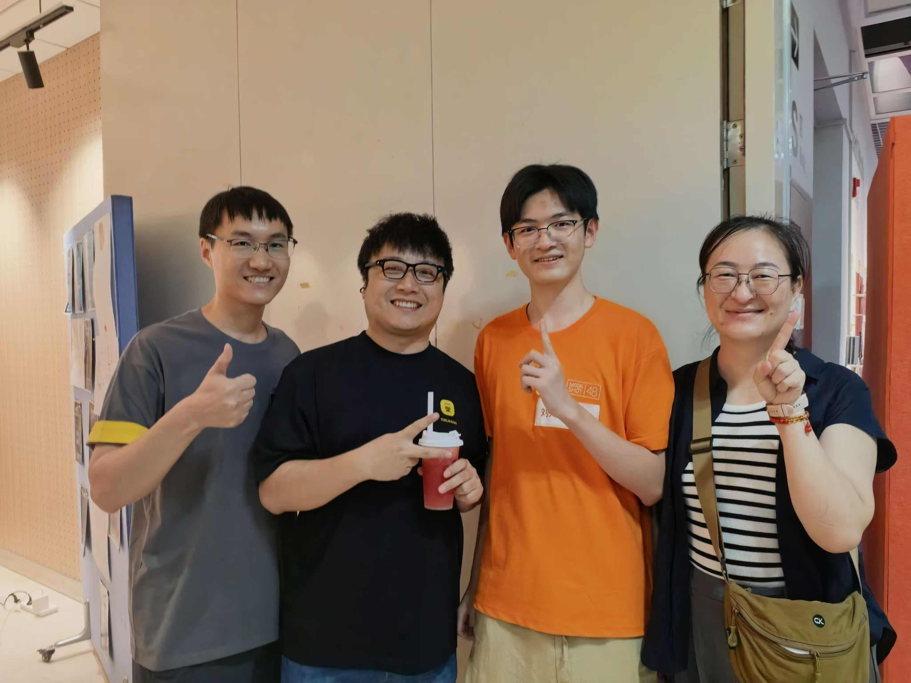