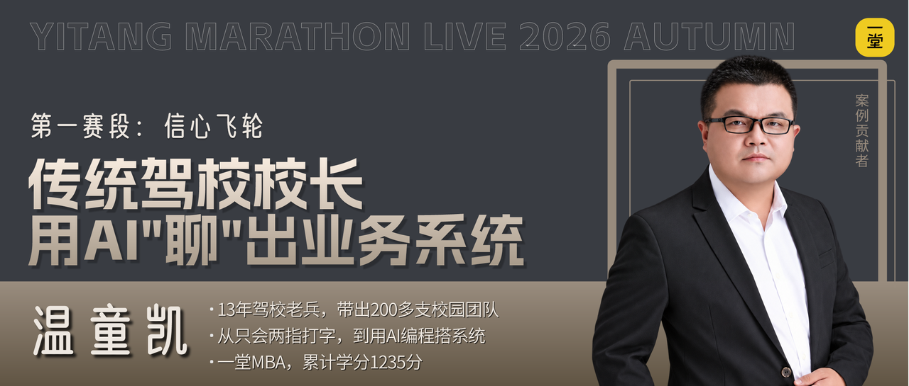
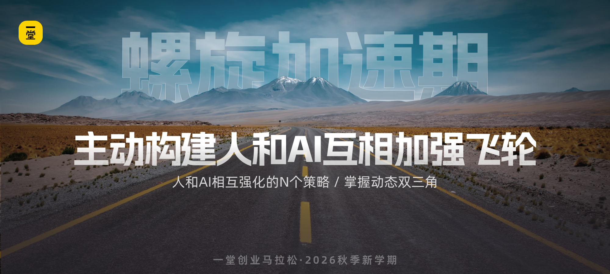

## 背后的洞察和学习

我们把这几个案例放在一起，大家能感受到什么共性？

大家感受到了这些同学背后的状况了么？我们现实回顾一下之前的停滞：

如何提升和进步呢？核心就是我最近反复提的一个字：争取**爽一次**。

因为感受过AI的爽，所以才有信心，才会投入更多的时间，精力，金钱，这个飞轮才能滚起来。

**【姿势🙋‍♂️】**大家觉得刚才这些同学能顺利飞轮滚起来，最最核心的策略有哪些呢？

————

核心是把这个飞轮变成一个正向用功飞轮：

在这个阶段我们不要过度追求“一次性做成一个大项目”：场景越大，项目越大，难度越大。这个阶段的核心，不是“立刻做出大结果”，而是先让自己进入到“爽一次”的信心循环。

主动降低难度：缩小场景，缩小项目，感受小进步：

- **工具的爽：**诶呦不错啊，AI竟然能给出个不错的结果。
- **积累的爽：**每增加一些要素，都在逐步积累，接近合格线。
- **凑齐的爽：**第一次初步凑齐双三角，感受下60分可用的爽。

有了这个爽，飞轮转起来，才有后面的越来越强，越来越有信心。

## 第一赛段冲刺

哈哈，来吧，希望大家都能带着自己，带着自己的团队、客户尽快启动AI飞轮。

这是所有工作的基础，也是一切的重中之重～～！

来集体Flag时刻到了：

**【号召🙋‍♂️】**来来来，一起勇敢扣一个口令吧：**一起启动！**

### 下一赛段更精彩

下一段我们继续挑战难题，进入**《螺旋加速期》**，我会给大家交付3个内容：

- 案例1：砻沣，一堂教研新人，半年独立搓出十余个教练级YAI Partner，靠人和AI互相加强实现飞速成长
- 案例2：郁金星，10年商业咨询师，把自己的商业体系教给AI，再让AI反哺自己，给跨行业客户做辅导时专业度碾压同行
- 案例3：劉衛，操盘三家公司上市，双向增强AI，构建完整的CEO第二大脑，真正参与日常战略思考和商业决策

## 快热身：进入第二个赛段

哈哈哈我们继续上课，欢迎大家进入第二个赛段：**螺旋加速期。**

第一赛段我们解决了“从0到1启动”的问题，很多同学已经爽过一次了，飞轮开始转起来了。

但问题是，很多人的 AI 使用，**长期停留在一个“也就还行”的水平：**
1. 有些人已经能用 AI 把事情做完，但结果总停留在“差不多”，一直做“差不多”的事情，拿到“差不多”的结果；
2. 有些人知道自己对结果不满意，但说不清楚到底差在哪里，也没有把自己的审美、经验和判断教给 AI；
3. 还有些人有些人已经越来越依赖 AI 做事，回头一看，自己好像没什么成长，AI变强了，自己还是老样子。

而且我过去一段时间，不管是和一堂的同学交流，还是观察大家使用 AI，我发现很多人已经不缺工具，也不缺使用机会，但依然很难真正进入“人和 AI 一起变强”的状态。**飞轮没有真正加速，只是在原地平转。**

到底差在哪了呢？背后的问题到底是什么？

归根结底，是没有构建“**人&AI互相加强的双循环”**：**你没有让AI变强，AI也没有让你变强。**

### 本轮重大卡点

来来来，我们调研一下，连着问四个问题吧：

**上手问题**：你已经不满足于“AI能帮我干活”了，开始有意识地把自己的经验、审美、判断标准教给AI，让AI干出来的活越来越像你干的，甚至比你干得还好。

> 1）还没有，**扣0**

> 2）是了，**扣1**

**初阶问题**：你开始主动让AI帮你复盘——做完一个项目，让AI帮你总结哪里做得好、哪里可以改进，AI的反馈真的让你有收获、有成长。

> 1）还没有，**扣2**

> 2）是了，**扣3**

**进阶问题**：你已经感受到AI在弥补你的盲区——比如你不擅长的数据处理、技术实现、逻辑推演，AI帮你补上了，而且你因为AI的补位，开始敢做以前不敢做的事。

> 1）还没有，**扣4**

> 2）是了，**扣5**

**高难问题**：你和AI已经形成了一个互相加强的循环——你教AI越多，AI越强；AI越强，反哺你越多，你也越强。半年下来，你明显感觉到自己的能力边界在扩大，成长速度是以前的好几倍。

> 1）还没有，**扣6**

> 2）是了，**扣7**

这四个问题，大概率都会在未来半年陆续发生，但是回到现在，大家卡在哪里了呢？

为什么飞轮转起来了，却没有越转越快呢？

总结一下，这个阶段最核心的，就是在“人和AI的关系”上，缺少互相加强的意识：
1. **满足现状**：飞轮刚转起来就觉得“够用了”，没有对自己持续不满意，没有追求更快更强；
2. **单向使用**：很多人只把AI当工具，我提需求、AI干活就完了，从来没想过把自己的积累“教给”AI；
3. **只用不学**：很多人只是让 AI 帮自己完成任务，却没有借助 AI 训练自己的判断力、体系能力和创造力。

飞轮只是转起来，没有进入“互相加强的加速循环”，后面讲再多的最佳实践、工作流、Agent……也很难真正拉开差距。

更麻烦的是，**人和 AI 之间很容易形成一种「反向循环」：**

- 对结果没有更高要求，AI就只会停留在“能用”；
- 自己说不清楚判断标准，AI就只能继续猜；
- 人看完以后说“差不多”“先这样吧”；下一次继续用同样的方式，继续得到差不多的结果。

慢慢地，**人没有把自己的审美、经验和判断教给 AI，反而把判断交给了 AI。**

**AI也没有真正让人变强，只是让人更快地复制一个自己还没有完全理解的答案。**

所以这个赛段，我们希望给大家一套框架，帮大家从“单向使用AI”升级到“人和AI互相加强”，真正让飞轮越转越快，如何变成加速循环呢？

### 这赛段不容错过

这个赛段，我会分享几个优秀的同学案例：

- 案例1：砻沣，一堂教研新人，半年独立搓出十余个教练级YAI Partner，靠人和AI互相加强实现飞速成长
- 案例2：郁金星，10年商业咨询师，把自己的商业体系教给AI，再让AI反哺自己，不断挑战高难度大B客户交付上限
- 案例3：劉衛，操盘三家公司上市，双向增强AI，构建完整的CEO第二大脑，真正参与日常战略思考和商业决策

**♥️ 新手提醒**：如果你刚启动不久，这个赛段会告诉你“启动之后下一步该干什么”，别让你的飞轮刚转起来就停在那里。

**♥️ 熟手提醒**：对于已经用AI有一段时间的同学，重点看看自己如何不满足于已有的进步，还能持续追求更好的结果，让每一次循环都带来新的飞跃。

接下来，我们就来看看**螺旋加速期**的最佳实践。

## 涨见识：三个同学的案例