### 第一个案例：砻沣

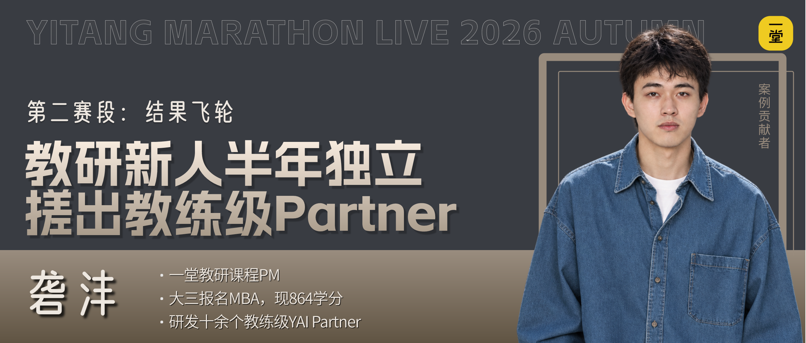

我听过一些声音说，现在公司如果想AI落地的话，除了找有经验的人或者是 AI 专家以外，其实还应该找**刚毕业没多久，思维不太受限，学习新能力快**的人来执行，效果可能更好。

很巧的是，一堂的教研新人**砻沣**（longfeng），恰好就是这样的一个新人。

他大三就报名了一堂的MBA，后来从南方跑到北京，来一堂实习，毕业后就加入一堂教研，目前已经是一堂一些重要项目的PM。

《AI数据第一课》《AI口喷基本功》，他是课程背后的产品经理。

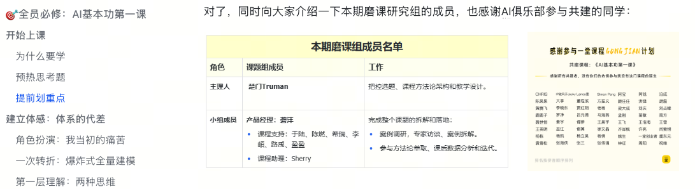

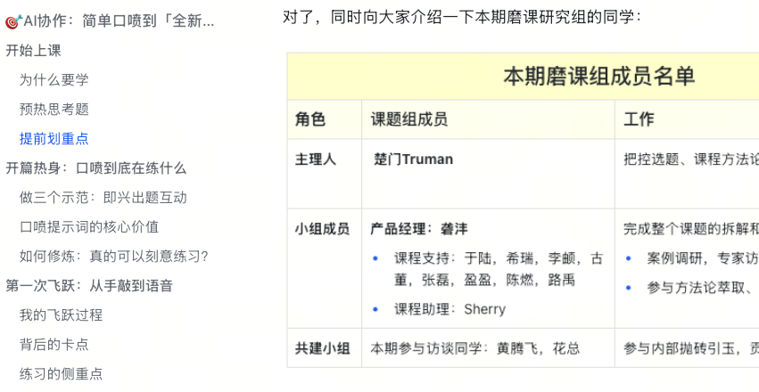

很多YAI的Partner，背后都是砻沣主导推进的。

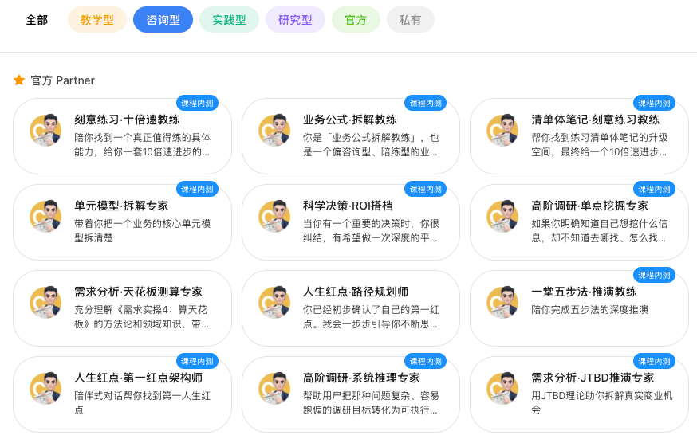

其实，砻沣成长得这么快，我们自己也很意外。正常来说，培养一个合格的教研PM，需要两三年，而且最好还要有一些教研或者是创业的经验才行。

今年春节之前，他AI用得也一般般，教研也没入门，主要在教研部门参与一些边边角角的工作，可以说还是一个“小透明”的状态。

春节之后，他好像就慢慢成长起来了，到后来可以独立扛住**YAI Partner生产这种复杂的、工程级别的项目**。

所以下面，我就结合很多同学都感兴趣的 Partner 工业化生产，和大家一起复盘一下：**砻沣这半年多，到底是怎么成长起来的**。

**【小插曲📢】**补充 YAI 和 Partner 信息。

今天直播间还有很多同学没有参与过 YAI 内测，甚至没有用过YAI Partner，对 YAI Partner 还不熟悉，我快速介绍一下一堂的AI产品。

YAI：一堂在这个时代的第一个AI产品，是一次 AI x Business 的真实实践。

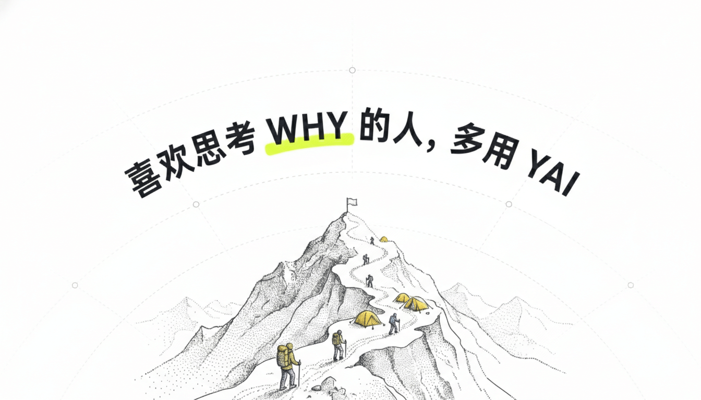

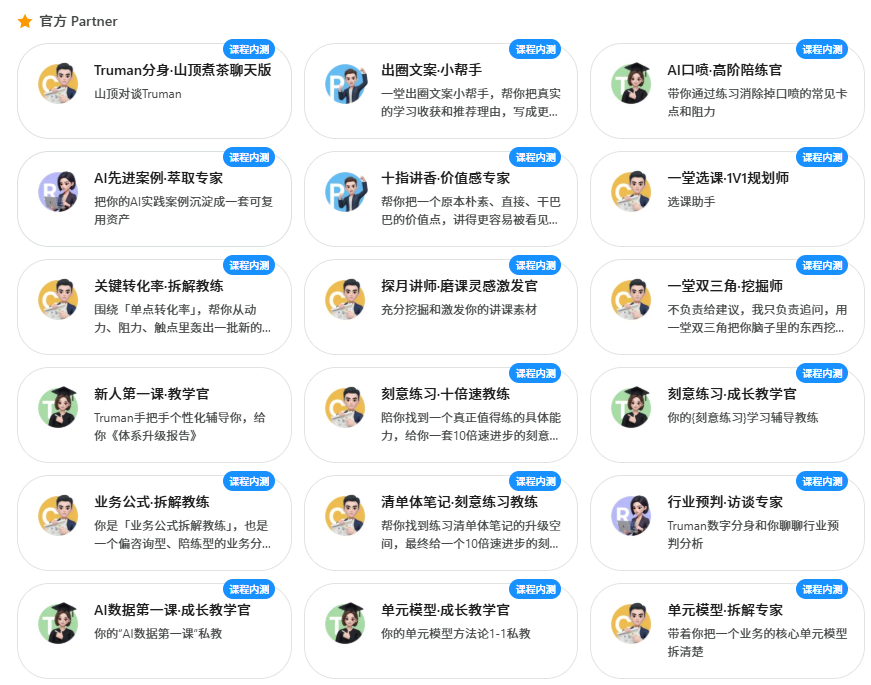

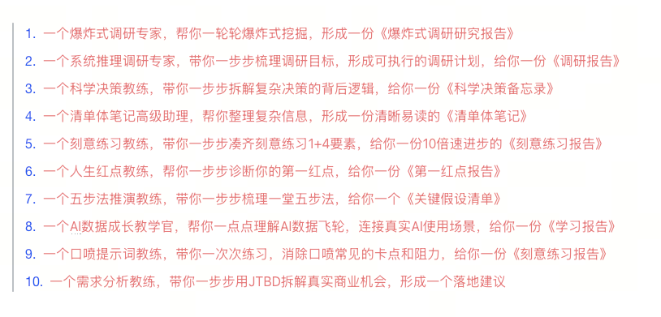

YAI 的 Partner在技术层面不复杂，我们的思路很简单：**先把低垂的果实摘下来，再一步步去摘更高、更难的果实。**

现在的第一批Partner，像人生红点诊断、高阶调研、清单体笔记、科学决策、爆炸式研究，用**“系统提示词＋数据包”**这一层能力，就已经能做出很好的效果。内测阶段，很多同学都非常喜欢。

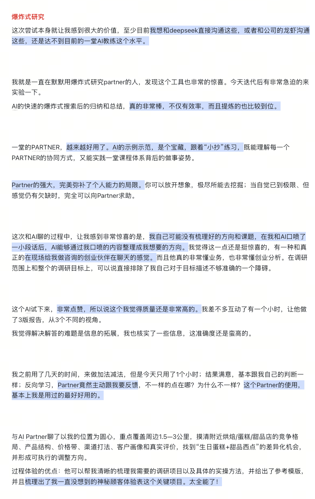

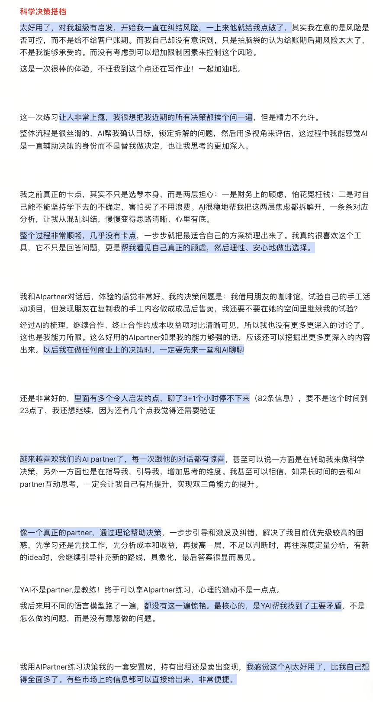

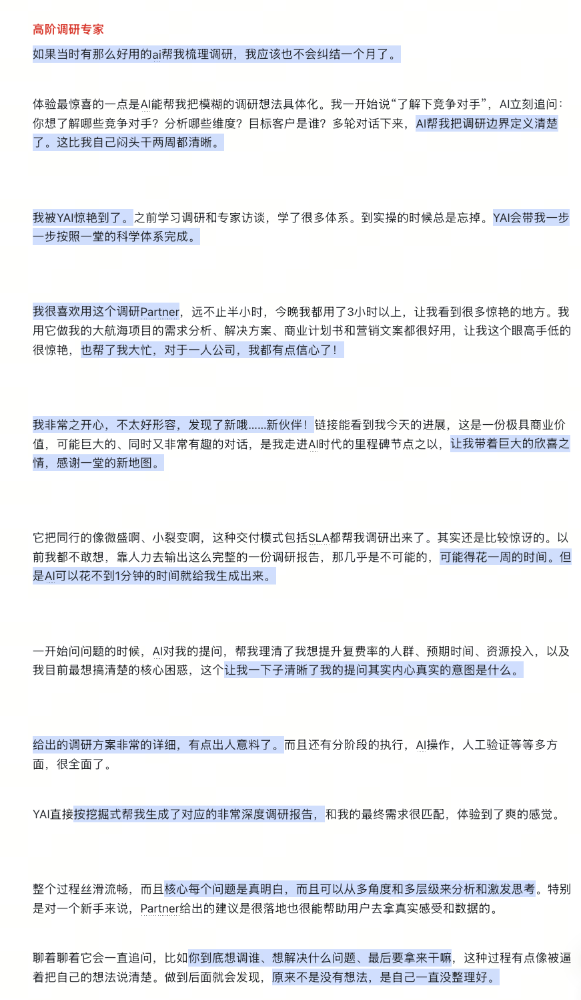

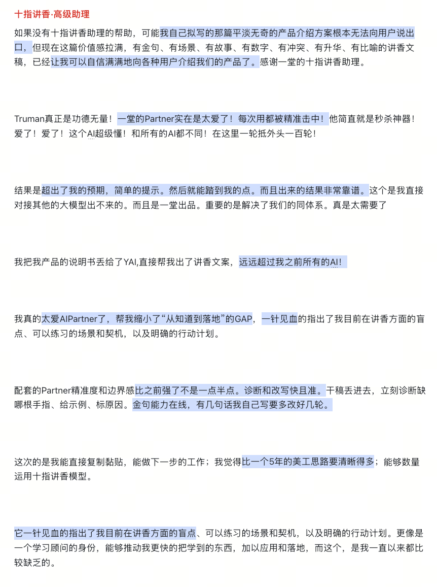

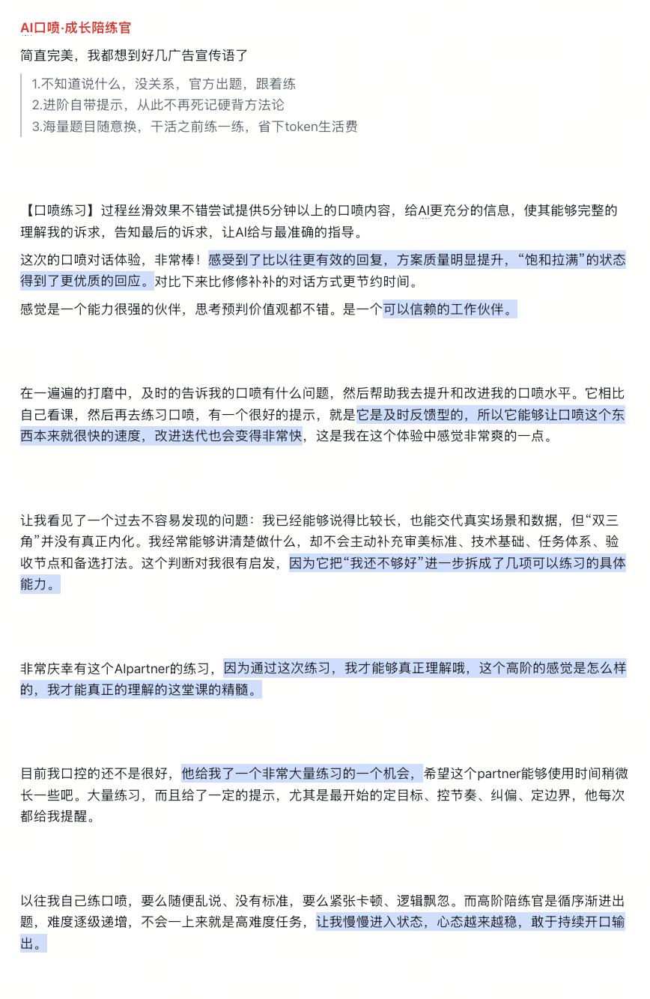

参与过 YAI 内测的同学，可以说说你们最喜欢的 Partner 是哪个？

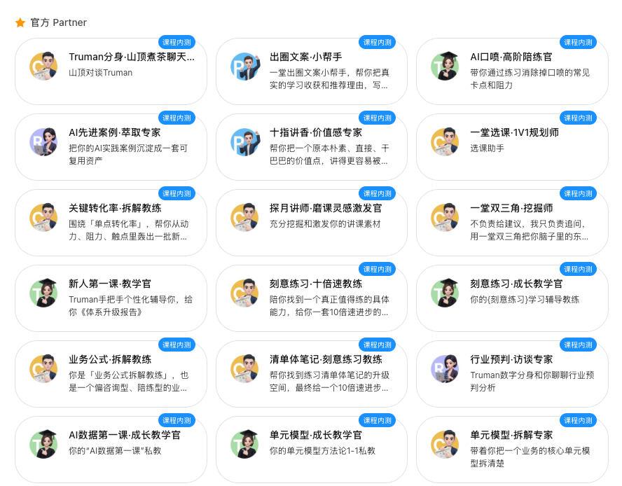

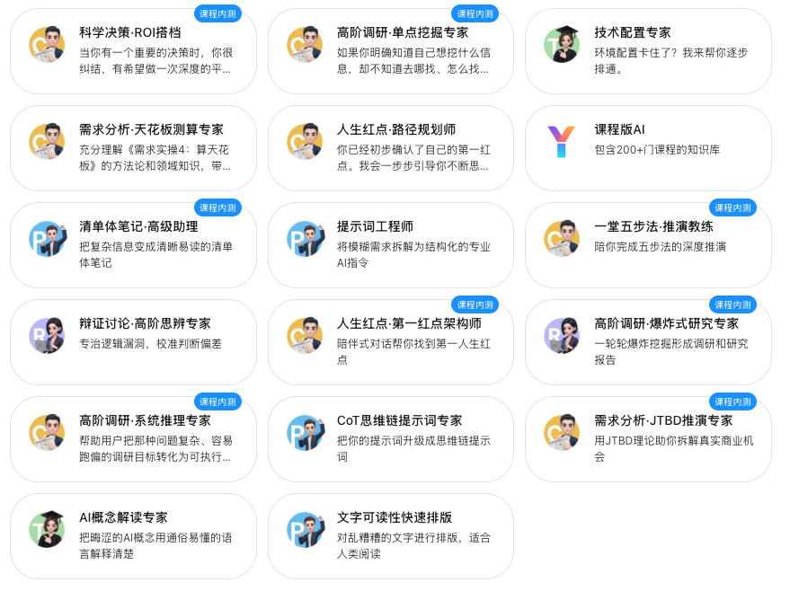

虽然只在**系统提示词+数据包**上工作，但是每个Partner背后，其实都是一个完整的AI项目。要把它真正打磨好，我们得先想清楚它要实现什么功能，再想清楚怎样交付，才能让大家真正用起来。

每个Partner对应的文本平均都在2万字，多的接近5万字。最开始的几个Partner，每个大概都用了15-20个人日的工作量才做出来，当然后期（因为有砻沣）速度变快了很多。

YAI 和 Partner 介绍完了，我们回到案例。

砻沣这半年多的成长，就发生在这些Partner的打磨过程中。下面，我就展开讲讲他的进步过程。

先把时间拉回到今年春节后。

目标是做一个AI工具，能够辅导别人找到人生红点，需要达到专业教练的水平。

这个案例我在很多场合都讲过，没听过的同学可以快速看一下：

第一步，补充基础审美，让我给出优秀教练的评估和微观体感，加入出口式咨询，有了教练的感觉；

第二步，yulu让AI学习两个业界的最佳实践，有了系统的灵活提问和引导。

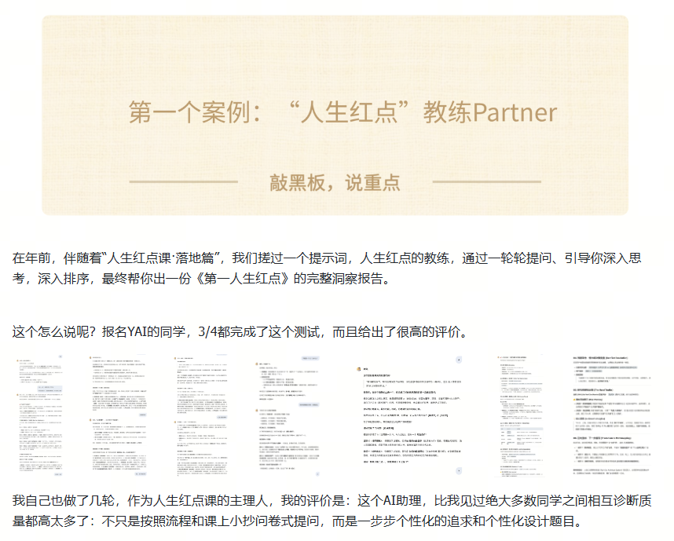

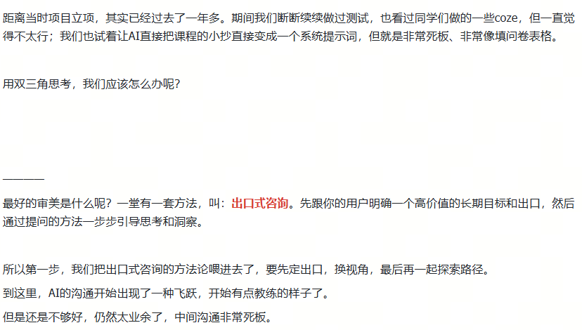

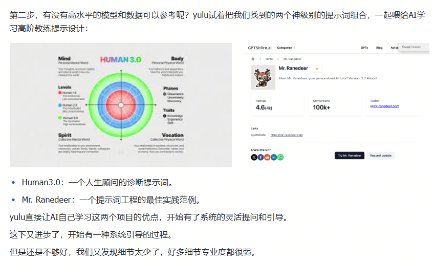

这时候，我们感觉还是不够好，很多细节不够丰富，专业度也不够。我就让砻沣去准备一个《人生红点核心理念知识》**Datapack数据包**。

先解释一下，一堂的数据包是什么，是把课程逐字稿和相关资料**提炼浓缩成足够支撑提示词的信息文档**，配合Partner的系统提示词使用，为它提供完成任务需要的专业知识。
1. **不多**：不包含为了教学效果在逐字稿中添加的张力表达
2. **不少**：核心方法论，重要概念的解释，相关的模型和方法，都要有。方法论各部分之间的关系，也要讲清楚
3. **样本**：案例按需补充，帮助AI理解和使用

**【互动🙋🏻】**如果你是砻沣，要准备这么一个数据包，你会怎么做？

直接开始人工分析整理 **扣1**

直接把课程逐字稿交给AI，试试效果 **扣2**

直接把课程干货点清单（教学大纲）交给AI **扣3**

————

这是砻沣第一次正式参与Partner项目，他没有马上动手，而是想先搞清楚：**什么才是好的数据包**。

但在当时，YAI刚刚起步，我和教研团队对数据包的理解都不深，根本不知道什么叫好数据包，只是模糊地知道，**课程干货点清单 < 数据包 < 课程逐字稿**。当时验证数据包质量的方法也很朴素，就是保持系统提示词不变，换不同的数据包来看结果的差异。

砻沣问了一圈，没有得到多少明确的反馈。然后他就想：**人帮不上忙，那试试AI吧**。

他把我们希望做的事情，YAI的前前后后，以及数据包的作用，都告诉了AI，让AI帮他分析数据包的标准，去调研边界；他还要求AI给一个基础框架，方便后面做新的数据包都可以复用起来。

AI很擅长做这些事情，马上就给了他一个初步的四要素框架。
1. **要素一**：核心定义对齐
2. **要素二**：具体执行框架（第一步，第二步...）
3. **要素三**：少量样本示例
4. **要素四**：适用边界

怎么样，看上去还行？

砻沣没有满足于此，他继续追问：

- 为什么是这四个？
- 各自的优劣是什么？
- 这四要素的关系是什么？
- 少了其中一个会怎样？

并和同事讨论。

最后做了一番优化，形成的标准是：
1. **核心定义要对齐**：讲清核心概念、概念之间的关系，以及适用条件和边界；
2. **执行框架要具体**：说清第一步、第二步、第三步分别做什么、怎么做。
3. **判断标准要清楚**：说明什么算做对、什么算优秀，以及常见错误是什么。
4. **事例样本有帮助**：配少量事例样本帮助理解，样本不是核心但很有帮助。

有了这样一个框架标准之后，他就把三节人生红点的课程逐字稿，交给AI整理。

**【互动🙋🏻】**你们猜一下，AI整理的资料最后的采用率有多少？

30%

50%

70%

90%

————

只有30%可用！

很多核心定义和方法论没有被抽出来，内容还会**偏、歪、不完整**。

他只能自己一点点修补：先补全缺失的事实，再用 AI 辅助理顺结构。

他同时打开四个网页，其中三个分别让不同的AI产出内容，另一个用来手动汇总和校对，最后逐项检查“有没有跑偏”和“有没有遗漏”。就这样花了大概两天时间，反复调，反复测，终于整理完成。

这份数据包接入人生红点 Partner 后，团队感到：**“哇，就很惊艳。”** 

原先的 Partner 有教练引导和灵活推进，但专业度不够；接入数据包后，它既能根据用户情况一步步推进，又能在具体疑问上调用课程知识，呈现出“**教练引导 + 千人千面 + 专业答疑**”的组合效果。

人生红点Partner推给同学们之后，反馈都很好。每周项目复盘的时候，砻沣把他的实践告诉我们，他自己说也挺有成就感的，算是第一次感受到了和AI协作的快乐。

后来，所有的数据包任务都交给砻沣了，他一边继续去理解优秀数据包的标准，一边调整AI提取数据包的提示词。到现在，做一个 Partner 的数据包，他大概只需要半小时，人工纠正和优化的部分也已经不超过10%了。

当时，砻沣是被我临时拉过来准备数据包，对于一个Partner的贡献还只在数据部分。

数据包只是Partner 里最简单的一部分，接下来，我们再看他是怎么参与系统提示词打磨的。

YAI开始内测之后，我们又有了新的Partner制作需求，砻沣除了整理数据包，也开始参与系统提示词的打磨。当时应该是内测课，做**《算天花板》Partner**：让用户介绍一个业务，经过补充信息、TAM、SAM、SOM 等层层分析，最后形成一份决策报告。

砻沣知道自己审美不够，想做出合格的Partner，就得把审美补上。他的方法很直接：**找人问**。

**【互动🙋🏻】**在 Partner 设计上，审美最好的人是？

————

不好意思，目前还只能是我hhh

审美这部分，还是由我来提供。每次我会给他们口喷一大段，讲讲我对**这个 Partner 的“美好想象”。**

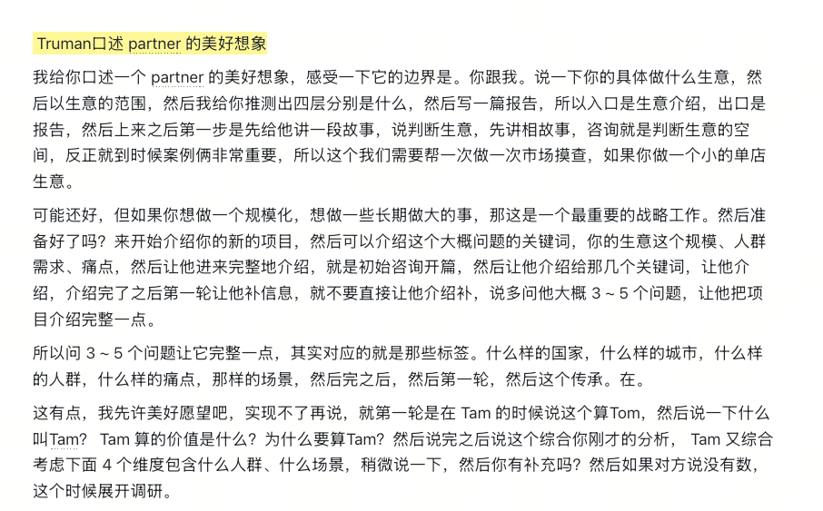

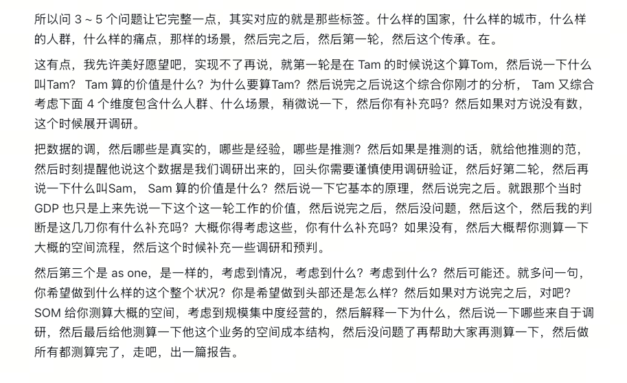

我说的，算是压缩后的专家经验，对算天花板熟悉的人，能理解背后的完整工作过程。但砻沣说，里面有一大半，他都听不懂。

听不懂，怎么办？

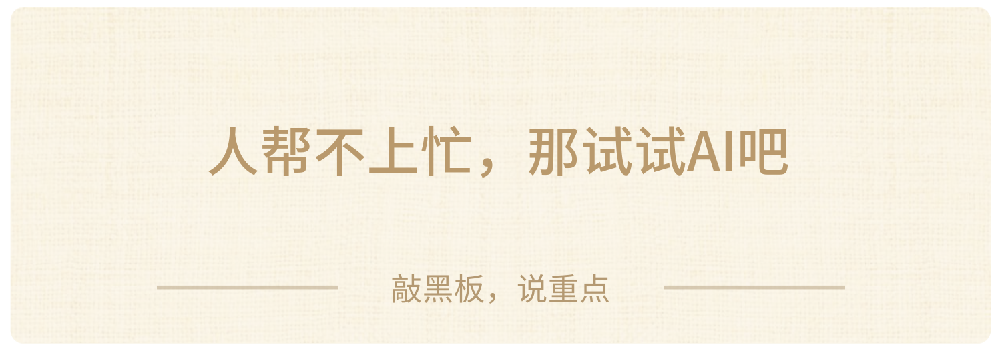

他把我的口喷原话完整交给 AI，让 AI 逐段拆解，帮助他学习理解：
1. 这段话包含哪些阶段？
2. 每个阶段要解决什么问题？
3. 输入和输出是什么？
4. 前后有什么依赖？
5. 为什么要这样安排？

AI在这里的作用，就是把我口喷压缩的隐含信息“解压”出来，变成砻沣可以理解、检查和实现的材料。

我提供了审美和部分体系，AI帮他拆开、理解，砻沣再把这些内容整理成系统提示词里的流程和要求。

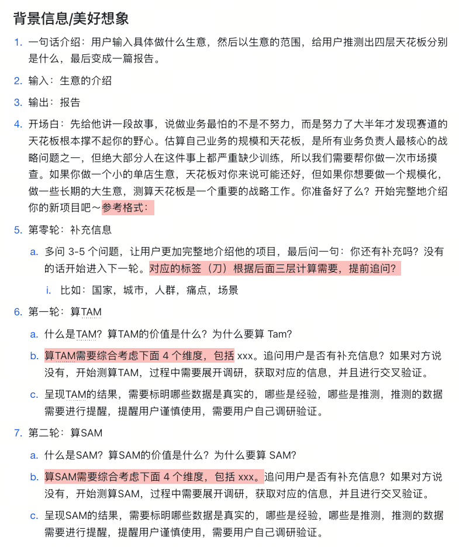

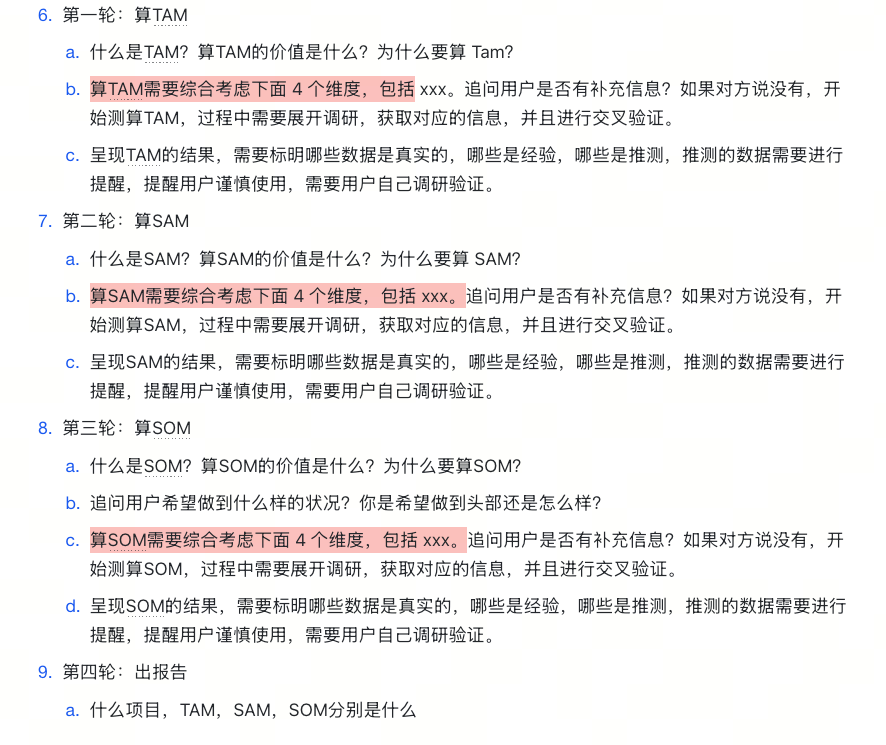

有了结构还不够啊，还得看看，哪些内容需要补齐。

他继续问 AI：“我现在想要弄一个系统提示词，下面是我的初步设想，请你阅读、理解和帮我分析缺少哪些内容。”

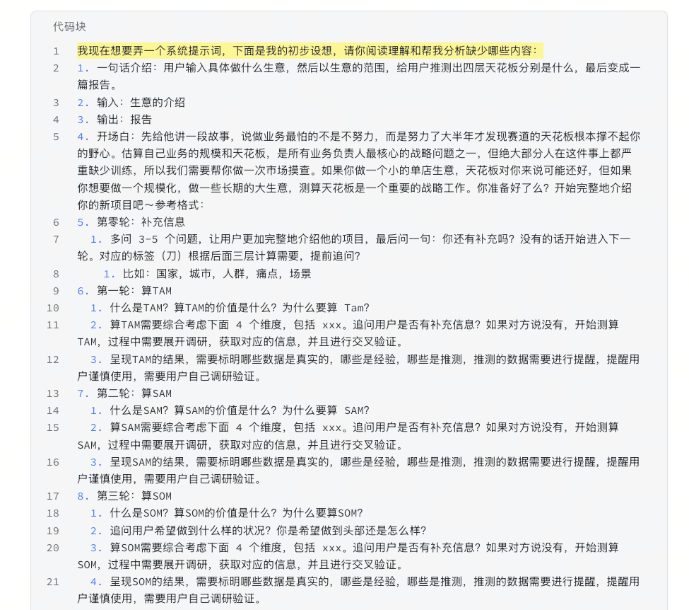

AI就会告诉他，需要补充：输入输出约束、分支、数据来源、可信度、异常处理、报告边界等等。

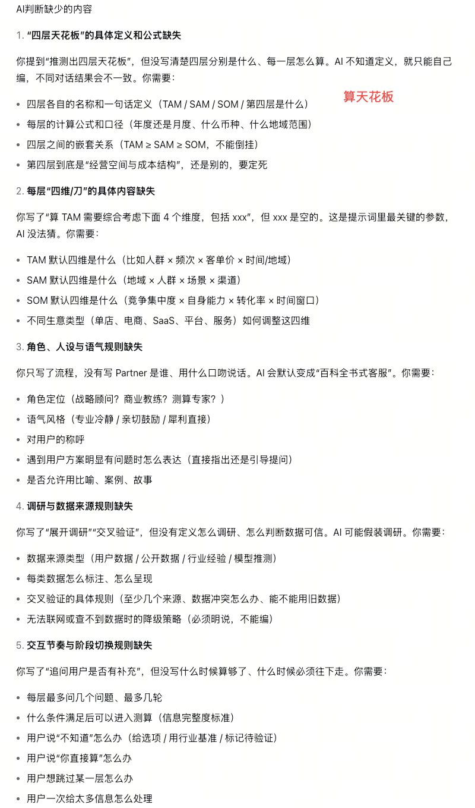

接下来，就进入具体打磨。这个过程，砻沣用一种非常“AI原生”的方式来干活。

**核心就是：**砻沣提要求，AI干活。人只负责提供审美、判断结果，发现AI做不到位的地方，他就手动补上。如果他也拿不准不太会，就找团队里的专家要反馈。

他对AI的要求
> 1. 每轮需要调研
> 2. 数据要标注来源
> 3. 推测要说明不确定性
> 4. 分析要给注意事项，不能只给结论
> 5. 还要让用户知道结论是怎样推出来的

内部专家来试用后给的反馈，他会和AI一起逐个分析，每个优化假设背后的详细原因。

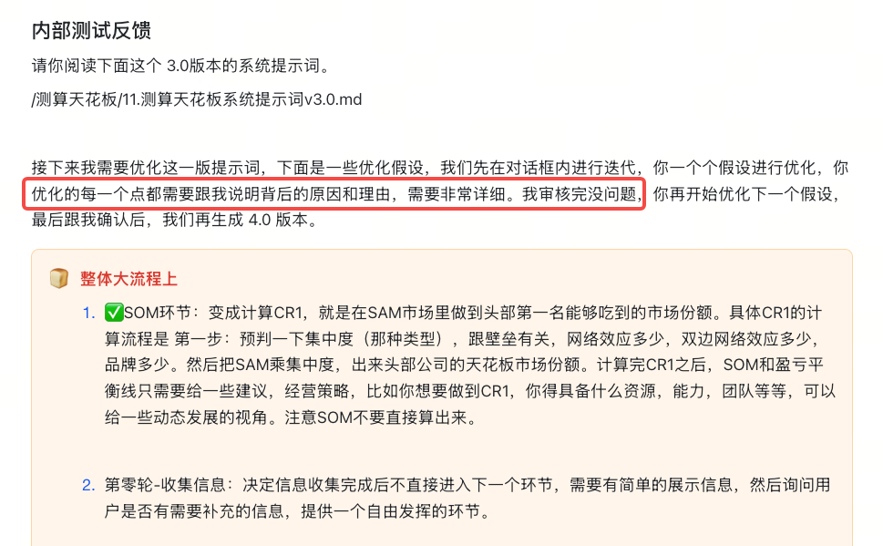

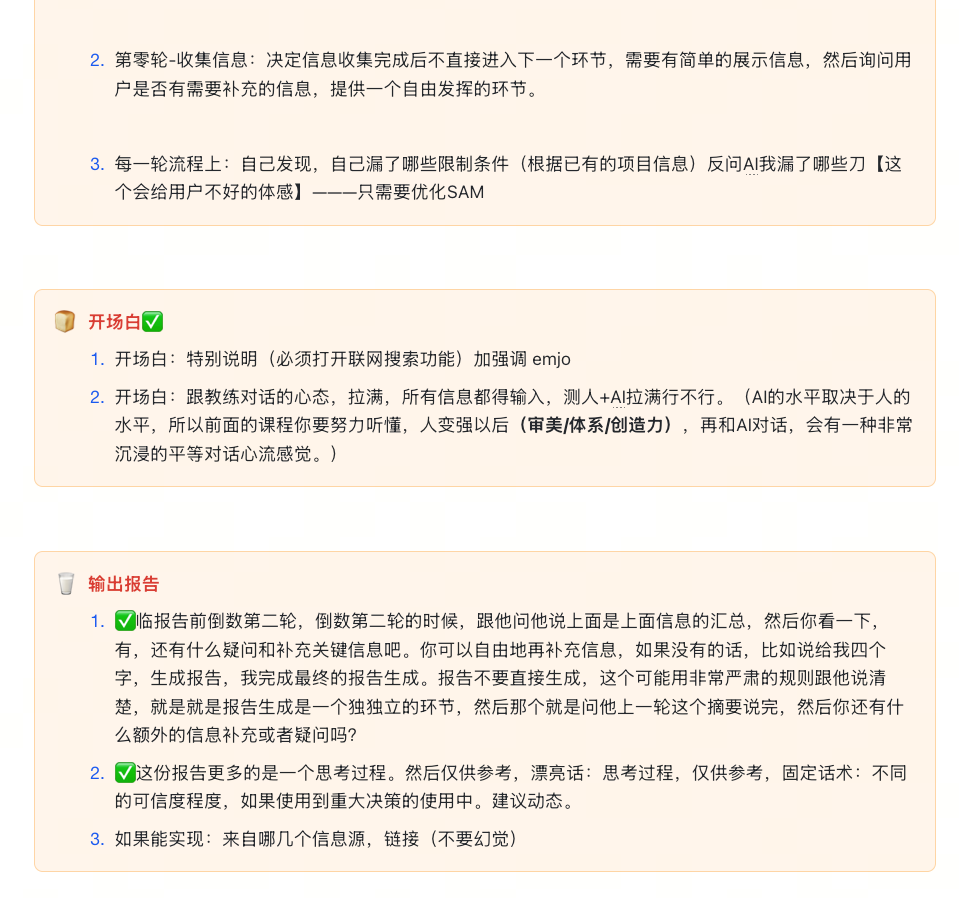

就这样，一个「算业务天花板」的Partner，他可以做得七七八八。

项目复盘时，砻沣跟我们说，只要有我的口喷，他就有80%的信心，可以搓一个完整的Partner。后来，他果然搓出来了《复盘营五步法》等几个Partner，质量都不错。

借助我的口喷和 AI 的辅助，砻沣参与的工作，已经从数据包整理，扩展到了Partner的打磨。

这时候，砻沣已经可以做出合格的Partner，但速度太慢了，一个Partner至少需要一个星期。

我给砻沣派了个任务，要赶在五一假期前搞定两个调研Partner。留给他的时间，只有一周。

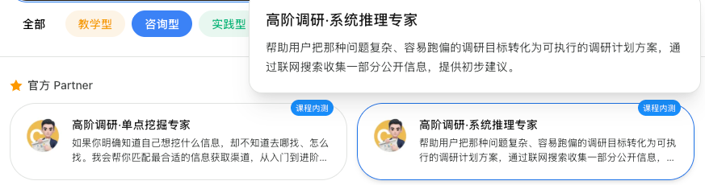

之前有过成功经验，这次是不是就容易了？他会怎么做？

————

虽然两个Partner有点接近，但是功能和要求差别挺大的，**一周做两个，非常有挑战**。

砻沣对自己要求很高，这一次，他给自己提了几个问题。一边想这些问题，一边动手做这两个Partner。

**如何明确出口**

之前做**《算天花板》**和**《复盘营五步法》**等几个Partner时，砻沣主要是在理解和执行我口喷的美好想象（审美、体系，包括具体的执行动作都有一些）。

到了调研 Partner，他第一次先问自己：能不能先自己写一版？这个 Partner 解决什么问题，出口是给调研计划还是给部分答案，用户应该拿走什么，哪些事超出当前条件不能承诺等等。

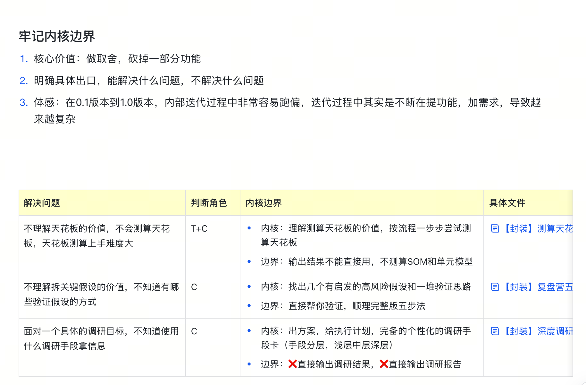

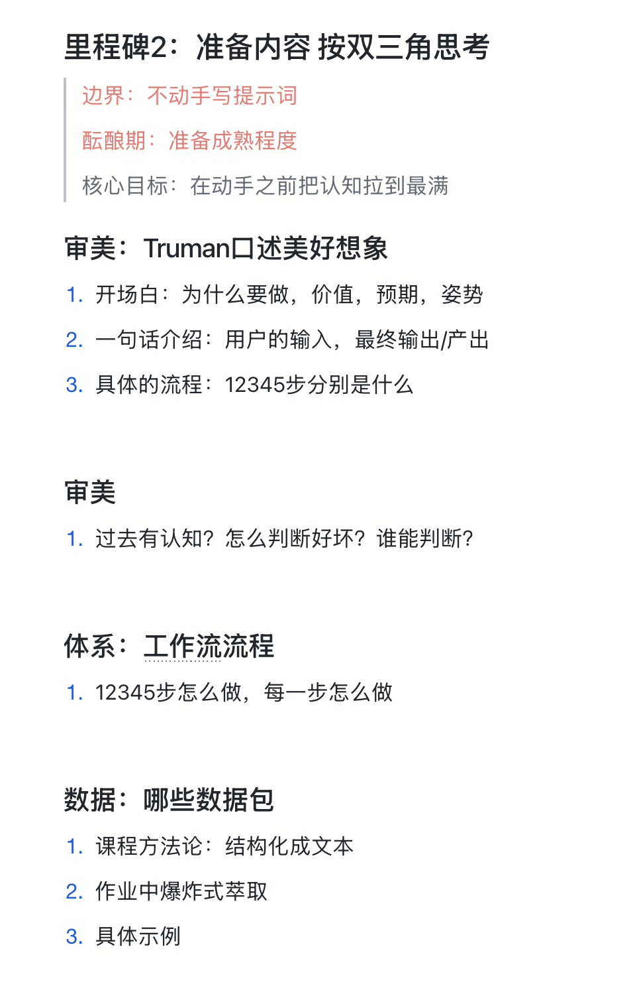

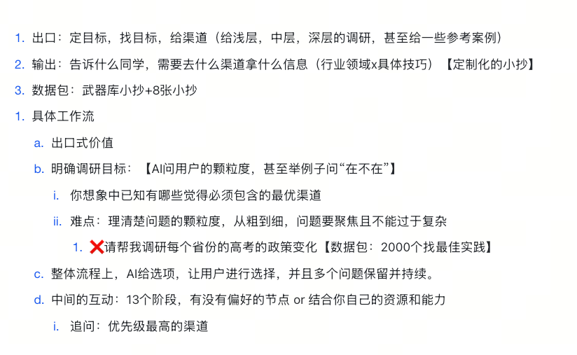

**如何提升审美+体系**

除了我口喷的提示词，砻沣会让AI帮忙分析整理。

每次内部试用我和其他专家**给出反馈后**，砻沣都是先让AI分析，给出优化建议，说明优化理由来帮助自己做判断，然后再修改。

做完**《算天花板》**和**《复盘营五步法》**等几个Partner后，他开始问自己：这些口喷和反馈背后的判断，我能不能自己学会？

于是，他开始把这些反馈一点点归类，尝试自己判断：哪些是审美问题，哪些是流程或分支的问题，哪些涉及交互话术、数据包或稳定性。慢慢地，他越来越清楚，具体哪里需要改，以及该怎么向AI提要求。

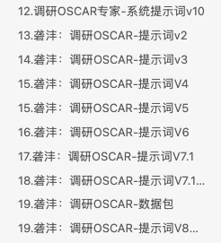

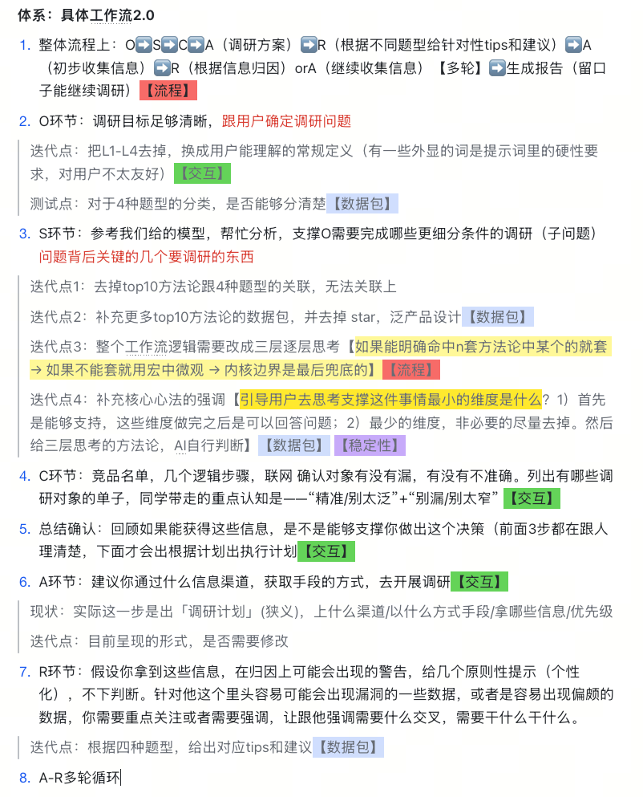

**如何提升基本功Feature**

> Featrue是一堂定义的，提升AI解题水平的的最小实践单位。

> 🙋‍♀️**选课口令**：**我选AI基本功**

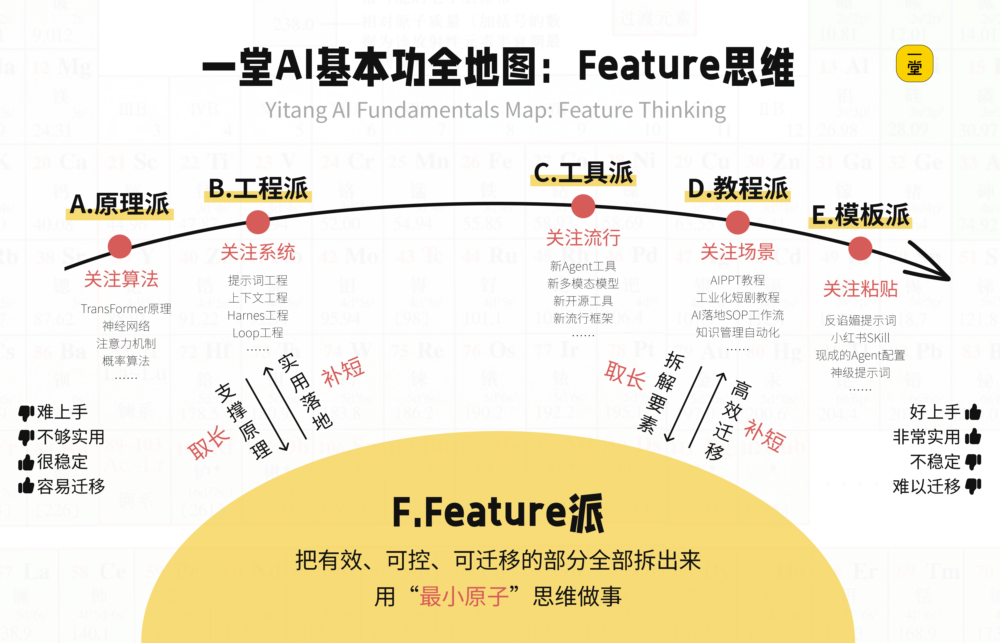

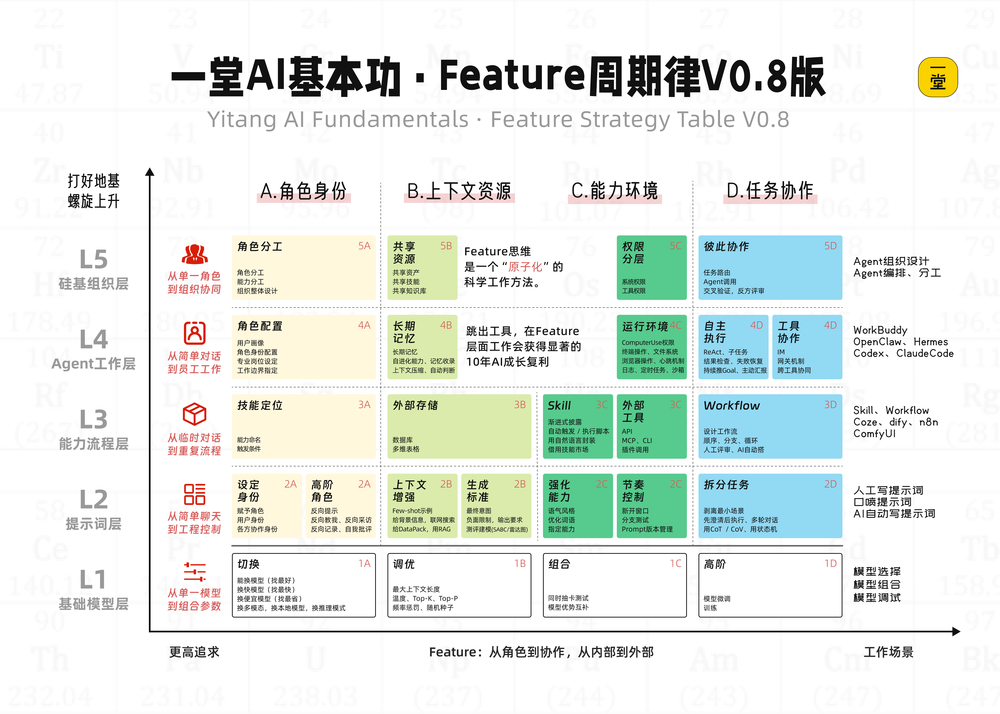

最初，他对最佳实践的学习还限于Human 3.0，他大概知道，这是一份很复杂、很强大的提示词，但具体的设计细节，里面包含哪些Feature都不太了解。

这时候，他手头已经有了十几个业界最佳实践的提示词，他就问自己：有没有对这些最佳实践更高效的使用方式？

于是就给AI派活：

- 先让AI按Feature拆解这些提示词，
- 再根据当前的调研课题，筛选出最接近的4个，
- 再继续分析每个Feature解决了什么局部问题，
- 最后只提取当前调研 Partner 能用上的 Feature

有了这样的基础，每次系统提示词都可以很快完成。

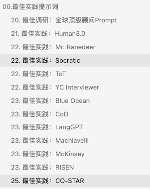

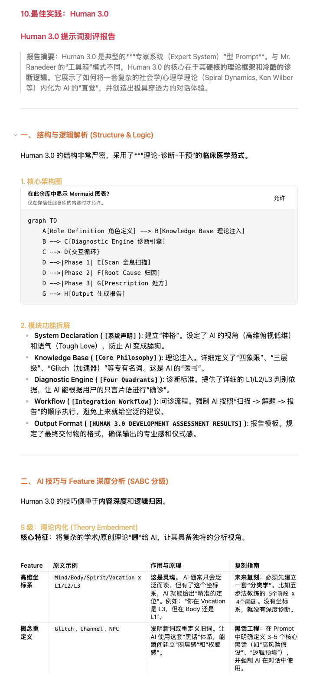

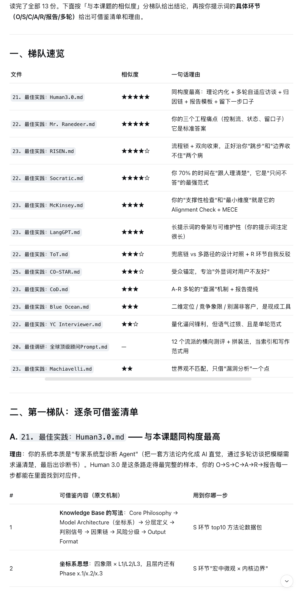

**如何提升制作流程**

之前做Partner的流程，基本都是来自我和其他同学的打样。这次他问自己：我能不能自己设计一套流程？

于是他基于之前流程，和自己做完几个Partner后复盘出来的流程、自己理解并设计了一个制作流程：
1. **找准场景**：先围绕 TCPR 充分做加法，再做 ROI、能力层级和内核边界的减法；
2. **充分准备**：用双三角想清楚审美、体系和数据；
3. **MVP验证**：分案例、分版本，让有判断力的人测试并形成共识；
4. **工程化实现**：处理边界条件、约束、Bug 和交互体验，直到足够稳定再发布。

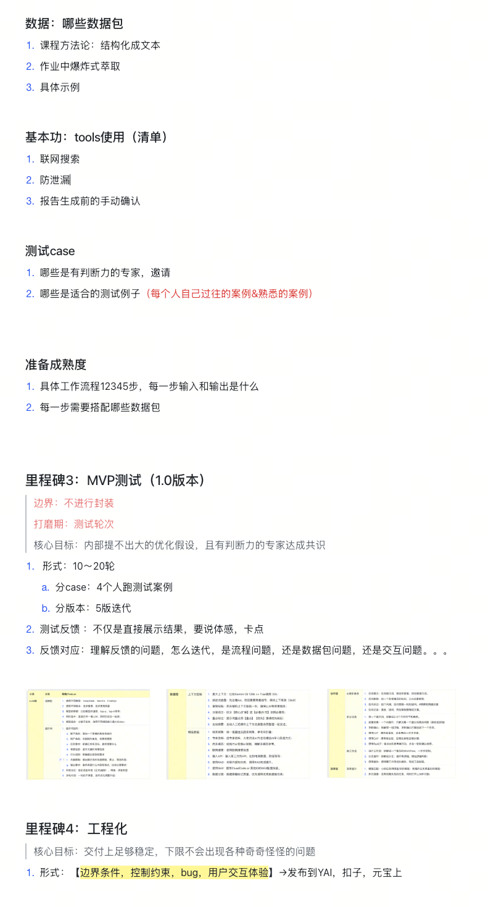

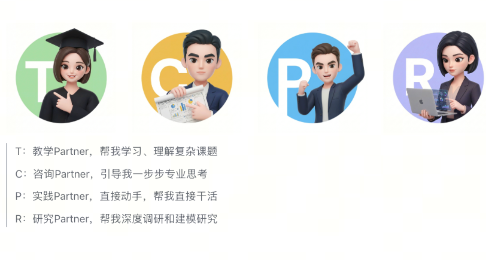

就这样，他带着这些问题，一边思考，一边推进两个调研 Partner 的设计和实现。遇到问题，就找之前用过的解法，或者问 AI、请教内部专家。

经过十几次迭代，他不仅一星期完成了两个复杂的调研 Partner，还**把自己的 Partner 制作流程跑通了**。

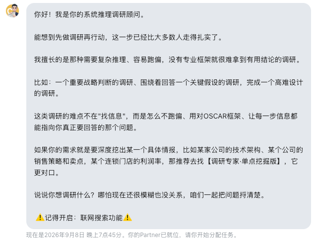

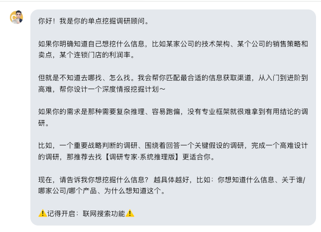

当周复盘，我们本来觉得，一周能做出两个Partner，**已经很厉害了**。结果，他把这套制作流程拿出来之后，我们**都挺震惊**的，砻沣什么时候成长到这个地步了？！这么复杂的项目，他都能自己梳理清楚，真的能独当一面了。

后来，大部分的Partner，都由砻沣牵头来做了。

这个时候，除了最内核的部分需要找我口喷，其他部分，他已经能自己做到七八十分。

砻沣的进步还没停下。

**细化1：里程碑思维**

这个进步，来自一次“难产”的Partner，「科学决策·ROI搭档」Partner，现在的 YAI 使用量排在第二，但当时差点没做出来。

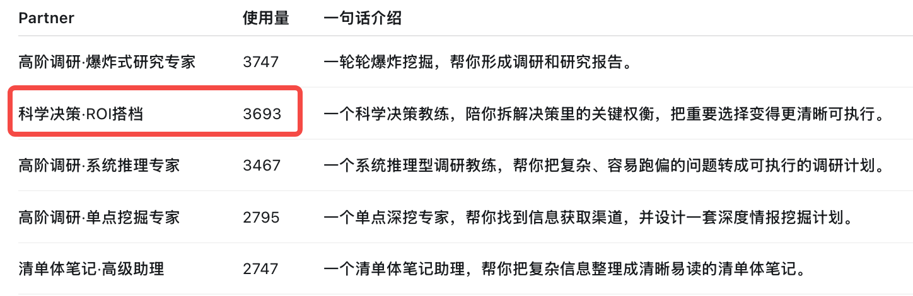

我当时就预判，这个Partner要做出比较好的效果，难度会比较大。所以，我让砻沣和另一位教研PM，分别按流程做一个版本。

两个人都做出来了，我们先看他们当时的里程碑设计，看上去都挺不错：

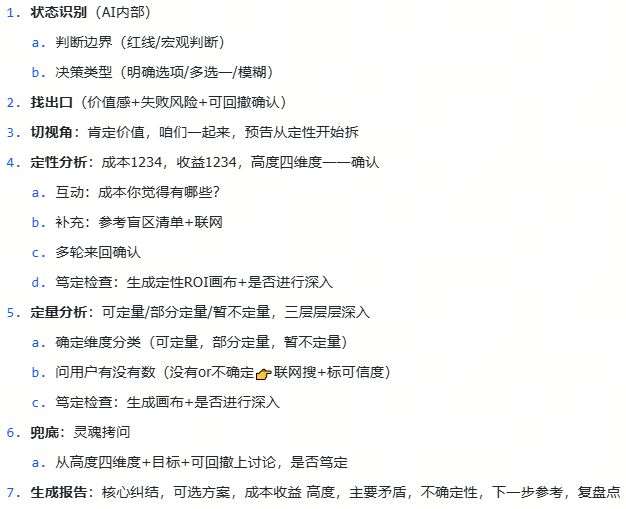

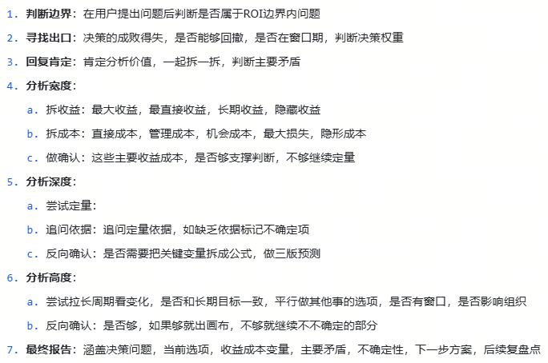

但是，从内部测试的反馈来看，效果不是太理想，大概只有四五十分。

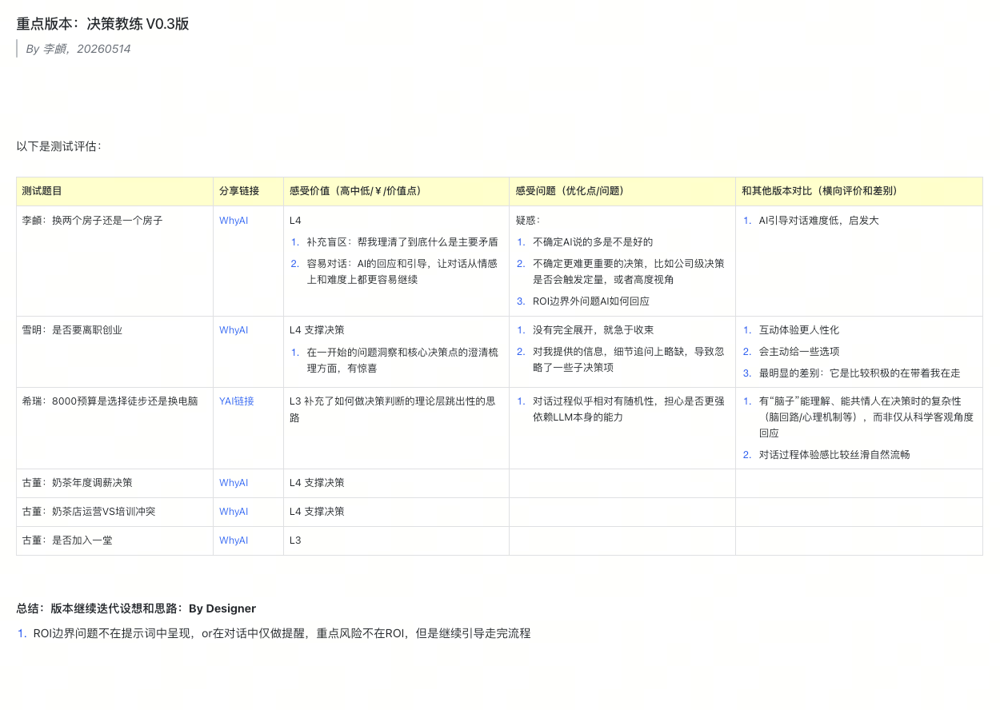

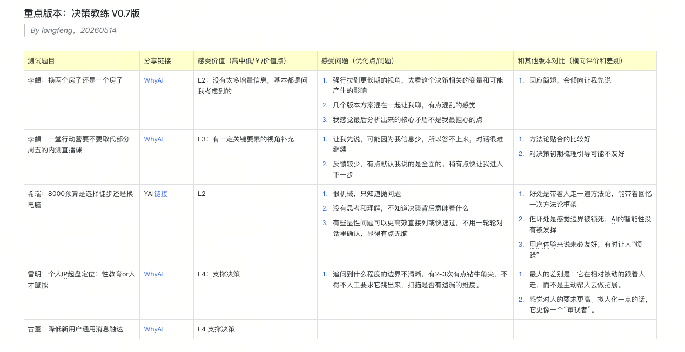

项目有点卡住了，他们就来找我。我整理了一版新的科学决策里程碑，砻沣就按这版里程碑，很快把新的Partner版本做了出来。

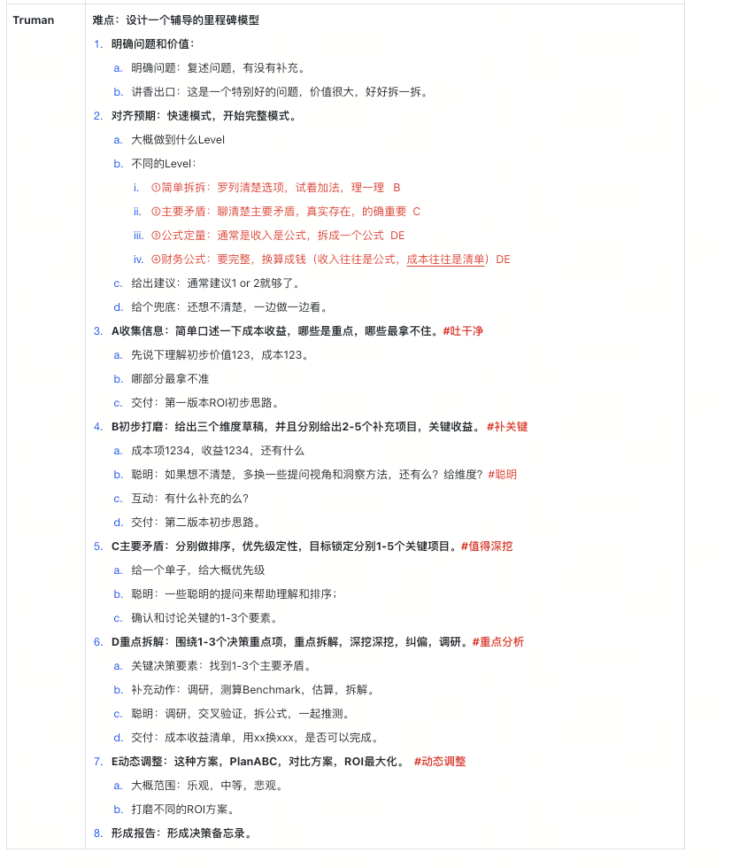

后来复盘时，砻沣说，之前Partner设计也有严格的里程碑，但从来没有把和用户交互的过程梳理得这么仔细。从那以后，他就在自己的Partner制作流程里，加了一步"**和Truman确认里程碑模型"**。

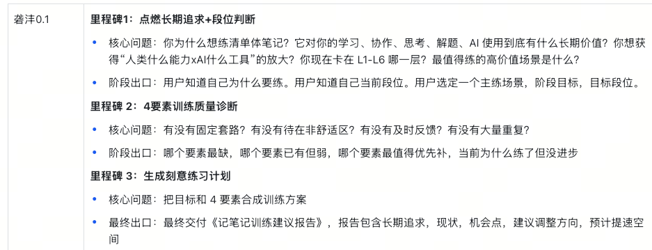

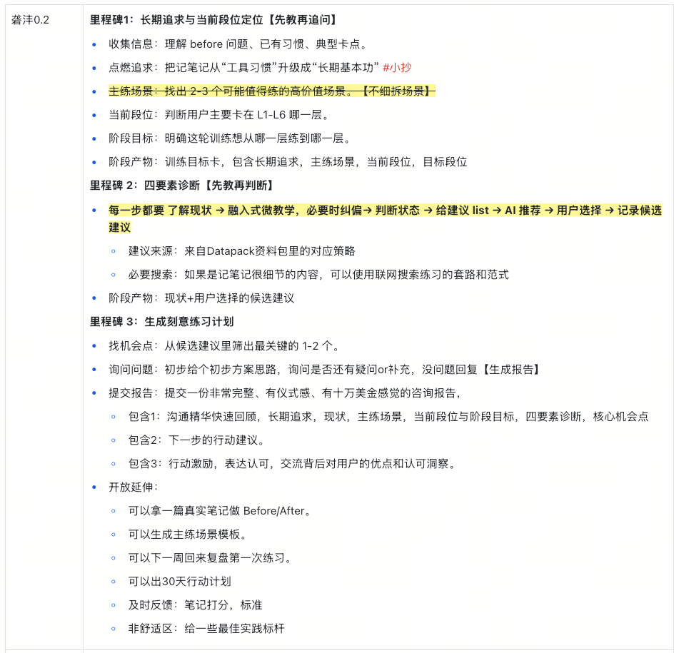

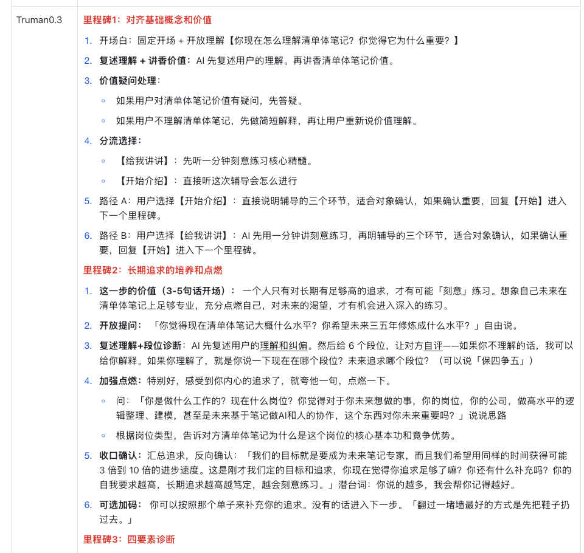

这还没完，他还根据这次认知，形成了两个后来反复使用的提示词Feature：
1. **状态机：**系统在任意时刻只处于一个明确状态，只有满足特定事件才能进入下一状态，减少跳步和随机发散。
2. **先复述再追问：**先让用户感到“Partner 理解我的处境”，再继续追问和分析，避免一上来就像填表。

> 状态机Feature，连我都没用过。我问他怎么研究出来的，他就说，是和AI一起学习研究出来的。

**细化2：流程优化**

这个进步，来自他对过去多个Partner项目的全量复盘。他让 AI 遍历每个项目的对话记录、文件、提示词历史版本和反馈，重新还原完整过程，识别每次推翻、修改和验证之间的关系。


他复盘下来发现，真正让搓Partner的速度提起来的，是**流程的稳定有效和多线程同时推进**，而不是指望AI 一次就生成完美提示词。

到这个阶段，他把原来的制作流程进一步梳理和优化，形成了现在仍在使用的完整工作流：


按他现在的实际做法，除了启动时需要我口喷、中间需要和我确认里程碑，其他节点他基本上自己就能闭环。

**细化3：AI做测试**

为了提高协作效率，一堂内部通过CLI，把不同的AI工具打通了，很多事情就可以让Agent自己完成。
1. **复盘真实对话：** 让AI读取团队内部试用 Partner的真实对话过程，分析哪些地方可能不顺畅，有没有跳步，哪些内容还可以表达得更清楚。
2. **跑模拟对话：** 让AI模拟A、B两方，跑完一段完整对话，专门观察交互和分支。


至此，砻沣在Partner上的进步都讲完了。现在我们内部都管他叫"**一堂Partner第一人**"哈哈哈。


我发现砻沣身上有两个优点啊：

**第一个优点，是知道自己不行。**

**这是优点，不是批评啊**。相比愿意承认自己不会不行，我其实害怕遇到的是：觉得自己很厉害，和AI咔咔把活干完了，但是结果完全不能用，还需要返工的那种。

砻沣知道双三角，遇到一个事情，他会想：我没有审美，我就管别人要；你要让我给你分活儿，我就管你要目标、要标准、要边界、要方法等等；你只要给我，我就能干。这种状态拿捏得非常舒服。

**第二个优点，是他对双三角非常笃定。**

砻沣在有明确出口的时候，他相信双三角，可以指导他一步步走过去。靠着对双三角的理解，他可以和AI互相成长做事。

再回顾一下砻沣进步的几个阶段。
> 1. 简单参与，一开始还模模糊糊，只能帮助完成数据包的提取
> 2. 管理项目，基于我的口喷，可以借助AI完成Partner的一部分工作
> 3. 主动驱动，发现自己哪些不够，就想办法补上
> 4. 全面细化，不满足原有的流程，自己主动优化迭代

回到双三角来看，是一个借助AI提升自己，完成一次全面能力提升的过程：

参与双三角（弄数据包）→ 管理双三角（用AI理解项目）→ 补齐双三角（自我提升）→ 创新/细化双三角（状态机等）


这是一种因为不满意而持续升级、敢于进入非舒适区、让自己和AI一起变强的进步方式。

不知道大家有没有注意到一个细节：每次项目之后的复盘，是整个过程很重要的一环。教研团队每周都会定目标、提假设，做复盘，上半年这样的复盘大概做了有二三十次。

一个教研新人，靠着一次次的复盘，加上砻沣自己的主动，加上AI的辅助和部分专家反馈，才能快速成长到现在的样子。用一个公式来概括这个案例，就是：

**（砻沣的主动 + 人和AI互相促进 + 专家反馈）x 周期复盘 ≈ 一堂 Partner 工业化生产**

讲完了砻沣和 Partner，我们稍微展望一下未来YAI的演化。

目前一堂在做的是，让 Partner 在一项项重要的工作上，逐步成为你最好的AI伙伴，不管是科学决策、讲香、清单体、人生红点、各种调研，这些Partner的质量都比通用模型、开源Skill要显著更好。

再往后，像我们想做的**选课顾问、课程发现顾问这类Agent**，就需要更多Feature。它得能调用工具、使用技能、处理文件，未来会长在Skill / Agent这一层。

再再往后，像“**我的 CEO 助理”“一堂学习秘书”“我的业务幕僚**”这样的数字员工，我们希望它能长期记住你的背景，持续跟进你的事情，在合适的时候主动帮你推进工作，和你一起成长。这时候，大概率就得到龙虾/Hermes这一层或更高层实现了。

**一堂对 YAI 的期望，也是一堂对Feature层级理解的体现。**


