### 第二个案例：郁金星

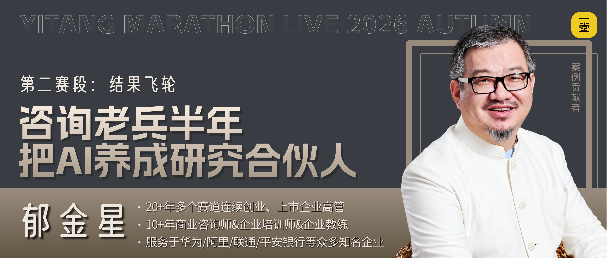

接下来这个案例，是来自比我资深得多的一位前辈，郁金星，金星老师。开讲之前，先问你们一个问题。

现在 AI 做图、做 PPT、做短剧之类，大家已经见过很多拿很好结果的了。但是 AI 在商业决策和商业咨询上的渗透率就相对就低很多。不知道大家体感怎么样？

**【🙋🏻‍♀️思考】**你想想，如果老板让你**做一份复杂的研究报告、业务分析、项目转型方案，或者给投资人写一份 BP**，你敢不敢把问题丢给 AI，然后直接拿它的结果去交付？

——

我估计大多数人都不太敢。

AI 确实很快就能写出一份很长、很完整的东西，但是**从“看起来像方案、像报告”，到“真的能用于商业决策”，中间还差很远。**它里面可能有幻觉、有编造的数据，也可能只是把网上最常见的说法重新排列一遍，和你真实的业务的相关性也极低。

但有人真的做到了。**郁金星这个案例就是，在商业咨询和企业培训领域非常资深的一位大哥**。

20 多年前就开始连续创业，做过上市公司高管、私募基金 GP，辅导过上百家创业企业；2016 年起做商业咨询和企业培训，服务的是华为、阿里、沃尔玛、宝洁这个级别的客户。

**他每天面对的题，可能比我们在公司给老板做汇报难几十倍**，服务的都是这种非常挑剔的大公司，现场坐着一堆比你懂行的行业专家，你的交付绝对不能只是“听起来不错”。

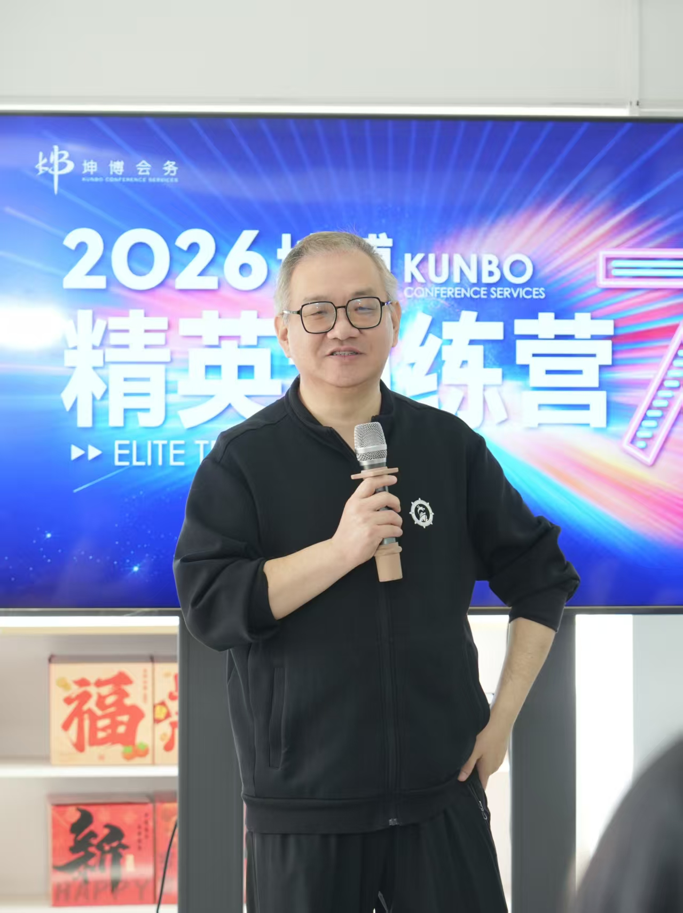

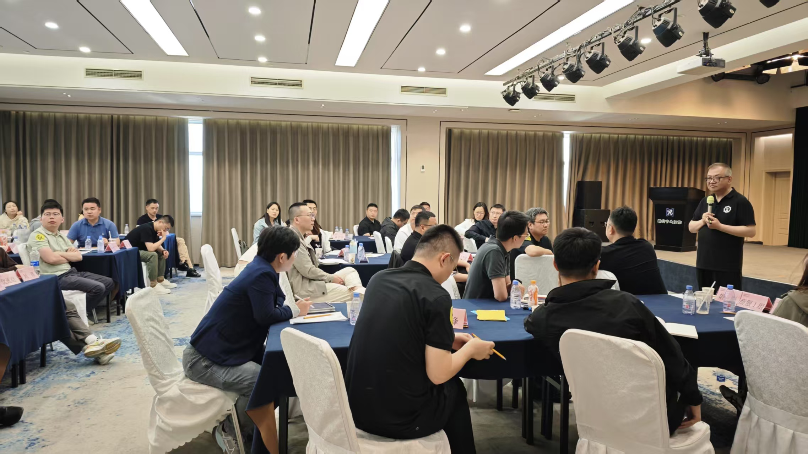

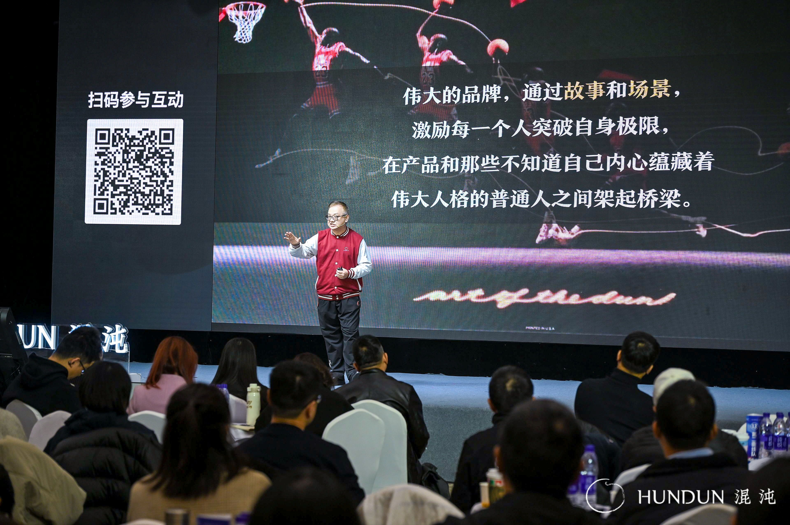

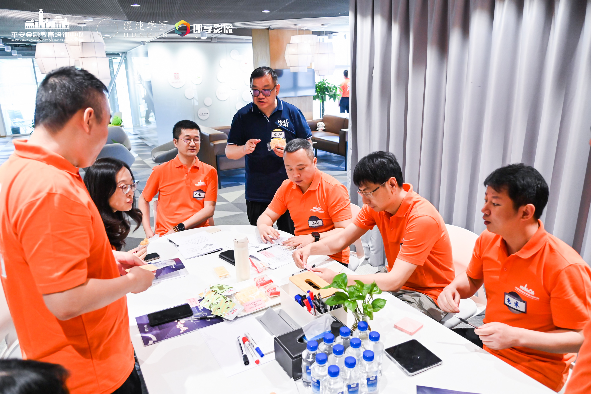

就是这么难的一类任务，**他现在把 AI 用到了堪比一个“优秀搭档”的程度**。他是怎么一步步把 AI 真正落实到交付咨询、培训的过程中的呢？接下来就看看这个案例。

先交代一句他这一类任务的底色，难在哪里。

首先，作为一位咨询顾问型企业讲师，**他交付的是定制课，每个行业、每家企业痛点都不一样**，没法拿现成的稿子凑。所以，日常有大量的调研、预研、分析类的工作。

二来，相当于是**轻咨询**，客户要的不只是听个课、看个课件，而是要有专家顾问级的价值，能**帮他们解决困惑、问题，搞定真的业务需求**。所以要真“懂”客户，想他们所想。

所以做起来是**工期长、产能低。**一门像样的定制课，稍微复杂一点的，**能熬上半个月、一个月，有时候光「调研」可能就要做半个月**。

所以郁金星最**首要希望用 AI 帮解决的，就是一揽子杂活儿**：找行业数据、翻案例资料、组织内容素材、调排版等等，把人从耗时的体力活上解放出来，真正投入精力来琢磨逻辑、打磨核心洞察和观点。

最初他是怎么开始调教 AI 的呢？其实和大家一样，也经历了一个新手期。

郁金星认真学习和使用 AI，基本**从 2025 年下半年参加一堂的「AI 大航海」开始**。

最早他就是打开聊天框，问问题、查资料。那时候他的感受很直接：AI 知道的东西确实比搜索引擎多，整理出来的结构也舒服，条理清晰，**这时候他确实有被 AI 爽到过。**

但很快发现，也就到这了，基本还是个搜索引擎的水平，**离真正帮上忙好像还差不少，卡了挺长一段时间。**这个卡点，**我估计不少人现在还卡着。**

转折是一次分享，他在 AI 大航海里**认真听了花总的《刻意练习 x AI上下文工程》**，第一次知道了**提示词「六要素模型」**，慢慢找到感觉：对 AI，不能只丢一个问题过去，要把自己到底在做什么、要解决什么、希望它按什么标准输出，讲得更清楚一点。

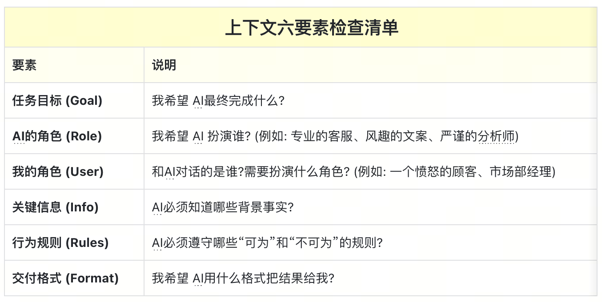

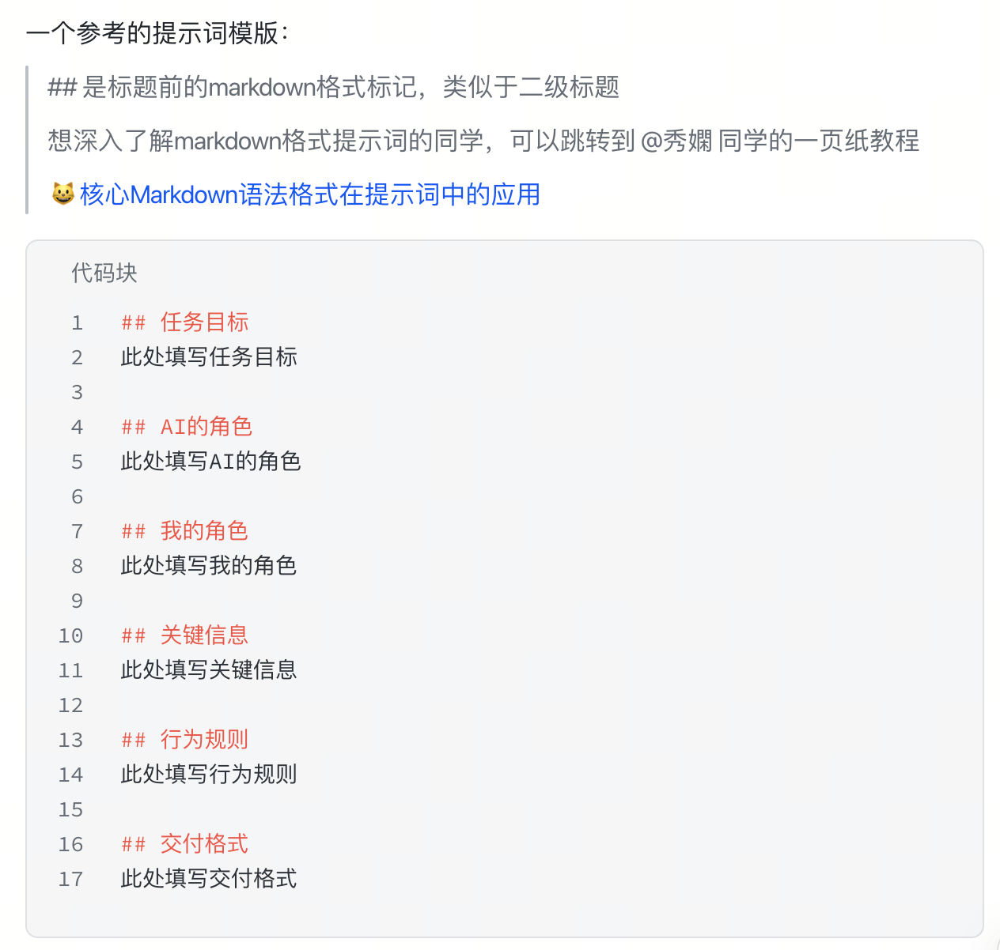

在他眼里，还不仅仅是一个提示词技巧的问题，实际上是**「上下文工程」**。我们教研同学访谈他，他说了一句特别到位的话：**“做咨询的人，本应该最擅长的就是上下文，可自己以前给 AI 的信息太少了。”**

这一下之后，AI 开始有点像样了，他也越用越顺手。原本散落在网上的资料，能够被梳成一个清楚的结构；临时要搭一个课程框架，也能先给出一版能被讨论的初稿。AI 确实帮他省掉了不少体力活儿。

几个月下来，他慢慢形成一个判断：**只要“题目”出得对，AI 是可以在单点任务上，被拉进工作的**。这个阶段，他在这一类任务上的双三角画布大概是↓这样，挺明显，人的这一侧厚，AI 那一侧薄。

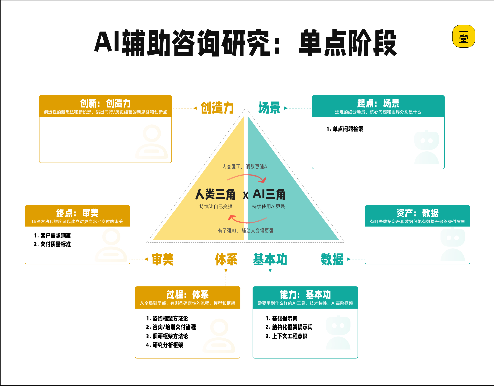

好了，有了这些正反馈，他对 AI 一下就更有信心、也更大胆了。结果一大胆，问题就跟着来了。

有一次他让 AI 帮做调研，AI 很快就给出一大堆材料、数据，看着特别像模像样，很唬人，**他就直接信了，还用到了讲课PPT里**。

结果到了客户现场，**讲到某个数据时立马被客户举手质疑**，“你这个数是哪儿来的？我们从行业协会这块专门拿到的报告不是这个数据呀。”

他当时就尴尬住了，总不能说这个数是 AI 说的吧，只好说“是网上查的，可能没有做好交叉验证...”总之先圆过去了。你们能想象吗，一位二十多年的资深顾问，在基础问题上被客户质疑得摁在当场，确实很窘迫啊。他自己说，这时候**对 AI 的情绪简直可以说是气愤。越是靠专业吃饭的人，越栽不起这种跟头。**

但经过一两次这种踩坑，他就**搞清楚了 AI 的问题、能力、边界是什么**：AI 最大的问题，不是不会写，**而是随机性和幻觉太严重**。对普通内容，错一点可能没关系；**但对大客户交付，数据来源和逻辑链条一旦被质疑，整场课的可信度就塌了。**

**【🙋🏻互动】**那么这时候问题就来了，一做调研，AI 哗啦啦吐一大堆巨长的信息，斩钉截铁地给你 20、30 个信息源、说是某个知名理论时，你信不信？很难验证，怎么办？

郁金星是怎么思考的呢？他冷静下来想，如果回到没有 AI 的时代，人类老办法是怎么做的？在大量的调研数据、信息、事实面前，**专家最常用的方法就是多层交叉验证呀。**

于是他又**把人类的经验、已经刻进骨子里的工作习惯，搬到了与 AI 的协作上**，他开始重新分工，并且设计了三层措施：

**第一，多 AI 交叉验证。**比如同一个数据，DeepSeek 做完，再交给豆包、千问等模型去验证、挑毛病，先把互相存疑、冲突之处找出来。所以后来但凡他经手的重要内容，至少都经过3个模型的交叉。

**第二，人工加 AI 交叉。**自己的权威资料、人工查到的行业报告、专家访谈，一项一项对照：时间线对不对、基准数据对不对、案例事实有没有偏差。

**第三，把自己的资料和规则交给 AI。**比如，把自己 Obsidian 库里的一手资料，多年积累的访谈、调研、行业材料等等，都放进给 AI 的知识库，并明确告诉 AI 规则：哪些数据必须和原始资料对得上，对不上的，以人工资料为准。

这背后还有郁金星特别想强调讲的一点，我也很认同。

现在 **AI 能吃到的公开数据，哪怕是最顶尖的模型，都有天花板，有很大的局限性**，不论是数据源本身的可信度、还是说有很多水下信息、内部数据并不会公开暴露，等等。

所以**人永远也不能停止积攒属于自己「独家的数据和内容」**。你认真做过的行业研究、亲自访谈拿到的事实、基于经验的观察沉淀，才是 AI 无法替你凭空补出来的部分。

你不去做这些难而正确的事，最后水平就会和 AI 均值差不多；**你把自己的牌攒起来，AI 才有机会在你的基础上继续放大。**这一点在他后面的案例中也会体现。

好了，你们再来感受一下啊。这一步看起来是在说给 AI 纠偏的小技巧，实际上是想说，要想让 AI 输出的质量更可靠、AI 交付的工作更可用，**人必须把自己的专业体系、工作习惯、验证边界，变成 AI 工作流的一部分**。也就说，**人的能力需要往 AI 三角里面走，人先让 AI 变强。**

这个阶段的双三角画布，在 AI 侧明显长起来了很多，两边更加平衡了。

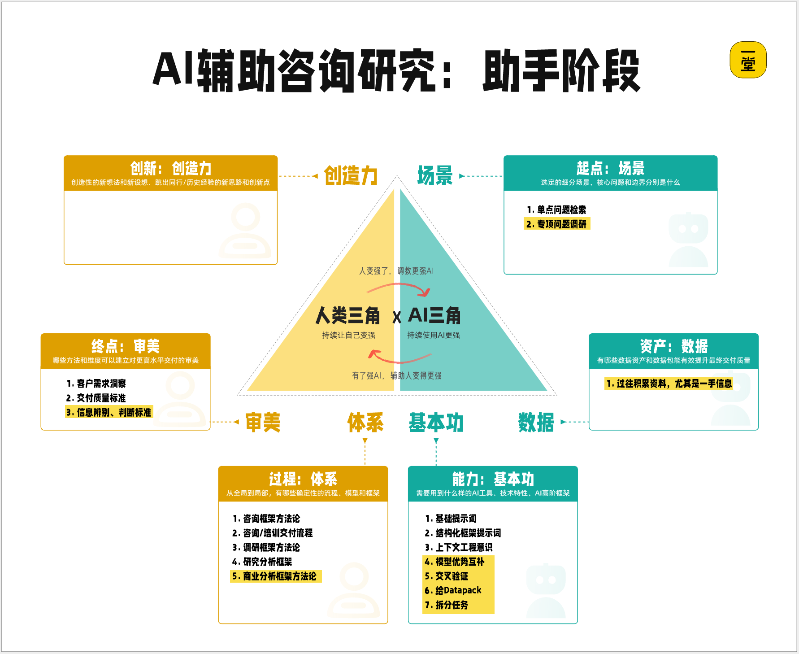

到这儿，**AI 已经像个听话、专业的助理，能帮完成一些单点的工作，**但就这样，郁金星当然觉得还不够。

前面是把二十多年的专业能力“教”给 AI 了，但他还一直在找一个机会，**AI 有没有可能，在他自己最需要、也最难补的地方，反过来帮人变强？**

**【🙋🏻互动】**停下来想2秒，如果是你，结合你用AI的场景、体感，能想到什么点，觉得 AI 很可能能帮自己提升的？

——

我们看看郁金星是怎么想的。先回到他的客户交付现场去想，这些头部大公司，花高价找外部顾问，是为了什么？只是听个课、听个分享吗？

他转述过客户的一句原话：“**我不想听故事，那是别人的故事。我的目标，是借鉴别人的故事来解决我们的问题。”**所以客户往往会继续追问好几层：

> - 你能不能从案例和信息里抽象出底层逻辑？

> - 这个逻辑能不能迁移到我们的行业？

> - 我们拿着这套理解，能不能回去说服自己的老大，推进一个真正的方案？

> - ......

也就是说，**客户要的不是简单的 what 和 how，还要知道 why。**

过去他一直知道这个要求，也一直努力把案例往深处研究。**但问题是，一个人面对陌生行业时，时间和知识边界都摆在那里，想把每一层都查全、讲透，并不容易。**

现在有了 AI 之后呢？能不能帮忙？AI 能不能帮自己把问题一层层拆开，甚至看这些层次之间能不能互相解释？

比如这几年的经典培训案例**「泡泡玛特」**，常见讲法往往会分析三层：
1. 第一层：**是新闻和现象**：卖得很好、增长很快；
2. 第二层：**是经营事实**：财务数据、经营增长，收入、产品、渠道和用户变化；
3. 第三层：**是商业逻辑**：单元模型、产品转化、复购机制、增长飞轮...

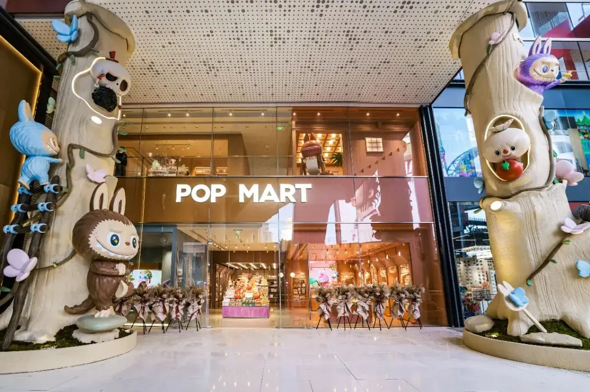

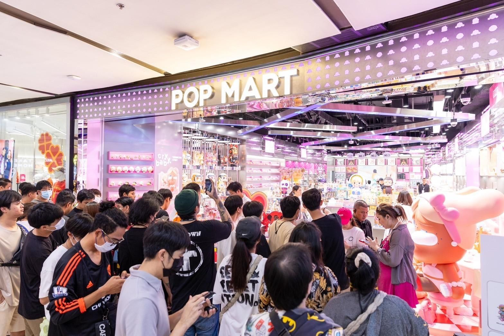

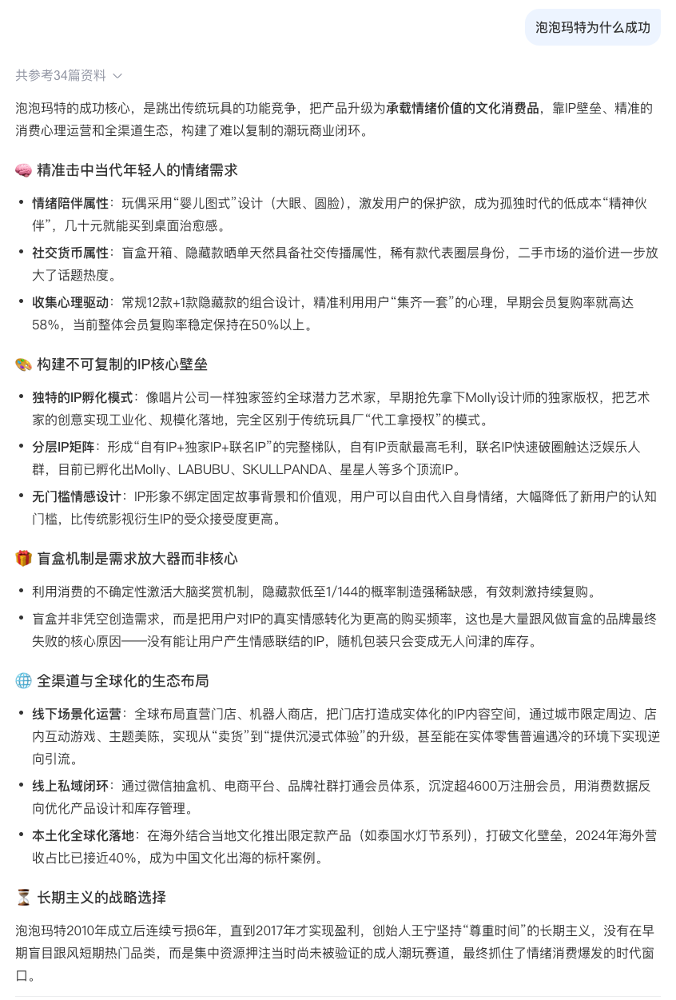

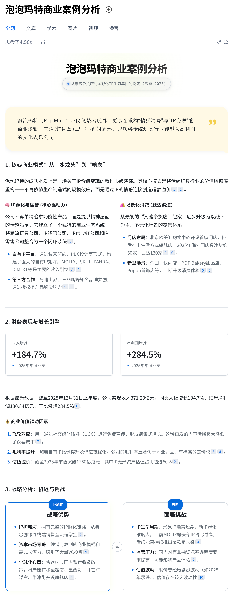

没有 AI 的时候，可能在有限的时间内，研究到这里已经很深了。说实话，我们多数人看案例，看到第二层就停了。但有了 AI 之后，**郁金星还可以继续追问「第四层」：**

> - 为什么在当下这个环境里能成功？

> - 10 年前为什么不一定行？

> - 是什么社会心理变化在支撑？

> - 为什么情绪价值在当下会超过功能价值？

> - 它可被参考的边界在哪里？

> - ...

然后他发现，AI 很快能旁征博引地调用更多人文社科类的、政治经济类、社会发展趋势的研究，比如提到了像韩炳哲《疲怠社会》、三浦展《第四消费时代》等等学术作品，这些都是他之前不熟悉、甚至不知道的。

你们看这个动作，他自己未必知道答案，重点是，**他有足够优秀的提问能力，对 AI 也能像对专家访谈一样，从不同角度追问为什么，把 AI 更广阔的知识调动出来**，挖出他自己原有认知边界之外的视角、认知。

**四层分析的框架他本来也有，但以前不是每一次都有机会做到这么深、这么完备。**现在靠 AI，短时间内就能打开思路，一个案例背后的复杂分析结构，一下就都分层讲清楚了、都打通了。

**人的专业性给 AI 上下文、最终意图、标准和边界；AI 通过巨量的知识储备、大范围的信息整理和分层拆解，反过来把人的体系夯实。**

**到这个阶段，AI 早就不只是一个工作助理，有时候已经像一个可以一起做深度研究的搭档、合伙人。**

这个阶段的双三角画布，比之前填得更丰富、更完备了。

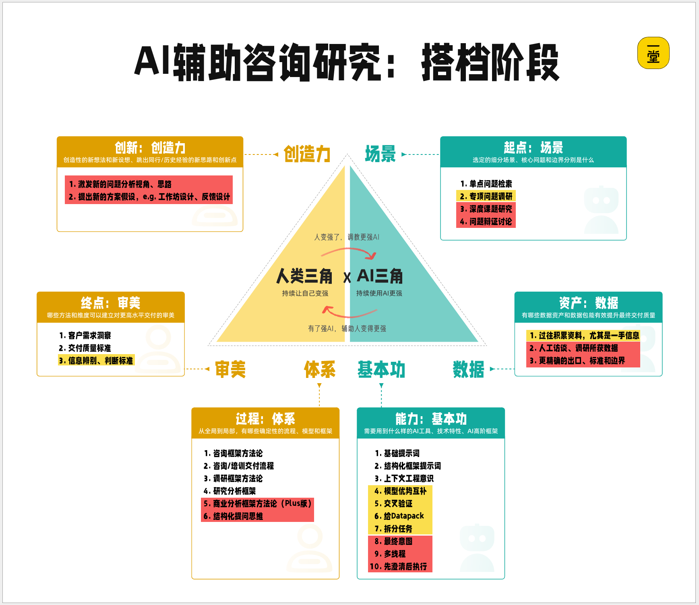

接下来给大家再讲一个完整案例，他这几个月以来“人教 AI、AI 教人”的积累，终于要在一个真实项目里汇合。

**【💡启发】**大家可以带着问题来听，看看这背后，他到底应用和加强了多少个双三角的要素。

> ⚠️ 先说一句，**案例已经脱敏**了一些关键客户信息，大家不要瞎猜，专心关注案例过程本身~~

今年4月中旬，郁金星从之前长期合作的培训公司那边，临时接到了一个特别着急的活儿。

有个客户准备组织高管去胖东来做一次游学，**去之前，想做一场定制化的「医药供应链 x 胖东来案例」的线下培训工作坊**。但紧迫的是，培训公司找到郁金星的时候，**只剩下 8 天时间了**。

其实客户早在3月底就提出了需求，**期间已经一连找了5-6个培训老师，**甚至找来了真实在胖东来干过十年的店长，**客户都不认可。**

问了才知道，**客户是一家大家都知道的互联网头部大厂，这次参训的又都是事业部的高管。**之前郁金星也和他们其他事业部合作过，一听就明白：为什么纯做培训的讲师不行，也知道了客户在意的交付基准线在哪里。

接不接？郁金星心里也纠结，自己之前确实积累了不少胖东来的研究、课件、资料，但客户要求高，领域内容垂，最关键是时间极其紧张。

**【🙋🏻互动】**代入一下，如果是你们，面对这样的高难度大题，敢不敢接？

——

郁金星最后还是下决心去挑战一下。

但他也说，如果没有AI，或者说，**如果没有前一阵子的 AI 积累，这样的难活儿，他是决计不敢接的。**

那这个难题，他是怎么一步步啃下来的呢。

第一轮和客户沟通完，明面上**提出了两个交付内容：**
1. 医药行业供应链的基础扫描，因为高管中有不少是跨部门过来的；
2. 深度介绍胖东来线下药店的模式和做法。

沟通完，郁金星**承诺第二天就能给大纲。**

当天晚上，他把所有客户资料、沟通纪要、参与者背景和**已有资料原原本本发给 AI，让它提炼三样**——核心学员诉求、学员普遍基础水平、课程必须回答的三个核心问题。

AI 很快给出一版大纲，大方向都对，他花十几分钟，结合自己的判断改改，基线就定了，第二天就拿着这版继续和客户沟通。

郁金星说，搁以前，光这一步他就得自己坐在那儿琢磨一两个小时，还总忍不住脑补客户的想法。现在有个帮手先帮忙把信息过一遍筛，人只做最终的判断，**省了特别多时间和内耗。**

第二天交了大纲和初步想法，客户很惊喜，展开讲了更多具体的子问题和需求，比如医药行业采购怎么做，供应商怎么分类，库存怎么管理，等等。

还特别提到一个重点，**线上医药采购和供应商管理客户他们自己也相对熟，但对线下渠道不了解，尤其希望看清线上线下差异、分别的行业痛点与共通点，最好做一些扎实的比较分析。**

听到这，郁金星立马意识到客户的真实诉求，**当然不是只来听听胖东来的故事，而是借胖东来的实践，看清行业痛点、模式差异，进一步判断自己的线上业务应该解决什么问题、未来可以建立什么差异化竞争力。**

讲到这儿你们品品：把“讲胖东来”的需求听出来“看清自己”的最终意图——**这一步听懂客户，AI 替代不了，是资深顾问的真功夫。**

回去之后他就立马开始了**一轮大的深度调研。**

基于之前**做咨询、培训多年的人类基本功、体系认知，他上来先理顺了任务拆解**：

- **横向**：拆出了几大调研模块是什么、彼此之间的先后顺序；
- **纵向**：拆出了每个模块之下，具体要澄清、追问的一揽子子问题和信息点。

具体来说，**他给AI拆解出了一堆非常细的任务和问题：**

- **横向**：比如，**先做行业调研，再做胖东来研究**；先做**线上**，再做**线下**；先做行业扫描，再做竞对分析，最后做对比研究...等等；
- **纵向**：比如，每一个子模块往下都要研究**三大核心课题：采购管理、供应商管理、库存管理**；每个课题又拆出**一堆子课题**：流程体系、策略选择、成本管控、风险管控、组织模式、库存周转、零供关系普遍痛点、竞品与行业挑战机会...等等。

> ↓ 不同任务提示词与对话节选（部分）

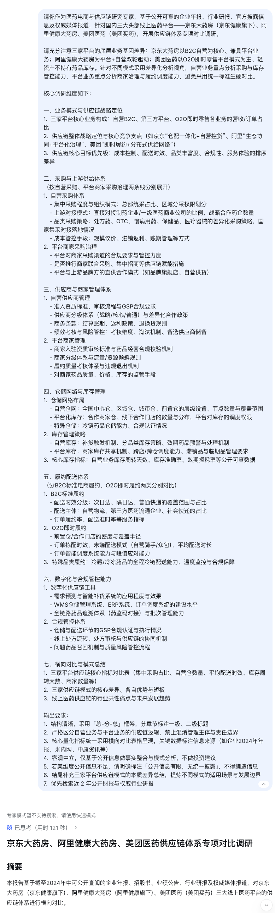

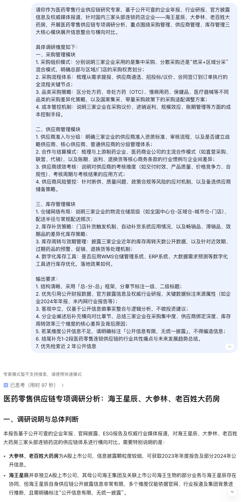

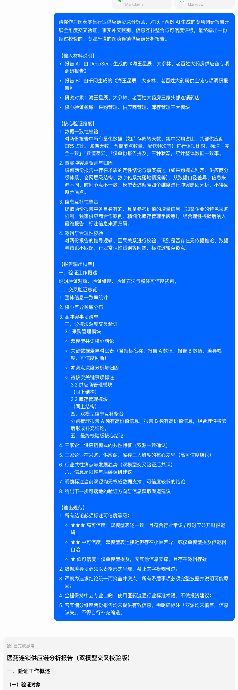

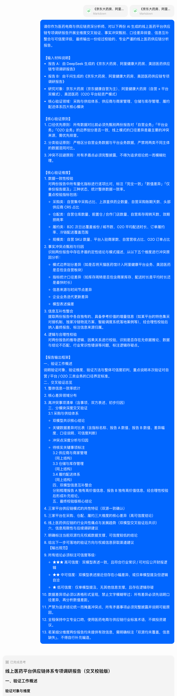

这么多任务要调研，那在 AI 实操方面，如何让 AI 的结果既快速高效、又有质量保障？**这里他也有不少小tips**，比如：

- **结构化提示词：**AI 辅助整理、优化，逻辑更清晰、简洁；
- **多线程：**开多个窗口，可以并行的子问题就同时跑；
- **多个 AI 交叉：**一来，根据不同任务，发挥不同大模型各自的能力擅长，分工有侧重；同时，互相之间做交叉校验，确保数据结果的准确和质量；
- **人工校验**：先是依靠郁金星**多年自己积累下来的审美**，做初步把关，迅速排掉明显不靠谱的信息；

二是经得起**真正行业 Know-how 的检验**：

- 找了咨询行业、医药行业的朋友访谈、确认；
- 也找了很多出自专业咨询公司、行研机构的公开/内部报告来做对照；
- 把 AI 输出的分析和行业圈内资料逐条比较： 时间线对不对，benchmark 对不对，关键数据有没有明显偏差 ... ...

> ↓部分调研结果/报告示例

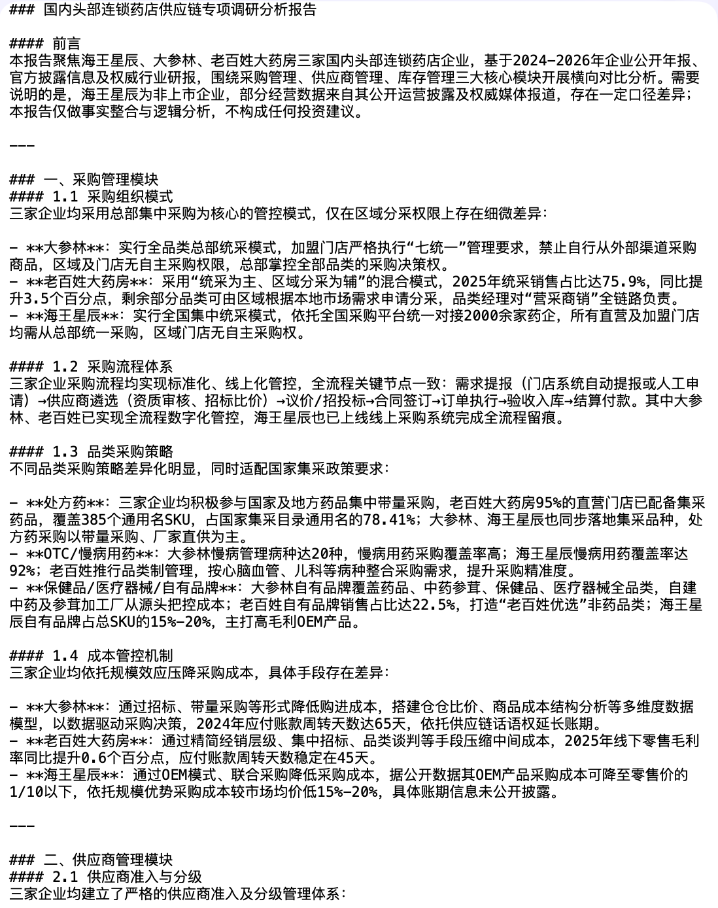

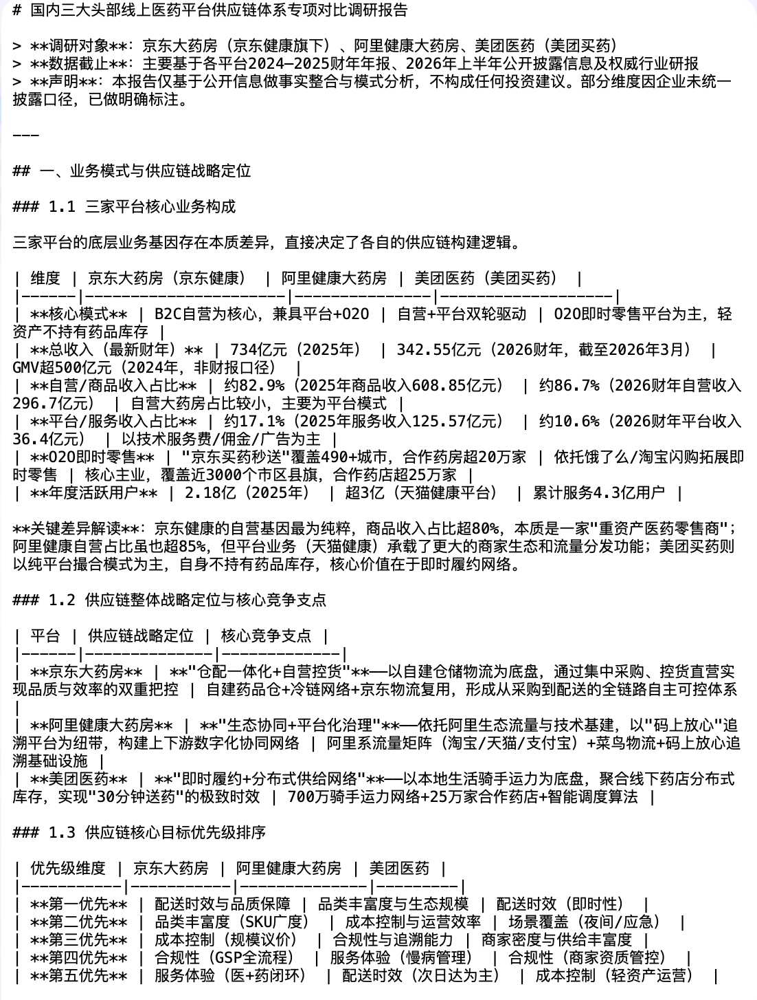

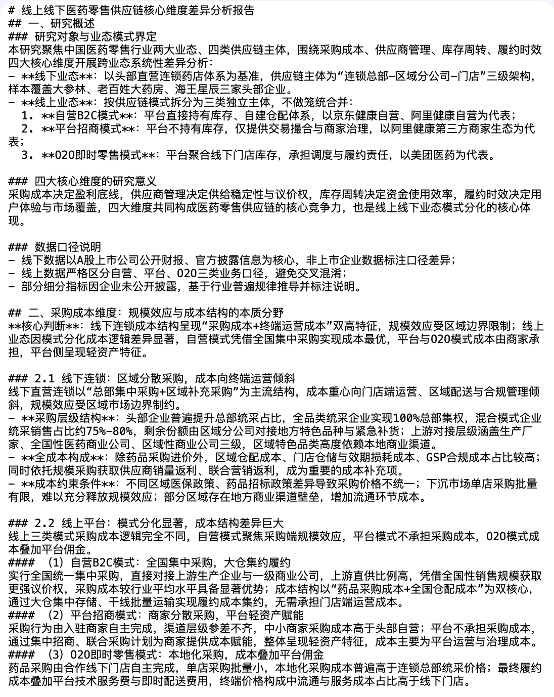

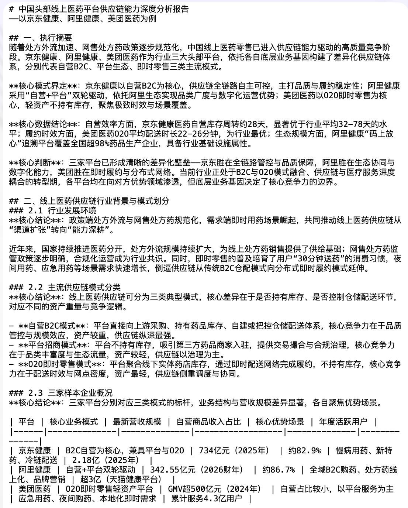

在**调研到「胖东来」这一块**呢，郁金星还有些别的体感。

这次客户重点要了解的，不是什么大而全的故事，而是关于**「胖东来线下药店门店」运作的深度内部情况**，这是一个**非常垂、非常深的内容点，线上的公开资料极少，AI 能读到的数据有很大局限。**

这时候，独家积累就帮上大忙了。

在他自己的知识库里，存了多年来大量关于胖东来的资料：**除了市面上公开的**案例素材、分析报告之外，**尤其还有大量他自己独家一手的东西**，e.g. 实地考察的笔记、内部的运营标准、各种访谈转的文字，等等。

> ↓过去交付胖东来课题的部分现场照片

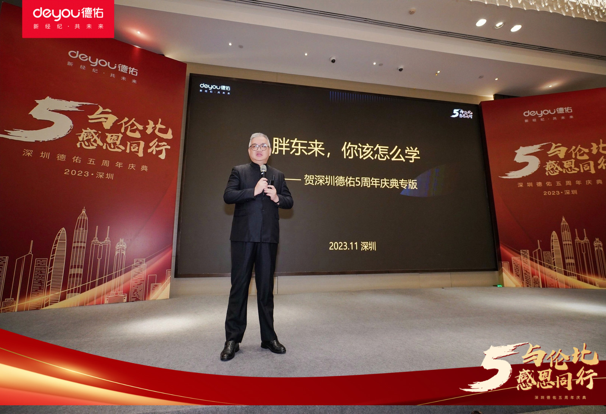

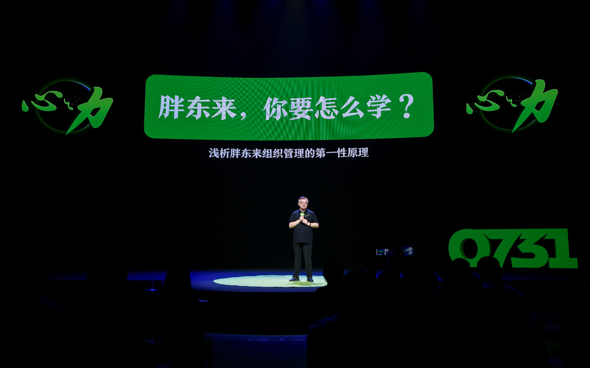

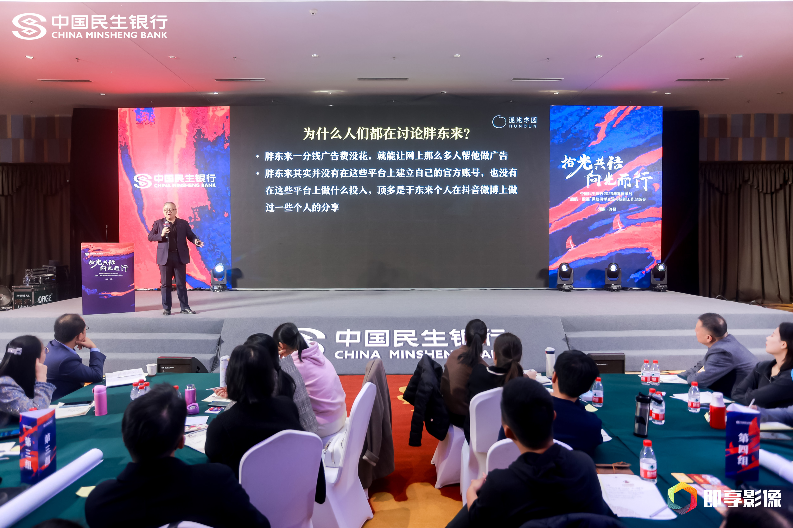

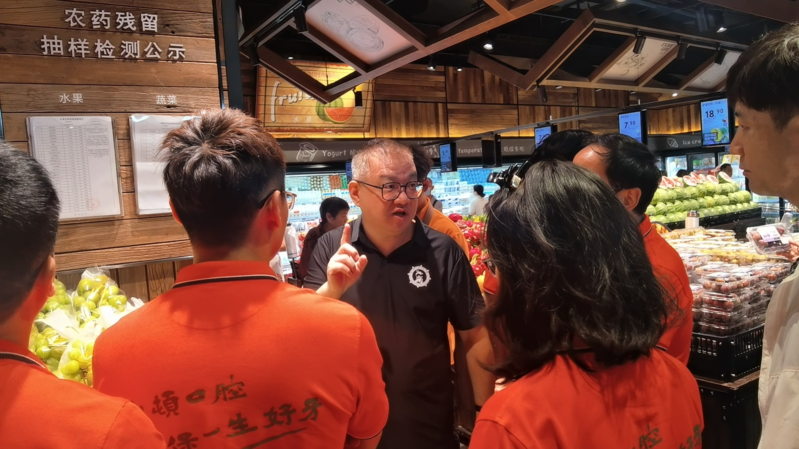

> ↓胖东来相关资料知识库截图（部分）

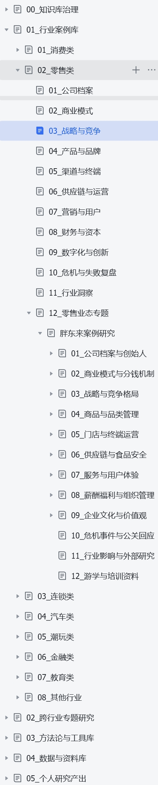

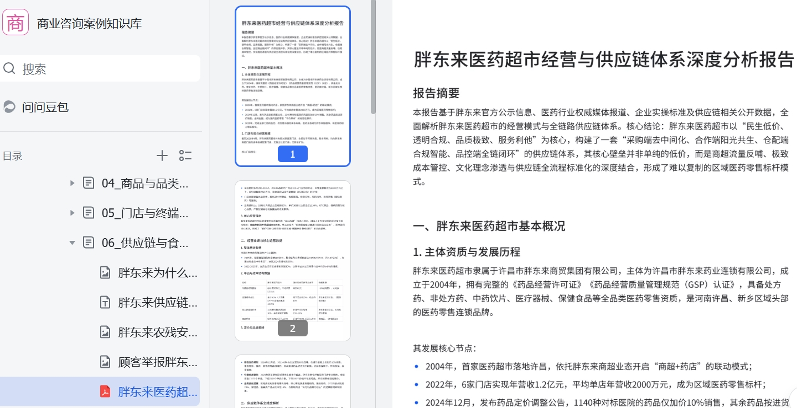

AI 最后形成的关于胖东来部分的调研分析成果，**至少有 60% 都得有赖于他自己知识库里的这些独家积累**，把这些**喂给 AI 之后，AI 有了基准线和依据**，再定向做精准检索、信息整合、结构化处理，就靠谱很多了。

这些积累真不是在一夜之间能变得出来的，也是为什么这次挑剔的客户最终会认可他的一大重要前提。回到前面提到过的一句，**不能停止积攒自己独家的数据和内容，这在 AI 时代，就是在攒好自己的牌。**

**【🙋🏻互动】**好了，调研环节差不多讲到这里，大家猜一猜，这轮看起来极其“铺天盖地”的调研，花了多长时间？

——

**总共只花了1.5天。**之前可能单个问题或模块都需要人工做 2-3 天，而现在 AI 平均 30分钟就能完成一个子课题或模块，极大的提效和解放生产力。

这个过程中，郁金星在校验和比对信息时，**有一个很关键的发现。**

很早之前他就访谈过胖东来的供应商，当时还以为胖东来的做法就是行业惯例。这一轮真正扫完行业才发现，**行业报告和胖东来的操作对不上，胖东来的做法才是孤例，是反行业直觉的**。

他很快意识到，**这背后，恰恰才应该是对客户最有启发、有价值的部分**，在what、how之外那个更深一层的“why”就藏在这儿。

**你们再品一下这个发现怎么来的**：光靠 AI，扫不出“这是孤例”，AI 不知道他二十年前访谈过谁；光靠人，也扫不出，谁有精力把整个行业翻一遍？就得是**「人的独家积累」，撞上「AI 的全行业扫描」，两边一对，这个洞察才掉出来。这就是把 AI 真的用成了研究搭档**。

于是，接下来他又和 AI 做了一轮非常深度的讨论。

**先由人来拆解出了一堆子问题，扔给AI分析，再和它来来回回继续讨论、挖掘，包括很多与 AI 不断辩证的过程：**

> - 胖东来这些供应链做法是好，但**真的适用这个客户**吗？ 

> - 哪些是纯运营方法，其他企业**可以直接借鉴**？

> - 哪些是靠它的区域规模、商超流量、企业文化和价值观撑着的，**很难照搬**？

> - **客户事业部要追求什么**、在意的KPI或结果是什么？

> - 两者矛盾处**能否找到共识**？共识可能是什么？

> - 对于客户来说，哪些可以借鉴、哪些需要商榷、**哪些边界必须讲清楚**？

> - ......

AI 在这些问题引导之下，确实吐出了很多很有深度的洞见，又一次极大地帮他把交付的思路和深度拓开了。

也因为这轮探讨，**他冒出了一个新点子**，决定在培训中**额外增加一个30分钟的互动工作坊模块**，除了客户点名要的内容，他还**专门站在客户视角列出了6个业务决策假设**，并且给出了他自己经过追问、思考、分析之后的观点和建议，让客户回去之后真能消化、真能用，真正帮助到业务讨论。

注意，这个新模块不是客户要的，是他自己长出来的，AI 帮他把问题想深了，他反手又能把交付的标准又往上抬了一截，

多说一句，这个小尝试，**也是 AI 与他一起实现了一次创造力的突破。**

它一方面，**大大提升了客户的满意度**，拉升了大B客户之后长期的复购和转介绍；

二来，也**大大帮助他自己完成刻意练习的闭环。**

之前给大客户交付，想要收到真正的价值反馈是很难的，只能通过现场的表达、互动去感受，很片面，很难确定是不是真正对业务有帮助。

但这次新增的30分钟，他把帮客户思考的6个问题假设抛出去，客户现场的追问、讨论和反馈，就是最高质量的反馈。事后证明，**6个问题中有5个都命中了客户真正的问题和需求**。

这么一来，未来如何持续在大B交付中，获得高质量的及时反馈，这件困扰他许久的事儿也打开了一连串新假设、新解法的大门。

最后简单说一句，这个交付还有最后一个步骤，**做 PPT 与逐字稿**。但这一块的 AI 实践案例大家都听得比较多了，时间关系，就不细讲了。总之也是一个和 AI 来回调整分工、工作流，不断升级协作的故事。

> ↓部分PPT框架页截图

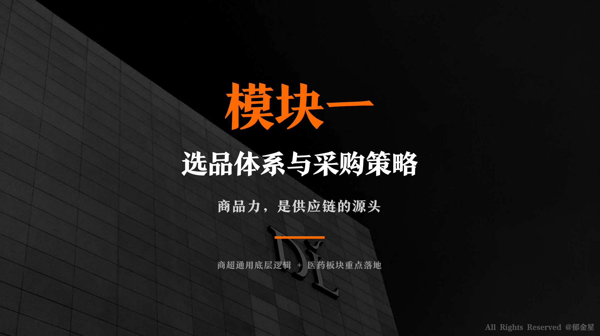

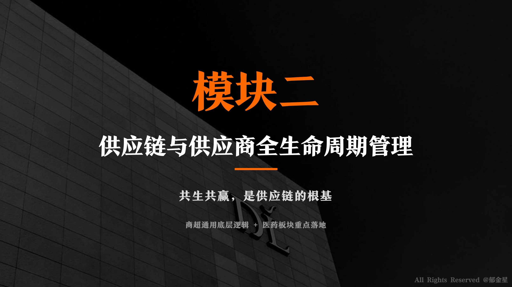

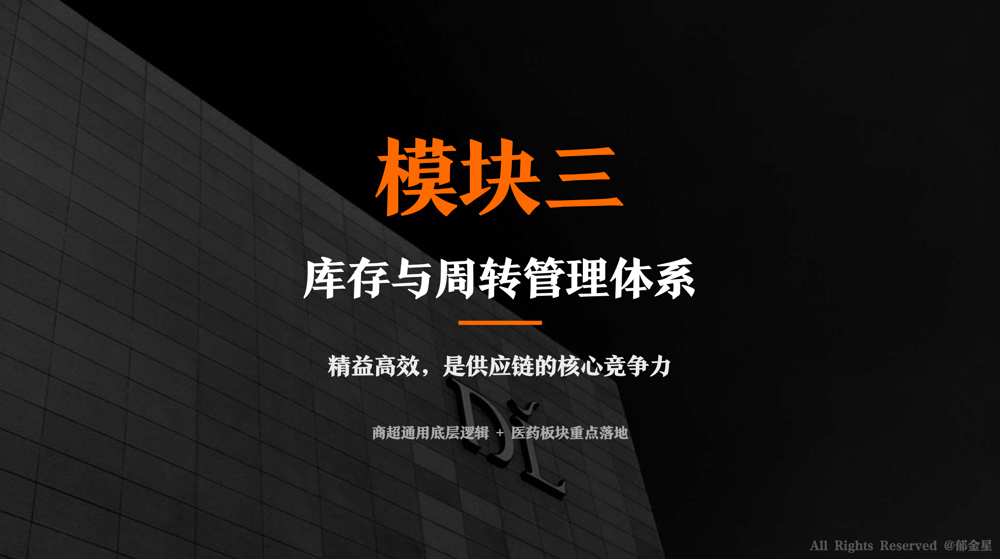

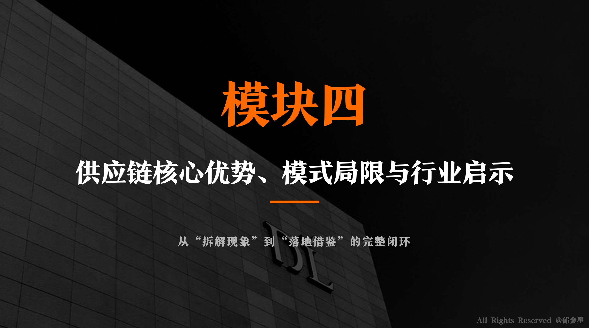

这个完整的案例大概就差不多讲完了。

结果上来说，从原本单靠人来动手，**起码需要半个月的工作量**；到能与 AI 深度协作，**提效到几乎5-6 天就能高质量完成。**

整个过程，人与 AI **两侧互相螺旋推动：**

- 人提供资料、问题、方法和边界；
- AI 负责扫描、结构化、比较和发散；
- AI 返回的新冲突、新维度和新问题，又反过来推动人做出更好的判断。

而且还**突破了之前很难触发的一些新的洞察和尝试，激发了新的假设**。

比如在这事之后，关于如何获得高质量、有细节的学员反馈，郁金星还用 AI 做了不少的新尝试，比如用 AI 深度改造了之前流于形式的反馈问卷，一下就拿到了比之前细得多的反馈和迭代依据，等等。

回头看，郁金星这个案例里，**他不是“突然”就做到双三角完备了，也不是“突然”拥有了一个万能 AI，而是人教 AI，AI 教人，再循环加强——**

- 他从先把自己的问题讲清楚开始，发现 AI 可以在单点上帮忙；
- 接着被幻觉狠狠教育，开始用多模型、人工资料和专业规则去约束 AI；
- 再后来，他不只看 AI 的答案，还看 AI 的拆解方式，让 AI 反过来补自己的分层研究体系；
- 最后，这些上下文、数据包、交叉验证、多线程、业务假设和专业审美，在八天的急活里汇合起来。

> ↓ 回顾一下在这一类任务上他的双三角的演进

虽然我们多数人不需要在 8 天内给一家头部公司做一套这么难的咨询培训方案，但我们都会遇到类似的题：做一份需求分析，写研究报告和 BP，拿一份商业方案说服客户。

什么是真正科学的 AI 用法？先找一个真实任务，让 AI 帮你跑一轮，过程中你要不断提醒自己的是：

- 你这些年积累的专业知识、资料、思维方式、规则和审美，真的充分交给 AI 了吗？
- AI 在帮你拆题、研究、交叉和建模的过程中，又有没有反过来让你变强？......

只有「你变强 + AI 变强」强化了 5-10 轮之后，才可能真正完成那次升级，而不是单纯学会一个工具。这样，**AI 才会从一个聊天框，慢慢变成真正能和你一起工作的协作伙伴。**

**最后你会得到的变化是，从偶尔能搓出一个好结果，到知道怎样和 AI 一起完成一个高标准的交付。**

**实际留下的，是一套让你更有谱地完成高质量交付的人机协作范式、和科学成长范式。**