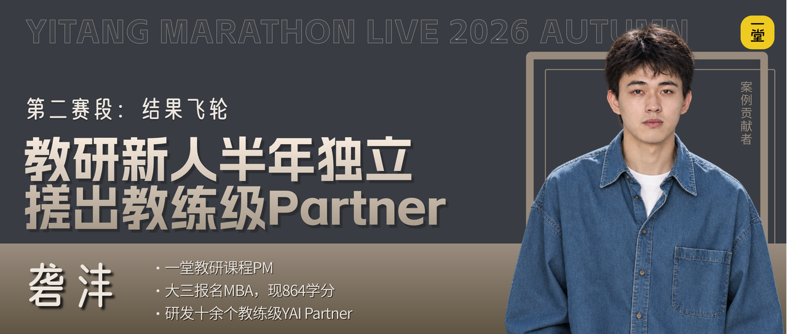
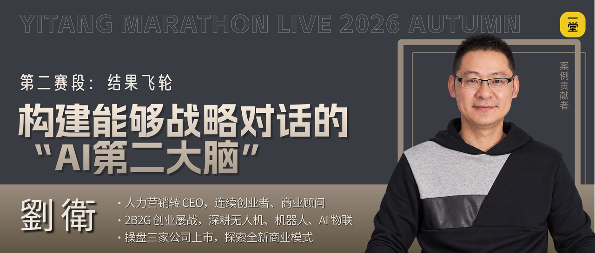
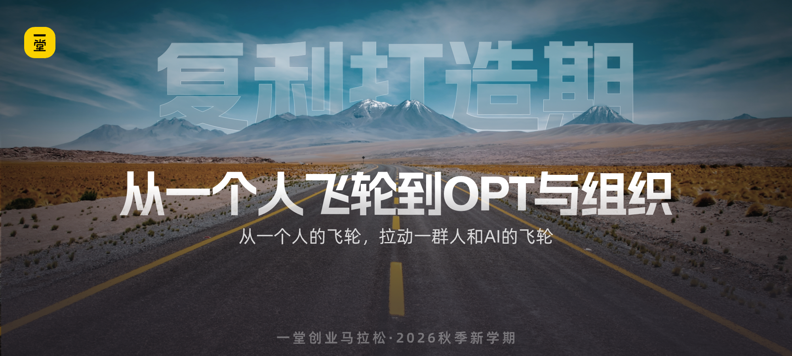

## 背后的洞察和学习

我们把这几个案例放在一起，大家能感受到什么共性？

如何提升和进步呢？核心就是我最近反复提的一个心态：**对自己持续不满意。**

- 因为不满足于当前的结果，所以才会继续寻找更好的案例、更高的标准和新的可能；
- 因为愿意持续迭代，才会把自己的审美、体系和创造力教给 AI；
- 因为 AI 越来越懂你的标准，才会反过来帮你看见盲区、扩宽认知、提升能力。

**【姿势🙋♂️】**大家觉得刚才这些同学能顺利让飞轮加速起来，最最核心的策略有哪些呢？

————

核心是把这个飞轮变成一个**双向加强**飞轮：

在这个阶段我们不要满足于 "AI 能帮我干活就行了"：

这个阶段的核心，不是 "让 AI 多干活"，而是先让自己进入到 "人和 AI 互相教" 的增强循环。

主动建立双向：一边教 AI，一边让 AI 教你：

- **教 AI 的爽**：AI 干出来的活越来越像我干的了，甚至比我干得还好。
- **被 AI 教的爽**：AI 帮我复盘、帮我补盲区、帮我解决我搞不定的技术问题，我自己也变强了。
- **双向加强的爽**：我教 AI 越多，AI 越强；AI 越强，反哺我越多，我也越强，半年下来成长速度是以前的好几倍。

有了这个双向加强，飞轮越转越快，才有后面的复制、组织、跨界，越来越强。

我们再回看下这个图，和双三角放在一起，就能一目了然了：

## 第二赛段冲刺

哈哈，来吧，希望大家都能带着自己的审美、自己的体系、自己的创造力，去教 AI，也敞开了让 AI 反过来帮你补盲区、帮你复盘、帮你解决技术问题、帮你行动。

AI 替你完成任务是效率，AI 帮你提升能力才是复利，这才是飞轮越转越快的关键～～！

来集体 Flag 时刻到了：

**【号召🙋‍♂️】**来来来，一起勇敢扣一个口令吧：**互相加强！**

### 下一赛段更精彩

下一段我们继续挑战难题，进入**《复利打造期》**，我会给大家交付3个内容：

- 案例1：天末，头部上市设计公司前合伙人、体验设计专家，把十多年积累接入一套 AI 协作系统，个人能力极限放大
- 案例2：半肥猫，24年连续创业老兵、懂生意的AI系统架构师，把二十年营销经验封装进一套数字员工工作台，带着团队能够稳定产出
- 案例3：贺雷，20年医药行业老兵、上市药企高管、医颉集团CEO，作为非技术CEO，半年时间带传统背景团队跑进AI原生，落地组织转型

你好啊，坚持学习的一堂同学！

欢迎来到一堂2026秋季马拉松大课的复习，一起冲向 AI 十倍速成长！

直播回放：https://air.yitang.top/live/jXNs2HkcwW

作业链接：https://yitang.top/homework/5Svo6aa54b23d298/edit

文稿P1：https://yitang.top/fs-doc/5ee54ced87f02af39c550f6669149d77/Izvcd7M2NojQTHxW88Pc8vxYnig（本文稿）

文稿P2：https://yitang.top/fs-doc/a5d55cfa1f6b71e1ab0319198140093b/AnOZdDPWjoAPLYx9Hm3c69XhnPh（点击跳转）