## 涨见识：三个同学的案例

### 第一个案例：天末

在开始这个案例之前，我想可以先和大家互动一下：大家有没有想过，给自己搭一套好用的 AI 协作系统？

大家可以想象一下那种**比较理想的状态**。

> 有任务来了，你先和 AI 商量清楚要做什么、做到什么程度，它就能自己安排步骤，在后台接着干。**那些费时间、你又不太想反复做的资料整理、来回比对，都可以交给 AI 自动搞定**。

> 而你也不用再守在电脑前，可以去推进另一件重要的事，这边的研究还在继续。等你回来，新的信息和思路已经摆在眼前，等着你接着做判断。

> 同时，它还能带着你这些年的积累一起做。几年前研究过的资料、某个项目里磨出来的好方法，甚至很多自己都没想起来的经验，它也能帮你精准地翻出来，用到眼前的工作里。

> 今天新摸索出来的好方法，也都能完整地留下来，下一个项目接着用。一起做过的事情越来越多，它也越来越懂你的要求，配合也越来越顺。**你就有更多余力，去做那些一直想做、却总顾不过来的事。**

今天要讲的 **天末**，这半年多就在自己的业务里，持续摸索这件事。

天末也是一堂的 MBA 同学，长期做商业地产和体验设计。他曾经是国内一家头部上市设计公司的合伙人和设计总监，也拿过一系列国际设计大奖。

十多年下来，天末攒下了大量资料，也在一个个项目里磨出了自己的经验和方法。他开始把这些积累，一点点接进一套 **AI 协作系统**，也就是 **AIOS **中。

用起来以后，按天末自己的感受，**以前同时跟两三个项目，就已经累得够呛；现在七八个项目一起往前走，反而从容多了。**

研究任务交代好，他就能腾出手，去见客户、跑现场，和客户深入聊业务，把更多精力放在方向和关键判断上。那些过去顾不过来的新机会，现在也有余力一个个去了解、去争取。**事情做得更多了，他感觉自己能施展的空间也更大了。**

下面我们就一起来看看，天末的这套 AIOS 是怎样跟着一个个真实项目，慢慢搭起来、用起来的。

**【思考🤔】**这里大家也可以想想看，天末为搭建这套 AIOS，第一步会做什么呢？

——————

天末做的第一件事，就挺有意思。

平时帮客户做设计，**他很擅长深入调研，把背后的需求一点点深挖出来**。客户提出的要求，他会和对方的生意、客群、资源条件放在一起分析，再从不同角度往下挖，找出那些还没说清楚、却可能影响整个方案的深层需求。

这一次，他**把自己当成了客户**。

他让 AI 用类似“**出口式咨询**”的方式，帮自己把需求挖清楚，设计协作方案。过去做过什么、擅长什么、接下来想做什么，**他先讲给 AI，再让 AI 顺着这些信息追问**。

有些想法，天末自己也还没想透，那就反复聊。甚至他还会一边走路，一边和 AI“打电话”继续聊，回头再看 AI 整理出来的内容，哪些说到点上了，哪些理解偏了，再接着补充、修改。

包括自己手上有几台笔记本、Mac mini、NAS、AI 会员，还有已有的各种项目资料、多年积累的知识库，这些他也一起通通告诉 AI，**让它完整地知道自己手里有哪些资源**。

然后他还会给 AI 出题。不光看它能不能介绍天末，还要重点来**看碰到具体的分析和取舍时，AI 知不知道天末最在意什么？**要是感觉理解偏了，就继续补充、校准。

同时，AI 也带着这些对天末的理解，还有逐渐清楚的需求，去调研网上相关的最佳实践。看看别人怎么做，再回来帮天末提出各种方案。

但很多方案，天末一开始其实没弄明白。为什么要这样分工，还要弄得这么复杂？用好了能做到什么程度，又可能在哪儿出问题？

这些，他都是追着**让 AI 反复讲明白**，再把自己的感受和判断反馈回去，和 AI 一起调整和使用。

天末自己也在这个过程中不断学习。很多原来没想到的用法，就这么越聊越清楚了。**哪些事情交给 AI，自己在哪些地方介入，系统该怎么搭**，他也慢慢有了把握。于是就先从简单的安排做起，边用边完善。

这些讨论，也慢慢形成了一份**持续更新的核心文档**，叫作“**平行宇宙的天末**”。天末的经历、目标、资源，还有他的判断，都整理在一起。

这份文档也成了整套 AIOS 最早、最重要的基础之一。直到现在，天末有了新的经历、想法和判断，仍会回来更新它。后面的项目怎么推进，工作怎么安排，都可以回到这里，对照他的目标、处境和判断标准。

这套系统要跟上的，是一个**还在不断成长的天末**。

接下来，天末开始用 AIOS 做具体的设计项目。他会先给**每个客户项目建一个独立的工作空间**（比如，就可以用 Codex 里的项目功能）。客户沟通、方案修改、当前进展，都留在这个空间里，AI 就能接着这个项目往下做。

他手里还有一个**积累了十多年的专业知识库，足足有 50T**。

> 包括**上千套业内的优秀方案**，他之前都是一页一页详细拆解，整理成结构化文档。

> 进一步**深入研究里面有哪些共性、哪些差异，有什么方法可以借鉴**，也都有详细的对应文档。

> 还有数十万张设计图片，也**细分到了场景、功能、品牌、单品和风格等等**，可以精准地定向查找。

**天末十多年来，在设计方案上面下的功夫，都留在这些资料里。**

不过，**这套知识库原来主要是给人用的**。每次项目来了，还是得天末自己想、自己搜，把相关资料一点点翻出来。

**【思考🤔】**在这里，大家可以先想一想，如果你是天末，有 50T 的资料，一听就是非常大的工程，**这可要怎么一步一步地让 AI 用起来呀**？

——————

天末的方法是，在刚开始搭 AIOS 的时候，他就一边做项目，一边把用得上的资料接进 Obsidian，再和 AI 一起整理，比如在文件开头加上 **YAML 元数据说明**，再拆解出更清晰的**目录层级**，然后在相关目录里补上 **README 作为索引文件**。这些整理，是为了让 AI **知道里面有什么、该去哪里找**。

> **YAML 元数据**，就是用 YAML 这种易读的 “键: 值”（类似“标签：内容”）的格式写成的说明信息，用来给文件或数据贴上标题、作者、类型、时间等标签，方便人和 AI 理解与管理。

使用过程中，有些反复用到的方法，天末进一步整理成 Skill，之后 AI 就可以调用相应的 Skill，沿着里面的方法先做起来。

这些 Skill 一般也都是随着 AIOS 的使用，慢慢长出来的。

比如**产品研究这个 Skill**，就是他和 AI **一起研究五六个产品时，一点点磨出来的**。每次看到 AI 的分析结果，天末都会给出一些深入的反馈和判断，哪些真正有帮助，哪些没什么用，还有哪些地方需要继续研究。

AI 按照他的意见补充、修改。这样做了几次，那些**比较好用的步骤，还有他反复提到的要求**，就被整理进了这个 Skill。

还有包括战略雷达、内部资料分析、外部项目调研等等，这些经常要做的专业工作，也都随着天末每次做项目的需要，把慢慢摸清楚的做法留下来，一点点积累迭代成为了一批很好用的 Skill。

这样天末就**不用每次从头解释怎么看、要做到多深**。新任务暴露了问题，他再和 AI 一起调整结果。需要改的地方，再写回 Skill，后面接着用。

有了这些在真实项目里反复打磨过的资料和方法，天末开始尝试，**把一整轮研究交给 AI**。比如**了解一个陌生行业，分析一项新业务的机会**，就可以安排成一轮长程任务，让 AI 持续往下研究，**一般最长 12 小时**。

他追求的，是可以**把这类复杂工作尽量拆清楚，**有哪些步骤，要从哪些维度研究，判断标准是什么，都说清楚。让 AI 能**按这些要求自动往下做，把一整轮研究的结果做到更高的水准。**

在具体安排时，他先和 AI 商量清楚，这次究竟要弄明白什么，**什么样的结果才算达到要求**。再从行业趋势、目标客群、同类案例、客户条件等方面，拆出具体的研究维度和步骤。然后交给 Codex，让它调用项目资料和已有的 Skill，自动循环往下推进，**直到达到目标要求或时间上限。**

> 这类任务不一定是时间越长越好，因为 AI 可能会由于理解偏差或者幻觉导致越跑越偏，所以天末一般会设置 12 小时的时间上限，避免 AI 持续跑偏。

做这样的长程任务时，AI 就可以有足够的时间多找些依据，比较不同思路。发现缺口以后，再继续深挖，把研究做得更充分。

天末这边，也可以**同时处理其他工作**。等他回来看报告时，对项目的理解和判断，就有机会往前走一大步，即使是多个项目并行推进也都一点不耽误。

当然，天末最开始构建这类自动化长任务的时候，也是**经常就跑偏**。前面一个判断出了偏差，后面还顺着它往下展开，就可能越跑越远。

天末就**顺着跑偏的结果回头找原因**，补资料、调整任务要求，把没说清楚的步骤和判断标准补充清楚，必要时再修改对应的 Skill。

同时，他也会把任务分成几轮，让 AI 按时交回阶段报告。自己看过以后，**补充、纠偏，再带着新的判断进入下一轮**。

在这样的反复磨合中，这些报告逐渐开始**给天末带来很多惊喜**。

> 外面新找到的信息和视角，**能补上他的盲区**。对一些关键判断，还可以通过**“红蓝军”对抗分析**，从不同立场再看一遍，看看有哪些问题被忽略了。

> AI 也会围绕眼前的任务，回到他的知识库里，**找出值得借鉴的经验**。有些旧方法，天末当时没想到，AI 会重新翻出来。其他项目里的做法，也可能**迁移过来，形成新的解法**。

> 还有的时候，不同资料里那些原本零散的线索，被联系到了一起，竟然能**拼出一个天末原来完全没想到的思路**。

这样，天末再做判断时，能用上的，就远不止自己当下想到的那些东西了。他过去积累的经验，外面新发现的信息，都能**更充分地参与进来**，帮他看清问题，也打开新的可能性。

而对他做的业务来说，项目能不能拿下来，很大程度上取决于前期的分析和判断。做方案，本来就是天末的强项，**前面研究得更深，后面的方案就更有胜算**。

除了看每轮研究的报告，AIOS 每天都会给天末发送晨报和晚报，帮助他从整体上看看，手上的工作推进得怎么样。AIOS 每天把外部变化、各个项目的进展，还有待判断的事情汇总起来，他再有针对性地复盘、调整。

更有意思的是，**复盘还会回到天末自己身上来**。

大家还记得前面那份“平行宇宙的天末”吗？里面完整记录着他对自己的理解、想做的事情，还有判断标准。而真实项目里，留下的是他实际怎么花时间、怎么做选择。

不知道大家是不是也有这种感觉：

**自己以为是什么样的人，自己说最看重什么，和真正做出来的样子，未必完全一致**。

单看每一次选择，可能都有当时的理由。可把一段时间里的行动连起来看，就能再问一句：“每天这么忙，真的是在靠近自己想去的方向吗？”

AI 会把这些记录和差异整理出来，天末再和它一起往下聊。想想到底是被眼前的事情带偏了，需要**把方向摆回来**？还是经历了一些项目以后，自己真正想做的事情已经变了，需要**重新调整目标**？

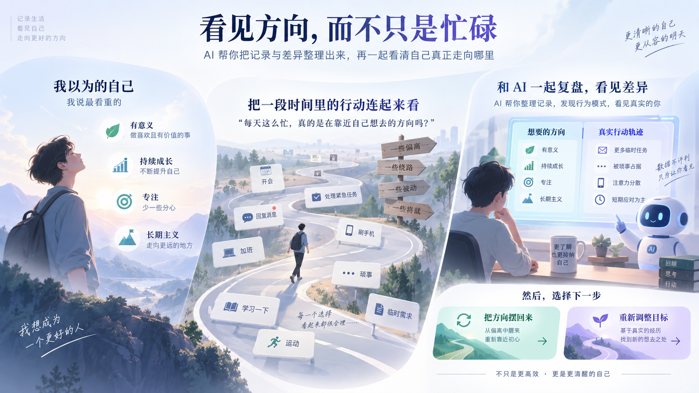

这样一轮轮对照，天末也在**更清楚地认识自己的偏好、能力和取舍**，再决定下一步往哪里走。

新的认识，也会**继续补回那份“平行宇宙的天末”**，让后面的工作安排跟上他的变化。

到这里，**整套 AIOS 终于连起来了**。

Obsidian 保存个人说明、项目资料和知识经验。Codex 带着这些背景，调用 Skill，推进长程任务。报告和复盘，再把新的信息与判断带回来，天末从中做选择，把值得留下的东西继续补进系统。

这套 AIOS，是围绕天末自己和他的需求，**在真实项目的使用、反馈和复盘里，一点点长出来的**。

他有新的经历，系统就有了新的理解。业务提出新的要求，他们就继续调整资料、方法和协作方式。**前面留下的经验，能继续帮到后面的工作；后面的工作，又反过来丰富这套系统**。

有了这样的 AI 伙伴和协作方式，一些**过去很难参与的项目**，天末也有条件去认真争取了。

最近，天末刚拿下了**一个很有标志性的文旅设计项目**。我们可以通过这个项目，来看看他和 AIOS 协作以后的那种感觉。

在这个文旅项目里，客户的核心需求，是围绕一栋小楼，做一套文旅建设的整体设计方案。这类项目，一般会涉及几千万元的整体投入。前面的方向要是定错了，后面的建设和运营，都可能跟着走偏。所以**客户选设计团队，非常慎重。**

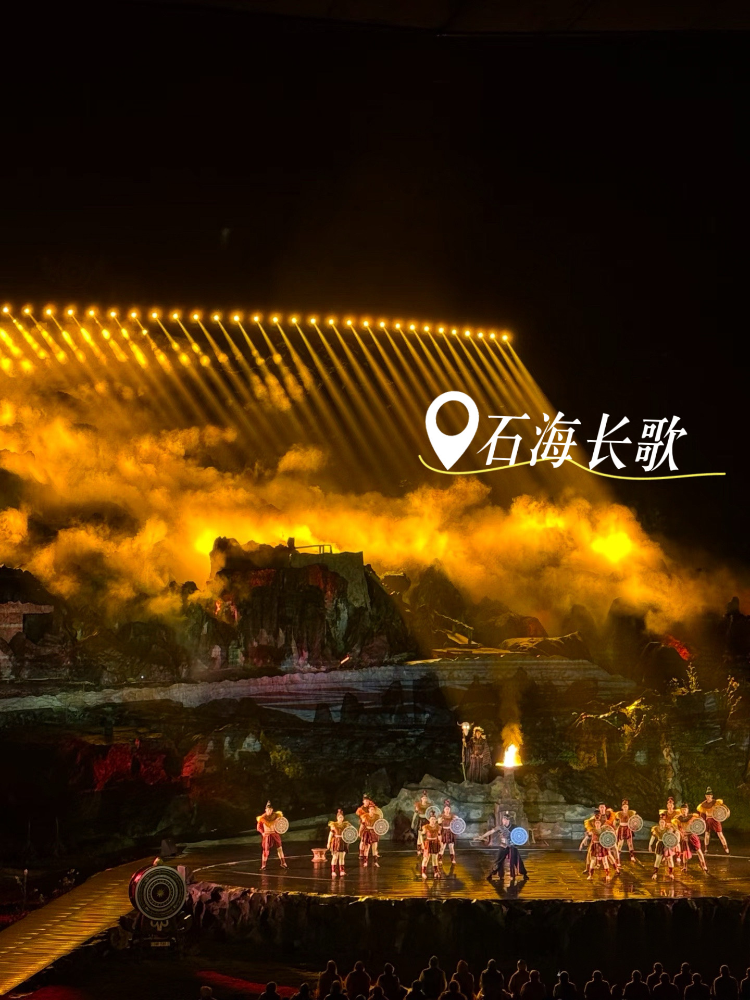

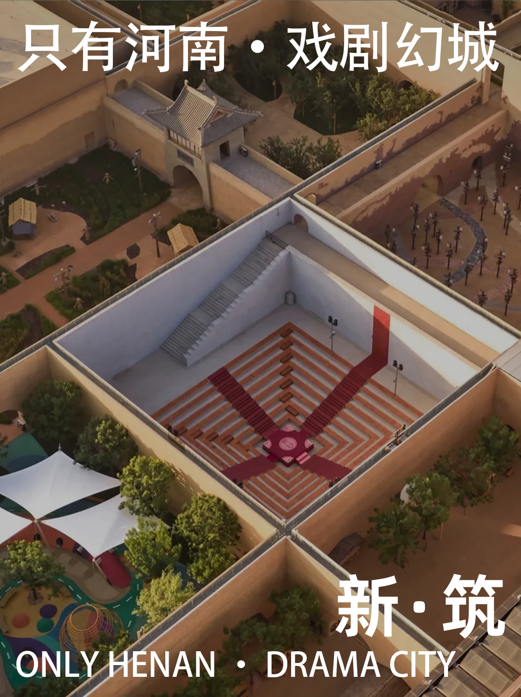

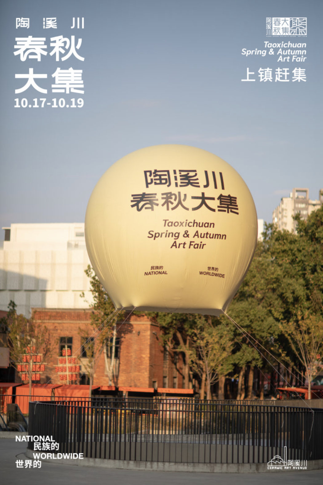

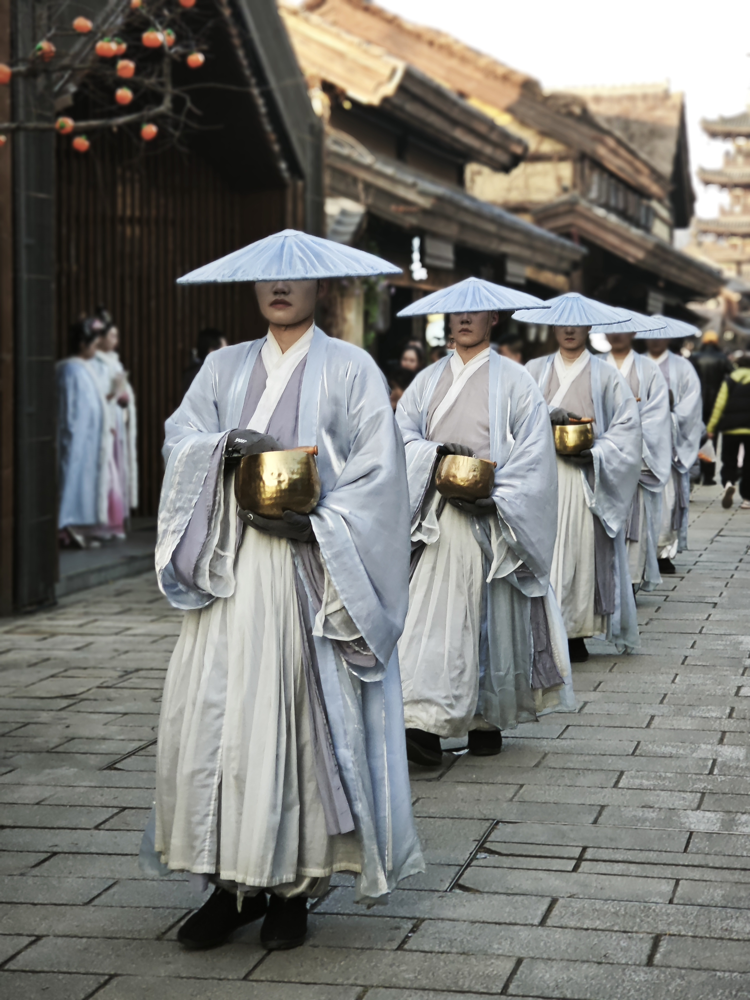

参与竞争的，有文旅领域的头部团队，也有知名导演和成熟主创。别人**做过同类项目，非常有经验，也有已经落地的案例，可以直接拿给客户看**。

天末的专业能力很强，但他**之前没有做过可以直接对标的文旅项目**，拿不出这样的案例背书。而且，他已经离开大厂，也只是几个人的创业团队。

如果按照传统的做法，他可能得带着团队，花将近两周补行业功课、研究项目、再完整地准备一版设计方案，才有机会参与竞争。而拿下这个项目的几率，按他自己的估算，可能**连百分之五都不到**。

而且方案研究成本巨高，通常也不是他这种小团队能付得起的。

大家可以感受一下，假设你和天末一样，对文旅行业非常感兴趣，可真的会想要来竞争这样的一个项目么？

——————

下面我们一起来看看，天末是怎么**带着团队和 AI，不仅仅是参与，还一起把项目拿了下来**。

回到当时，第一次和客户聊完，天末就开始让 AIOS 一起做准备。他把完整的会议纪要存成 Markdown 文档，连同所有项目文件、微信截图这些相关信息，一起放进系统。

AIOS 会自动建立项目档案。客户决策链上的关键人物，也各有一份专门的记录。各方是什么角色，彼此有什么关系，最关注什么，天末就能借助这些记录，**逐步梳理清楚**。

接着，他先和 AI 聊了一轮，重点想清楚两件事：**这个项目值不值得继续投入？下一次见客户之前，自己最需要补上哪些功课？**

然后，围绕这些初始资料和问题，他给 AI 安排了**一轮 12 小时的长程研究任务**。

> 这轮任务是专门设计过的，里面有**十几个步骤，不少步骤还要按不同维度展开**。既要回到内部知识库，梳理可以借鉴的经验和方法，也要做外部调研，研究当地市场、区域条件和同类项目。

> 有了这些资料，还要**放在一起，从不同视角分析。甚至围绕一些关键判断，做“红蓝军”推演**，分别找出支持和反对的理由，看看判断里有什么漏洞，再带着这些问题回去补资料，继续分析。

> 天末给 AI 留出了充分的时间，让它**把研究做深，也让初步的判断经过反复推敲和修正。**

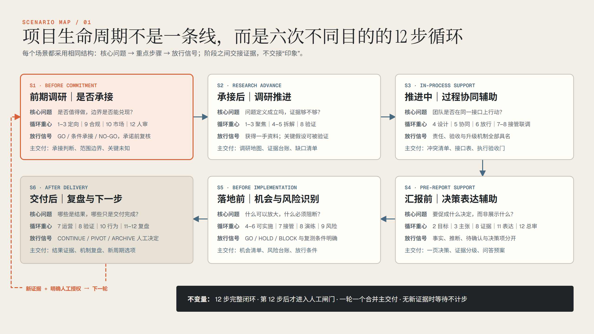

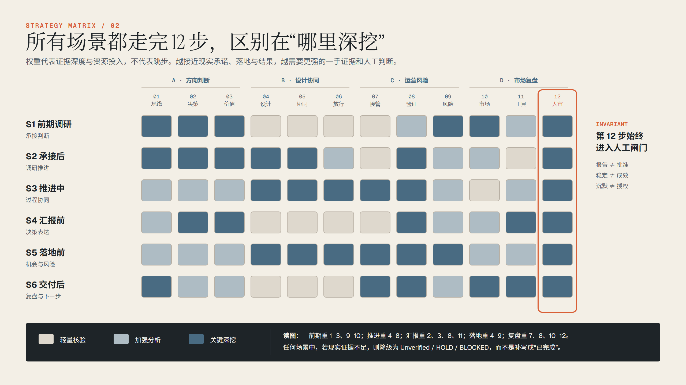

等到第二天早上，一份专门针对这个项目的深度分析报告，就交回来了。天末认真看完以后得出判断，**这个机会，值得认真跟下去**。

再去和客户交流时，他已经有点“**半个专家**”的样子了。客户谈到客群、消费和运营，他能接着往下问，也能带着自己的判断，把讨论推进得更深。

接下来，天末和客户前后进行了**五六轮深入沟通**。一边补充项目条件，一边拿着逐渐成形的方案讨论。碰到需要更专业判断的地方，他也会请教相关领域的专家。

每次沟通完，**新信息都会回到 AIOS**。天末再结合具体情况，和 AI 商量，接下来还有什么需要弄清楚。基本上每次，他也都会再安排一两轮长程任务，继续深入研究、修正判断，为下一轮沟通和方案调整做准备。

几轮下来，他们已经做出了一版**相当完整的设计方案**。

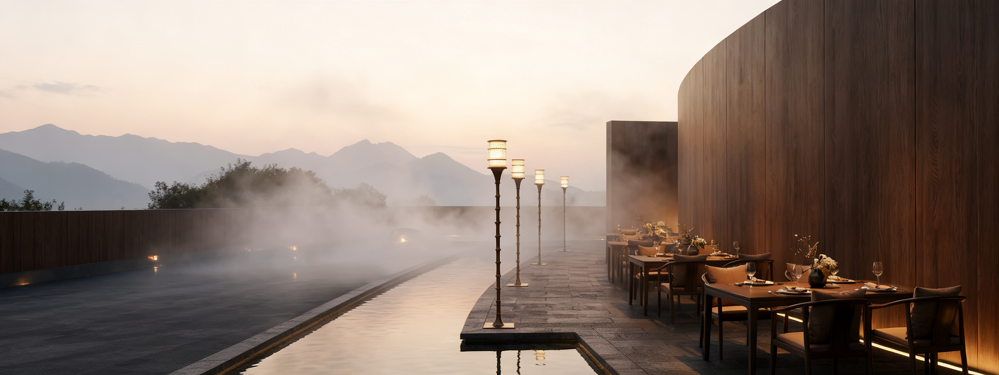

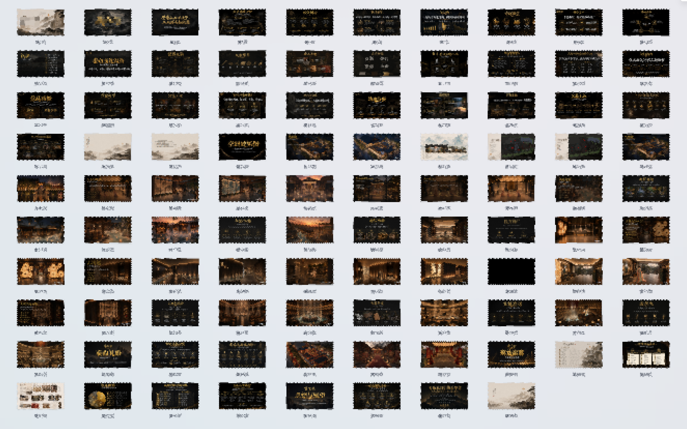

而这时候，在一次深度分析之后，AIOS 提出了**一个值得重新考虑的判断**。

客户聊过**小楼旁边的院子，也说到周边的空间，还有一些后续运营的设想**。这些信息，散落在前后几次沟通的资料里。单独看，都像只是在**给眼前这栋小楼补充信息**，可放在一起看，却指向了**一个重要的可能**：

这栋小楼，或许只是客户项目的一个起点，背后还有**更大区域范围的文旅发展空间**。

天末当时很重视这个提醒，他甚至在思考，是不是需要重构之前的设计方案。

**【互动🙋】**大家可以来互动一下，如果是你，这个时候下面三个方案会怎么选？
1. 按客户的明确需求，继续**把小楼方案做扎实**              **#扣1**
2. 保留现有的小楼方案，另外**补上区域发展的设想**        **#扣2**
3. **重新设计整个区域**（包括小楼在内）的完整方案        **#扣3**

——————

天末马上结合 AIOS 的分析，反复推敲手里的资料和项目条件，判断这很可能是一个**拉开差距的大机会**。如果能先把整个区域未来可能是什么样展开，再回头设计眼前这栋小楼，他们就**有机会拿出一套明显不同的方案，在竞争中形成自己的优势。**

要是回到以前，考虑到当时还剩下的时间和更大区域范围设计的工作量，**天末几乎只能选择 1，最多想一想 2 的可能性，3 重新设计整个区域这种，是完全不可想象的。**

而这次，有了 AI，天末很有信心可以在有限的几天内就**重构一个完整的、更大区域内的设计方案。**

于是，他们果断决定**推翻已经做得相当完整的原方案，从整个区域出发，重构整个方案。**

接下来天末继续和 AI **多线程展开讨论**，分别研究区域布局、体验设计和后续运营。同时，他还安排了新一轮长程研究，**从这个更大的设计方向出发，辅助重构整个方案**。

之前积累的客户资料、专家意见、区域研究，还有天末过去的项目经验，都被**重新调动起来，放到一起分析**。

**AI 不断展开很多新的可能**，天末和团队一边看，一边做判断。哪些方向值得深入，哪些超出了当地条件，又该怎么通过设计，把这些想法组织起来？他们把自己的取舍反馈回去，让 AI 继续推演。

一版新的整体方案，很快就在这样的协作中成形了。

连天末和团队自己都很惊喜，整个区域的思路变得非常清晰，而且，**眼前这栋小楼的方案，也比之前明显更好了**。

楼里应该安排哪些内容，游客进来怎么走，以后怎样连接院子和周边空间，这些都有了更明确的设计依据。

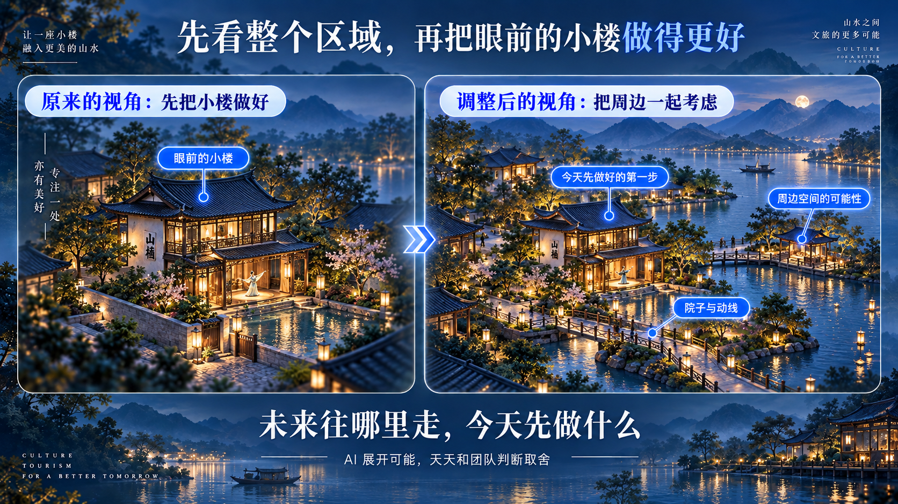

呈现给客户时，这套方案既展开了整个区域未来的可能性，也讲清楚了眼前这栋小楼，作为第一步可以怎样做好。**未来往哪里走，今天先做什么，就这样连了起来**。

最终，凭借团队的专业能力，以及这套更完整、更贴合客户期待的方案，他们**拿下了这个文旅项目。**

过去，面对这样的项目，天末基本不会考虑。光是前期准备，就要带着团队投入大量时间和精力，最后还没有多少把握。

可这一次，在争取这个文旅项目的同时，他还在同时**跟进另外五六个项目**。而且是有机农场、咖啡厅、酒店、书店、展厅、非遗文创、品牌体验升级、跨境商业、企业AI体验战略还有异宠这些各不相同的业务方向。

有了 AIOS，天末可以**把更多时间用来和客户沟通，把新信息带回来**。再和 AI 一起讨论，看深度研究的报告，判断哪些方向值得继续，然后安排下一轮任务。

一个项目的研究还在后台继续，他就可以同步去跟进另一个项目。新的报告交回来，他再来看、来判断，把下一步需要深入的问题交给 AI。

这样，这些工作都可以**同时往前走**，天末也能推进得很从容。

而这些背后，随着一个个项目在往前走，天末**对商业和客户的理解，也在持续加深**。

客户提出一个设计需求，背后究竟想解决什么经营问题？一个看起来不错的方案，放到真实的客群和运营条件里，能不能成立？在一次次研究、沟通和取舍中，他越来越能**对这些问题形成自己的判断**，也更清楚，该让 AI 继续往哪里研究。

这些新形成的经验，也开始**留在 AIOS 里**。

客户补充了什么条件，专家指出了什么问题，一个方向为什么最后被放弃，哪些做法值得以后再用。这些经过天末的筛选和整理，都可以成为**后面继续调用的资料、方法和判断**。

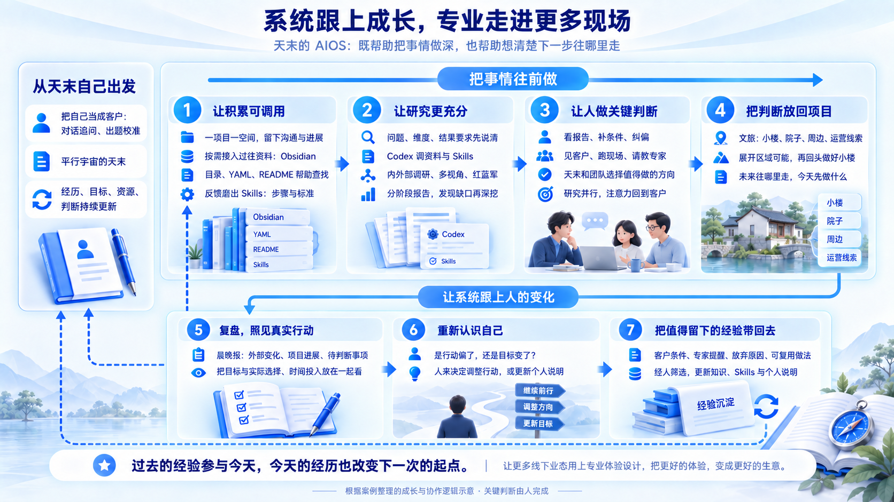

天末在真实项目里学习，这套系统也在他的使用和纠偏中，**慢慢积累起共同走过的经验**。

我们开头谈到的那个期待，也开始有了具体的样子。**过去多年的积累，能够参与今天的工作；今天新获得的经验，又有机会成为下一次工作的起点**。

而天末希望，这份不断积累的能力，也可以用来赋能和改善更多的线下业态。

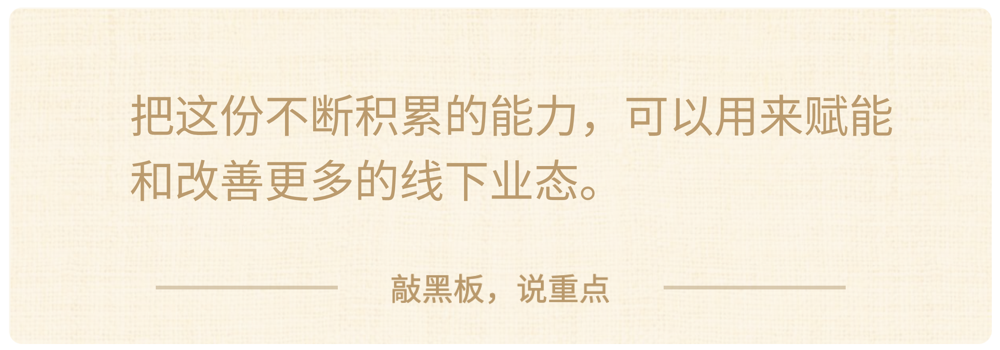

带着这样一套协作体系，他有机会走进过去很难顾及的那些业务，让**更多线下业态也能得到更深入更专业的体验设计支持**。

> 一家店，客人为什么愿意走进来，在哪里愿意多停留一会儿，离开以后还会不会想再来？

> 这些看起来细小的体验，其实都和生意连在一起。

> 让顾客在一个空间里感到舒服、被理解，也让经营者通过这些更好的体验，获得顾客的认可和再次选择。

天末自己创业，就是想要**把这些地方想得更细、做得更好**。

一支创业团队，带着过去十几年的积累，借助 AI，有机会**把这样的专业带到更多地方**。

他做过的项目、打磨过的方法，也有机会**帮到更多经营者，让更多人在日常生活里，感受到更好的体验**。

这些变化，可能就发生在一家普通的店、一个人们愿意停留的空间里。经营者把生意做得更好，走进来的人，也得到更用心的对待。多年积累的专业，就在这些**具体的人和事里，继续发挥价值**。

我们也很期待，天末能和 AI 一起带着这些积累继续往前，在更多真实的项目里发光发热。

**把更好的体验，变成更好的生意。**

下面，我们继续来看看第二个案例。