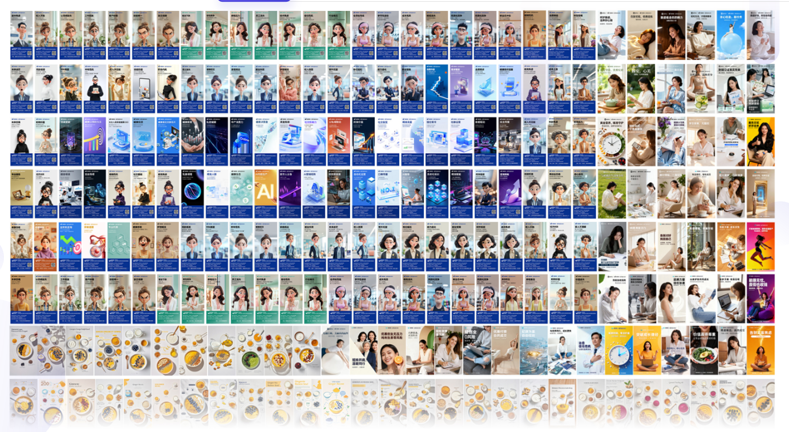
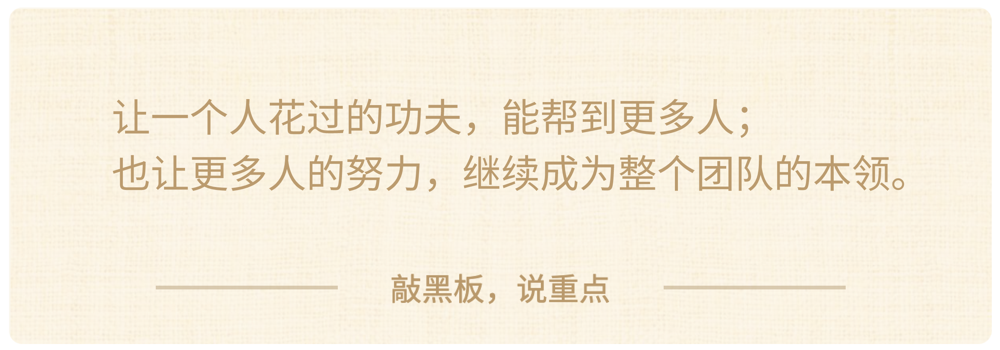

### 第二个案例：半肥猫

接下来这个案例，来自 **半肥猫**。很多同学可能在大航海期间都听过这个名字。两次大航海，他持续贡献了很多优秀的 AI 一页纸教程，也是这次**商业大航海的 MVP**。

半肥猫可以说是个 **AI 高手，也是个创业老兵**。他**在美业和大健康行业做数字化营销，已经做了二十多年**。手上带着一支新媒体团队，高峰的时候，要为旗下品牌的三千多家门店做文案、短视频和推广物料。

他很早就带着团队用上了 AI。先用它写营销文案、想选题、写短视频脚本，后来又做数字人短视频。两年前，他就用 AI 结合数字人，**做出过百万播放的爆款**。放在当时，可以说是非常厉害了。

今年商业大航海期间，半肥猫又往前走了一大步。他带着 AI，做出了自己的**数字员工工作台**，把多年积累的知识和方法，一点点装进这些数字员工里。它们也开始能**在团队的文案、海报任务里稳定接活了**。

团队现在会主动打开这个工作台，写文案、做海报。**一些过去压在他和合伙人身上的工作，开始交出去了**。讲到这个变化，他还不自觉地说了一句，“**幸福太多了**。”

可在这之前，半肥猫可就完全没有这么轻松。

大家这两年用 AI，可能也有过类似的感觉：

> 好不容易调出一篇满意的文案，你觉得，哎，这回终于能帮我干活了。

> 可换个任务，或者条件一变，结果又不对了。那就再补背景，再讲要求，一轮一轮把它拉回来。

> 自己盯着，还能做出不错的东西。可想让团队也拿去用，又总不太放心。这个地方得提醒，那个结果还得回来改。

半肥猫当时就卡在这里，AI 确实已经能干活，也帮团队提高了效率。可同事们一用不顺，事情最后又回到他手里。

> 这个任务怎么让 AI 做，要他帮着调。

> 换个客户，出来的东西不对了，又得他来看。

> 哪里出了问题，后面怎么改，也还是他来排查、调试、维护。

这边刚帮同事调顺了，眼前的活能往下做。可换个人、换个任务，又可能有地方接不住，还得他顶上去。**大家是在用 AI 干活，可让大家把 AI 用好这件事，还是一件件压在他身上。**

所以啊，半肥猫一直想要有一批靠谱的数字员工，然后把这些年攒下来的知识、反复磨出来的好方法，都能装进去。

团队接到任务，手里就可以直接有专业的方法和标准，可以自己先做起来，也就不用每一回都等他重新带一遍。

这样，**一个人花过的功夫，就能在整个团队的工作里反复派上用场**。以后再把实际使用中有价值的修正留下来，带到下一次工作里，而且**这套东西还有机会越用越好**。

那么接下来，我们就来看看半肥猫是怎么一步步走过来的吧。

事情是从一个整理资料的小麻烦开始的。

半肥猫一直习惯用 Obsidian 管理**营销和行业资料，已经积了二十多万条**。每次有新内容进来，放在哪儿、打什么标签，都得整理，越来越费时间。

他很想让这些内容自动归类、打标签，可现成的插件试了一圈，都觉得没那么好用。

于是，他把这个问题拿去跟 AI 聊，把自己想怎么整理讲清楚。聊到后来，**AI 直接说可以帮他做一个**。

结果，插件很快就做出来了，用起来也很丝滑，整个过程就是**特别顺，特别爽**，半肥猫一下子就兴奋了。

大家可能还不知道，半肥猫是**艺术生出身**，过去听别人讲 Vibe Coding，他总觉得，那是程序员的事，和自己没什么关系。可这次，他居然就这么把一个能替自己干活的工具做出来了。

他第一次觉得：“**原来，我也能编程**。”

后来，他又拿着手边的几个小需求，陆续做成了几个小工具，他也就越来越有信心了。

这段时间，他还一直在用 Claude Code、Codex，觉得这些工具确实好用。再看市面上，WorkBuddy、QClaw 这类工作台，也开始陆续出现了。

他开始认真想，**自己一直想要的那套数字员工工作台，是不是也能做出来**？

他和 AI 来回推敲，最后定下了一个足够垂类的方向：**以美业和大健康行业为主，专门做营销获客的数字员工工作台。**

通用 Agent 能写文案、做海报，可到了具体生意里，面向什么客户、该突出哪些信息、做到什么程度才能拿去用，还得结合行业来判断。而这些，恰好是他**做了二十多年数字化营销积累下来的本领**。

而且，团队每天都有文案、短视频、海报这些真实任务。**工作台做出来，就有地方用；用着发现哪里不合适，还能继续磨**。这些经验和方法，也就有机会在团队每天的工作里反复派上用场。

再往外看，**美业、大健康里其他的创业者，可能同样需要这样的营销能力**。如果工作台也能帮他们解决实际问题，将来就还有进一步产品化、商业化的机会。

半肥猫越想越觉得，**这件事值得认真做**。

于是，他正式立了项目，一头扎了进去。

可正式做了起来，那可真是问题一个接一个地来。

> AI 经常说已经搞定了，然后拿来一试，还是**各种地方跑不通**。

> 让 AI 把这里改好，旁边原来好用的功能又坏了，还**冒出一串新问题**。

> 他就一边做，一边补课。遇到不懂的，就**去翻编程书，让 AI 把别人的代码拆开来讲**，再回到自己的项目里试。

> 结果不对，就继续去**学测试**。改一处，坏一串，就去**研究系统架构、设计解耦**。

> 几个 AI 一起开发又乱了，那就用共同的**项目文档，把分工和交接说清楚**。

熬过了无数个通宵，终于，**他的 Vibe Coding 能力一点点长了起来**，工作台里的功能也陆续做了出来。

到这里，开发上的问题已经解决得差不多了，工作台也能跑起来了。接下来更重要的，就是让里面的**数字员工更好用、更懂行**，这就到了半肥猫更熟悉的领域。

他做了二十多年的营销，一直在整理自己的经验和行业知识。光是 Obsidian 里的营销和行业资料，就有**二十多万条**。围绕细分业务场景，他还做过很多简单的 Agent，积累了不少提示词、Skill 和工作流。而且自己和团队**在实际工作里反复用过，也都拿到过结果**。

比如，同样是写文案、做海报，客户做的是什么生意，想吸引什么人，这次要达到什么目的，情况都可能不一样。那具体该突出哪些信息，用什么方法，做到什么程度才能拿去用，就得结合这些情况来判断。

这些都是半肥猫过去一直在做的事。现在，他希望数字员工也能慢慢学会这些判断，**换了客户、换了任务，都知道该怎么调整做法**。这样，团队用起来，才能比较稳定地拿到高质量的结果。

乍一看，他手上的积累已经很丰富了，资料有了，方法也在实际业务里都验证过了。这些东西都是现成的，接进去是不是就能干活了呀？

**【思考🤔】**那大家可以先想一想，**接下来，要让这些数字员工真正把工作做好，半肥猫还会遇到哪些难题呢？**

——————

我们先回顾一下半肥猫之前是怎么做的，看看有什么差别。

这两三年他一直带着团队在用 AI 干活，知识库里的资料也一直在用。但接到一个任务，**该找什么资料，哪种方法适合眼前这个客户，很多时候还是靠他来判断**。

> 客户的要求没说清楚，他就**再追问几句**；

> AI 给出的东西不对，他**指出来，再带着改**；

> 前面做完了，**后面该接着干什么，也由他来安排**。

也就是说，过去他是**一边用 AI，一边帮它补上这些判断**。那些好结果背后，也有他在一步步带着做。

可现在，他希望数字员工接到任务以后，**遇到不同情况，能调整做法，同时又能守住做事的要求**。毕竟总不能还是每换一个客户、换一种任务，又把半肥猫叫回来，从头带一遍。

怎么办呢？就得把过去由他来做的这些判断，一点点讲清楚，让数字员工也能学着做。

首先，**接到任务，该用哪些知识、选什么方法，就得选对**。这里一旦出了偏差，后面接着写文案、做设计，交出来的东西就可能偏离原来的要求。

第一个难题就来了：**知识有了，要先做哪些整理加工，才能让数字员工更好用起来**？

半肥猫自己熟悉这些资料，也知道怎么用。可要让数字员工也能自动找到、用好这些知识，原来的资料和整理方式，就还得做一些调整和加工。

他用的**一种重要方式，就是知识卡片**。

**一张卡片，就围绕一个具体问题，把相关的方法、判断或者规则讲清楚。**做任务的时候，需要哪部分，就取哪部分，几张卡片还可以搭配着用。

这里我们拿他研究做海报的过程，具体说说。

最开始，他想找些好用的做海报用的生图提示词，拿来当模板。网上收集的，加上自己积累的，攒了**三千多条**。可提示词越攒越多，挑起来也越来越费劲。

这里可以想一想，如果你找到了三千多条看起来都还不错的提示词，后面想要让 AI 使用的话，有什么好方法么？它有好多种选择：
1. **每条提示词**作为一个知识卡片，写好使用说明，AI 根据情况自行选用 
2. 挑出**比较好的一两百个提示词**，再分别做成知识卡片，其他不用      
3. 分成不同类别，**每类挑出最好的 Top10** 做成知识卡片，其他不用      
4. 提炼提示词中的共性，写成**一些具体规则**，AI 每次依据规则生成新提示词 
5. 其他，也可以说说你的方法                                                         

——————

半肥猫没有把这三千多条提示词，直接变成三千多张知识卡片，那样使用起来的效率确实不高。

而是先和 AI 一起进行分类和评级，再**把筛出来的好样本放在一起比较，研究它们到底好在哪里**。

研究下来，他发现，一条完整的提示词，往往把布局、颜色、风格和文案都绑在了一起。明明只看中了它的布局，可整条搬过来，颜色和风格也跟着来了。想换一种感觉，又得回头改一整段。

于是，他把里面值得保留的方法提炼出来，**重新整理成三类知识，**每一类都可以有很多张卡片，互相组合使用。

> **第一类，是结构**。标题放在哪儿，主体怎么摆，说明文字怎么安排。一种好用的布局方法，就整理成一张结构卡。

> **第二类，是视觉表现**，他也把这一层叫作“**皮肤**”。比如，颜色和光影怎么搭配，能让画面显得温暖、克制。一套可以反复用的视觉方法，也单独整理成卡片。

> **第三类，是规则**。哪些信息必须出现，哪些东西不能有，尺寸和篇幅有什么要求。这些也整理成相应的规则卡，做任务时按需要取用。

比如，标题和主体的位置已经很合适了，现在只想让画面从热闹变得简洁。那 AI 就可以把当前的结构留着，单独换一张“皮肤”卡，再配上这次任务需要的内容和规则。

不同的结构卡、视觉表现卡，就可以**互相组合使用**。比起从几千条完整提示词里挑一条，再回来改一大段，这样用起来就灵活多了。

以后再研究出一种好的布局，或者一种新的视觉方法，也能再单独补进来，跟已有的卡片继续搭配。这就是知识卡片的好处，半肥猫**每次研究留下的东西，下一次做任务时，都有机会接着用。**

但随着知识卡片和数字员工越来越多，大家都在共用同一个知识库，第二个难题也跟着来了。

**知识明明就在库里，数字员工却还是经常给出一些泛泛而谈的回答。**半肥猫一查，这个问题前面明明研究过，也有对应的知识卡片，可那些好方法，根本没用上。

他就和 AI 反复讨论，研究了不少方案，也重点借鉴了当时谷歌发布的 **OKF（Open Knowledge Format）。**

> OKF（Open Knowledge Format）是谷歌今年刚推出的一个技术规范，是用来给 AI 大模型用的“资料整理法”，把知识像图书馆一样分门别类放好，让 AI 回答问题时只查相关部分，更准也更省。

接着，他和 AI 一起，**把知识卡片的格式和标签统一起来**。这样，不同的 Agent 就能按同一套约定，读取、共用这些知识。

但每个知识卡片上具体要有哪些字段、哪些标签，还得结合业务来磨。

比如，做一张海报，那卡片就得写清楚：适用什么行业、什么任务、什么风格，还需要配合哪些其他卡片。

这些条件，过去很多都是半肥猫自己心里明白。而现在要让几个数字员工共同使用，就得讲清楚，写下来。

写好以后，他拿一批卡片，让几个 Agent 跑不同的任务。这个场景找对了，换一个又找不到，那就回头继续查，到底是知识缺了，还是卡片明明有，却没被找到？

**缺知识，就补卡片。找不准，就检查标签和适用条件**，把没讲清楚的地方改好，再换任务继续测。

就这样，**标签字段加了又减，减了又改，最后反复磨到二十九个**。在他反复测试的那些场景里，调用终于开始稳定起来。

每一次找不到、找不准，都逼着半肥猫，**把原来只在自己脑子里的判断，再讲清楚一点**。

慢慢地，数字员工拿到任务以后，也开始有了共同的依据，去寻找和组合他研究过的那些好方法。以后再有新的知识进来，也能沿着这套办法继续积累。

接下来，还有第三个难题：**找准知识后，要怎样分工和把任务稳定做好？**

要解决这个问题，半肥猫核心就是要继续**打磨各种专项 Skill **了。

他手上本来就有不少好用的**提示词和 Skill**。可实际用起来，经常出现这次跑得挺顺，下一次稍微换个条件，又做不对了。有些关键步骤，AI 还可能会直接就给省略掉。

他慢慢理解了，要把 Skill 放进工作台，让团队每天拿来干活，就得做得**更完整，更工程化**才行。哪怕一个 Skill 只负责一小项工作，也得“**麻雀虽小，五脏俱全**”。过去搭 Coze 工作流的时候，那些很折磨人的步骤、约束和检查，在这里同样不能少。

于是，他和 AI 一起重新做了全面的梳理，**每个数字员工需要哪些 Skill，哪些能力可以共用，分别在什么情况下调用。**

再往每个 Skill 里面看，从接到任务到交出结果，整个过程都要设计清楚。**缺什么信息，要先问；哪些步骤不能省，要明确；最后做得合不合格，也要有检查的标准**。

至于具体选哪种方法、搭配哪些知识，可以让 AI 根据任务来判断。**做法可以灵活，关键步骤和要求要守住。**

几个 Skill 里**共同使用的规则和检查方法**，他也都会抽出来，做成**知识卡片**。以后某条要求变了，就有一个明确的地方可以统一修改，用到它的 Skill 也能继续复用。

这些设计好了之后，**每个 Skill 还都要拿实际任务反复测试**。

> 发现哪里漏了步骤、没达到要求，就回来改。

> 改完，出了问题的任务要重跑，原来能做好的任务也要再试，看看有没有受到影响。

> 不过这样还不够，接下来，半肥猫还要拿同一个 Skill，换着任务和条件反复跑。

> 信息给全了，能完成，那就故意少给一项，看看 AI 会不会先追问。

> 这个数字员工用着没问题，再换一个来调用，看看该做的步骤、该守的要求，会不会漏掉。

一旦跑偏，他就把实际结果和原来的要求放在一起，跟 AI 查清楚，**到底是哪条规则没说明白，还是哪一步没执行到位？**

找到问题，再回到对应的地方改。改完以后，**刚才失败的任务要重跑，以前通过的任务，也得拿回来再跑**。要看到新问题解决了，原来做对的也仍然做得对，这一轮修改才算过关。

就这样一轮轮测试，一轮轮调下来，半肥猫自己再用这套工作台，感觉确实不一样了。数字员工交回来的东西，**越来越像样，也越来越贴近他的要求**。

慢慢地，他觉得这些数字员工的能力已经不错了，可以让身边的人真正用用看了。

于是，他找了周围几个比较熟的美业老板，把工作台拿给他们，请他们**带着各自生意里的真实需求**，试试这些数字员工。

一到了**真实用户那里试用**，大家想一想，还会有什么新的难题么？

——————

行业里的用户用平时的说法提需求，半肥猫熟悉业务，往往能听明白对方具体在说什么。可同样的话交给数字员工，就未必能分清背后的行业和真实意图了。

比如有位做医疗美容的朋友，想用它梳理账号定位。聊了半天，**报告看着挺完整也挺专业，内容却都偏向生活美容**。用户看到这样的结果，只会觉得，**这个 AI 根本不懂我**。

第四个难题也就又来了：**面对各种细分行业，数字员工怎么才能都聊懂啊？**

半肥猫就继续和 AI 一起研究，怎么才能让数字员工也真的能听懂这些不同行业用户的话。AI 从他的营销知识库里查了很多资料，最后找到了一个方向：**从 VOC，也就是“用户原话”入手**。

> **VOC（Voice of Customer）**，就是用户在各种渠道中亲口或亲手说出的、未经加工的真实反馈原话，用来原汁原味地反映他们的需求、痛点和感受。

他们马上先拿一个行业来做，收集行业里老板们平时常说的原话。这时候，半肥猫熟悉这个行业的价值，就用上了。用户一句话，背后是什么场景、有什么需求，他得帮 AI 一点点分清楚。

那些他一听就明白、AI 却容易混淆的区别，就**一点点整理成知识卡片**。接进系统的判断和调用逻辑，也用到相关的 **Skill** 里。信息不够，就让数字员工先追问。接好以后，再拿实际任务反复测试，看它能不能真正理解这个行业里老板的需求。

可行业一多，新的麻烦又来了。**两个行业分开测，都能做对；放进同一个系统，遇到相似的说法，AI 又可能混淆。**

半肥猫就还得继续把这些容易弄混的话放在一起测，看它会不会认错行业、拿错知识。每增加一个新行业，前面做对的任务也都得重新跑一遍，看看有没有受到影响。发现问题，就查清原因，改完再测。

他们准备逐步覆盖的细分行业，接近上百个。**可一个晚上熬下来，常常只能推进一个**。

连续四五天，每天都在熬夜调研、改程序、跑测试。半肥猫开始有点扛不住了，甚至很想直接放弃。他说：“**测试量非常大，大得都不想干了**。”

实在熬得难受，他就去问 AI：**现在这个做法太慢了，能不能加速？**

AI 给了他两条路，大家也可以代入半肥猫那时候的**那种煎熬感觉**，跟着一起选一选：

一条，是**现在就开始批量做**。几十个行业的内容，很快就能生成出来。可眼下的样本还不够，很多行业之间容易混淆的地方，还没碰到。底层判断一旦错了，**错误也会跟着一起放大**。

另一条，是**继续一个行业、一个行业地跑**。多碰到一些真实的说法，把容易混淆的地方找出来。等判断和检查的方法逐渐磨稳，再批量扩展。

——————

他当然很想快，可这套东西以后要交给团队和行业里的老板们用的，换一个人、换一种说法，也得能比较稳定地把事情给做对啊。

所以，半肥猫**最后还是选了慢的那条路**。他决定继续一个晚上一个晚上地熬下去。

做到第九个行业，**判断和测试的方法，也逐渐磨稳了**。半肥猫再去问 AI，能不能加速。这一次，终于得到了肯定的回答。

他和 AI 就把前面磨出来的这套做法，**整理成了一套标准工作流程**，让团队也可以跟着一起来做。不到一个星期，剩下大几十个行业的内容，就完成了批量生成和工程测试。从当时的人工抽样结果看，都已经可以很好使用了。

当然，后面的试用，也还有很多新的问题，半肥猫都是这样一点点地找解法，做测试，他说自己还是更相信长期主义，**先把慢路走通，后面才能真正快起来**。

到现在呢，这套工作台已经在团队内部用起来了。**员工手上有活，会主动打开它，处理每天的真实任务。**

以前，写短视频脚本、宣传文章，很多时候都得等半肥猫或合伙人先写好。就算员工自己写了一版，也常常要请他们帮忙反复改。

现在，团队可以把客户、产品和这次的具体要求跟数字员工聊清楚，先拿到一版质量不错的内容，再根据实际情况调整。**很多工作，自己就能往前推了。**

做海报的时候，这种变化更明显。做过海报的同学可能有体会，经常是那种脑子里明明有个感觉，可跟设计师来回说了几遍，还是差点意思。

现在，把活动主题、产品资料、目标客户和大致风格交给数字员工，**一个晚上，就能生成几十张，甚至上百张不同方向的方案。**其中不少，完成度和质量都相当不错，风格也比较准。团队可以从中挑选，再校对、调整素材和文字。

原来，要费力地描述一个还没看见的东西。现在，**眼前有了一批方案，哪里合适、哪里还需要改，大家可以直接判断。**

团队愿意用，也确实用得上，半肥猫当然高兴。过去压在他和合伙人身上的一些任务，终于开始交出去了，两个人也轻松了很多。

不过，**用得越多，测试时没碰到的问题，也开始露出来了**。比如，用户说过的偏好，下次又没记住；前面确认好的信息，换一个数字员工接着做，可能还会没接上。

团队一边用，一边把问题反馈回来。半肥猫自己也还会在后台抽样，看大家怎么用，哪些结果好，哪里又出了偏差。

每次任务，**用户输入了什么，AI 给了什么，员工改了哪里，最后用了哪一版**，这些过程都可以尽量自动记录下来。这样留下的，既有问题，也有大家把内容一步步改好的过程。

以前，一篇文案没做好，半肥猫常常得接回来，亲自改。现在，他都会再往下追一步：这次为什么会出错？是偶然没做好，还是系统里缺了什么，下次还会出同样的问题？

**行业知识不够，就补知识卡片；做事的方法有问题，就调整 Skill。**客户偏好记不住，或者几个数字员工之间没接好，就继续改进长期记忆和协作流程。记录里那些好的内容、好的方法，他也会先检查、验证，再把值得复用的部分整理进系统。

大家看，这样员工每提的一条反馈、改好的一版内容，就有机会帮到后面做同类任务的人。**一个人这次花的功夫，开始能让更多人的下一次工作受益。**

当然，哪些值得留下、怎么用，半肥猫依然要做判断。但留下来的修正和方法，就有机会随着知识和 Skill，用进后面的工作。团队继续用，又会带回新的问题和好做法，再经过筛选、验证，继续积累。

**这套系统的飞轮，就在这样的使用、反馈和修正里，开始转动了。**新问题还需要半肥猫来判断、处理，但一些过去得等他和合伙人接手的工作，现在团队自己就能往前推了。

讲到这里，我们再回头来看，半肥猫一直想做的，就是**把自己积累多年的经验，变成团队都能用的能力**。知识、提示词、工作流，他早就有了。真正费功夫的，是**把中间这些环节一点点磨好**。

我们可以用一个简化的三步任务打个比方。如果**每一步有七八成的水平**，三步连起来，整体也就**只有四成多**，还很难放心交付。而如果**每一步都磨到九成五**，整体还能达到**八成五**，依然可以相对优秀地交付。

> 0.75*0.75*0.75≈**0.421**  **VS**  0.95*0.95*0.95≈**0.857**

同样是三步，**每个环节更努力打磨一些，最后交出去的结果，就会有很大的不同。**

半肥猫后来花那么多时间测试，就是在做这样的打磨。换一种说法，还能不能听懂？换一个行业，会不会用错知识？修好这里，会不会弄乱以前做对的地方？这些，都得反复检查，一点点磨稳。

**他花时间磨好的方法，不同的人就可以反复用**。大家在真实使用中留下的需求、修改和采用结果，又能积成新的行业数据。半肥猫再从中查清问题、验证改法，把有价值的修正留下来，后面的任务就有机会少犯同样的错。这份投入，也就有机会持续带来回报。

未来，半肥猫也很希望把这套能力也带给美业、大健康这些垂直行业里的更多创业者。他们有产品、有手艺，却不一定擅长营销。他希望这些人也能用上反复打磨过的方法，把自己的价值讲清楚，**把更多时间留给真正擅长的事情**。

最后，也希望同学们有所收获，也可以把自己积累的宝贵经验，都能一点点磨成一群人能稳定用上的能力。再把大家解决新问题时磨出来、验证过的好方法留下来，变成下一次都能用上的积累。

**让一个人花过的功夫，能帮到更多人；也让更多人的努力，继续成为整个团队的本领。**

