### 第三个案例：贺雷

好，前面两个案例，我们分别讲了怎么把自己的 AI 能力往知识系统复制、往 Agent 复制。接下来这个案例，也是一个一堂大哥级别的例子，我们要讲一件更难的事：**怎么把一个人的 AI 能力，复制给一群真实的人，最后推动一个组织改变工作方式。**

如果你现在正在带团队，或者未来希望自己的组织更快进入 AI 原生状态，这个案例会非常有启发。

**【思考🙋】**先代入想想，如果你是一个 CEO 或负责人，团队大多数人还不会用 AI，你会先从哪个场景开始推大家使用？你会怎么思考这个问题？

——

大家先不用着急回答，但这是一个很重要的问题，可以带着这个问题来听下面这个案例。

这个案例的主角，贺雷，是一位很新的同学，加入一堂还不到一年，但很快他就引起了我们的注意哈哈。先简单看看他的履历介绍：

> - 之前学的是医学、药学，不是 AI 或工程背景，但喜欢钻研。

> - 2003年起，曾在两家上市药企，从管培生做到高管，见证了中国第一个重量级创新药从立项到商业化的全过程；

> - 2016年自己创业，做医药行业咨询陪跑，曾帮客户把一个处方药从几千万做到6亿+；

> - 2019开始作为联创，将一家中华老字号的中医药企业做到产值增长4倍，年销售额突破10亿；

> - 2025年12月，受邀加入今天案例中的这家公司担任CEO，刚满9个月的时间。

这个商业成绩真的是不用多说了，很牛啊。但和 AI 看着没什么关系？其实不是的，他的 AI 学习能力和动手能力，也非常厉害，还是花两分钟简单回顾一下。

贺雷重度使用 AI 是从2024年开始的，也没有比大家更早多少。

- 刚开始他主要泡在国外某个大模型开放探索平台，不断摸索使用各种大模型；
- 2025 年开始用 skill creator 自己手搓各种 skill 和 agent；
- 2026 年，他就已经把这些个人实践带进了新公司的组织建设。

这个落地进展是挺快的。但实际上他也不是技术或工程背景，只不过不同在于，**他能持续钻研、持续动手、持续折腾。**一个新东西出来，别人还在看热闹，他当天上手，第二天就搓出自己的版本，搓完用完还复盘，总结出自己的认知和经验。

但真正让他敢在新组织里强推 AI 的，不是他会搓工具，**而是他在上一家公司先爽过。**

当时他还在上一家中医药公司，业务会对接很多连锁药店等渠道，因为之前的咨询视角，他会想法儿去赋能渠道，进而提升自己的销售额。**于是他会尝试做很多 AI 小产品、小demo，去帮他们解决问题。**

- 举个例子，连锁药店有几千到上万个 SKU，可每一家药店的产品到底覆盖了哪些适应症、哪些用户，老板自己都说不清楚。他就用 skill 加 Python，**做了一个「经营分析和品类梳理工具」**。工具刚有雏形，连锁老板就不断把自家药店的底层数据交给他，请他帮忙分析和优化品类；
- 再比如，他还做过一个**「掌上中医药康养师助手」**，把总部主推产品的介绍、诊疗方案和垂类知识放进知识库，帮助药店店员在现场更快、更准地给消费者建议，大大提高销售效率和精准度。

> ↓ 原型Demo概览

这些个原型当时都做得还挺糙的，受业务限制也没有做成正式的产品，却给了他很强的 AI 落地体感：
1. 碰到问题，**AI first，先试一把**；
2. 身先士卒，一定要**把自己推到第一线；**
3. 更重要的，**AI 不只是写写文案，它可以进入真实业务；只要真正有价值，业务人员真的会用、甚至主动把数据交出来。**

带着这样的体感和信心，他后来加入了现在这家公司。

简单介绍一下背景。

**医颉集团**，2024 年组建的新团队，内部员工一百二十人左右，年销售额约 5 亿，背后是深厚的传统医疗和医药背景。团队成员相对年轻、开放，都**想要做一些行业创新。**

业务上**两个发动机一起烧，一边坚持严肃医疗的循证能力，一边做新「健康消费品」的 C 端商业化**。比如儿童近视防控的国际专利产品、中医药智能手环、总代的全球知名营养品等等这些新东西，都在等着推广、孵化，有机会面向千亿级市场。

贺雷是在去年12月，被创始团队、**董事长邀请来医颉担任CEO**的。他加入医颉时，规划就很清晰了，他不是抱着“我们试试看 AI”的心态，而是带着一个更大胆的设想：

- 这家公司的基因是，**既要坚持严肃医疗和循证能力，又要做健康消费品和 C 端商业化；**
- 而研究型团队往往不懂商业，商业型团队又可能缺少研究能力。

**那么，既然很难一次找到这么多同时具备两套能力的人，能不能借助 AI 和组织机制，让一个传统医疗背景的团队，逐步获得全新的 AI 战斗力？他给这个目标起了个名字，叫「智能原生组织」。**

还有一个小插曲值得讲一句。他们之前也想过在 AI 和技术上，**借助外部资源**。

公司和一家头部互联网/AI 大厂有很深的战略合作，对方愿意深度陪跑他们，搭平台、搭工具。**但实际真推起来，处处卡壳**，不论是推进速度、周期、定制化程度等等，总有落差。

贺雷反而因此也越来越笃定：**AI 是必经之路，而且智能原生组织不能靠外部“做出来”，必须从组织内部“自己长出来”。**

好了，接下来就展开讲讲，他到底怎么在组织内推动 AI 落地的。

**【互动🙋🏻‍♀️】**先来个小互动。如果你是这个CEO，团队是新团队，AI 意识参差不齐、多数人不会，你会做的第一件最关键的事情是什么？

——

哈哈，想得到吗？你们想到了什么？

如果给你们几个选项呢？
1. 先自己用起来以身作则
2. 先做全员培训
3. 找信息部开发系统
4. 找外部供应商
5. 其他__________

——

这几个选项一出来，估计很多同学还是能猜得到啊。**「一号位工程」这个词**，对大家来说确实应该已经不陌生了。

这里应该不用更多解释了吧。用贺雷在访谈时的原话是：“**AI 落地必须要自上而下，和组织变革、绩效结合才推得动。否则就是“临渊羡鱼、叶公好龙”，下面不会真用**。”这一点，我去年在一堂也是这么过来的，特别有共鸣。

贺雷早就笃定这一点了，只不过这里的“一号位”不是他自己，他这个CEO上面还有个董事长，他的首要任务是必须**从董事长下手**。具体是怎么做的呢？

他分析了这一类人的特点，对AI有认知，也有尝试新东西的态度，但**卡点在于，完全没有时间精力自己学**、做产品、做工程化。所以他必须先解决两个问题：

- **一是，零门槛**，给他们免配置、拿来即用的产品；
- **二是，要先打他们的痛点**，先制造“AHA时刻”，老板吃到甜头后自然会更认可，投入更多。

他分析了一下董事长**日常最头疼的事情，就是每天面对公司大事小事，太多、太杂了**，最好能有一个助手，能记得住所有事，随时问、随时答，告诉他事情进展，还能在开会前把重点整理出来。

**于是贺雷很快就给董事长搓了个「助理Agent」**，记忆系统做得比较复杂，而且已经调教好了，API 配好，帮他装在他的电脑上，完全零上手门槛。

董事长用了几天后发现，每周发生了什么、谁的工作到哪一步、开会要追问什么，都可以快速掌握。他的原话是，“**工作效率提升了十倍不止，管理边界也扩大了。以前不是不想管，是管不到；现在很多事情都能看见**。”

更明显的变化是：以前他几乎不带电脑上班，后来开始天天带着电脑，主动和 AI 对话，甚至自己搓起了skill，用来帮他持续收集市场和投资信息的。

所以总结一句，想要推动组织 AI 化，不是先让所有人一起学工具，**而是先影响真正有资源和权力的人，解决他的真实痛点，让他进入使用循环，再利用他的行为变化和管理要求，自上而下传导**。

好了，董事长影响到位了，也笃定了。下一步真的要往团队推了，接下来又该先做什么呢？

**【互动🙋🏻‍♀️】**如果是你，这时候会怎么思考？

——

贺雷的思路依然还是，**先确定下一步要去影响的对象，就是说要先想清楚，下一批该动起来的人，是谁**。

延续「自上而下」的思路，下一步就该轮到**他们 10 来位公司高管和各部门负责人了**。

这一步，贺雷是先踩过一个坑的。一开始，他把自己做好的 agent 直接培训给各部门用。后台数据一看，傻眼了，**使用率很低，很多高管一个月都打不开一次。**

这个坑很多公司都熟：工具给到手上，不用，还是不用。贺雷的解法不是继续发工具，而是换打法。

今年 3 月的**公司战略会上**，他和董事长正式向全员提出了**「建立智能原生组织」**的方向决策，并且很快就落实到了具体行动。

**首先，做培训**。在紧接着3月高管们参加的月度会上，贺雷组织了一场很细致的培训，现场演示之前他自己手搓的各种 skills 和 agents，比如前面提到的连锁药店工具，还有小红书自动写作、自动生图、市场推广物料、智慧科研平台等。

这个培训的重点，不是讲 AI 理论、更不是讲 AI 多么重要的道理，而是让大家看到：

- 一来，**真的好用、有价值**，这些小工具是真的能解决问题；
- 第二，**真的靠自己也能做，给信心**。要让大家觉得 AI 没那么难、离自己不远。还不会的可以直接拿来用，用多了下一步都能靠自己做出来。

**其次，给任务**。在培训现场就要**给出明确的任务和要求**：一周之后，每个人都要用 Agent 跑出一个针对自己业务痛点的原型，下一周的会上互相看，到底能不能落地。

**第三，定原则**。3月份的多次会议上，贺雷都在反复传递一个斩钉截铁的原则：**每个业务 owner 都是智能化的 owner**；智能化第一责任人不是信息部，公司也没有信息部，就是每个板块的第一业务负责人。

> ↓部分培训&会议 PPT截图

好了，大的调子铺好，但真正落地还要从具体场景入手。

**【互动🙋🏻‍♀️】**再代入一个问题想想，如果你是 CEO，先从公司的某一个会议开始做 AI 化改造，你会选哪个？
1. 周会
2. 销售复盘会
3. 经营分析会
4. 一个普通部门的小会

——

估计有些同学可能会选周会、或者部门小会，是吧？因为看起来场景小，感觉更能快速跑起来。

但贺雷的思路不是的，他选的是**经营分析会**。

为什么不是一个小而安全的部门试点？因为**经营分析会有三个特点：**
1. 高管和关键负责人都参加，谁都绕不过去；
2. 大家的表现都公开在眼前，做得好不好很明显，做不好当众丢人；
3. 会议本身价值大，一旦改造好，复利很显著。

**【思考🙋】**定好了场景，那改造思路是什么呢？如果是你，具体会怎么改？大家先想想看。

——

不卖关子了。贺雷的做法是，先**反观过去的经营分析会**，问题在于：

- **数据混乱**：各部门的信息和数据比较分散，人工抓数据、人工看报表，又慢又未必准；
- **会议效率低**：各个部门逐个汇报一遍，非常耗时，反而没有时间讨论真正的问题。

然后**他把整个循环，从头到尾重新推演了一遍：**

> - 数据如何进入系统

> - 谁、按什么口径、在哪里提交

> - AI 如何读取、分析、预审

> - 人在什么节点参与

> - 会后如何形成督办和反馈

> - ......

理清楚之后，重新设计。具体来说：

**第一步，统一数据规范和入口**。他先在**钉钉里用 AI 表格做好一揽子的统一模板**，填写项目包括：月度重点工作、重点督办、每周总结、KPI 数据等等相关信息。每个人按统一模板填写，提交到指定位置，并上传对应交付物。

**第二步，会前：让 AI 自动读取和预处理**。**AI 自动抓取大家在 OA 中填写的相关内容，在会前生成：**经营分析报告、异常清单、重点督办闭环、KPI 红黄绿评分卡、需要重点审计的内容和需要追问的问题等。

**第三步，会上：人在一起，聚焦高难问题、决策讨论和共创**。管理层不再把主要时间用于听材料，而是区分事实、假设和判断，围绕偏差追问，**把时间留给真正需要讨论、判断和决策的问题。**

**第四步，会后：AI 追踪督办。**AI 自动把会议内容、决策转化为具体的Owner、交付物、截止日和下次复查事项，并且持续完成跟进。

> ↓部分流程环节截图：数据表、AI预处理、督办清单

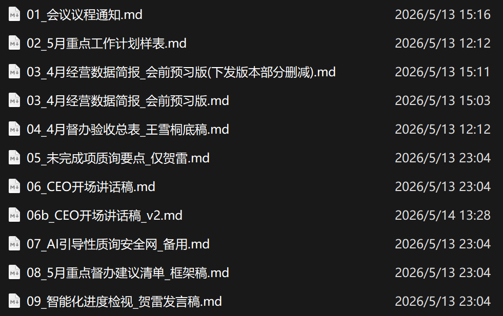

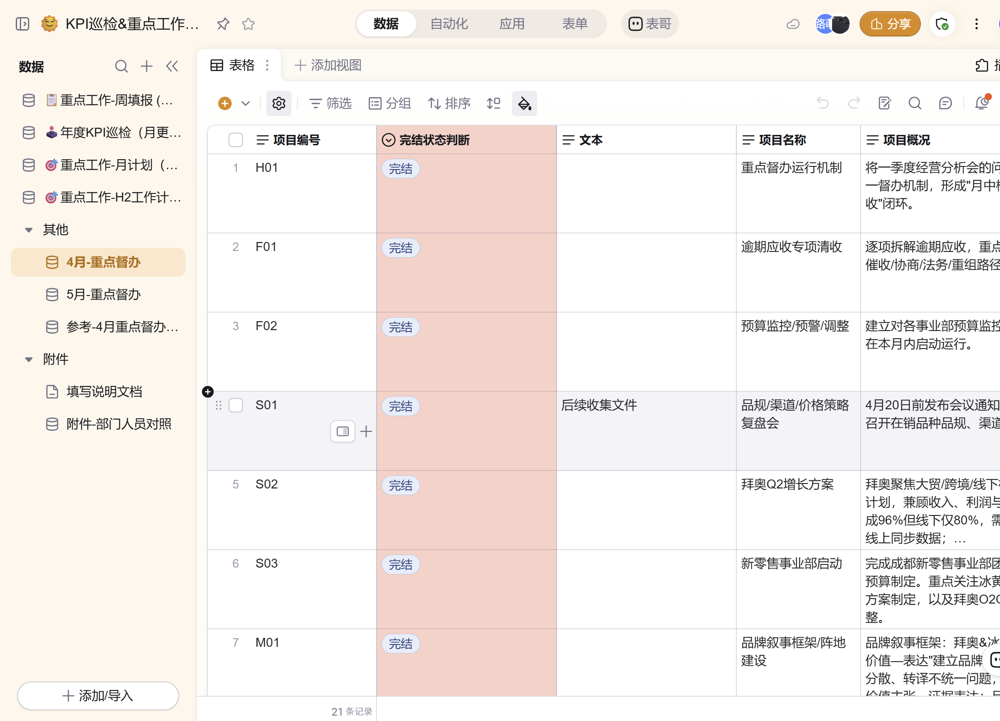

这里补充一句有延伸价值的是，改造经营分析会的流程，**不仅只是改变了一个会议的效率而已，背后是在逐渐从底层重构整个公司的数据治理、管理机制。**

举个例子，经营分析会积累的记录、数据，后续还通过 skills 和agents，**实现了能与每个人、每个部门的 KPI 绩效评分直接挂钩、联动**。虽然暂时还并不会以 AI 数据作为单一的管理依据，但这些已经能非常直接地让公司上上下下感受到，AI 已经在“润物细无声”地融进组织肌理里了，任何人不跟上脚步都是不行的。

> ↓部分skills相关文档截图

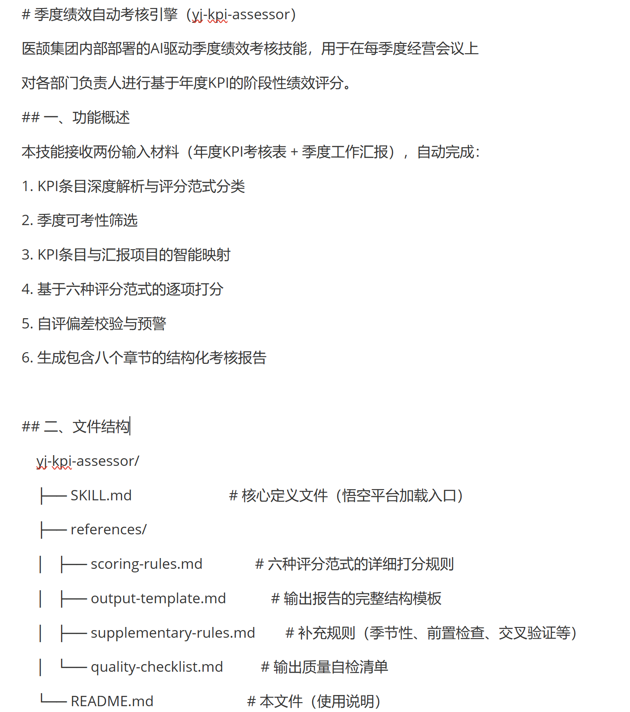

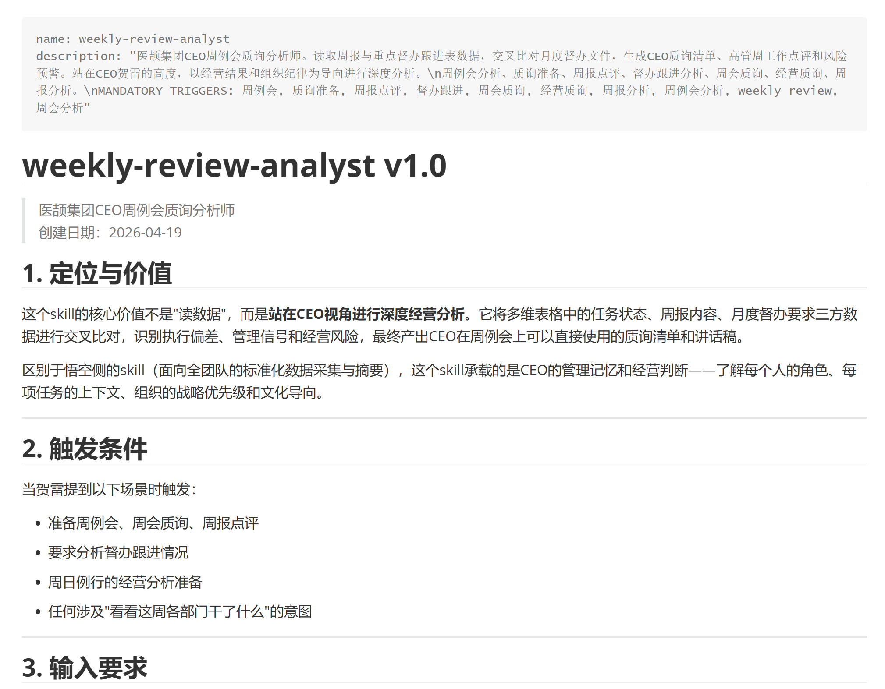

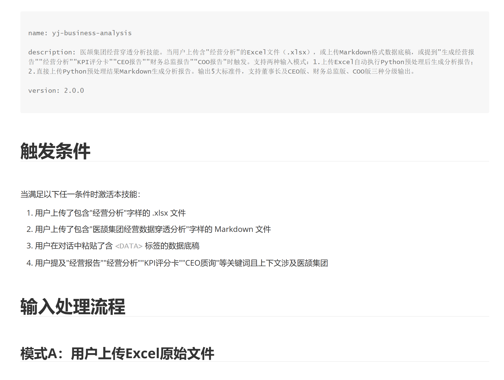

老实说，贺雷分享到这里的时候，我自己也觉得非常触动，学到了很多。

可能不少同学的公司和团队，现在也都在用 AI 改造会议，但你们是不是只停留在了：用 AI 做个纪要、列个待办，或者会前让 AI 查查资料？我直说，这最多算 **AI+ 或AI 增强**，是在旧流程的几个环节打补丁。

但贺雷这个不一样，在我看来，这就相对而言基本符合**一个以「AI 原生」为底层思路的案例**。

他是从头到尾**想了一遍整个数据和决策循环**：AI 扮演什么角色？哪些环节人类是最必要的？... 理清楚之后，人和 AI 的流程分工、边界很明确，**人在最关键节点做必要的评估、讨论、决策和责任。**其他的，**但凡 AI 能做，就争取不在节点上埋人。**

也因此，他背后的一整套“基建”、信息流转、系统，**实际上都是优先面向 AI 友好的**：他做了数据库，是要求人去按规范填表；为了 AI 能有效调用和分析，做了一堆skills、agents，在各个节点都参与进来。

也就是说，从一开始就是按 AI 能读、能处理、能调用的方式设计数据、标准和流程，AI 进入的是主循环。这个系统一旦跑起来，不管是谁，一下都被卷进了高度和 AI “合作”的过程，**团队成员的这个对 AI 的意识和认知，一杆子就覆盖过去了。**

大家再仔细理解一下这个思路啊。对比起来，我们一堂自己也做得还差很多。

好了，高层动起来了，再往下看一个带部门的例子。

在往各个部门推的时候，接受度和落地度确实是有快慢之分，**研发团队**是其中最早和最快见效的部门。

先说一下研发部的工作，主要是负责去挖掘、分析、评选出一些好的新产品、新技术的苗子，之后其他部门再去发展各种各样的合作方式，比如包括专利合作、投资、控股/参股、总代、孵化等等。

所以研发团队**天然需要通读、处理大量文献**，医药的、临床的，成百上千的厚厚的专业学术文献，想想都头大。而且这些工作**不快不行**，好的技术转化都是要抢占先机的。另外，他们还涉及很多和国内外专家的沟通、开会，天然需要**跨部门、跨时空协作**。

总结一下，没有 AI 之前，他们很容易**卡在三个问题**：
1. **读不完**：比如那个中医药智能手环项目几百篇的文献资料，“放了几年也没人完全读完过”；
2. **对不齐**：立项会靠各团队自己准备材料，格式、口径、深度各不相同；评审项目的标准也零散、口头、因人而异；
3. **存不住**：证据和结论散在不同专家脑子里、个人电脑、邮件和零散文档里，格式不一；人一走知识就断档，成不了可复用资产。

痛是真痛，但 AI 真的能帮忙吗？一开始团队成员多半都是将信将疑、犹犹豫豫的。但这时候，贺雷做了一个很聪明的管理动作。

**【互动🙋🏻‍♀️】**你们猜猜，如果换做是你，会怎么点燃团队去试试用 AI 解决问题？

——

这确实不好猜啊哈哈，直接说吧。

贺雷和团队玩了个“赛跑”，说“**你们做一套，我做一套，我们一起跑，看最后谁做得好**。”

你们想想这真的很机智，一举两得。

- 第一是制造压力和动力，老板都亲自下场了，团队还不得认真想想自己的价值；
- 第二是兜底，万一团队没做好，贺雷至少还有一个能用的版本。

结果事实证明，**还是团队做出来的更好**。你看只要他们真的花时间和投入去做，不会做不好的。

再简单说一下，研发部门到底做了哪些改造吧。

**一、他们先用 skill、并发脚本和多代理方式，处理大量资料，使之结构化、资产化。**

几百篇文献可以在较短时间内形成一份一两百页的**深度报告**，再切成几十张**结构化「证据卡」**。证据卡有统一字段、索引和图形化结构，以后讨论任何问题，可以直接调用相关卡片，不用每次重新读海量长文档。

证据卡后来还逐渐从“静态”迭代到了“动态”，后续的进展、跟进、决策依据，技术上的新变化等等，都按时间线持续叠加进去。

注意这一步很重要。**原始文献变成报告，报告变成「证据卡」，证据卡再进入知识库、索引和图谱。这就是面向数据的封装，读过的每一篇文献，从此都是组织资产，人在与不在，资产都在。**

> ↓某产品证据卡/知识库示例

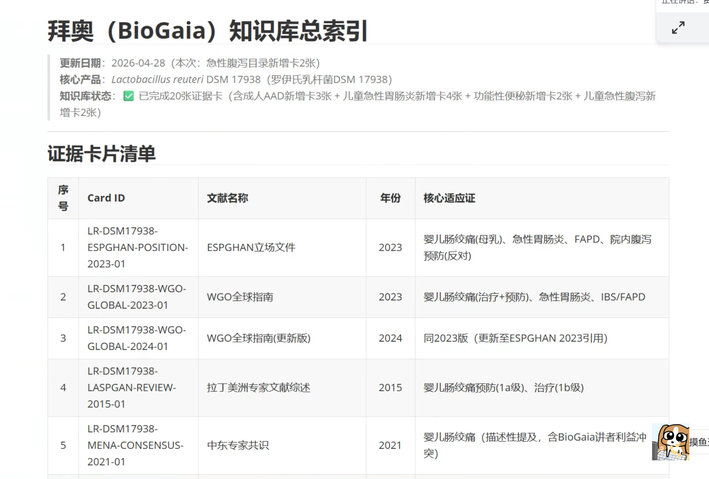

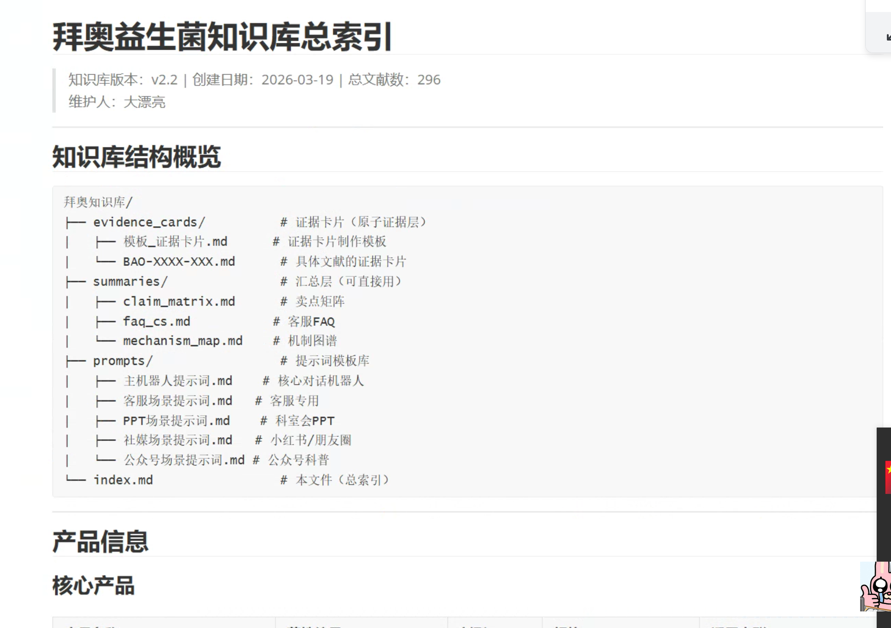

**二、把知识库接入「立项流程」，制定统一「标准与机制」。**

资料结构化以后，他们再反过来**用 AI 帮助提取研发立项标准、审核标准，并在预审和终审流程上明确人机分工。**

- AI 先做合规、市场容量、技术挑战等维度的预审，并留下通过或不通过的理由；人再根据实践把稳定部分固化成 SOP；
- 流程设成一道道 Gate，由不同的 Agent 分方向、分权重把关，过一道，才能进下一道，每一关都留痕；
- 但最终决策一定由人来做。所有需要负责任的东西，一定是人在负责任，AI 永远不能代替人负责任。

总结起来就是，**AI 负责**收集、读取、归档、分析和预审；**人负责**定义标准、审核关键结论、讨论立项，并承担后果。

这一套下来，一个显性对比就是，上会所需的材料一道道被“压缩、提纯”：

> 几千篇原始文献变成几百页的报告 → 报告变成几十张证据卡 → 再在部门节点由人工把几十页压缩成几页 → 最后研发立项会只保留一两页真正需要讨论的内容。

有一次研发立项会开完，一位美国的科学家反馈：“从来没有这样开过会，效率非常高。”这不是因为会议上多了一个 AI，而是因为大家终于在同一套数据、标准和语境下讨论问题了。

这个流程改造真的很牛啊，它背后的价值，**绝不仅仅是简单的提效，大家细想一下之后沉淀下来的复利**：

- 知识库变成可持续被调用的组织资产；
- 跨团队协作会议变成“共享知识库 + 统一 SOP”；
- 还形成了文化，大家都有意识去不断细化工作流、找优化空间、把人的流程固化下来给 AI 提效。

**每封装一次，后面每一次都更快。这就是复利。**

最后再补充一个很快的小例子吧，虽然时间紧，但也实在是舍不得砍掉，哈哈。

市场部也是贺雷直管的部门之一。几个月前，市场部老大来请求一笔20万的预算，说是去年也花了这么多，支付给**第三方供应商做 2套专业医学内容的 PPT**。

> 什么PPT这么值钱？这里面确实不只是排个版，专业要求还是高的，背后是大量体力和脑力，包括下载大量学术文献、查专业资料、文献分析、资料归档、形成专业表达和推广方案，等等。

但贺雷一听，马上就摁下了，“**这都有AI了，为什么还要花这20万？先自己做。**”

负责人不乐意了，一开始说，“这些都是体力活，为什么要自己做？”然后他也试过用豆包给指令，结果得到一堆编造、不可靠的内容，于是第二反应是，“AI 太蠢了，AI 不行”。

贺雷没有只讲道理，而是**选择了手把手、带他做**。

- **先拆工作流：**这个任务之前一口气外包给第三方，经理没直接做过，但他多年经验、该有的东西脑子里都有，只是显性化不出来。贺雷就带他一步步拆工作步骤；
- **再教会如何“使唤 AI”：**市场经理只会把 AI 当万能搜索、给笼统命令，贺雷就一步步教他：怎么去专业渠道查，怎么进入PubMed ？检索不到时怎么追问、怎么调关键词？怎么教 AI 判断没用信息、怎么把有用信息归档？怎么把过程沉淀成可复用 skill？
- ...... 这里还可以讲一万字，就不具体展开了。

重点是，真的**别指望这是什么“一夜之间脱胎换骨”的故事，这个过程陆陆续续磨了一个多月**。负责人一边抱怨一边学，遇到问题就回来问；贺雷不仅帮他分析，遇到真技术难点就亲自上手，再让他继续跑下一轮。

最后的结果，这20万一分没出去，用贺雷的话说，最后花的钱“两千块不到，两百块都可能用不到”。

更重要的是，他们逐步**沉淀出了一套**资料搜索、文献分析、归档、专业表达和推广物料生成的**完整流程**，再把不同步骤**封装成多个 agent**，这套工作方法还可以**在组织内部复用给其他部门**。

这时候，**一次“痛苦”的过程，又已经变成了一堆组织复利。**

**当然，更重要的复利，还不是这些资产，是人。**

你们看贺雷的管理手法，不是给点鸡汤、给个命令，他是真的带人，花时间去教、去答疑，给兜底信心。对贺雷来说，偶尔抽一点时间教人，不是什么特别高的成本，**但带出一个关键岗位的“AI带头人”，这个ROI是极高的。**

这位负责人后来在自己的复盘作业里，写了一句特别到位的话：“不是 AI 不行，是我没用对。”

> ↓贺雷也带团队在学一堂，这是负责人在他们内网提交的一堂作业和学习心得。

> （左图）是他关于自己做PPT案例的反思；（右图）是后续已经在实践和思考如何在市场部其他场景和同事推AI落地。

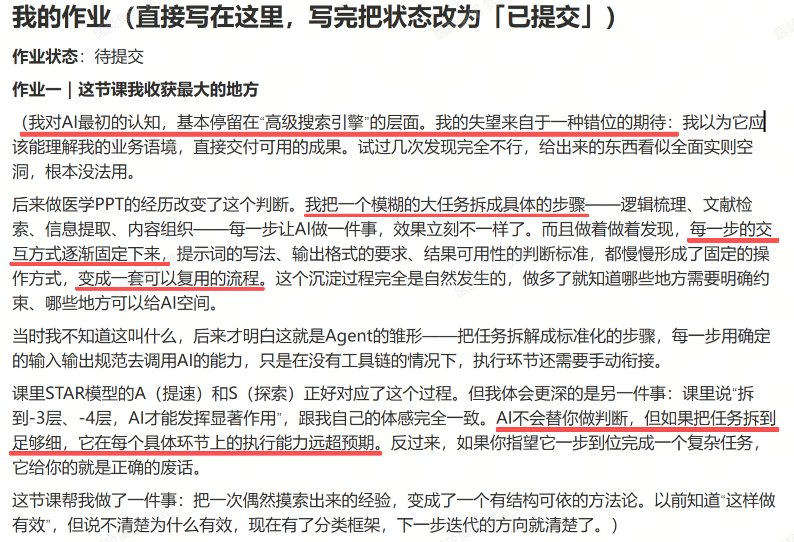

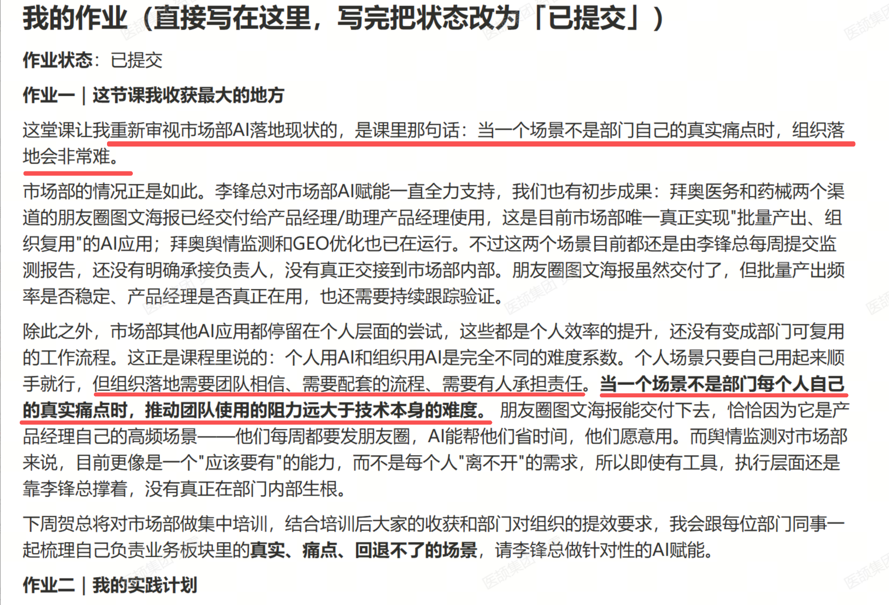

从一堂方法论的角度补一句，你们发现了没，**贺雷其实是在帮同事补齐双三角**，里面能看到有补体系、审美，也有基本功、数据等等。

带团队的同学记住这一条：如果一个人跟你说“AI 不行”，先别急着反驳，**先判断他缺什么？**有的人缺场景，有的人缺数据，有的人缺基本功，有的人缺审美，还有的人只是没有把自己的工作流程说清楚。

**管理者要做的，不是把同一套工具丢给所有人，而是找到这个人的卡点，帮他把自己的双三角滚起来。一旦滚起来，再做第二个、第三个任务就快得多，再延伸到团队、机制、组织文化，也是顺理成章的事情。**

---

好了，案例基本讲完，最后收个尾。

也就是小半年，贺雷基本就把一个传统组织的 AI 飞轮给转起来了。现在中高层10+人，都已经成为了 AI 骨干，每天重度在用、在推。下半年他准备重点开始做规范，更全面地沉淀组织知识体系和 AI 资产。

甚至还有余力往外溢，因为集团下面还有很多合作团队、子公司等等，**他还在酝酿一些有赋能价值的 AI 产品**。比如正在内测的一个**「BOSS OS」的产品**，就是以他给董事长搓的助理Agent为原型的。大家如果感兴趣，下来还可以找贺雷同学多多交流。

> 一款专门面向创始人、董事长、CEO等一号的个人助理与经营协同Agent，让老板们无需坐在电脑前，也能用最便捷的方式查到公司最细致的信息，能一边坐车一边就和AI助理完成工作讨论、任务布置与督办闭环，甚至随时随地记下老板和下属的每一次谈话，并能给出符合老板需求的精准纪要与深度建议。

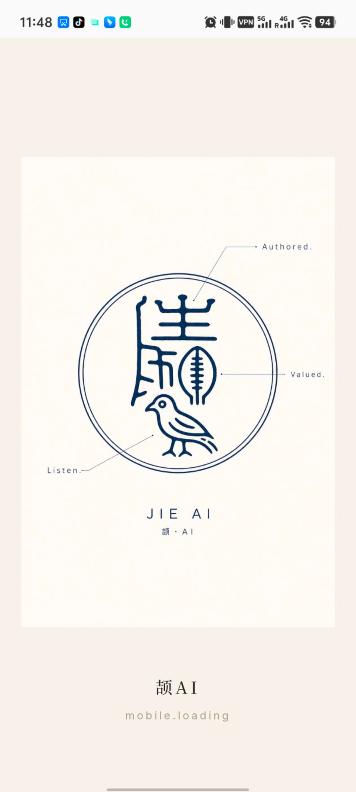

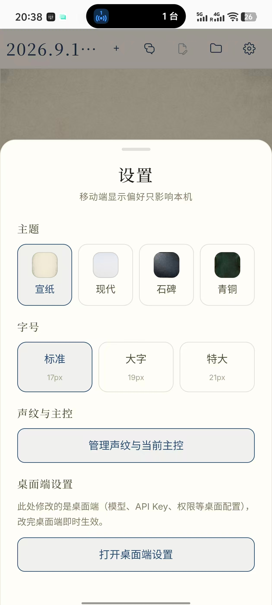

好了讲到这里，我们回过头看贺雷这小半年，飞轮是怎么转起来的？

这个赛段我们重点讲的是**「封装 x 复利」**，贺雷这个案例最有价值的地方，不是他自己会做多少知识库、多少个 agent，而是**如何把能力封装到了「人×AI」的协作循环上。**

绝大多数组织都不是一个人，不可能脱离员工和团队。**怎么以「AI 原生」的思路，想清楚人和 AI 的分工、重构流程和机制**，这一层最难，也最值钱，它解决的是**“复杂的人的协作 + 复杂的 AI 协作”糅在一起的问题。**

贺雷这里留了四条实操：

- **第一**，**AI 原生，不是在旧流程里加一个 AI**，而是重新设计输入、流程和决策循环，让 AI 进主循环。
- **第二，推动组织 AI 化，本质是一号位工程**。先让真正拥有资源的人解决自己的痛点，获得一次强烈体验，再让行为和标准向下传导。
- **第三，组织复利来自能力部署**：部署给人，业务负责人开始会用；部署给数据，知识变成资产；部署给 agent 和工作流，一套方法可以反复调用。
- **最后，一堂双三角还有两个用途**。
- 面对员工，它帮助带人者找到对方卡在哪里，场景、数据、基本功、审美还是体系；
- 面对人和 AI，它帮助我们判断哪些可以交给 AI，哪些需要人复核，哪些必须由人做决策、承担责任，**守住 AI 的边界，也守住人的边界**，有依据，不模糊。