### 第二个案例：花辣子米

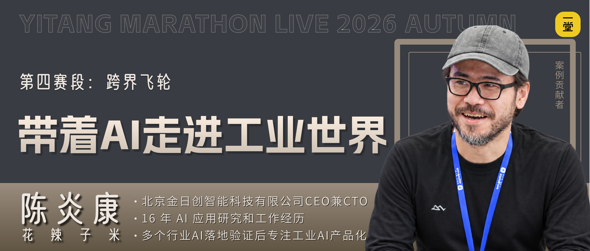

这个案例，来自一堂同学，**陈炎康**。大家可能对他的微信名“**花辣子米**”更熟悉，我们也经常亲切地叫他“**花总**”，有些同学可能已经很熟悉他了。

大家可能听过他用 AI 写歌，也见过他用 AI 写大型程序、分析客户线索、做需求洞察。他还长期服务一些 五百强企业，帮他们做过不少智能系统和 AI 项目。

在我心目中，花辣子米是**一堂排名前三的 AI 专家。**

而真正让我觉得他厉害的，就是他**总能带着 AI，快速把陌生的问题弄明白，哪怕是进入一个连他自己也很陌生的行业**。还能很快就和这个行业里的专家坐下来，把问题往深处聊。有些难题，行业里长期解决得不够好，他还能往前推进，做出来的方案，甚至能跟头部方案正面比较。

**大家听了，是不是也很想有这样的能力？**碰到一个原来不懂的问题，能借助 AI 更快学进去。从听懂别人在讲什么，到能提出自己的判断，再到能和懂行的人一起把**真正有价值的问题解决掉**。

花辣子米的这个案例，值得大家认真听一听，特别是这中间的过程，看看他是怎么借助 AI，把原来不熟悉的事情研究明白，再一步步做到全新的高度。

接下来，我们就跟着他走进工业现场。看他怎么判断从哪里下手，先花多大的成本试一试。遇到不懂的地方，又怎么继续往前走，最后做出工厂真正用得上的东西。

这个故事，要从一堂 MBA 的一次线下三天两夜活动说起。

当时，AI 俱乐部的主理人于陆，把花辣子米和一堂同学君仪介绍到了一起，而也就是这一次活动上的业务交流，开始**把花辣子米带进了工业生产领域。**

他们当时聊的，是**玻璃产线上的缺陷检测**。

大家可以想象一下大块玻璃生产的那个场景，发现一块玻璃上有个黑点，可能只是水渍，擦掉就没事了，但也可能是比较危险的**内部的气泡、结石**。

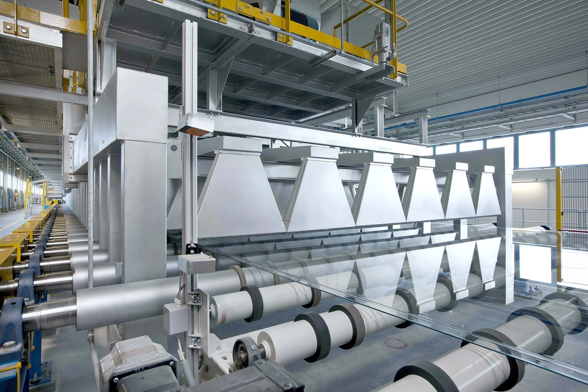

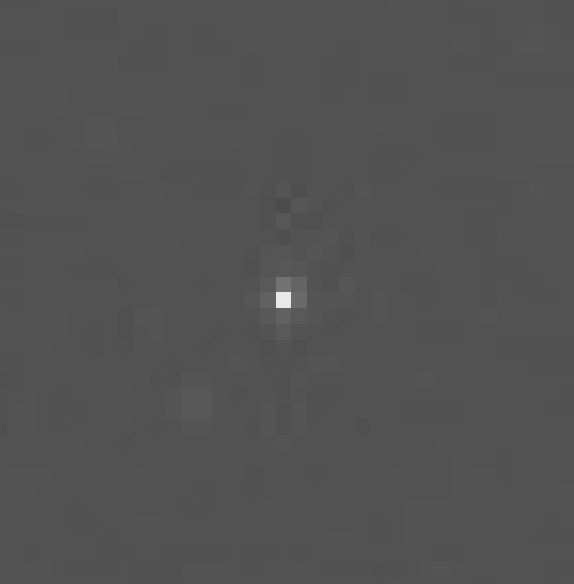

如果漏掉了这些危险缺陷，玻璃进了钢化炉，在高温加工的时候，就可能“**砰”的一声，整块炸裂**。

更严重的是，玻璃一炸，产线就得跟着停下来。先等炉子降温，把碎玻璃清理掉，然后才能重新升温、开工。这么一折腾，**前前后后十几个小时，往往就是上万元的损失**。

所以，花辣子米他们要解决的，就是在玻璃进入后续加工之前，把这些危险缺陷认出来，拦下来。

这件事，过去已经有检测设备在做了。**老方案打磨了近十年，可还是会有不小概率的漏检或误判，**再往下改进，空间也很小了。

于是，合作方**研发出了一套新光源**，希望把缺陷照得更清楚。

可**光源一换**，同一个缺陷在图片里的样子也跟着变了，**原来打磨好的算法就不适用了**。要让新设备工作，就得训练一个新的算法模型用来配合新光源一起使用。

而**训练新模型，首先就得有大量图片**。

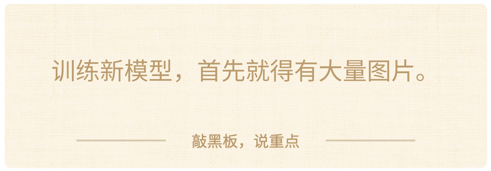

按照花辣子米团队的经验，**至少需要几万张这个量级**。可实验室能拿出来的真实样片，**每一类缺陷也就三五块**。如果要靠产线一点点收集，可能得花一年，甚至好几年。

新设备总不能一直这么等下去。

问题就这样摆到了花辣子米面前：**要让机器认出缺陷，先得有图片**。可这些图片，到底从哪里来？

**【互动🙋】**可能有同学会想，现在很多 AI 画图都很厉害，能不能让它生成几万张带气泡、带结石的玻璃缺陷图，直接拿来训练，大家感觉怎么样？
1. **可行，**主要看成本，成本能接受就可以  **#扣1**
2. **值得试试**，可以尝试一下，先看看效果  **#扣2**
3. **不太行**，生成图片的质量很难达到要求 **#扣3**

——————

花辣子米的**答案是 3**，直接让 AI 生图，确实不太行。

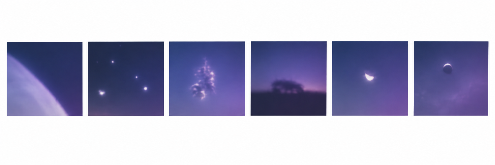

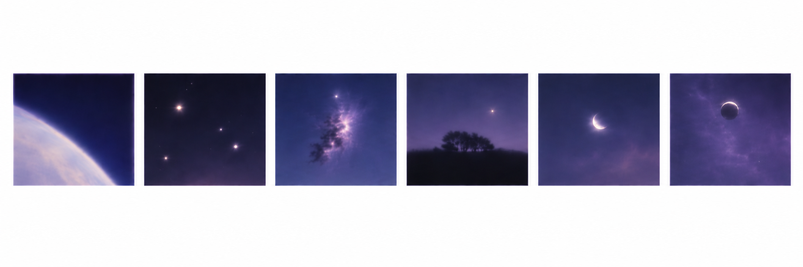

大家可以看看这两组图，一组是原图，另一组是 AI 生成的，几乎差不多。

然而，这里说的“质量”，不能只看图片像不像，也不是说清不清晰。更重要的是，这些图片得符合**真实世界的物理规律**。

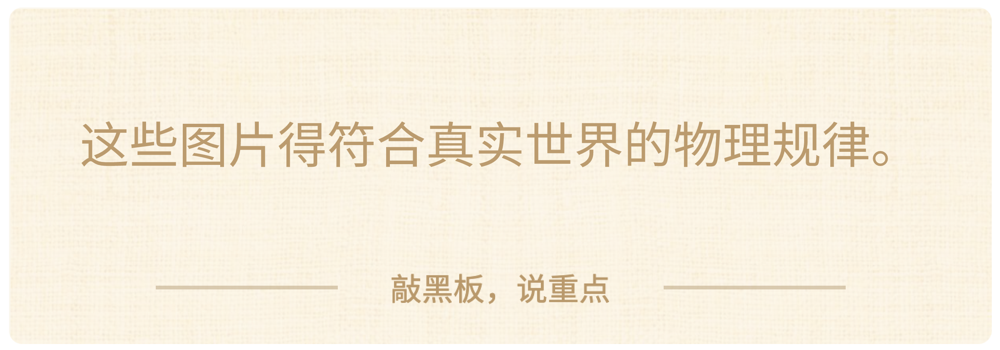

比如，同一块玻璃，换个光源，或者换个照射角度，气泡在图片里会变成什么样，都是存在客观规律的。AI 大模型可以画得很像，但它完全没法保证，生成的几万张图片都遵循这些规律。

这些图是要拿来训练模型，让模型到真实产线上来实实在在地认缺陷的。**图片里的变化如果和现实对不上，模型就可能学错**，也就完全没法用了。

所以，缺少大量可靠的训练图片，这个问题还是绕不过去。

大家也可以再想想，那还有什么好办法么？

——————

花总不愧是花总，他当时很快就往深处又想了一层，这些照片，本来就是**光照到玻璃上，遇到缺陷，再被相机拍下来的结果**。如果能用电脑程序把这条光路仿真出来，是不是就能**模拟出符合物理规律的缺陷图片**？

他以前也做过一些仿真项目，知道这不是异想天开。很多大的行业已经有成熟的做法，可以借鉴。

> 比如**设计飞机**，要仿真气流怎么经过机翼。

> 比如**设计汽车**，要在电脑里一次次模拟碰撞。

> 比如**设计芯片**，也要反复模拟不同工艺会带来什么结果。

只是，这种高精度仿真，通常需要很专业的团队，比如几个博士做上一两年，投入上千万，都有可能。**玻璃缺陷检测这样的小场景，基本上都很难承担得起这样的投入。**

于是，花辣子米提出了**一个大胆的假设**：

现在 AI 已经很强了，可以读论文、找公式、写代码了。能不能**借助 AI，用一个很低的成本，把这套仿真做出来**？再用这套仿真，为这个玻璃项目模拟出足够多、符合物理规律的训练图片。

其实一开始，他自己心里也没底，毕竟之前没这么做过，就准备先拿一天试试看。

好在他本科学的是物理，也做过其他行业的仿真项目。他知道，**关键还是得把底层的物理关系弄对**。如果 AI 可以快速找到一些靠谱的论文和公式进行分析，把这些关系描述清楚，再写成仿真程序，就能持续产图了。

于是，他和 AI 一起读了几十篇论文，寻找能解释玻璃成像的物理公式。再结合眼前这个具体问题，试着把不同论文里已有的关系**做一番抽象、提炼，再重新组合起来建模**。

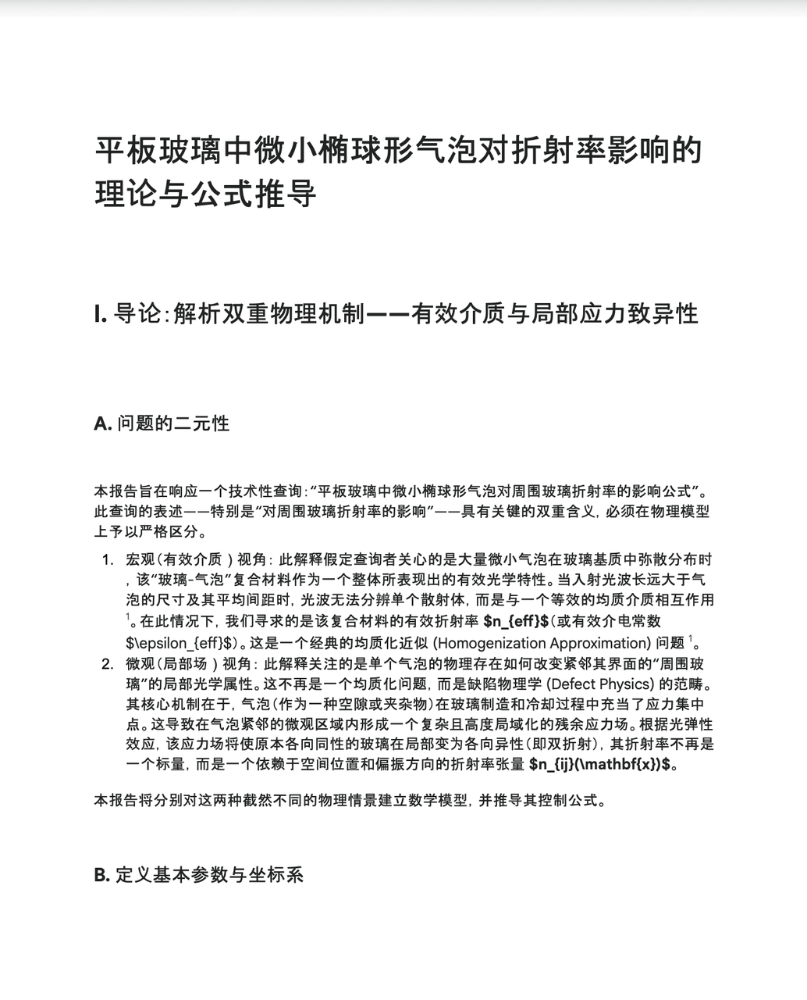

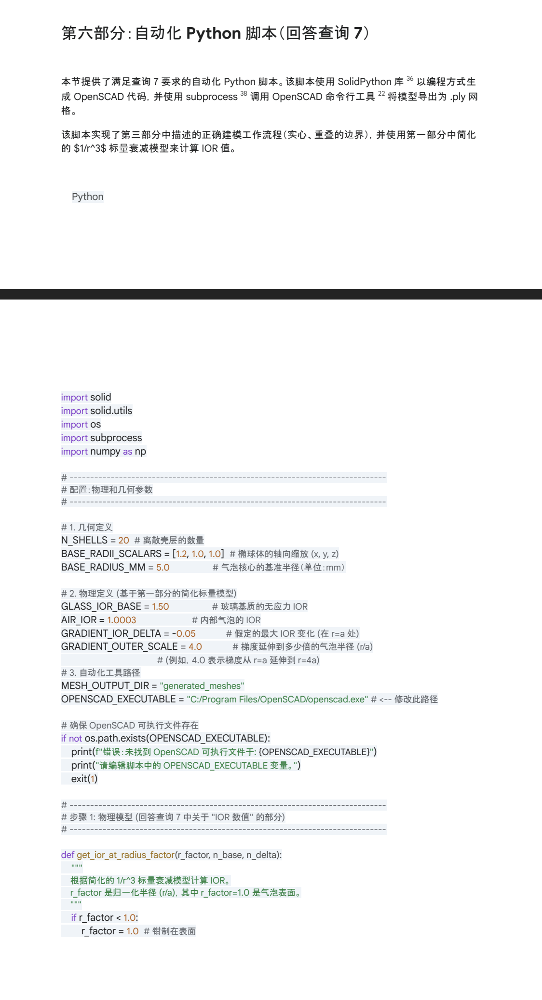

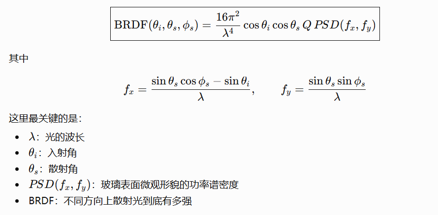

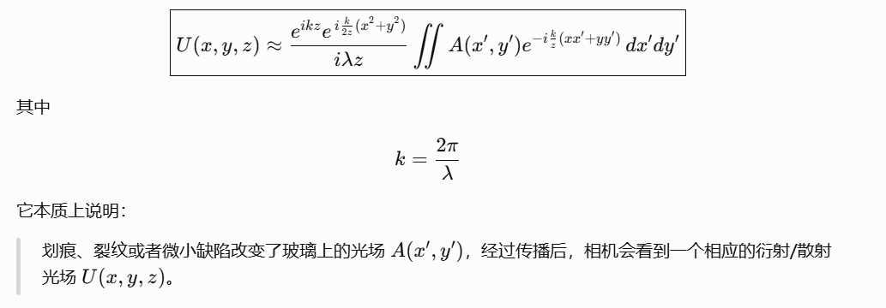

这里面的大量工作还是由 AI 来做，花辣子米自己只抓重点检查，**核心参考公式到底出自哪里，物理上讲不讲得通，条件变了，仿真结果会不会跟着合理地变化**。

一天之后，花辣子米还真的做出来一个初版方案，而且能够通过基本的物理检查，不至于完全失真；虽然离成熟的仿真软件还远，但花辣子米已经可以判断，**这条路值得继续走**。

接下来，他让团队继续**充分做加法**，把研究范围扩大到更全量的**几千篇论文**。筛选相关研究，做综合分析和交叉验证。

然后**开始做减法**。物理关系不成立的、结果明显不合理的，先淘汰掉。最后做出了**十几套仿真方案**，分别生成了第一批图片用来进一步校验。

那接下来要具体怎么校验这剩下的十几套仿真方案呢？

——————

大家还记得前面提到，**实验室里有三五块样片**吗，这时候，它们就派上了大用场。

虽然样品很少，但是他们想到了一个很巧妙的方法。可以给同一块样片换光线、换角度拍照，再到仿真里，**把同样的条件还原出来**。两边的图片放在一起比较。

真实图片怎么变化，模拟出来的图片也要跟着怎么变化。对不上，就继续调整，或者淘汰方案。

这些样片，**不够当训练算法的“教材”，却很适合拿来当“尺子”**。

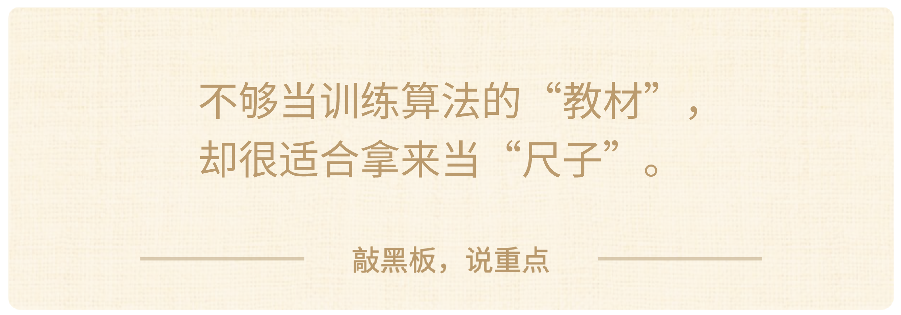

十几套方案，对比一圈下来，最后留下了少数几套，各自都能还原不同类型的真实规律。花辣子米和实验室专家、工程团队一起继续校准，把它们组合起来使用。

经过这样一轮轮对照，合作方的专家也认为，**这些方案可以进入下一步了**。

仿真一旦跑起来，数据就能持续生成。团队一边产图，一边训练专用模型。**三个星期左右，累计生成了接近五十万张图片，大概相当于一条真实产线十数年的产量。**

原来，想要凑个几百张训练图片都会很难，而现在，启动的数据一下子就有了几十万张。

不过，这些图片毕竟来自虚拟世界。用它们训练出来的模型，**进入真实工厂里，是不是真的有效才最重要。**

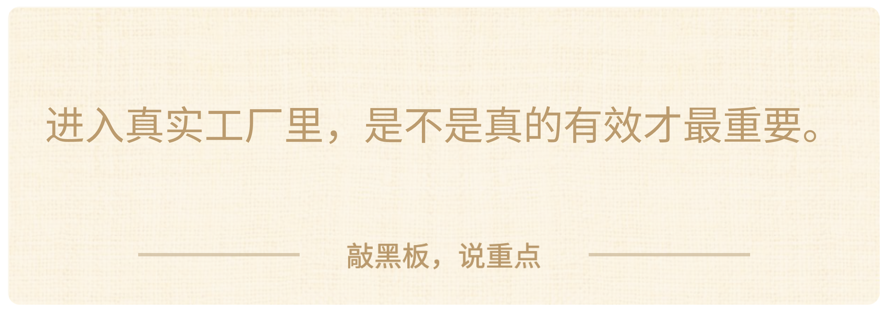

按花辣子米的话说，是骡子是马，得拉出去溜溜。

机会来自合作方的一位老客户。双方关系很好，对方也**愿意给新设备一个试跑的机会。**

工厂原来的检测设备和生产流程照常运行。新设备就在同一条产线上同步拍照、给出判断。两边的结果，再由团队一项项拿来比较。

**第一批结果很快就出来了，大家可以猜猜第一版怎么样**？

——————

这套主要靠仿真图片训练出来的模型，**第一次走上真实产线，整体表现就已经优于原来的设备**。

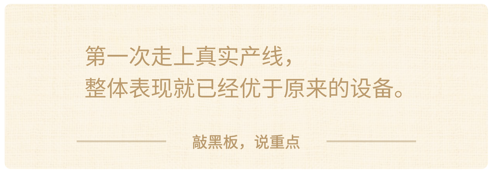

老设备的漏报率大约在** 5% 到 10%**，误报率更是在 **20% 以上**。新模型刚上线，漏报和误报就都进入了 **10% 以内**。

> 这里稍微解释一下漏报率和误报率的意思：
> 1. **漏报率**，就是漏掉生产中的真实缺陷、没有检测出来的概率；
> 2. **误报率**，就是机器检测出来的缺陷，有多少其实并不是真实缺陷，属于检测错误；而一般漏报率越低，误报率就可能跟着越高，这是为了尽量不放过缺陷。

离他们最终想要的效果，当然还有距离。但**这个结果，已经给了团队巨大的信心**。

他们在电脑里模拟仿真出来的那些图片，真的教会了模型一些能用到现实里的东西。

**仿真训练，开始在真实产线上起作用了。**

不过，进入真实工厂以后，仿真没有覆盖到的那些细节，也开始暴露出来。

比如，有些真实缺陷的周围，会**多出一圈光晕**，仿真图片里却没有。就这么一点差异，**模型就可能认错**。

团队干脆让**工程师驻在现场，遇到问题解决问题，持续调优。**

一旦出现漏报或者误判，工程师就把现场图片拿回来，跟仿真数据对照，看差别到底出在哪里。

比如，发现缺了光晕这个特征，就把它补进训练数据，再围绕这个特征生成新的图片。团队也会持续训练多个版本的模型，继续放到产线上比较。

**哪一版更好，就留下哪一版；哪里还会认错，就拿着新的现场图片继续改。**

他们就这样，在真实产线和模型之间，反反复复打磨了两个多月。

效果又往前走了一大步：**漏报率进一步降到了 1% 以下，误报率也降到了大约 5%。**这已经远远超过了原来算法的最好水准，甚至可以说，是一次质的飞跃。

> 之前比较好的水平是漏报率 **5%-10%**，误报率都要在 **20% 以上**。

检测结果越来越准，客户对这台设备的态度，也跟着变了。

哪怕只是送玻璃的小滚轮卡住了，客户也可能会马上找团队，催着赶紧修，**他们这边等着用。**

这个时候，花辣子米才觉得，**交付的感觉真的对了**。

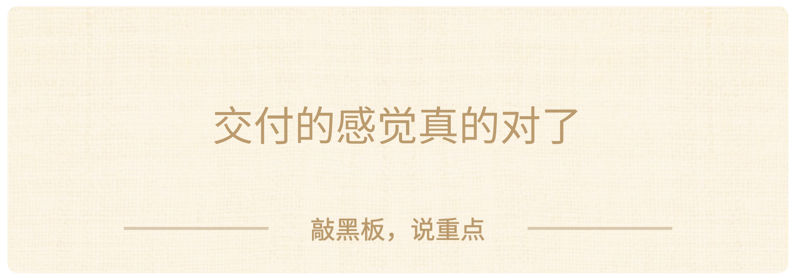

因为这台设备已经不是摆在那里、开不开都无所谓了。它真正嵌进了工厂每天的生产。**设备一停，现场的人就会觉得，这活干不下去了。**

这才是一套工业设备真正被用起来的样子。

第一条线跑通以后，**他们开始向更多产线复制**。

可工业现场，没有两条线完全一样。换一家工厂，光线、设备、玻璃的状态都可能变。刚开始，工程师还是得跟着，一条线一条线地调。

但这一次，**每次调完都不会白调。**

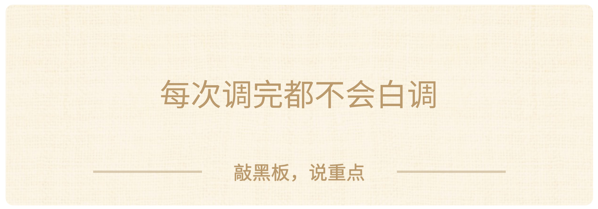

每条产线出现的新缺陷、新光晕、新误判，都会被带回团队，**继续用来完善仿真、训练数据和模型**。

第二条线不用再从零开始，到了第十条线，已经能用上前面九条线积累的经验。

很多工业项目，客户越多，交付反而越重，多一条线，就多一份定制，多一些人守在现场。

但这套系统，慢慢出现了相反的变化。

进入的产线越多，拿到的真实数据越多。到了下一条线，**需要重新调整的地方，反而越来越少**。

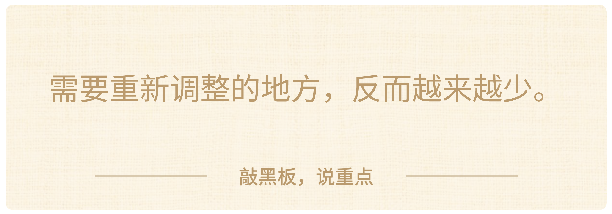

大约到了二十条线以后，这个变化已经非常明显，基本上需要工程师现场调的就很少了。

后来，这套设备**进入了上百条产线**。在不少成熟现场，漏报率已经几乎可以**做到 0%**，误报率也压到了 **1% 以内**。

一条线跑通，证明这台设备能用。

而当它**成功进入十条、二十条，乃至上百条产线**，意义就不一样了。

设备还是一台一台装进不同的工厂，每条产线，也仍然要结合现场做适配。但**识别过的缺陷、处理过的误判、试过的办法，都能留下来**。这些积累，又能帮团队把适合不同现场的方案做得更好。

花辣子米他们就这样，把原本散落在不同工厂、不同产线里，那些很难获得的真实数据和现场经验，一点点收回来，再去校准、沉淀，带进后续的研发和交付。

设备分散在上百条产线上，**数据和经验却在不断汇聚，慢慢长成一套越来越强的工业能力**。

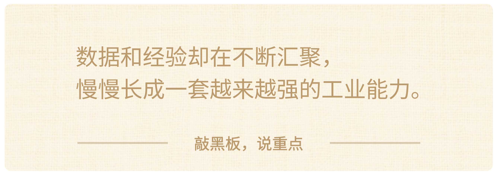

听到这里，不知道大家感觉怎么样，哈哈，花辣子米的这个案例，信息量确实比较大。

到这里，咱们先停一下，做个小复盘。

从一开始的新光源，缺数据、训不出模型，到后来设备在上百条产线上跑起来，**他们是怎么一步步做到的呢？**

把前面的细节稍微收一收，大家可以看到背后的**六个核心动作**。

第一，**找准真实问题，明确成功的标准**。 

这个项目最后要看的是，在新光源下，设备能不能在真实产线上，把危险缺陷认出来。

第二，**结合业务事实和理论经验，形成初步认识**。 

一边把产线条件、现有方案和数据缺口弄清楚，一边参考物理规律和成熟行业的仿真方法。两边结合起来，逐渐弄明白，问题到底卡在哪里，又有哪些可能的解法。

第三，**提出大胆假设，先用小实验快速验证**。

 能不能借助 AI，做出一套仿真系统，把训练数据补上？花辣子米先拿一天试了试，看这条路值不值得继续投入。

第四，**把理解做成能运行、能检验的模型**。 

先做加法，研究论文，尝试不同方案。再做减法，用物理依据和真实样片筛选、校准，逐步把想法变成可用的仿真程序。

第五，**从可控的实验，走向真实现场**。

 仿真通过检验，再批量产图、训练识别模型。模型装进设备，还要到产线上试跑。实验里成立的办法，也得接受真实生产的检验。

第六，**用现实反馈，持续更新模型和判断**。 

现场哪里认错了，就带回来分析、修正。这一轮留下的数据、方案和经验，也让团队再面对下一条产线时，多了一些解题的依据。

这些动作，就这样在一轮轮尝试里反复发生。**AI 让研究和试验更快**，**现实反馈又让团队的理解越来越深**。

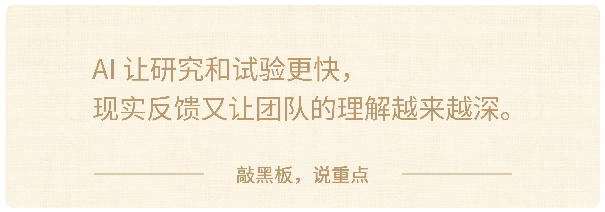

然后咱们往下继续讲。刚才的玻璃缺陷检测，只是花辣子米探索工业 AI 的一个项目。其实在很多其他工业场景里，他也都陆续拿到了不错的结果。

我们再来挑三个例子给大家简单讲讲，看看这套解题能力是怎么迁移过去的。

第一个，咱们就顺着玻璃缺陷往下讲。

缺陷找出来了，接下来怎么切，才能避开缺陷，又尽量多留下能用的玻璃？

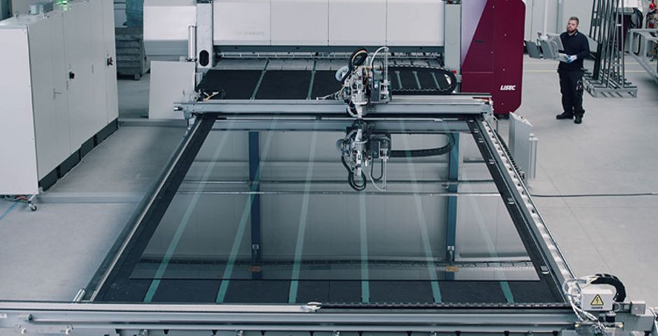

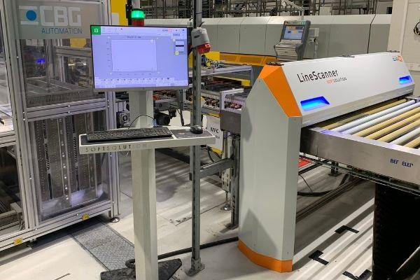

每块玻璃的缺陷位置不一样，后面订单要的尺寸也不一样。切割方案，就得跟着重新算。

大家这里可以猜一猜，在真实产线上，**这个切割方案最大的难点在哪里**？

——————

其实动态切割算法本身难度可能还好，但最大的难点在于时间。产线一直在往前走，**留给算法的时间，只有一秒多。**

哪怕方案再省料，如果要算上一分钟，也几乎没法用。后面的玻璃早就堵住了。

花辣子米他们还是先让 AI 做各种调研，提出不同的算法。再在电脑里模拟不同尺寸、不同缺陷位置的玻璃，给这些算法出题。

每一轮，都同时看两件事：**浪费了多少材料，花了多长时间。**

大约几天时间，团队就做出了一套符合要求的新算法。经过仿真测试，随后用到了真实产线上。一条满载的产线，用上这套算法，**一天最多能省下几万元**。

这也是工业 AI 很特别的一个地方。算法只是其中一部分，**还得同时满足生产节拍、设备条件和材料成本的要求**，才能在工厂里真正创造价值。

接下来，是一个特别复杂的场景——**钢化炉自动调温**。

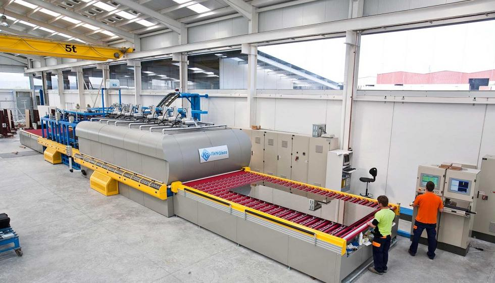

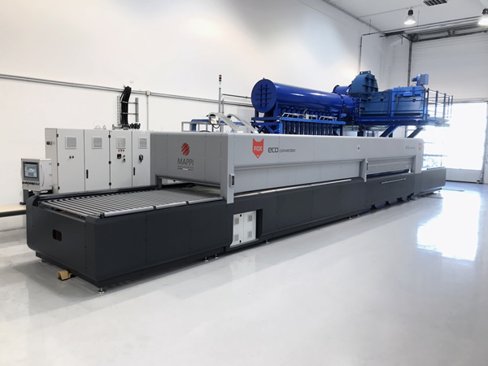

比如用钢化炉生产钢化玻璃，最后的产品质量高不高，一个很重要的标准，就是整块材料的**应力够不够均匀**。

要做到均匀，炉里的**上百个温控点，就得配合着调好**。

这件事，过去非常依赖老师傅的经验。他们会戴着偏振眼镜，看产品上的应力花纹，再凭经验判断，哪些地方要升温，哪些地方要降温。有时候，一天得这样来回调好几次。

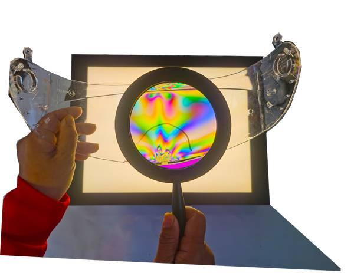

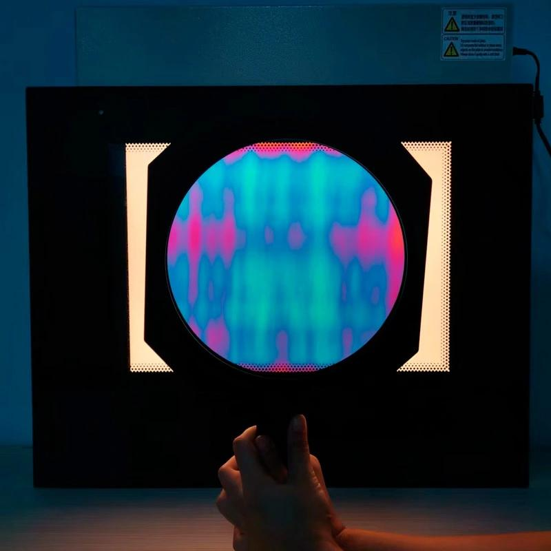

这里面的技术含量很高。但这些经验，长期都在老师傅的眼睛和手感里，**很难复制，也很难稳定地传给下一个人**。

花辣子米他们同样继续用 AI 建模、做仿真。

炉内的气流怎么走，温度怎么变，材料内部的应力又怎么变化，最后呈现出什么样的光学图像，这些都是连着的。背后涉及**流体力学、热力学、材料学和光学，复杂度一下子高了很多**。

他们把这些关系一点点建进模型，也把**老师傅过去怎么判断、怎么调节的经验，沉淀进系统**。

这样一来，老师傅眼睛里看到的、手上调过的，开始被放进一套可以反复检验、不断改进的模型里。

系统也开始实时盯住这些温控点，根据变化自动调节炉温。

过去，要靠老师傅凭经验反复调节，才能守住的品质，现在有机会在生产过程中持续保持。

高品质，开始**从一位老师傅的手艺，变成一套系统可以持续守住的能力**。

第三个，我们再看看**高速光缆生产**。

大家可以想象一下那个画面，下面这些设备一直在高速旋转，整条线**每分钟可以跑出上百米**。

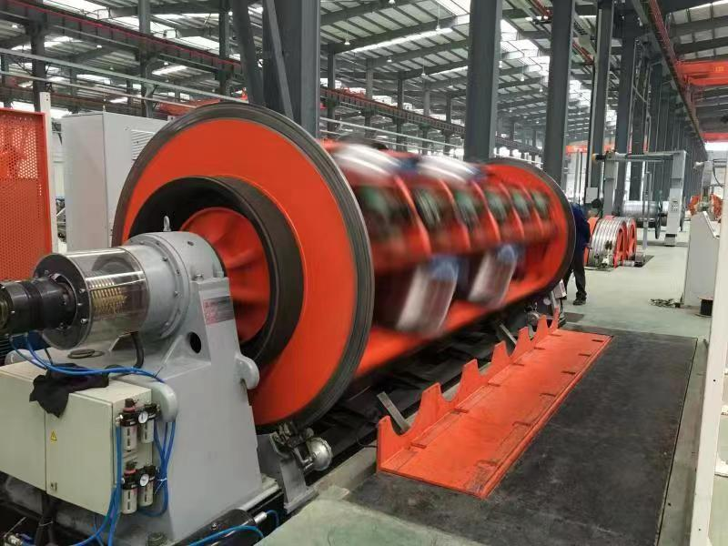

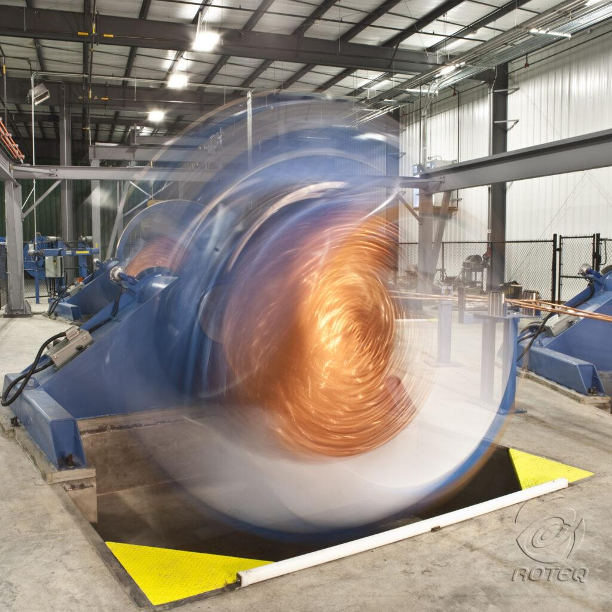

转速非常快，机器转着转着，很容易出现一点**微小偏差**。偏差一开始很小，但设备一直在转，它就会**一点点累积起来**。

人眼根本看不清，也完全看不过来。

即使用高速相机拍，画面也会有运动模糊。再加上整台设备的机械振动，真正要识别的那一点微小变化，很容易就被淹没了。

**所以过去，很多时候只能等**。等到偏差越积越大，最后“啪”的一声，**光缆真的崩掉了，工人才知道生产出了问题**，再停下来调整设备。

可一卷光缆，可能有几千米，甚至上万米。如果等崩掉了才把设备调好，前面已经生产出来的那一段，也可能只能作废。产线一停，整个生产节奏和效率也会被打乱。

为了解决这个问题，花辣子米他们花了很大力气，反复建模、搭建仿真系统，让 AI 前后尝试了**大约一百版算法**。

最后，他们相当于给这条高速旋转的产线，装上了一套实时运行的**自动感知纠偏系统**。

设备一边生产，系统一边感知、一边判断、一边纠偏。微小偏差刚出现，控制系统就会自动调整设备，**赶在偏差积累成断缆之前，把生产状态拉回正常范围**。

最终，这套系统把**产品合格率做到了 99.5%**，**生产效率也提升了 30%**。

它带来的不只是一次更准确的检测，整条产线也同时变得更稳、更快。

到这里，大家可以**把刚才这几个项目，连起来再看看**，意义就不一样了。

传统工业仿真非常专业，研究玻璃成像的，和研究钢化炉内温度的，往往是不同领域的团队。每跨进一个新领域，学习、研究和试验，都要付出很大的成本。

花辣子米带着自己的积累，也带着 AI，开始有机会和不同领域的专家一起，连续跨过这些门槛。

每一次建模、试验和现场修正，都会给团队留下更多知识、数据和判断。继续往前走，也就多了一分信心。

这些积累，也让花辣子米有了一个更大的目标。

这些工业问题往深处拆，都离不开光、热、力，也离不开材料和设备之间的关系。他希望把研究中用到的知识、真实现场留下的经验，一点点积累起来，进而研发一个**懂物理原理，也懂工业生产工艺的 工业 AI 大模型**。

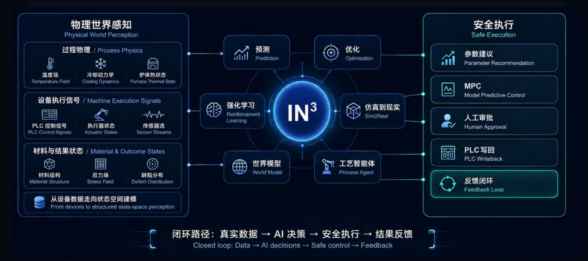

有了这个模型，团队可以持续和各个行业的专家一起，在电脑里模拟工厂的生产。现有产线遇到问题，都可以先在里面试一试，看看怎么改才更好。

还有他更期待的，是那些**还没有落地的新工艺**。用什么材料，温度调多高，设备跑多快，都可以先在电脑里反复试，看看哪条路更值得往下走。

设备还没造，材料还没投，一条未来的产线，就有机会先在电脑里跑起来。一些原本要投入设备、消耗材料才能发现的问题，就可能提前暴露出来。**让昂贵的错误先发生在虚拟世界，再把更成熟的方案拿到真实现场去验证**。

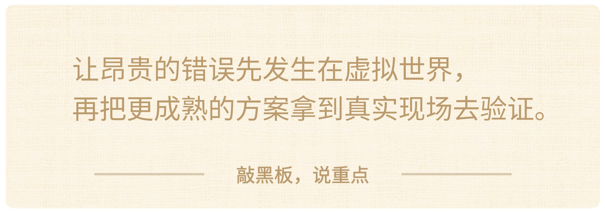

等产线真正开动，团队还能把现场的新数据带回来，继续改进模型。经过验证的办法和经验，也能留下来，帮助后面的研发。这样，每解决一个问题，都能为下一次尝试多积累一些东西。

如果这条路能走通，**很多工厂过去想解决、却承担不起研发成本的问题，就有机会重新拿出来研究**。当更多企业都能用上这样的能力，制造业研发新工艺、建设新产线的方式，也就可能慢慢发生根本性的变化。

这也是花辣子米希望**长期投入、继续做下去的工业 AI**。

这个案例，讲到这里，也就接近尾声了。

再回到最初那个三天两夜的现场，花辣子米当时接到的，是一道玻璃检测的难题。换了新光源，要训练新模型，可手里没有足够的图片。

他带着 AI，从这个问题一路追到背后的物理规律。先在电脑里做仿真，再到真实产线上一轮轮验证、修正。设备逐渐进入上百条产线，**团队也带着这些积累，开始解决更多工业问题。**

每解决一个问题，就多一些知识、经验和判断，也就有能力继续往前走。

大家有没有发现，花辣子米刚才一步步走过的，是 **双三角**，但其实也是 **Y 模型**。

往下找规律，把理论和事实放在一起。再通过假设、建模和实验，用真实反馈，一次次修正判断。

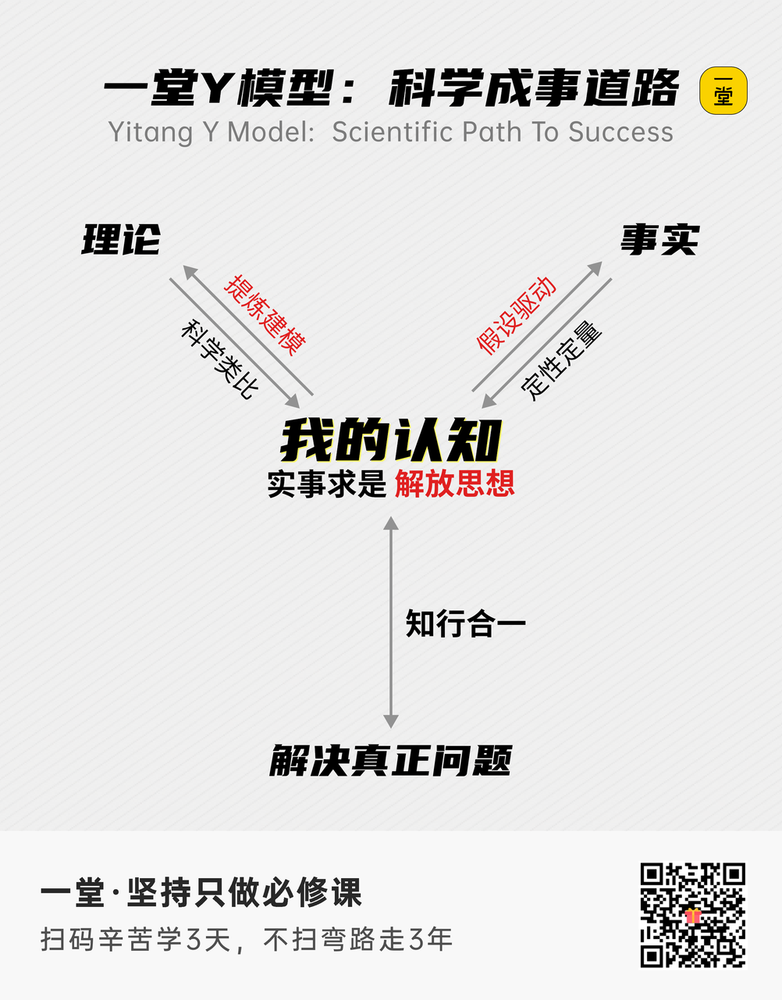

这里，我也还想感慨一下，AI 正在降低研究、建模和试验的成本，**但 AI 不会自己走进车间**。

还需要花辣子米这样有专业积累、愿意进入新领域的人，也需要行业专家和工程师。他们一起，**把论文里的规律、电脑里的模型，变成工厂每天用得上的设备**。

如果更多工厂能用上这样的能力，同样的一批材料，就有机会多做出一些合格的产品；同样的一条产线，也能少些浪费、少几次停机。新工艺也能在投入之前多试几轮。**那些过去因为成本太高而放下的难题，也开始有机会重新研究，一个个被解决。**

这些变化积累起来，就可能提升制造业的生产率，进而推动国家 GDP 增长。

当越来越多**有专业积累的人，带着 AI 进入真实现场**，一次次具体的解题，就有机会汇聚起来，**推动中国工业下一轮生产力的跃迁**。

最后，非常感谢花辣子米，愿意把这么硬核、这么热乎的案例，拿出来和一堂的同学分享。

一堂很少给同学的项目打广告。但这一次，我想借这个机会，帮花辣子米多说两句。

听说他们最近正在推进这个**工业 AI 项目的新一轮融资**。

我觉得，这个方向，**值得花上十年、二十年，甚至三十年，认真做下去**。对中国制造业来说，也可能是一个很大的机会。

所以，如果在座有同学认可这个方向，也有**千万级的投资能力**，或者能对接相关投资资源，欢迎课后私下联系花辣子米。看看项目的 BP，再跟他具体聊一聊。

也希望今天这次分享，能让这样一个值得做的项目，**遇到更多愿意一起往前走的人**。

哈哈，这两个案例是不是太硬核了？作为柔软的平衡和最后的收尾，最后我来讲讲一堂的案例吧。

和花总和晓光比，不敢自称“最佳实践”，更多的是给大家增强一些科学道路的笃定吧。