### 第三个案例：一堂

我先调研一个基础的问题：

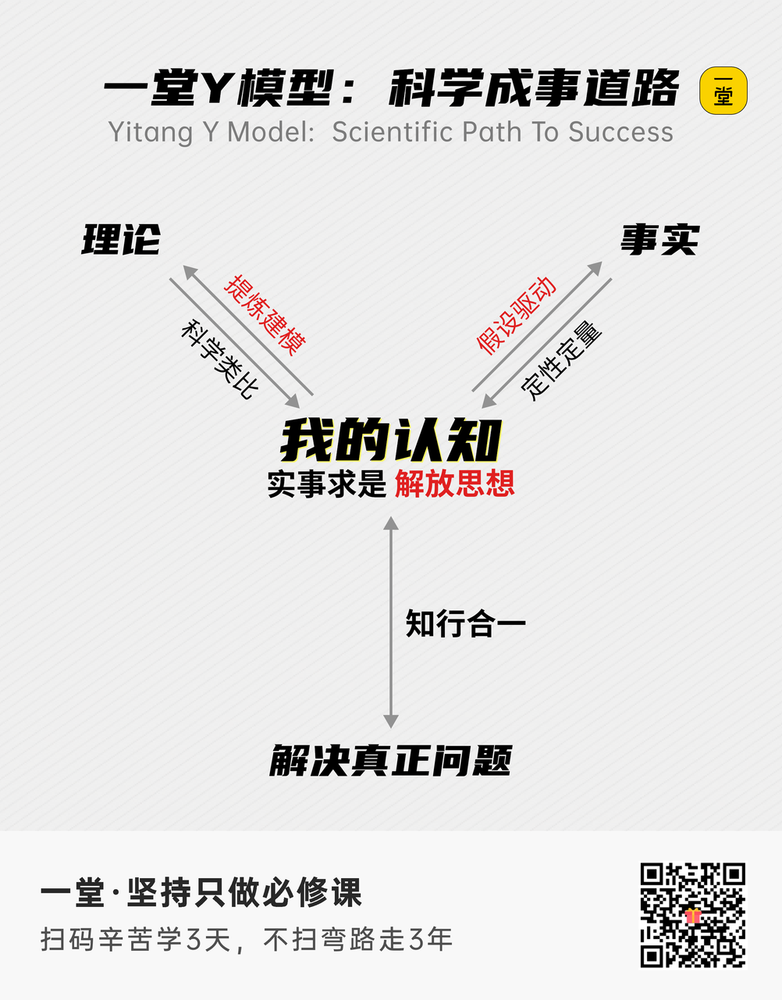

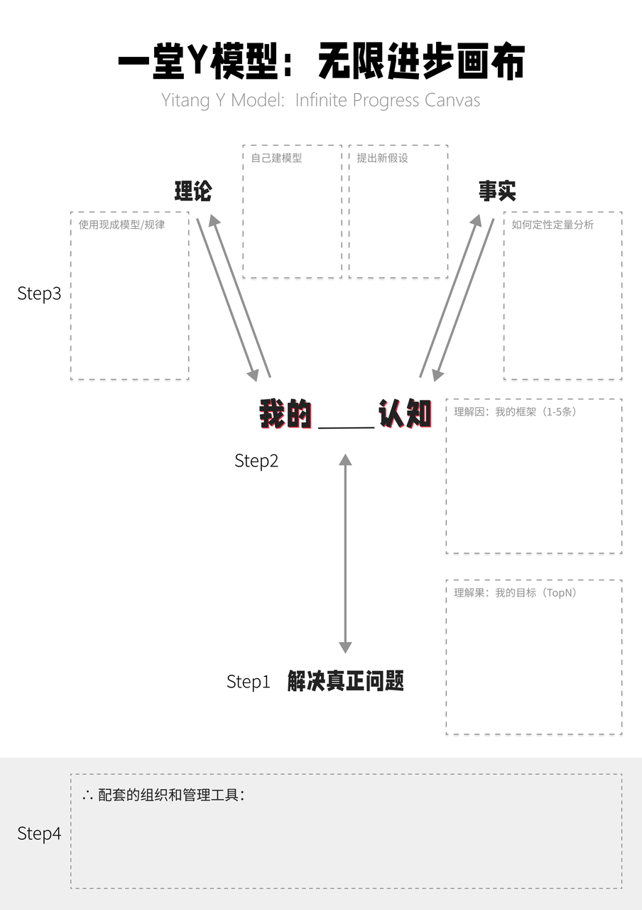

**【调研🙋‍♂️】**大家对于一堂Y模型的学习和理解程度如何？
1. **非常陌生：**今天第一次听说，还很懵。
2. **初步理解：**大概知道是什么，价值未知。
3. **听够课程：**听过完整必修课，了解价值，应用很少
4. **经常应用：**经常分析问题时候使用Y模型指导决策
5. **必经之路：**极其认可，积极长期实践，作为战略大牌使用

> 来自课程《重新理解“科学理念”》

————

很多人评价一堂的课程都是很具体的术（褒也是贬），我讲其实一堂有“道”，而且这个“道”比大家想象中要大得多，这个道就是：**科学。**

我们经常讲，科学用人、科学招聘、科学做抖音、科学起名字、科学投放、科学营销等等等等，但是"**究竟什么才是科学**"？

我能不能先忘掉所有“现成经验”“知名案例”“名人观点”“同行实践”，就从基本的科学方法出发，快速理解客观规律，构建一个解题的模型呢？

这个时候，Y模型的价值就出现了：**没有任何工具，只有基础的科学工作框架。**

**足够底层，底层到能适配几乎一切长期的科学工作难题。**

简单介绍解释下Y模型的基本原理：从一个最小的内核（客观的因果规律）出发，推导出一整套科学做事的工作体系。

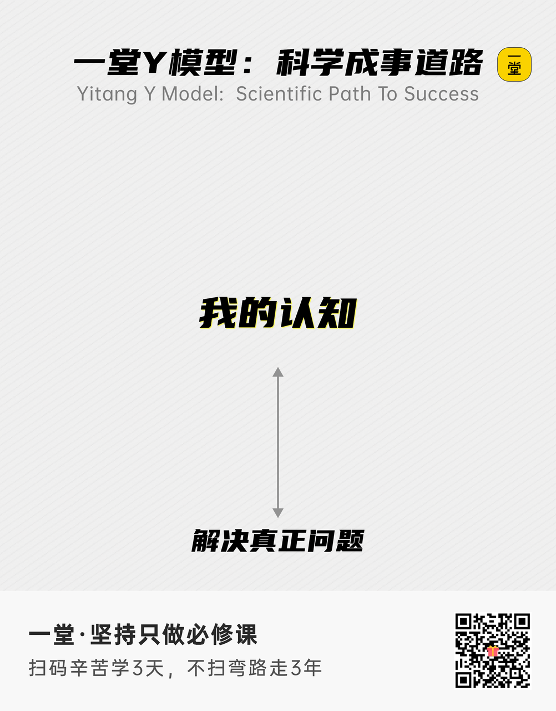

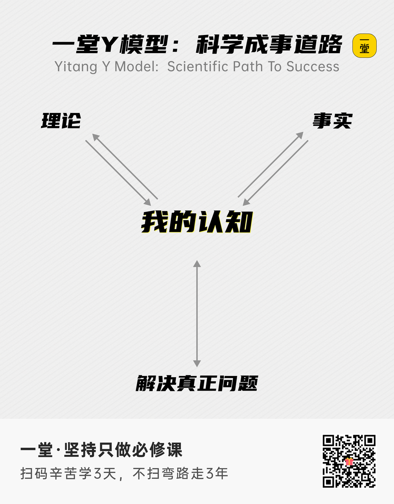

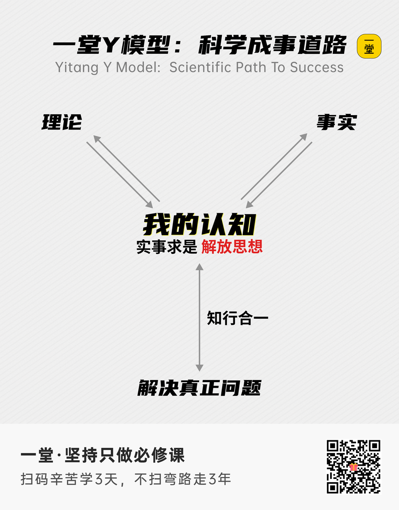

- **1：一个核心：因果规律**
- **2：两个基本点：理论，事实**
- **3：三大必备原则：知行合一，实事求是，解放思想**
- **4：四种迭代方式：科学类比，定性定量，假设驱动，提炼建模**
- **5：五步推理里程碑：问题范围，明确目标，基本认知，预判进步，组织配套**

有个段子，在访谈时候，拜访到360的业务专家胡喆骞同学，他调侃着说：

> 双三角就是得和Y模型结合着用，才能发挥巨大的威力啊。

> 我早就发现了，我就不说，看看Truman啥时候能悟出来。

哈哈说来惭愧，作为这两个模型的主理人，我也的确是最近一个季度才理解到的。

如果我们想持续在各个领域AI落地，**Y模型x双三角，就会发挥出最大的威力。**

- **Y模型**：提供了一个科学的工作姿势。
- **双三角**：提供了一个基本的因果关系。

一堂过去七八年，我们搭建了国内少有的一套“商业管理研究体系”，我们做出了一套非常稀缺又非主流的“科学教材”流派，每周都能生产一节必修课。

**【调研🙋‍♂️】**哈哈，学了一堆一堂课程了，商业、管理、个人、AI，大家有没有感觉一堂课程还挺特别、稀缺、非常不一样的？

最大的特点or稀缺的优点是什么呢？

————

关键词：**科学、体系、必修课。**

我们组建了一套原创的AI教育供应链。

很多人都过来学习，很多老学员来公司拜访，就想看看是不是教研真的就四五个人，甚至一些头部上市公司老大哥也过来聊天，但是能学习的很少，为什么？

因为这不是一套现成的SOP和工作流，而是长期坚持Y模型、每周迭代形成的一套体系。

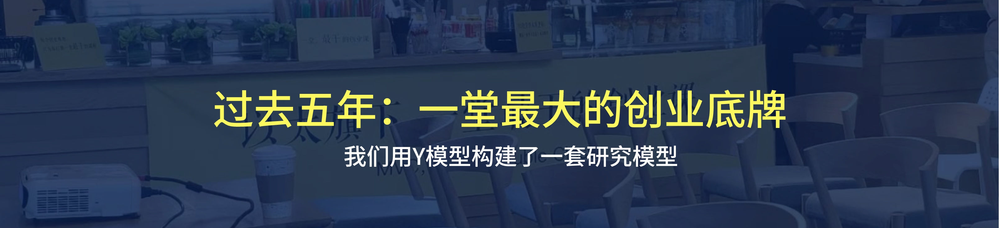

简单来说，我们从2021年正式搭建教研团队开始，我们就一直在迭代这套“科学做课”的体系：

**第一：目标足够明确**（做课的质量和NPS Benchmark）

**第二：模型足够稳定**，至少有三套模型：
1. 审美：什么是一节好课
2. 工作流：整个科学做课的里程碑模型。
3. 基本功：背后的基本功框架。

最关键的是，每周一次迭代，咬牙硬坚持了五年：保持每周雷打不动一节新课的节奏，每周做四件事：
1. 足够充分的调研：课题全网调研、研究信息量拉满；
2. 足够辩证的学习：学习经典理论，充分吸收现成。
3. 足够多的假设：每周复盘，提新的假设，做实验。
4. 足够多的建模：打磨基本功、打磨磨课手段。

而且这两年颗粒度非常细，

比如我们每周复盘，会把工作量精确到小时，每个小时的时间投入/效率/是否浪费；

比如我们会追溯，每一个核心方法论是怎么出现了，是意外还是计划，下次如何复现。

比如：某一次做课，周三发生了方法论推翻，险些Delay，我们次周一开复盘会，一点点罗列时间表、看当时的事实，最后总结出了一个新模型：

**十层解读有两种：千万不要搞混了。**

- **辩证十层解读**：教材维度，为了推翻。#先敲定
- **讲香十层解读**：教学维度，为了证明。#再讨论

过去五年时间，我们做了**200门课**，不夸张，至少提了各种大大小小**300-400个假设**，建模迭代了**500-1000次**，硬生生轰炸出来一套“科学做课”的工作流。

总结一句话：

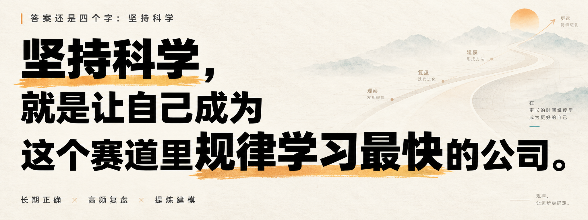

我们的目标不是赚钱最多，规模最大，甚至不是暂时领先，

而是成为这个赛道里规律学习最快的公司。

如果一个公司试图和一堂竞争，一共就做七八轮课，不怎么提假设，不怎么建模，设置没有一套确定性的科学体系，光灵机一动、抄一抄、攒一攒资源，怎么可能跟一堂竞争呢？

这就是一堂过去几年最大的底牌，也是**阳谋**，我们对科学的坚持和迭代最笃定。

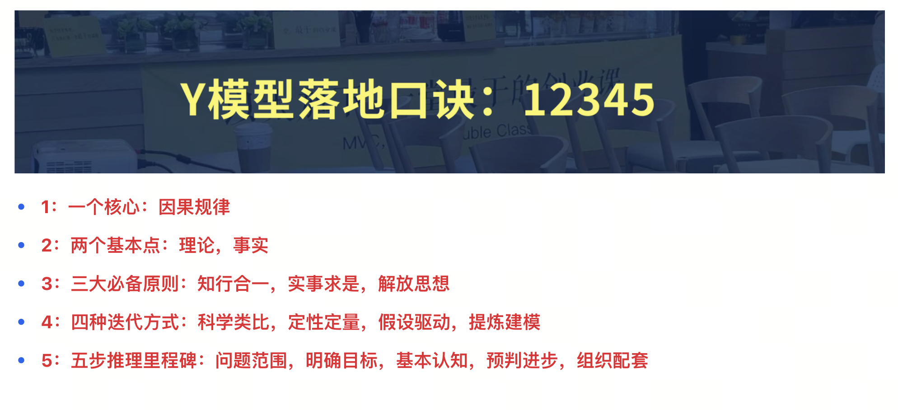

> 所谓阳谋：整套的思路，建模、复盘、基本功、假设的方法都做成了课对外讲了，不怕竞争，用来感召研究员、课程专家、案例贡献者一起加入。

随着**能力溢出**，我们陆续搭建了MBA服务体系、做训战营体系，其实都是大概的流程：建一套基本的模型，然后一堆假设轰上去，然后每周or每月迭代，持续高频迭代，慢慢就做出了竞争力。

市场上的商业管理课、IP课、观点课无穷多，而且基本上都是几个月一两年的昙花一现，而一堂做成了10年尺度的必修课，十年复利，依然如新。

回到AI，那未来呢？

对于一堂，其实道路是一样的，一堂做**AI最大的底牌**是什么呢？

一堂整个公司，在AI领域**最大最大的战略**是什么呢？

————

答案还是四个字：**坚持科学。**

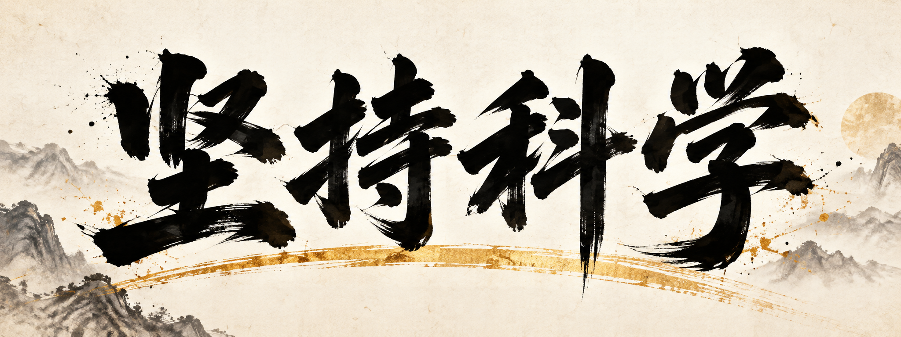

完全一样：选择一个足够长期足够正确的方向：

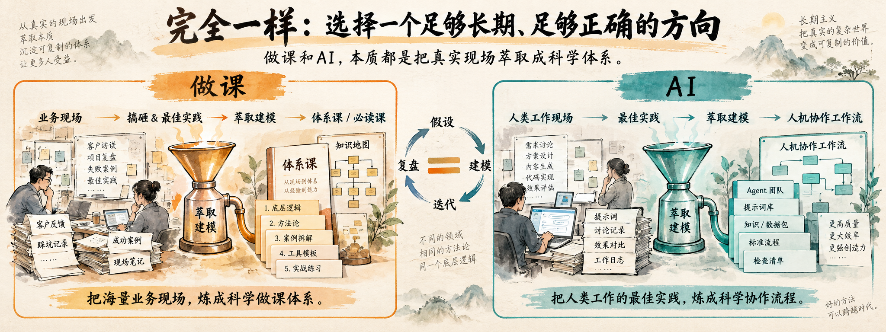

- **做课：**把海量业务现场的搞砸和最佳实践，萃取变成科学的体系和必修课。
- **AI：**把人类工作的最佳实践，萃取变成科学的人机协作最佳实践工作流。

然后建立一套基本科学框架，然后成为这个行业里最笃定的科学迭代者，用极其高频的周对周假设+复盘+建模迭代过去。

大家看到第二赛段longfeng的案例，或许觉得他作为一个应届生新人，进步很快，很羡慕，对吧？但是背后其实是整个团队过去几年养成的“**Y模型工作笃定**”：

基本目标：Partner的数量（使用率，对话完成率，留存率）

我们用双三角模型形成了一套框架：Partner背后的科学支撑。

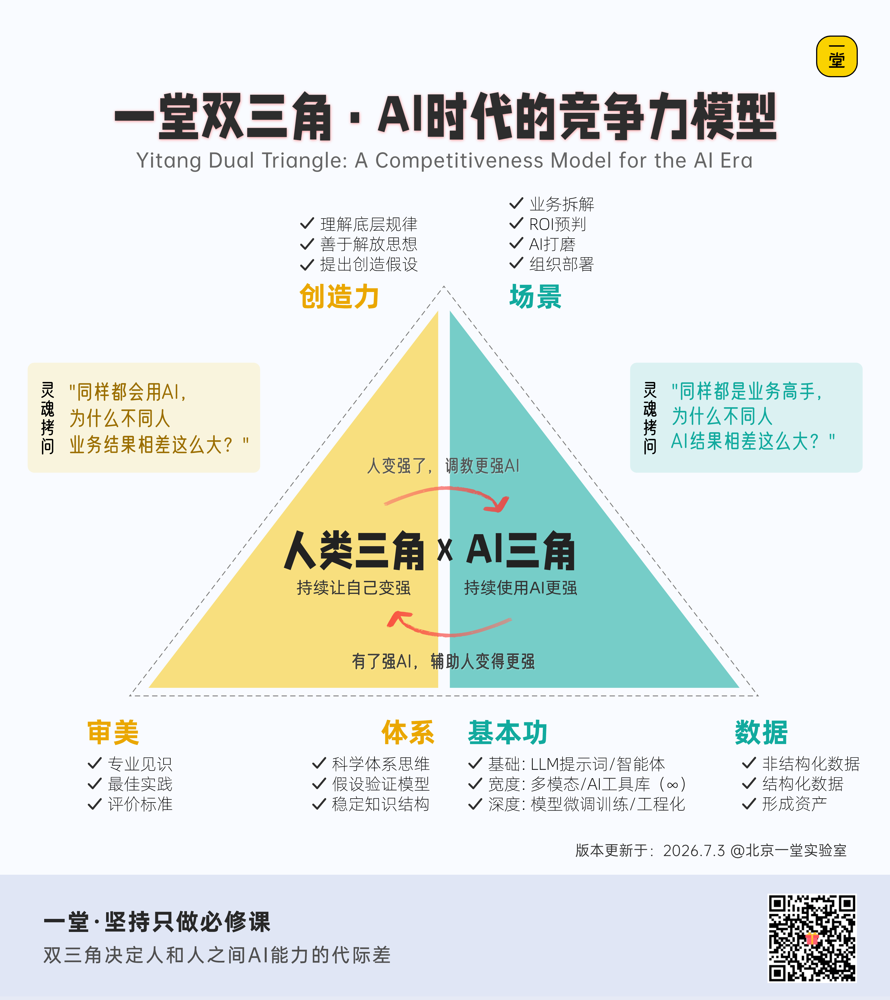

- 场景：TCPR模型和拆场景假设。
- 审美：Top专业审美构建；
- 体系：制作Partner里程碑模型。
- 基本功：Feature清单。
- 数据：积累数据包清单。
- 创造力：提创新假设+验证；

过去半年，我们围绕Partner工作体系，至少循环了20轮，提了50-70个假设，复盘了100个迭代点，建了10+个稳定的模型。

然后我们只需要保证一件事：每周提假设+复盘迭代，高频进化，形成复利，坚持的次数足够多，我们就一定会成为这个赛道最Sharp、能力最强的那个团队。

这就是我们AI的阳谋、科学道路的笃定。

而且这条道，真的100%清晰，真的100%可以通向极度美好的未来。

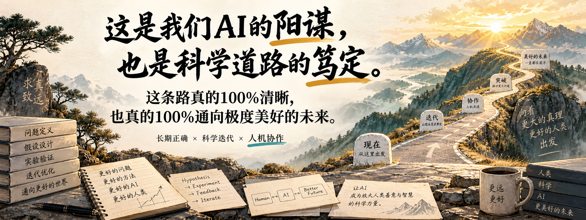

类似于做课的支线任务，我们随着能力溢出，我们准备后半年陆续启动：**2B AI落地研究体系（FDE），OPC应用创业（2C为主）**，再去用Y模型迭代出一套有竞争力的体系。

- **2B AI落地研究体系：面对企业场景，AI科学落地共同体（AI一把手/AIBP/FDE）**
- **2C OPC应用创业：规模化挖掘痛点，VibeCoding，做小应用（OPC一人公司）**

保持开放，保持阳谋，保持透明，带领上千个同学在AI领域探索AI for Businees的最佳实践，去构建一套足够底层、10年稳定的体系，然后保持足够科学和迭代速度，然后去形成碾压级别的竞争优势。

难得有机会讲这么底层和抽象的内容，最后呼吁一下吧，希望“坚持科学”也能成为更多人、更多公司的战略级别的选择，这不只是简单的一个口号和调味剂，而是决定未来能否胜利的生死选择。

好了故事接近尾声，这套思路深受教员毛选的《论持久战》启发：

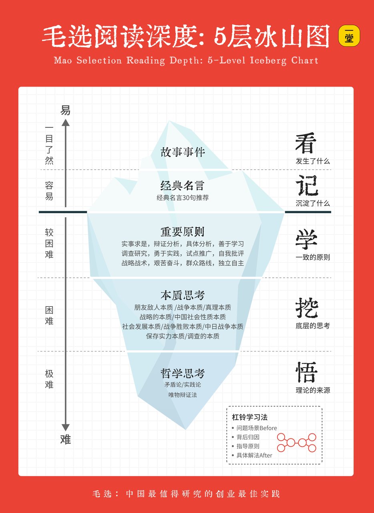

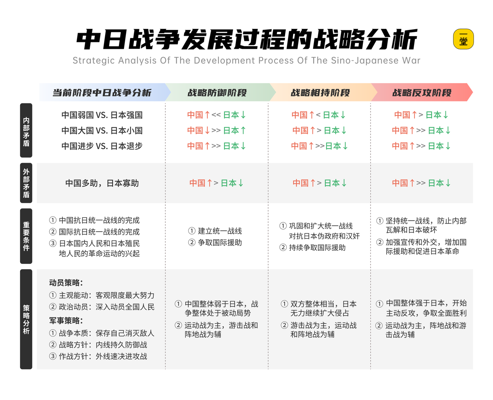

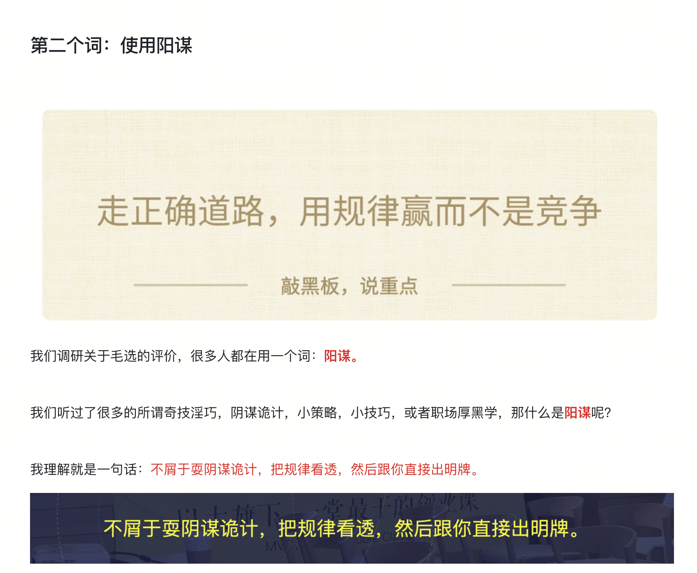

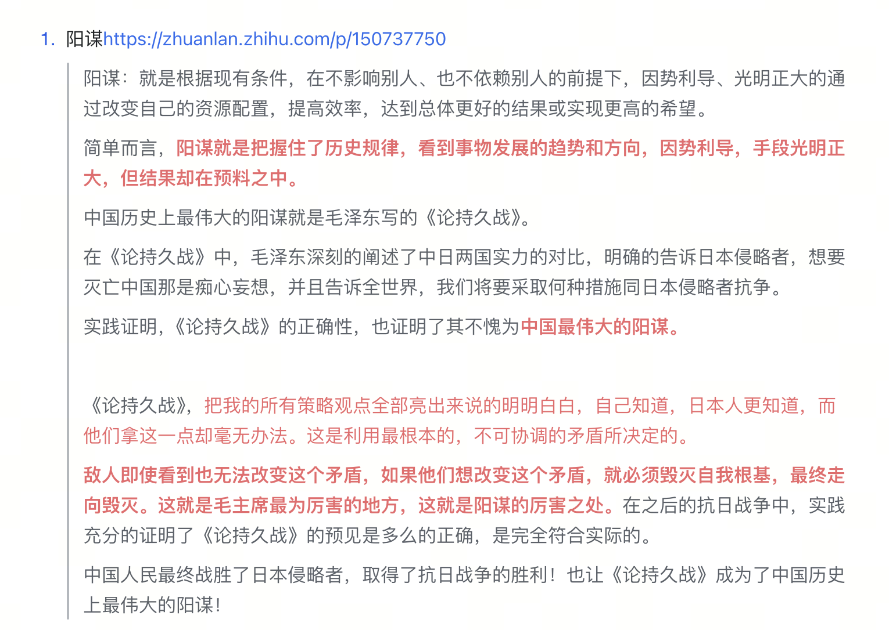

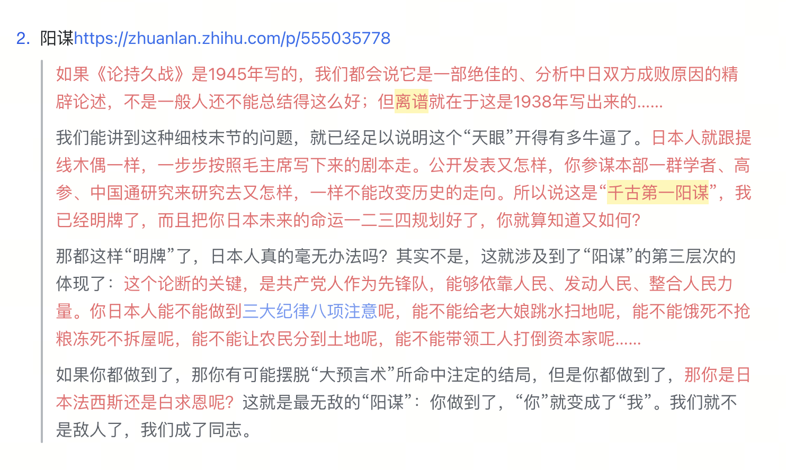

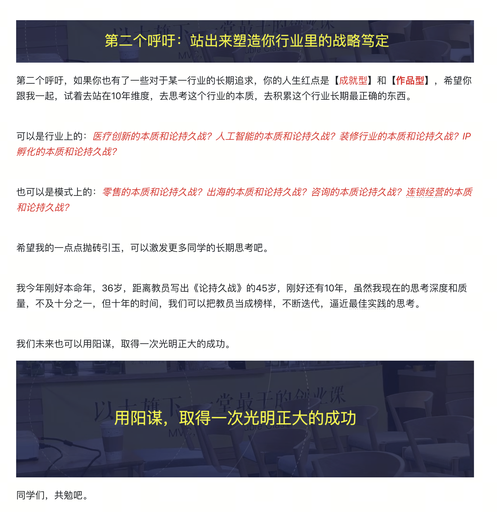

> 详见：MBA专属课《战略笃定探索营12》

各位见笑了，这就是一堂启动AI一年时间，一些阶段性的思考和战略笃定。