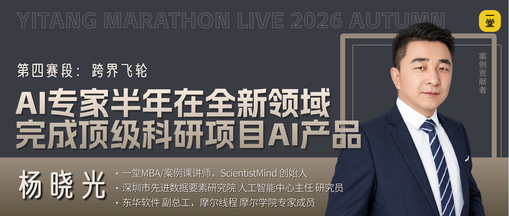
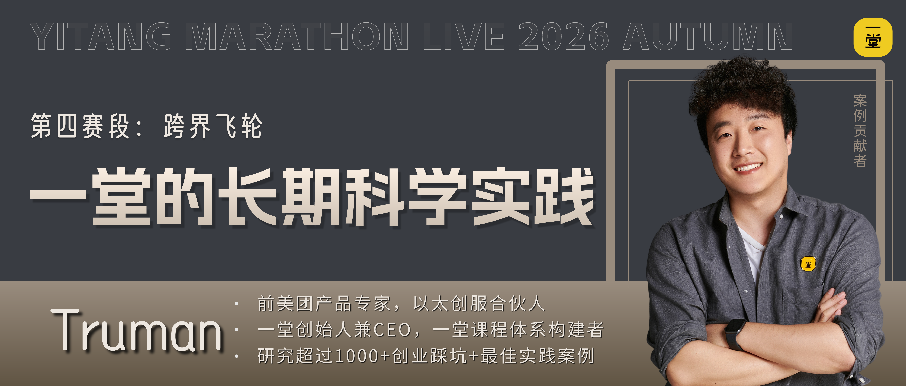
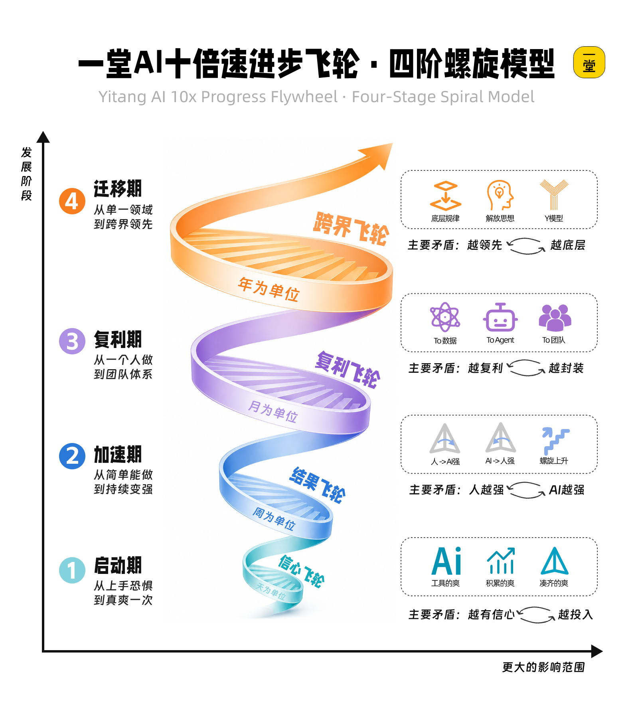
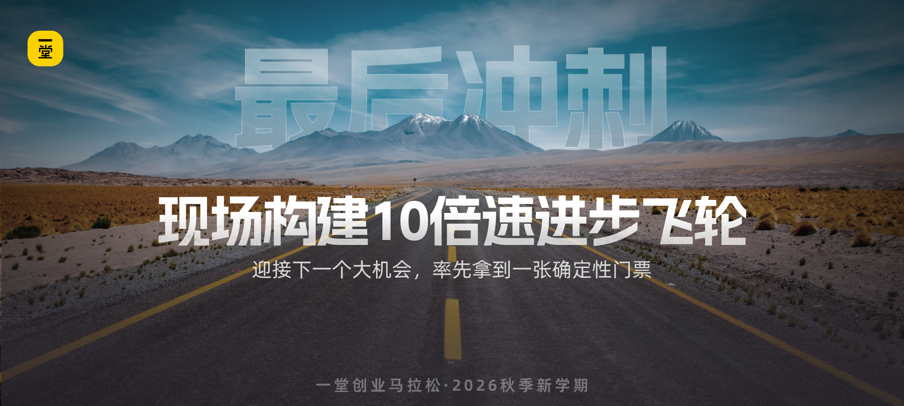

## 背后的洞察和学习

我们把这几个案例放在一起，大家能感受到什么共性？

如何提升和进步呢？核心就是我最近反复提的一个信念：**能力是可以迁移的。**

因为你在一个领域里练出来的底层框架和体系，换一个行业照样能用，而且因为 AI 的加持，迁移成本变得极低，这个飞轮才能从 "行业内优秀" 升级到 "跨行业碾压"。

**【姿势🙋♂️】**大家觉得刚才这些同学能顺利带着 AI 跨界，最最核心的策略有哪些呢？

————

核心是把这个飞轮变成一个**可迁移的底层飞轮**：

在这个阶段我们不要把自己锁死在 "我是做 XX 的"：领域锁死，你的天花板就永远是这个行业，AI 再强也只能在你的舒适区里打转。

这个阶段的核心，不是 "在自己的行业里做得更好"，而是先让自己进入到 "底层能力可迁移" 的跨界循环。

主动提炼迁移：从经验到方法，从方法到底层框架，从底层框架到跨行业适配：

- **小跨界的爽**：诶呦不错啊，我用原来的方法论 + AI 的补位，在一个不太懂的领域也能做出不错的成果。
- **框架迁移的爽：**我练出来的拆解问题的框架、做决策的逻辑、审美标准，放到另一个领域也适用，AI 快速帮我补上行业知识的短板。
- **降维打击的爽**：带着足够底层、足够稳定的框架体系开进新行业，快速拆解、快速上手、快速形成优势，形成碾压级的竞争力。

有了这个可迁移的底层框架，飞轮从行业内升级到跨行业，才有真正的代差，真正的碾压级优势。

我们再回看下这个图，就能一目了然了：

## 第四赛段冲刺

哈哈，来吧，希望大家都能带着自己练出来的底层框架和体系，勇敢地开进新领域、新行业，去形成碾压级的优势。

高手换个行业照样降维打击，这才是 AI 飞轮的终极形态～～！

来集体 Flag 时刻到了：

**【号召🙋‍♂️】**来来来，一起勇敢扣一个口令吧：**跨界迁移！**

### 下一赛段更精彩

马拉松还有最后1个小时就要结束了。

下一阶段，我会带着大家重新审视这四个阶段，并交付本次马拉松最精华的。

以及，还有一些时间，我想和大家聊聊我们在AI时代看到的那些**最底层的机会**，再跟大家聊聊一堂新一年的计划。

希望大家加油，终点就在眼前，我们冲过去！