## 冲刺赛段

啊啊哈哈哈哈，终于，终于到了本次马拉松的最后冲刺阶段了。

大家体力还能撑得住吗？坚持住，最后，我们一起冲过终点（12点）！

最后的1个小时，最后的1000米，我们一边总结，一边回顾，一边理解今天的核心内容，一边冲向终点！！

哈哈哈，这次马拉松难么？香么？说实话，这次马拉松我们顶着一个极大的压力做出来的：

**一方面是这个课题极其重要**，这是几乎2026年大家最重要的一个机会和课题，我们想呼应这个时代最大的范式变革的挑战。

**另一方面，这个课题极难**，案例都是最近一年，甚至是最近三个月的全新的案例，市场尚未稳定，规律尚未尘埃落定，总结规律是一个极大的挑战。

而且AI新老用户差异极大，但是我们都想服务，都想帮大家一起集体进步。

还好，我们把框架给大家基本搭建出来了。

下面我们快速复习一下这次马拉松的内容：

#### 终点-1000米：快速复习

前面我们一起跑过了四个阶段，讲了 10+ 个各种各样的 AI 案例，大家应该已经感受到，这背后是一条完整的成长路径：**先启动，再加速；先自己跑起来，再形成复利，然后把已经练成的能力迁移到更大的团队、更多新的领域。**

在这个成长路径上，所有人都是在持续追求进步。像前面这 10+ 位案主，就是已经率先完成蜕变，在某些场景、领域**完成了至少一轮十倍速级别的进化。**

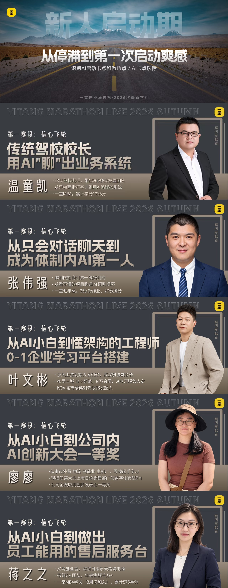

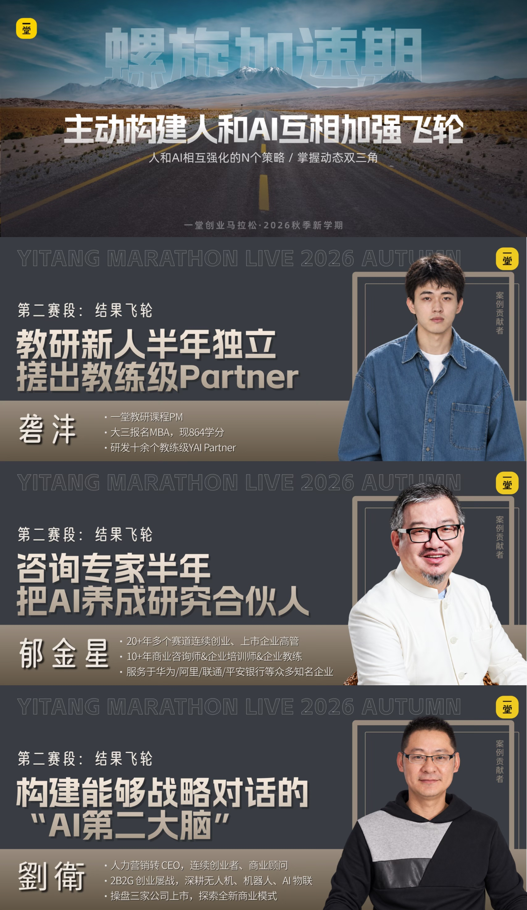

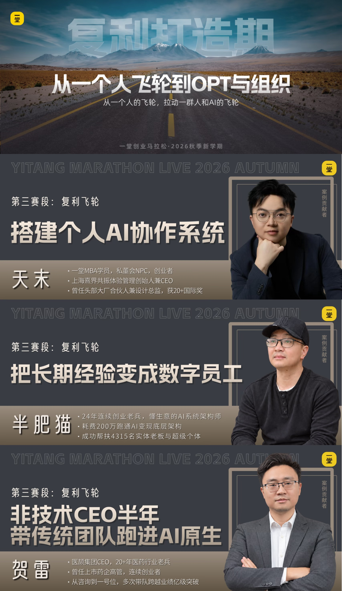

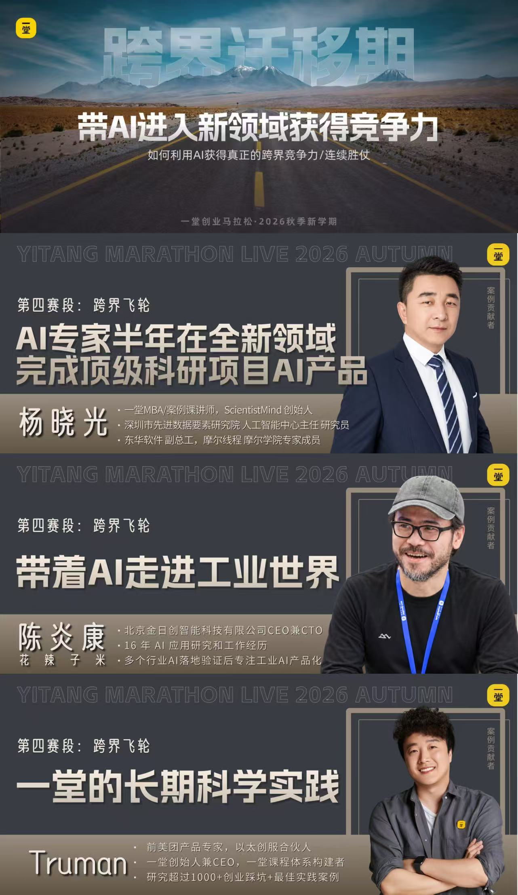

这些案例背后其实就是一套飞轮模型。到这个时候，我们也终于可以揭晓这张精心准备的大抄——

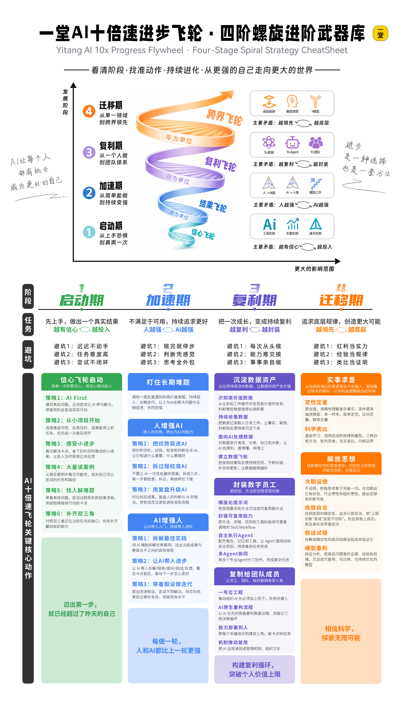

这张小抄真正有价值的地方，不是让大家记住几个阶段名称，而是帮助你在遇到问题时，先停下来判断三件事：

**——我现在在哪个阶段？为什么会卡在这里？接下来应该怎么推动？**

> - 如果还没有真正用 AI 解决过一个真实问题，就先回到**启动期**，把问题变小、但击穿，先完成一次有效闭环，体验爽感，建立信心；

> - 如果已经能完成任务，却总停留在“差不多能用”，就进入**加速期**，持续追求更好的结果，把自己的判断教给 AI，也让 AI 反过来不断带自己进步；

> - 如果很多事情自己已经完成不错，要追求更大的结果，就进入**复利期**，把经验、流程、标准和判断沉淀成可以复制给团队和 AI 员工的体系；

> - 如果已经在一个领域形成了强能力，准备进入新的行业，就进入**迁移期**，回到底层规律，通过调研、类比、假设和建模，快速构建新的理解和能力。

很多时候，我们不是不努力，可能就缺一个方法，先越过去某一个特别具体的卡点。**这张小抄，就是帮助大家找到当前最主要的矛盾，再选择一个最值得做的动作。**

当然，这张小抄不是一张完备的打卡表，也不是一套必须全部完成的 checklist。

**它整理的是四个阶段里最常见、最值得优先尝试的一些技巧和策略**。大家可以**把它当成一张放在手边的地图**：先定位，再选策略；先解决当前最主要的问题，再进入下一轮循环。

**以后面对 AI 的变化，不需要再恐慌**，也不需要急着一步跳到最后一个阶段。先看清楚自己在哪个位置，按照每个阶段的规律，**一步一步积累，飞轮自然会越转越快。**

**当你去辅导下属、客户，甚至老板时，也不要揠苗助长**。先判断对方处在哪个阶段，给他当前最需要的支持，陪他完成这一阶段的积累，再进入下一阶段。**成长有自己的周期，阶段对了，方法才会有效。**

**希望大家回到真实工作以后，它能成为你们可以反复使用的一张成长宝图**，陪大家从启动走向加速，从个人走向体系，再把已经练成的能力带到更大的世界里。

#### 终点-500米：背后的底层逻辑

其实背后，归根结底，就是一个双三角模型：

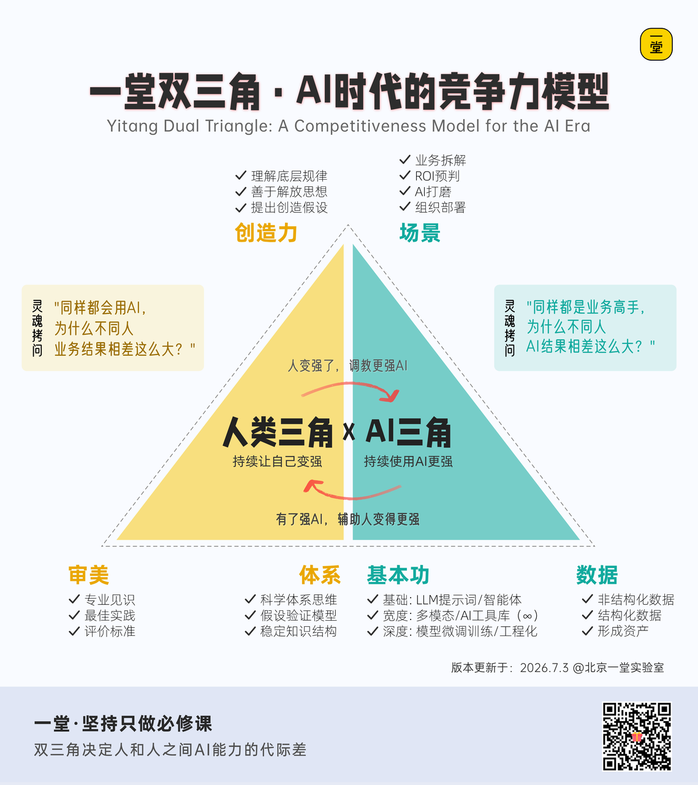

我们不该神话它，也绝不能忽视它，说到底，它就是给了我们一套基本的科学框架。

- AI不是一个单点问题，而是一个系统工程；
- 而双三角给了我们一套基本的科学因果框架。

规划时候，拆解时候，辅导时候，复盘时候，它都是一个很好的工作框架。

希望这次马拉松以后，大家再看待这个模型，能够不再静态，“**卷子能打到85分就是优秀**”，而是关注背后成绩一步步提升的成长过程。

这是一个不断补课、螺旋上升的过程，更多关注理念逐步强化的关系：

- 人强了：如何赶紧让AI学会，变成AI工作的一部分？
- AI强了：如何培养倒逼人类提升？持续提升工作的天花板？

如此循环往复，我们才能真正获得AI时代的下一波竞争力。

下面开始升华阶段hhh，留下的都是自己的人了，都是精神合伙人，我们来聊天更底层的、更走心的。

#### 终点-300米：关于悲观和乐观

大家整体觉得，对于AI是乐观还是悲观？

————

乐观往往会导致盲目，悲观往往会导致短视；

所以我一直鼓励大家要试着修炼成为一个矛盾共同体：**悲观的乐观主义者。**

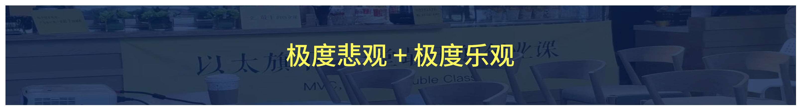

对于眼下状况，对于任何一个具体的问题，对于战术，建议保持**悲观和谨慎**。

你们过去对于AI、对于创业有过悲观么？

每一个Agent想一击即中都大概率失败；

每一个策略都大概率没用；

市场的变化，眼下的焦虑，这个接受它。

相对于很多友商的大幅变化，一堂作为一个“相对长期”的严肃教育公司，

影响相对小一点，但这一年我们也面临前所未有的压力：

- AI导致大家的耐心下滑
- AI导致大家的时间越来越碎片
- AI导致大家的注意力被吸走
- AI导致投放的数据持续下滑
- AI导致大量人开始怀疑自我成长

一些岗位会逐步消失，一些经验会逐步失效，带来一些课程会需要重构；

这是客观，不以我们的想法而转移的。

而且说实话，创业七八年了，

我怕一堂过时，怕一堂落后，怕我的成长太慢，会限制这家公司的发展。

你们看到我和一堂在AI新阶段，拿到了一点点新的成果，

但是这个背后，

这一年，我熬了无数个通宵，我也看过无数个日出，

希望尽快找到下一个AI时代的基本科学工作框架。

希望带领上万个同学，继续乘风破浪，顺利穿越这个变革周期。

因为，一堂难得立起来的“**科学的旗帜**”，不能倒啊；

“**创业管理学科**”只开了个头啊，不能中道崩殂啊；

我曾经听过一个金句，很心灵鸡汤，但的确有效：

当你面对创业or生活突然特别焦虑痛苦的时候，

你不要总是焦虑未来；

你回到5-10年前，现在的进展大概率是你当时都不敢想的美好样子了。

是啊，太难得把大家凑齐了，我在2018年刚开始创业做一堂

一个人带着3个班主任1个销售，开始做一堂的课程探索

我打死也不敢想象，就七八年后，

- 我有4个能把后背交出去，从不担心跳船的合伙人；
- 我有20几个业务负责人+研究员，帮我分管各个模块；
- 我有400+线上线下志愿者和助教，在几乎无偿支持一堂发展；
- 我们总结了一套科学框架，第二周就会出现在成百上千公司的实践现场。
- 我还有上万个活跃信任会员，这么难而枯燥的课程，能坚持听我讲一整天。
- ......

这些都是帮我抗住了巨大焦虑，一路笃定，走到今天的原因。

悲观讲完了，我讲讲硬币的另一面：

极度悲观背后，是极度乐观：我们对于未来，对于AI，对于最终的结果，保持极其乐观的态度。

我不知道大家对于3-5年后的新世界有多少期待，我猜因为AI，我们可能会经历我们祖辈们都没见过的一次生产力大爆发：**AI会带来一个全新的环境。**

而幸运的是，我们作为各个公司的一号位，业务负责人，我们不只是被动旁观者，我们是参与者，甚至是积极改变者：**我们有机会参与真正亲手创造一些全新的东西。**

这个可太酷了。

大的机会，都来自于大的变化；

这个变化实在是太大了。

上个月磨课会，我的合伙人智钊说了一句话：Truman，你一定要把这个理念传出去，让大家珍惜这两年，这可能是我们这代人，最后的一波大的机会了。

在面前10年的市场稳态，有些机会根本不存在。

而我们预判，未来6-18个月，这些机会正在向所有人打开。

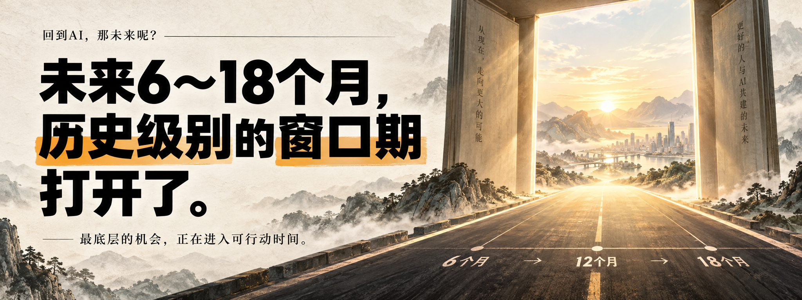

我们突然进入一种“**吾辈如神**”的工作状态：

那些最好的公司，最好的学校，最好的组织，也都遭遇同行的问题。

他们的历史包袱，刚好对撞上我们“**带上AI的无所不能**”；

我过去一年，我听过很多类似的声音：

我这个比腾讯的workbuddy更好用，

过去10年，我们何曾有机会去PK腾讯的战略产品？

我想做一个xxx组织，创建一个新的团队范式；

过去10年，我们何曾有机会重构一个组织分工方式？

我想带着AI，业余时间做一个“麻将训练场”的游戏吧；

过去10年，我们何曾想过这种“想做就能做”的生产力？

包括我也是，我曾和周鸿祎平等对话，交流碰撞对于AI和产品的看法；

过去10年，互联网时代的五层代差，在AI时代突然就被抹平了。

甚至不止两三个同学，认真鼓励我说：你咋老盯着国内的同行，

去看藤校，去看全球最好的创新学校，你应该和他们一起探索，

而不是老把注意力放在国内的培训教育和知识付费同行。

一年前我甚至不敢想象，我一句话指令，AI就自动做出了这套图啊hhh：

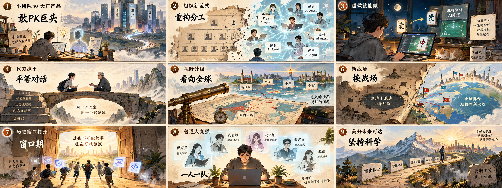

所以，短期极度悲观，都是因为对于未来过于乐观了啊。

所以希望今天的马拉松给大家多一些点燃和触动，去挑战过去没学过的东西，一定要去试试VibeCoding，一定要去试试泛产品设计，一定要去搭建知识系统，一定要去建设属于你的OPT团队。

总之一句话：**一整套飞轮逻辑我都交给你了，十倍速得你自己做出来。**

#### 终点-100米：一往无前

最后我想讲，希望大家多给一堂一些信心，我的人生红点，一堂的使命愿景从未丝毫动摇，我们一直想成为市场上的那个最坚定“**推动科学创业**”的公司。

这套体系不会推翻，会一直进化，这是我们最最重要的工作基础：

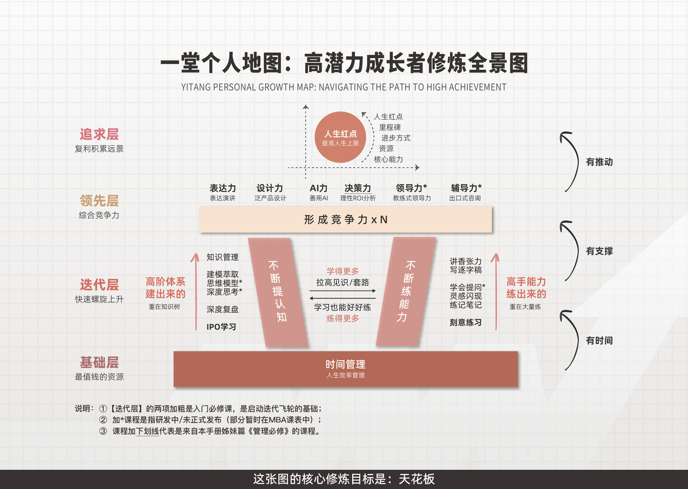

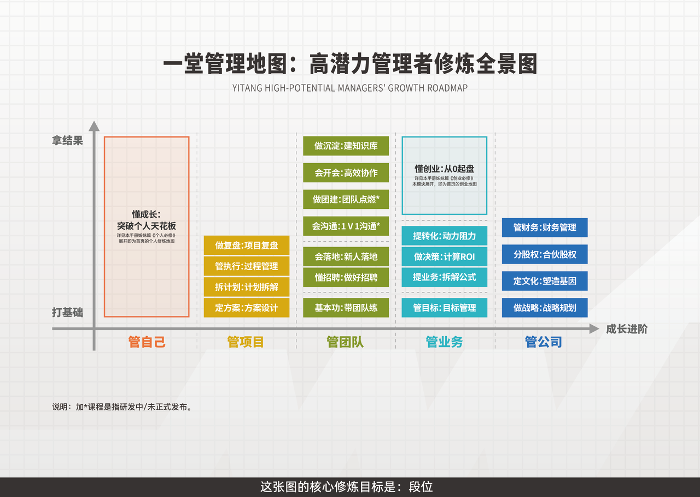

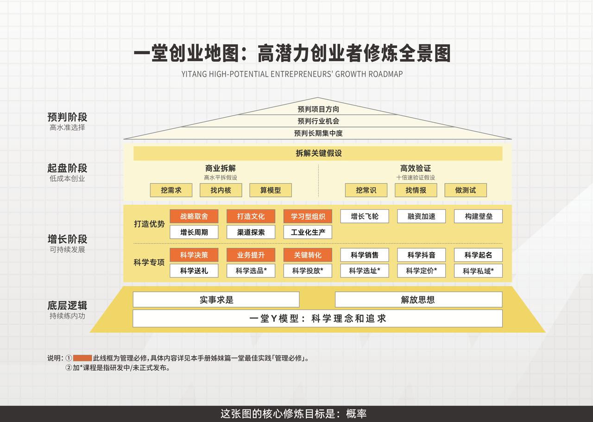

这每一节课，乘以AI，都会释放巨大的生产力。

同时未来一年，基于MUSE模型，我们也会逐步铺开全面研究：

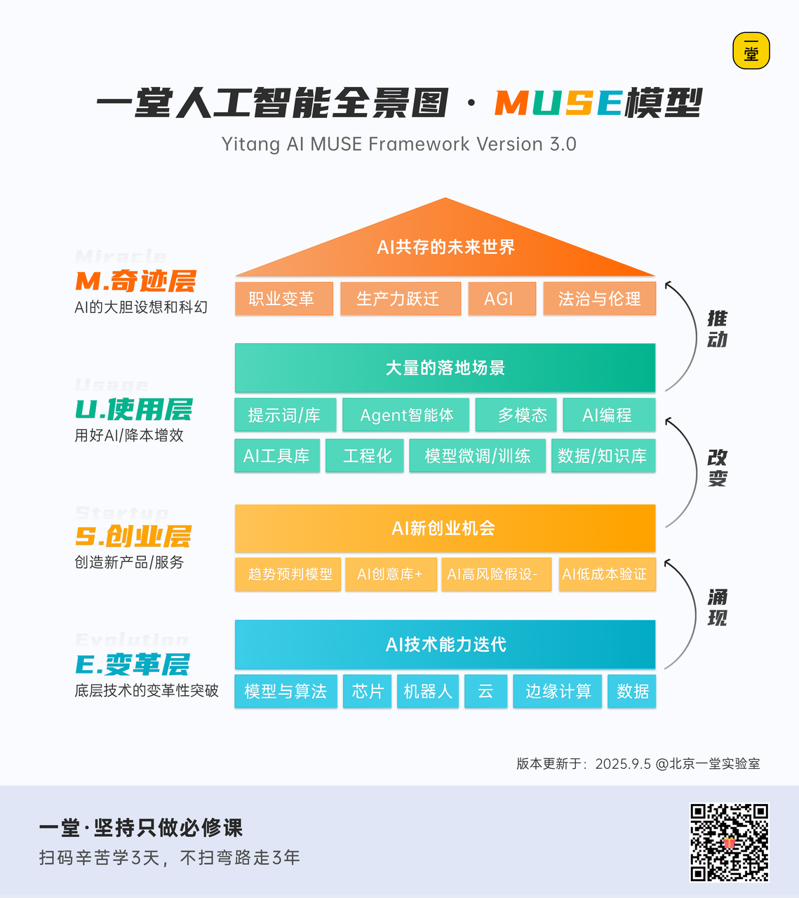

过去一年，我曾经无数次涌现出一个画面意向：我们是一群在镇子上生活了几十年的人，有人在开餐馆，有人在当司机，有人在摆摊，有人在表演杂耍，突然基础设施成熟了，大航海时代开启了，我们有机会出去淘金、看看更大的世界了。

我们是愿意一辈子呆在镇子上**一成不变**，还是愿意**出海试试**，看看更大的世界呢？

希望所有同学，躬身入局，去构建自己的飞轮，去抓紧一切时间推动，尽快滚起来。

我想送给大家刚刚新写的金句：

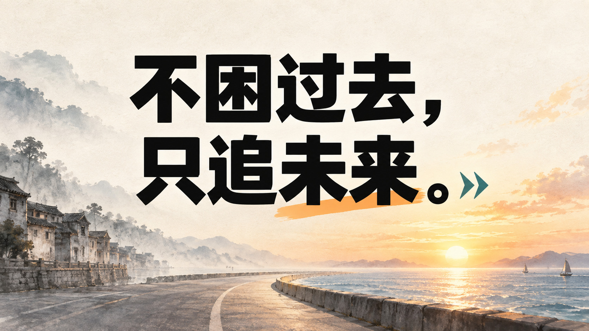

希望所有想提升AI系统能力的同学，一定去报名**AI OPT大航海**，我们数千个人一起出海。

希望所有想提升VibeCodingx泛产品的同学，报名城市即将举办的**城市黑客松**，自己下场去试错；

希望所有渴望2B场景落地的同学，勇敢报名“**AI高手营**”，**成本不高，上限极高**，不要轻易错过。

希望所有渴望建设学科的同学，以各种全职、兼职、志愿者的方式**加入我们**，成为一堂的一部分。

追浪花固然很轻松快乐，造大船才是我们的使命和必经之路啊。

#### 终点-10米：马拉松终点打卡

哈哈哈要到终点了，真开心，我们来留作业吧~