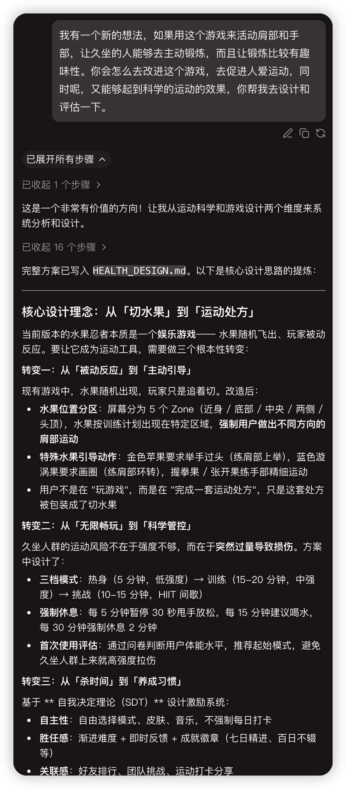
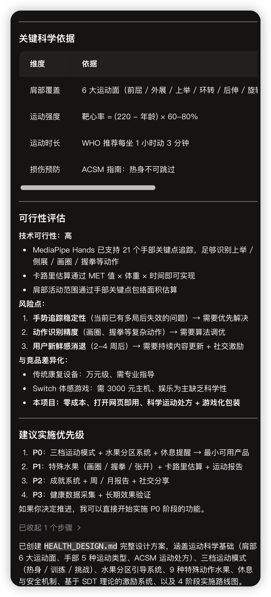
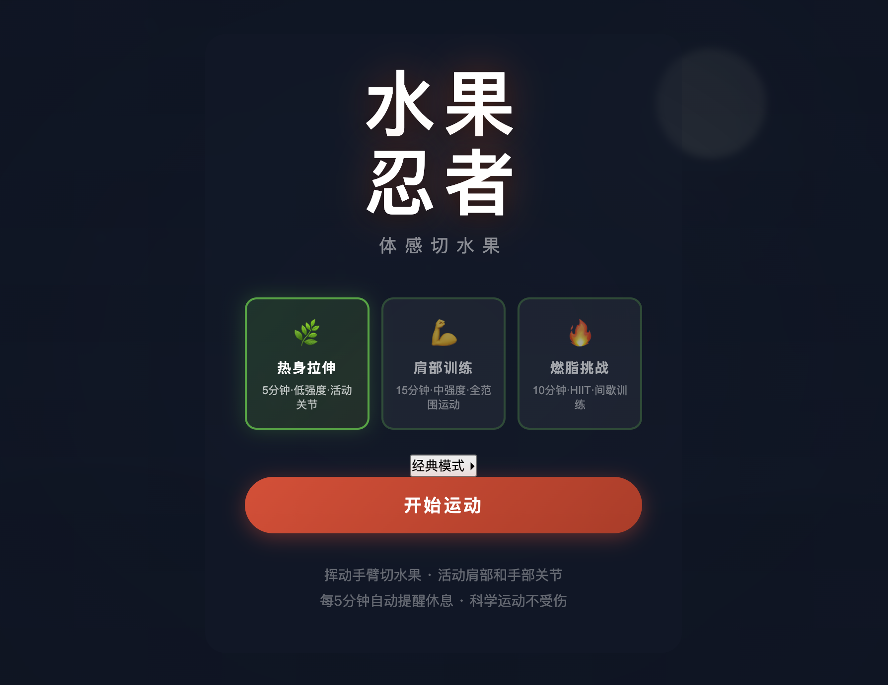
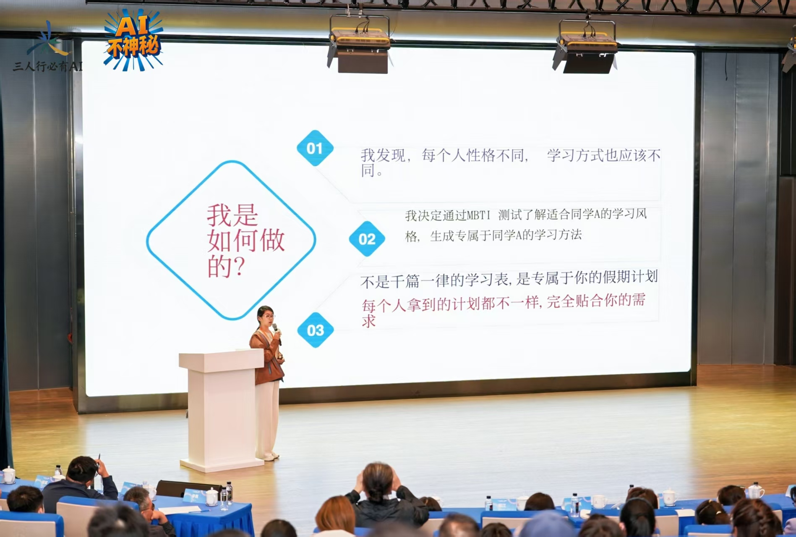

### 六、第四轮：场景——这个游戏该在哪发光

刚才为了拿到测试数据，我一共玩了三轮，每轮玩了十多分钟。玩完以后汗流浃背的，感觉我的肩膀和手臂，从来没有这么运动过。

这个时候我突然有了一个新想法：我可以做一个锻炼手臂肩颈的体感游戏啊。

怎么才能让肩膀得到科学的锻炼？这个时候，我又要先请教 AI 了。让它给我讲一讲，先学习一些成熟的理论，**建立审美**，在这些理论的基础上，我们再去做进一步的改进和创新。

牛顿说过一句话：如果说我看得更远，那是因为我站在巨人的肩膀上。过去科学家是站在前人的肩膀上往上够。现在，我们可以站在 AI 的肩膀上往上面走。

**我感觉有了新的想法，AI也“来劲”了......**

【AI】自己去研究了运动科学：查 ACSM 运动处方指南，把肩部的六个运动面拆出来。然后设计了健康运动模式：

> - 三档强度：热身拉伸、肩部训练、燃脂挑战。

> - 屏幕六个区域，对应六个肩部运动面，水果飞到哪，你就得挥到哪。

> - 九种特殊水果引导动作：金色苹果要你举手过头，漩涡果要你画圈。

> - 外加休息提醒、卡路里估算、运动报告。

这一轮改进完，就变成现在这个样子：

大家看，这已经不只是个游戏了。

我把 AI 做的这份运动科学研究学了一遍，慢慢建立起了对「健康运动」的审美——什么叫合理的强度梯度，什么叫有效的动作引导，我心里有数了。你看，**AI 可以研究一切，但「研究什么」，是人的判断。**

很多既有产品或者模式，在老的场景下可能看起来平淡无奇，但借助AI嫁接到新的场景下，可能就会闪闪发光。

**很多创新往往来自于我们对于老技术、老产品在新场景下的嫁接**。

或者，我发现了某个场景下的老问题，也可以借助AI去发掘解决问题的方法和技术，老问题因为有了AI，有了新的可能性。

比方说，上次我教过一个小学四年级的学生，她对心理学特别痴迷，而且很专业。后来在我们的黑客松比赛上，他就用MBTI的框架，结合AI做了一个针对不同性格的学生的寒假学习系统。

过去让一个小学四年级的学生开发软件不现实，现在借助AI，我们可以很轻松的实现。

让我们把话题回到我们的小游戏，场景定了，一个更大胆的问题冒出来了：**我们的目标，已经从「做一个好玩的切水果游戏」，变成了「做一个好玩的游戏化锻炼工具」。**

**【🙋互动】**那在这个新的场景下，我们有没有一些更有意思的玩法呢？你们有什么意见或者建议，可以在聊天区随时打给我。