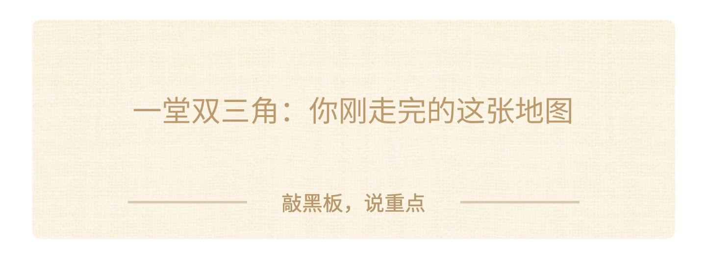
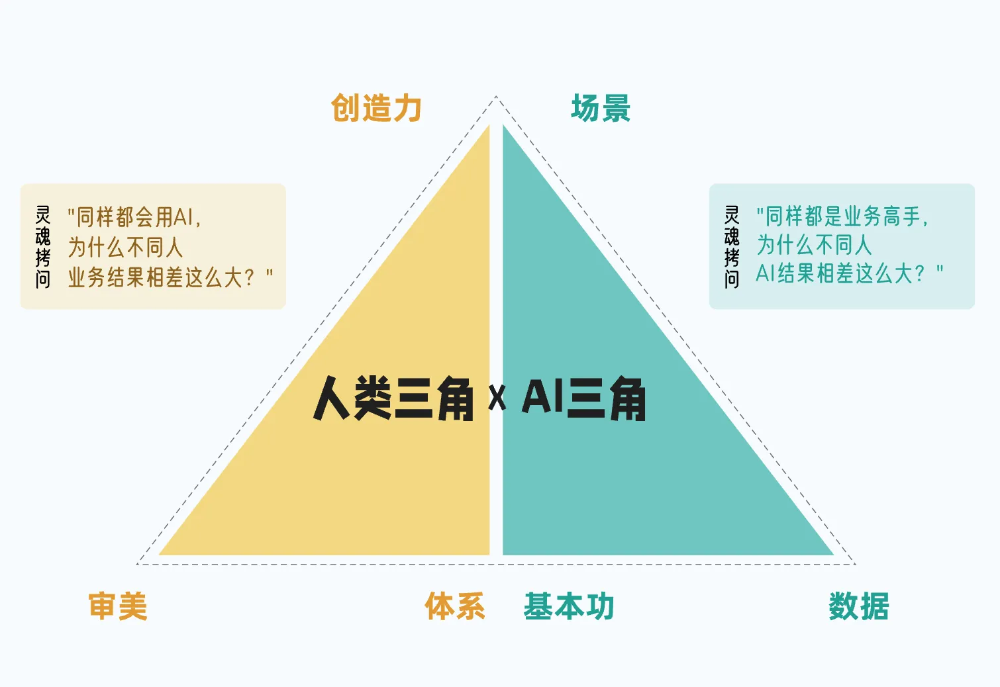
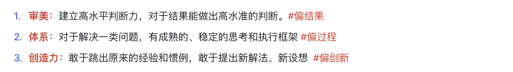
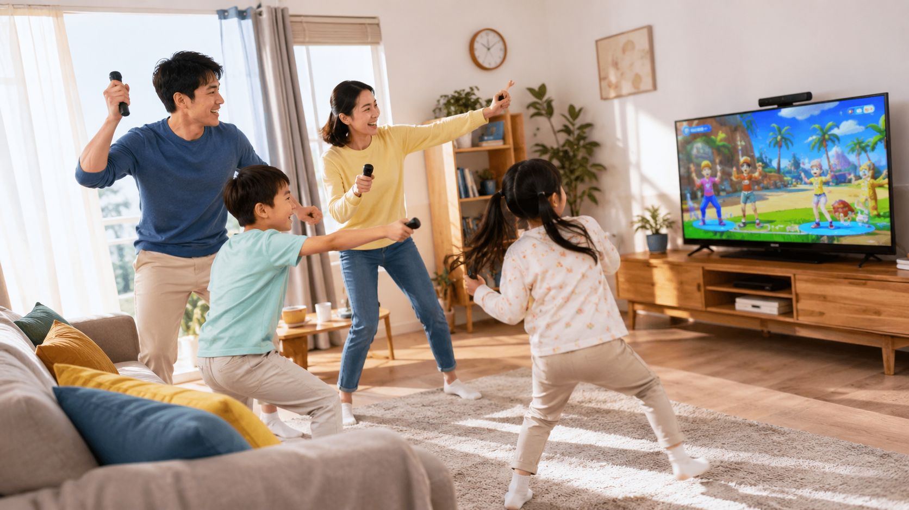
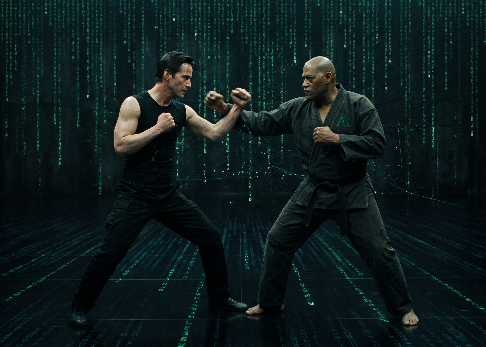
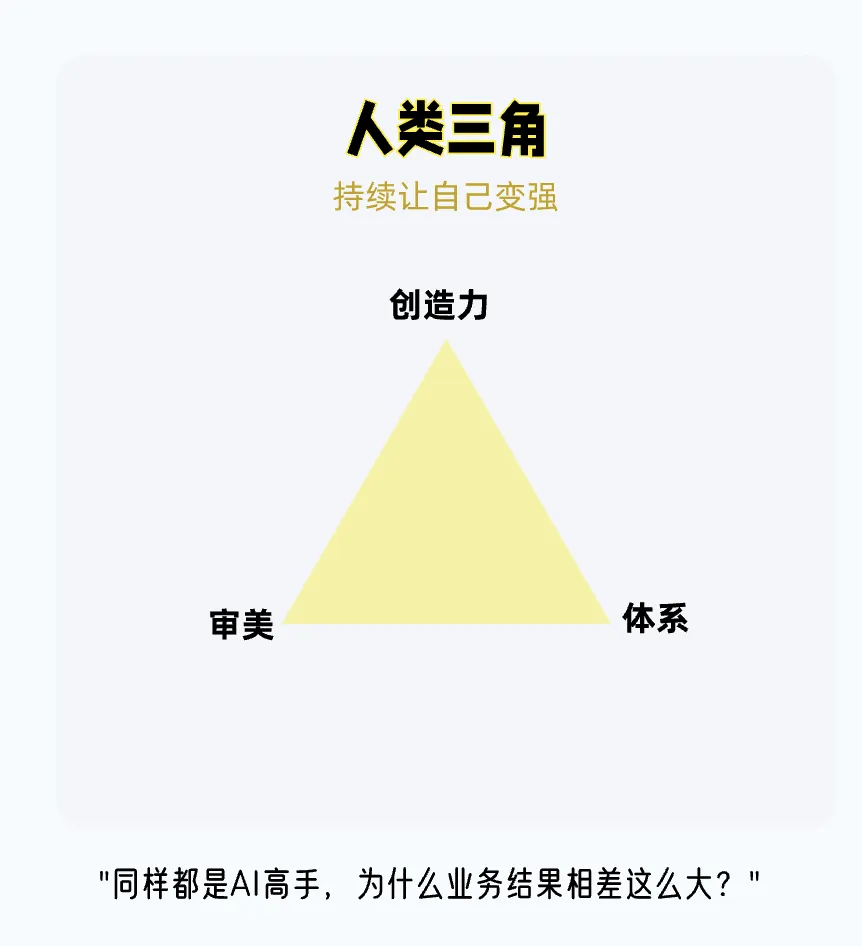
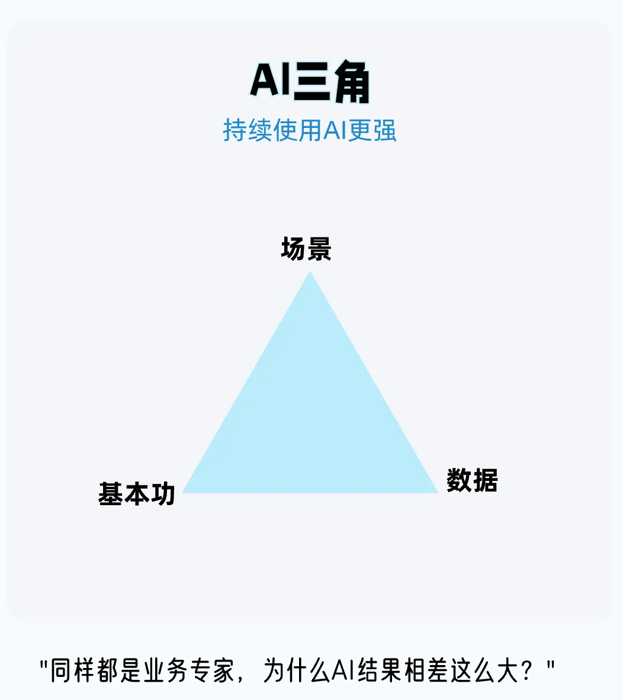

### 八、一堂双三角：你刚走完的这张地图

这套模型，叫双三角。两个三角，六个格子。它是一堂的双三角模型，今天我是拿做游戏这个例子，把它运用了一遍，好给大家讲透。

你刚才已经亲手走完了一遍，我带你认一遍名字。

#### 人类三角

人类三角讲的是，AI时代，我们需要锻炼提升自己的哪些，无法被AI取代的人类能力。

那刚才在做这个小游戏的时候，我们做了什么？

首先我们让AI告诉我了游戏设计领域的成熟理论，还有最佳实践，就是成熟的类似游戏，建立了一套评估标准，这个就是**审美**，审美是告诉我们，什么是好，如何做到好。

然后，我们通过拆分维度打分的方法，让AI实现了自我迭代，自我改进，这个人就是**体系**。这样我们就不用靠我们自己个人的主观意见去改进和评估产品，它自己改自己，爽不爽？

我们在企业里做管理也是一样，领导并不需要去关心员工的每一个动作，领导只需要制定业务标准，然后团队成员，自己想办法去达成这个标准。我们使用AI也一样，我们定标准，AI去想办法，做执行。

然后是**创造力**的部分。最后那个拍蚊子的创意，是根据肩颈运动的场景，我想出来的点子。这种点子，靠AI是不大行的，因为**AI不知道我们的场景，需要我们自己去分析场景，提出假设，然后验证假设。**

#### AI 三角

AI三角，说的是我们怎么用好AI，把AI的潜力，充分发挥出来。

**数据是联结 AI 和现实世界的桥梁。**它还能转成一个圈：现实产生数据，AI 据此分析、行动，新结果又变成新数据，帮 AI 继续调整。

比如刚才我们水果忍者的小游戏的例子，有了数据之后，AI才能真正分析出来，这个游戏不好玩、不顺畅的点在哪里。

再比方说，个人化的做题的数据，能帮 AI 发现你的提效空间，它安排针对性练习，再按练习结果调整。没有数据，AI 只能给泛泛的建议；有了数据和这个圈，AI 才能真正帮你解决问题，越帮越准。

**场景是我们利用AI实现价值的落地点。**就像刚才我的切水果的小游戏。水果忍者本身是很成熟的创意，如果我只是做一个切水果的小游戏，我很难超过现有的成熟产品。

但是如果我把这个玩法落地到肩颈运动这么一个场景，**就产生了一个新的创造它独特价值的点**。

游戏公司任天堂也是一样。进入互联网时代，任天堂在高性能游戏硬件研发上相对于索尼和微软落后了。但是，它通过Wii和Switch一系列的轻量级游戏机。创造了家庭运动场景，又火了一把。

**基本功，在这里指的是我们对AI的理解，使用AI的能力，**譬如提示词能力，使用Agent、使用AI进行软件研发的能力，规划知识库的能力等等。

从发展趋势上看，虽然AI越来越像人，越来越容易使用，但对AI原理、边界和局限性的充分了解，有助于我们举一反三、释放创造性、充分发挥AI潜力。

#### 飞轮

通过上面的案例，有没有发现，在我们和AI合作的过程中，我们锻炼了审美、搭建了系统、激发了创新，同时通过积累和整合数据、发掘应用场景、提升我们运用AI的能力，我们也让我们手里的AI变得更强。

**这就是AI双三角里面的飞轮：人变强了，调教出更强的 AI；更强的 AI，又帮人变得更强。**一圈一圈，越转越快。

就像黑客帝国里，Neo和他的教练不断对抗，相互都修炼得很厉害。

多说一句。双三角不是一套规矩，也不是什么必须照做的规范。它更像是给你启发、给你思路：在用 AI 的过程中，帮你打开新的思路、新的用法。让你自己变得更强，同时，你也训练出了更强的 AI，把 AI 的潜力拉满。

**你觉得你最擅长哪一项呢？**

> - 1 审美

> - 2 体系

> - 3 创造力

> - 4 基本功

> - 5 数据

> - 6 场景

把对应的数字打在聊天区。

那这套方法论可以用在哪些地方？几乎可以用在任何你需要和AI写作完成一件事情的时候。**用好双三角模型，你就像穿上了AI外骨骼，变得无比强大。**

你想不想用最快的速度，把你的作文水平训练到非常优秀？用双三角的模型就可以。你甚至还可以用这个双三角模型，利用AI开发一个作文训练系统，给你同学用。

明天咱们一堂和探月学校一起搞的青少年的黑客松就开幕了。我不知道在座的小伙伴们有没有明天的参赛选手。如果有的话，你可以仔细思考一下，怎么把这个模型用在你明天的项目里。