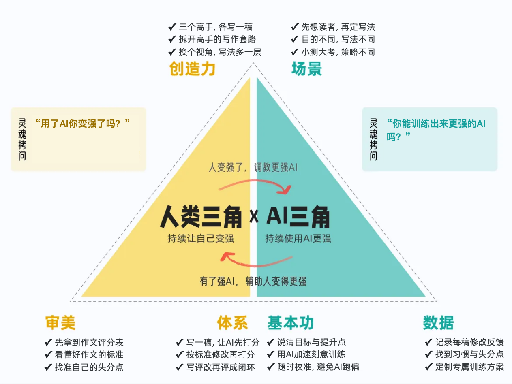
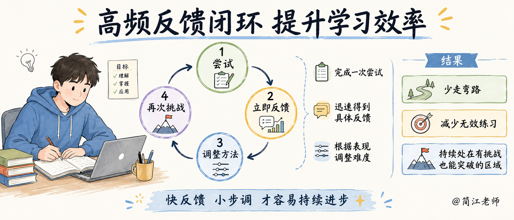
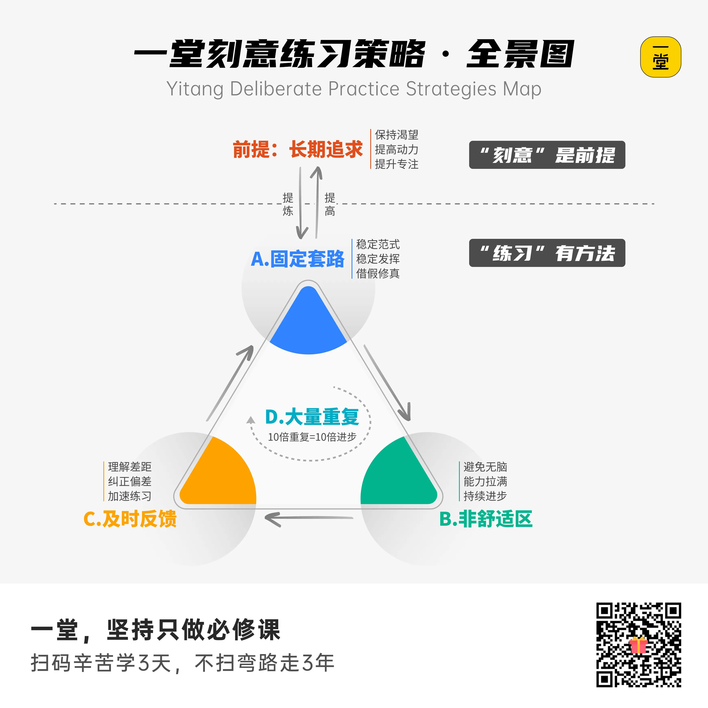

### 九、把双三角套进作文

先看作文。六个格子，一个一个往里放。

**审美：**什么作文是“好作文”呢？在学校场景里，这个事情老师说了算，当然，标准也不是老师一个人定的，中学作文应该怎么写，有通行的评分标准。

你让 AI 派个角色：你是批了十年作文的阅卷老师，把评分表交出来。以前作文本发下来，只有一个总分加一个「阅」字，不知道扣在哪。现在，那张评分表你主动拿到了手——你知道什么是好作文了。

**体系**：**你自己写一稿，发给 AI 打分，按标准改，再打分。**写、评、改、再评，一圈一圈转。每一圈，分数都在往上走。这就是反馈闭环。

**创造力**：**你让 AI 变出三个高手——讲故事的、说理的、写细节的，各写一篇。**你来拆他们的套路：他怎么开头？感情藏在哪个动作里？视角一换，你的写法就多了一层。

**数据**：比方说，你可以用Workbuddy结合IMA做一个专属你自己的作文修改数据库，你磨过的每一稿、AI 帮你总结。

举个例子：你发现自己老是「第二段忘了举具体例子」，记进清单，下次写之前先看一眼，就避开了这个老毛病。**数据积累久了。它就能帮助你发现自己的优点，找到自己的弱点，加强自己的得分项，定制专属于你自己的作文训练产品。**

这种方法能够延伸到你任何学科的学习和攻关。这就是利用AI五倍速学习的基本原理。

**基本功**：我们不仅知道应该怎么构造提示词来帮我们评估作文水平，而且我们也会用扣子或者Workbuddy之类的智能体。来写训练程序、构建自己的作文知识库，帮我们完成训练任务。这个就是我们使用AI的基本功。

**场景**：写给阅卷老师的作文，和投给校刊的文章，平时的小测验和大考。写法都会不一样。先想清楚写给谁，目的一变，写法全变。

你看，同样是写一篇作文，套上双三角，它就不再是一次性的交差，而是一套能越转越强的训练。

**有了双三角模型，可以让我们在运用AI帮助我们的时候，有更完备的思考角度，更多的启发。**

在这里多说两句，我们传统的学习方式，局限于客观条件，确实效率比较低。我们拿修改作文为例。你写了一篇作文，拿去给老师批改，第二天老师才有反馈。等到老师反馈回来，你当时写这个作文的想法思路可能已经忘得差不多了，还要从头来回忆，猜测老师的意思。

而且这个反馈有时候还不是一对一的。老师在卷子上给你的反馈会非常的简单，只会在大课上把共性的问题讲一讲，通常不会专门针对你自己的情况去做长篇大论的反馈。

但是有了AI的辅助，你写一篇作文，立刻就能够得到反馈和回应，立刻修改，修改完再打分，再修改。我们可以把这个反馈路径做的非常的短，你可以在很短的时间内去提升自己的作文水平，这样做的效率会比传统方式高很多倍。

**咱们一堂还有一节“刻意练习”的课程，专门讲的就是如何快速通过快反馈循环，成为高手。**这里暂时就不做过多展开了。

可以用AI来提升自己的作文能力，那能不能提升数学能力呢？我们一样可以用这个双三角模型来套。