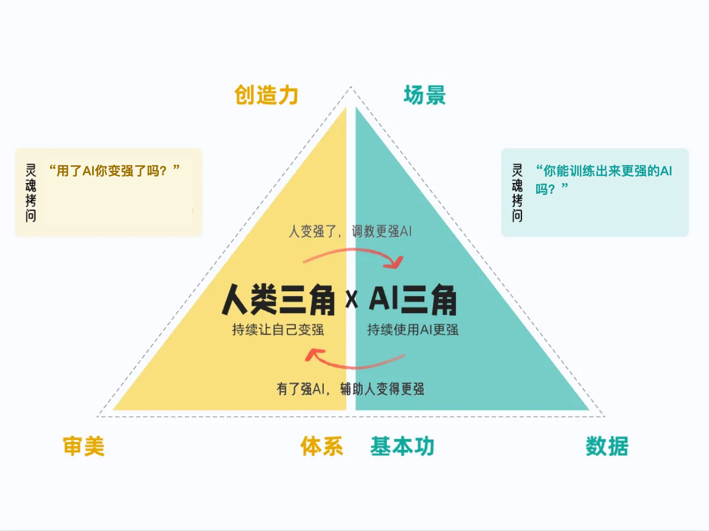
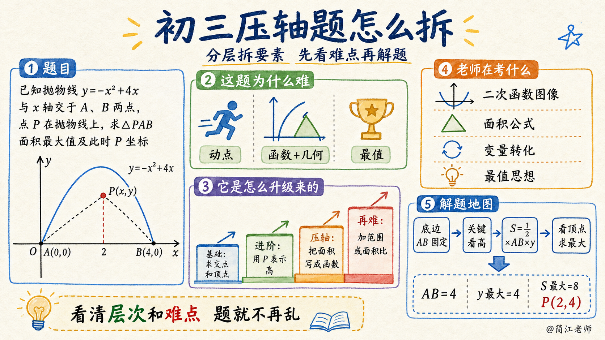
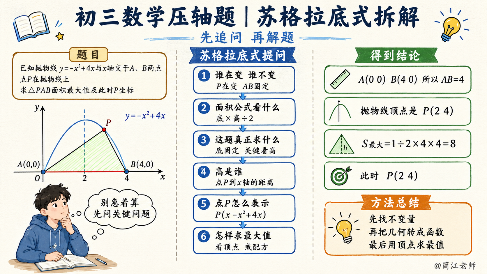
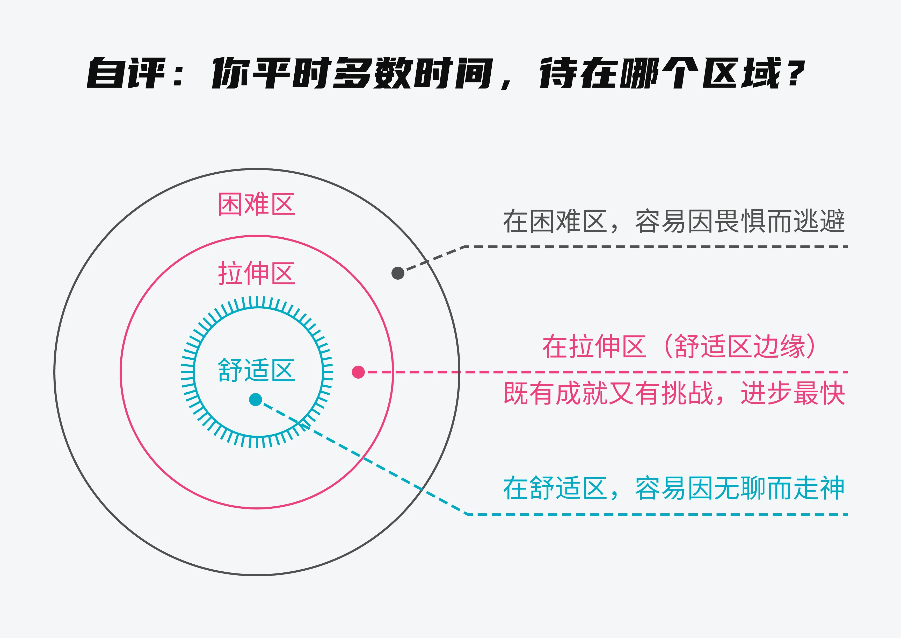
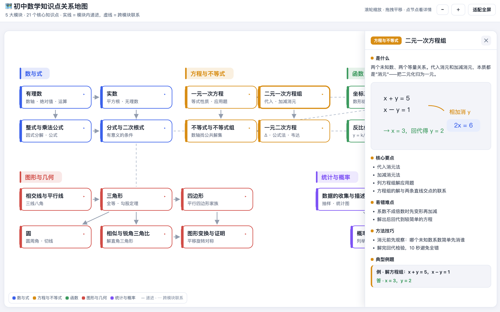
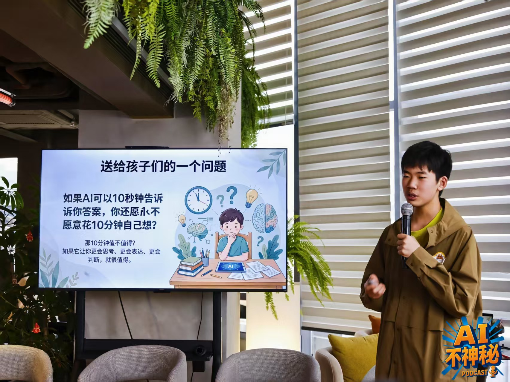
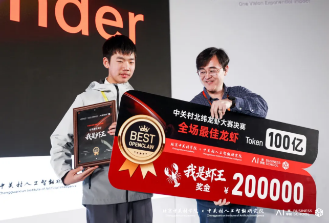
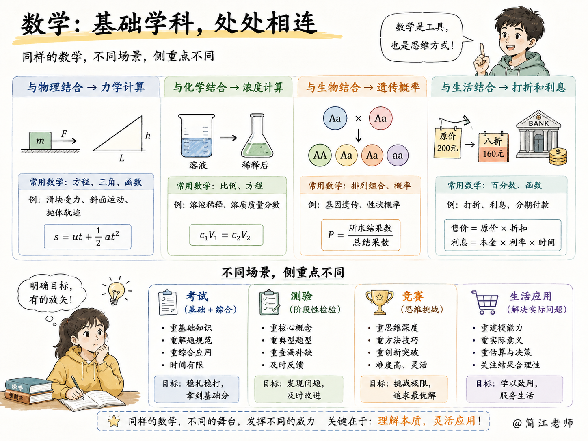
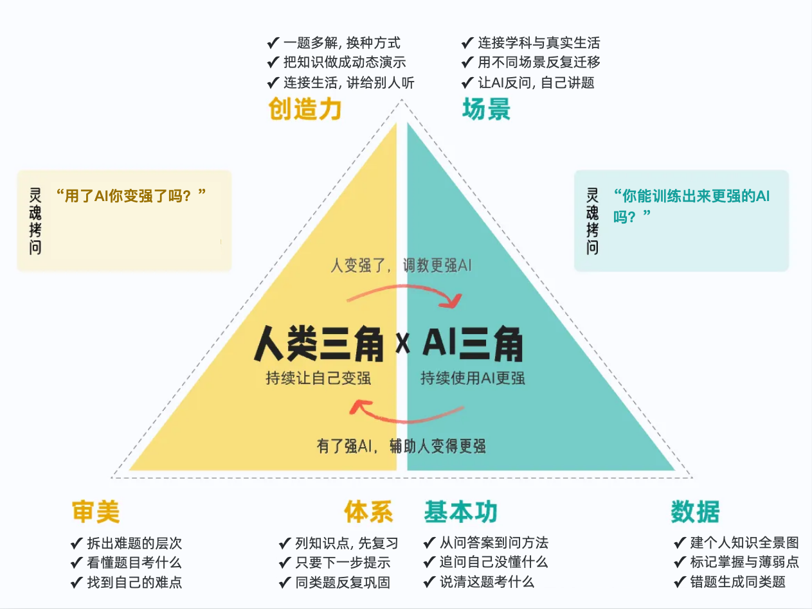

### 十、把双三角套进数学

**【🙋互动】**再看数学。先投个票：碰到难题，你一般问 AI 要什么？

> - A 直接要答案

> - B 要解题步骤。

把字母打在聊天区。

如果你有别的，更好的方案，也可以打在聊天区......让我看看听众里有没有用AI的高手。

选A的，AI 解完，你看一遍，哦懂了，抄上去。下次考试换个数字，又不会了。因为你只是在看别人解题，没有自己解。用功一点的学生会选B，但看会了，也很容易忘，还有没有更好的办法？

现在，六个格子往上套。你会怎么套？

**审美**：你可能要问，一道数学题，有什么好审美的？

**审美的一个关键要素，就是分出等级，分出层次，拆出要素。**

> - 这套题难，为什么难？难点在哪里？

> - 它是从怎样一道更容易的题升级上来的？下一步再难一点，又会去哪里？

> - 老师要考这道题，究竟想要考察什么？这道题用到了多少知识点？究竟哪个知识点对自己是难点？

把这些问题吃透，搞明白，就拿到了一步步把难题搞定的地图，做到心里有数，遇题不慌。

**体系**：你让 AI 别直接给答案，先列出这道题涉及哪几个知识点，你去复习；再让它只提示第一步，你自己推；推完了，出三道类似题巩固。卡住了，再要提示，再练。复习、推导、巩固、追问，这是个闭环。

一道题弄懂了，你还可以让AI给你出几道类似的题来巩固，直到同类型的题目没法难到你为止，这就好像游戏里面的通关。

科学研究已经证实，稍微制造一点困难，制造一点阻力，让自己进入到深度思考状态的时候，学习效率最高。

**创造力**：做完一道题，你可以再问一句：有没有别的方式？

比如，让 AI 把它做成动态的、可视化的东西——二次函数的图像，参数一变，抛物线怎么动，做成动画，一眼就看明白了。物理的凸透镜成像，光路怎么走，做个动态演示，印象深得很。

📹 iShot_2026-08-05_18.24.33.mp4

或者，把知识点跟现实生活结合起来：相似三角形能测旗杆的高度，百分比能算打折。你甚至可以让 AI 生成一个讲解小视频，自己讲给别人听。

**数据**：**数据可不只是一个错题本。**每个学科、每个学期，都有一张知识点的全景图。

你可以给自己建一个学习知识库，把试卷、错题、笔记放进去，让 AI 帮你标出每个知识点掌握到什么程度，生成一份薄弱点清单。你清清楚楚地知道，哪个点已经拿下，哪个点还悬着。

这就像玩游戏开地图，把地图里的关卡一个一个清掉，分数自然就上去了。这份数据，是独属于你的。

已经有不少同学在这么玩了：比如把 IMA 知识库当错题本，上传一张试卷，AI 就能帮你讲错题、归纳考点，还能生成同类题和薄弱知识点清单。

**基本功**：**你的提问在进化。**以前问「答案是什么」，现在问「我还有哪些没搞懂」「这题想考我什么」。问法一换，你的学习效率就不一样了。

海淀虾王，14岁的姜睦然同学，他有一套独特的学数学的方法。每次开学，他都会把所有的教材、习题册、参考资料、过去的考题、笔记，这些通通喂给Notebook LM，然后跟Notebook LM展开对话式的学习，一学期的数学课，他两三天就可以学完。

**有了AI工具，你就有了一个专属于你的私人教练。关键是你怎么用好它。**

还有一个特别重要的因素：**AI发展太快了，今天AI做不到、做不好的事情，下个月也许就做到、做好了**。所以当你有个想法的时候，一时半会AI实现得不够完善也不用气馁，随着AI能力的提升，或许很快就能实现。

或许你还在奇怪，刚才这些小游戏什么的，是用什么工具做出来的。如果你还在用豆包或者DeepSeek之类的网页，或者手机APP的话......换成电脑上的扣子、Workbuddy之类的Agent（智能体），然后把你的想法详详细细的告诉它，这些都很容易实现。

咱们可以时不时关注一下AI的发展趋势和最新案例，尝试一下新模型和新产品。如果你特别关心学习，你还可以用Workbuddy之类的智能体帮你定时跟踪AI辅助学习方面的进展和案例。

**场景**：**一个知识点，在不同的应用场景里，会有很多发散的用法。**

人是追求意义的动物。如果我们不知道一件事情有什么意义，往往就缺乏深入探究的动力。把知识点和现实生活相结合，我们就找到了这个知识的着力点。

数学是基础学科，跟物理结合是力学计算，跟化学结合是浓度计算，跟生物结合是遗传概率，跟生活结合是打折和利息。在考试、测验、竞赛这些场景里，侧重也不一样。

我们完全可以用AI定制自己的教学辅助工具和课外读物。

我们还可以用 AI 创造场景：比如苏格拉底式的学习，让 AI 不停地反问你；比如费曼学习法，你来给 AI 讲题，或者自己做个教程给同学看。这些，都是场景上的创新。

**一道题走完这一圈，相信你会对「怎么学透一道题」有一些新的想法和启发。**以前是 AI 带你过关——看懂了，考完就忘。现在是 AI 教你清关——这一关清掉，往后它基本不会再拦你。

作文逐点磨，数学清关。学科不一样，底层是同一套。

先别急着高兴，还有一个问题可以想想：这套方法，你希望自己在哪一层用起来？