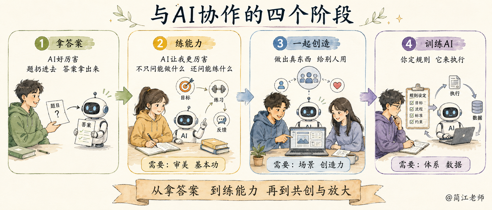
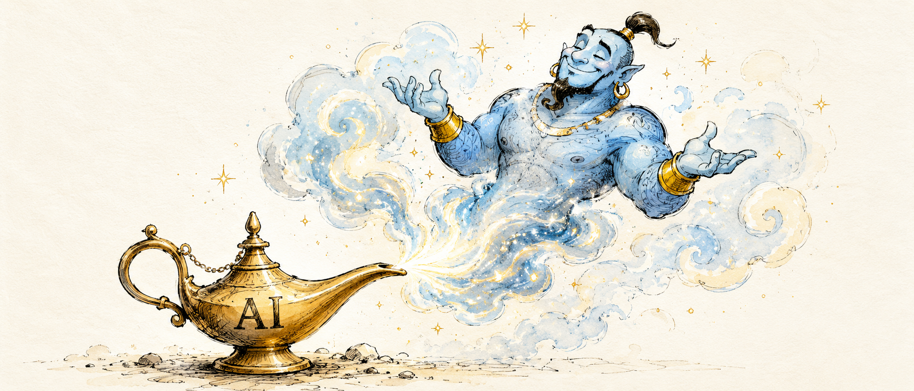

### 十一、四阶段：你想从哪一层开始

把双三角放到时间线上，是四个阶段。对照看看。

第一阶段最舒服，也最值得留意。给你一个电动轮椅，会让你失去奔跑的能力——坐上去是轻松，腿却一天比一天没劲，哪天碰到轮椅上不去的台阶，就哪儿也去不了了。

**一句话：AI 代偿人，人变笨；AI 修炼人，人变强。我们应该把AI当做梯子，而不是电动轮椅。**

今天的游戏、作文、数学三个案例，全是第二阶段的事。这节课把第二阶段每一步长什么样，都摆给你看了。

**【🙋互动】**我们用发展的眼光看问题。今天听了这些启发，你希望自己在哪个阶段去做一些事情？
> 1. AI替我做，我省事儿了
> 2. 用AI训练我，让我更厉害
> 3. 我和AI合作，做有用的产品
> 4. 我创造一个系统，让AI自己做

下一步，你打算怎么用AI？可以打在聊天区。

好，回到开头那盏神灯。你许的那个愿，该兑现了。

