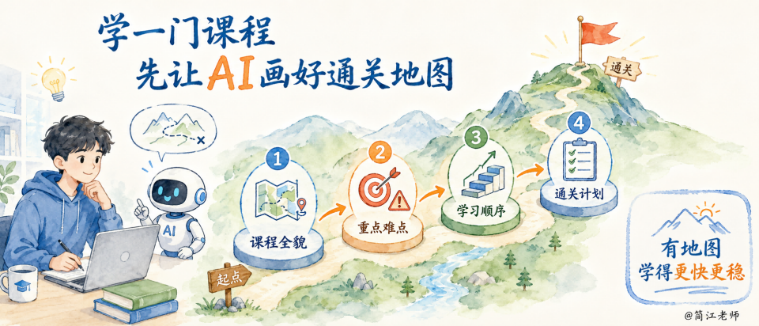
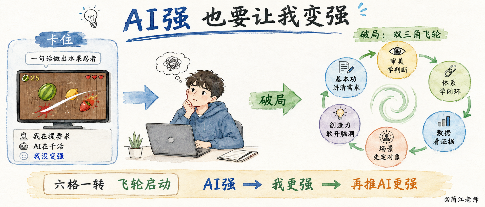
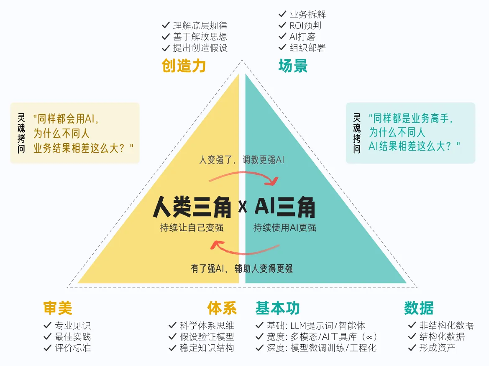

### 十二、回到双三角，也回到你的愿望

上课前，你在神灯面前许了愿。还记得这四个吗？
> 1. 帮我五倍速提分，考上重点学校。
> 2. 用 AI 写一本小说，主角就是我。
> 3. 自己做一个游戏，规则我定，做出来给朋友玩。
> 4. AI 把所有事都干了，作业别找我，考试别找我，我天天吃喝玩乐。

选4的同学。这个愿望一点也不丢人，想歇着是人性的一部分。只是躺久了你可能也有体会：一直歇着，人空落落的，并不见得多舒服。

很多同学不是不想变强，是觉得变强太麻烦——山太高，一下蹦不上去。

这节课给你看的，就是另一种可能：AI 把大山切成了一级一级的台阶，爬山从来没有像今天这么省劲。哪天你想动了，路已经修好了。

我们把今天这条线捋一遍。

我用一句话唤出了水果忍者，很快就卡住了——我在提要求，AI 在干活，我没变强。

破局的办法，是一堂的双三角：让 AI 出框架，我学成审美；让 AI 建评分体系，我学会用反馈闭环；让 AI 记数据，我学会拿人的行为做判断；我提出场景，开出脑洞，磨出指挥 AI 的基本功。

六个格子一转，飞轮就转起来了：AI 强让我更强，我更强再推 AI 更强。

现在，回到你的愿望。讲了 AI 双三角之后，你再想想自己许的那个愿——你有没有一些新的启发、新的思路？

**【🙋互动】**接下来，你打算做什么？怎么做？有想法要去实现的，在聊天区扣一个**「一定作业」。**

课后作业，就一个：

> 把你刚才说的愿望，不管是做题、写小说还是写个游戏，用刚才讲的双三角模型跑一边，跑完了，把你的体会告诉我。

老师会在这里等着你的喜讯，每一份作业，我都会回复。