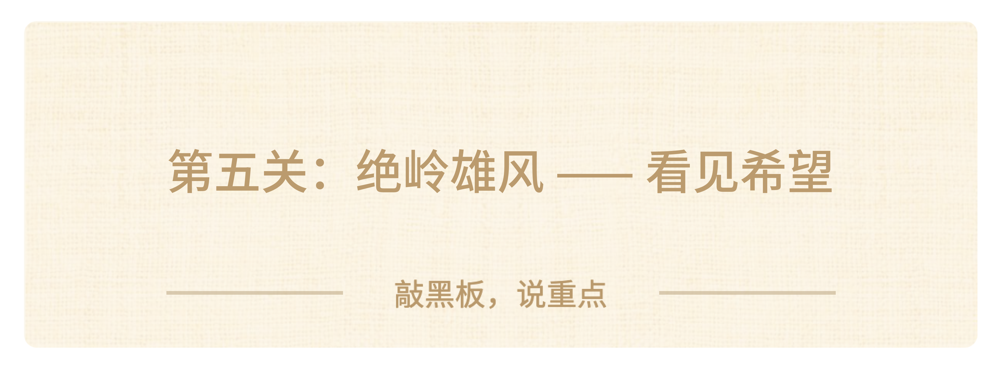

### 第五关：绝岭雄风 —— 看见希望

接下来是最后一关，也是最高阶的一关：**绝岭雄风 —— 看见希望，在不确定里主动破局。**还是老规矩，先做最后一道选择题：

**【🙋提问】现在AI发展这么快，很多工作都在变，你心里最常有的想法是？**

> A. 跟我没关系，毕业还早，以后再说

> B. 有点焦虑，怕自己以后学的东西没用，被淘汰

> C. 主动学AI工具，多试试新鲜东西

> D. 我也想做点不一样的事，但不知道从哪下手

大家坦诚一点，把真实想法打在评论区。

————————

其实特别正常，别说你们了，我平时和很多企业创始人聊天，他们也经常焦虑，不知道AI会把行业变成什么样。但我想告诉大家：**焦虑没用，等也没用，真正厉害的人，会主动跑到变化的前面去。**

这一关，我们讲一个核心概念，叫“**实验精神**”。

什么是实验精神？就是四句话：**承接最大的挑战，质疑惯例，马上就做，别等。**

我给大家讲一个真实的故事，是我之前在暑期创业营遇到的一个高中女生。

> - 她参加创业比赛的时候，本来只是团队里的“行政助理”，负责整理资料、安排会议。但她做着做着，发现团队的宣传文案写得特别生硬，没人看。

> - 她没有等队长安排，自己去查了很多爆款文案的写法，改了三个版本，拿给队长说：“我改了几版文案，咱们要不要试试发出去？”结果她改的文案，阅读量是之前的三倍。后来她又主动去做账号运营、对接合作，最后比赛拿了省奖，她也从一个小助理，变成了团队的核心负责人。

你看，这就是实验精神：**不是等别人给你安排任务，而是主动发现问题、主动解决问题。**具体怎么培养这种精神？三个小行动，大家从今天就能开始做：

**⭐️第一，多接一点“不是你分内的事”。**

> 小组作业里没人管的事，社团里没人愿意干的活，你主动搭把手。不是吃亏，而是给自己练手的机会。

**⭐️第二，多问一句“为什么一定要这么做？”**

> 大家都这么做的事，不一定就是对的。小组作业一直这么做，社团一直这么办活动，有没有更好的方法？多质疑一次惯例，就多一次创新的机会。

**⭐️第三，想到了就先试试，别等完美。**

> 有个好想法，别等“我准备好了再说”，先花半小时做个最小的版本试试看。错了也没关系，本来就是实验。

那我们最后再聊一次：**这种主动探索的实验精神，AI有吗？**

**没有。**AI再厉害，也只会执行你给它的指令，你不问它，它永远不会主动做事；你不让它创新，它永远不会跳出既定的框架。AI是工具，是放大器，但拿着工具往哪走、去探索什么，只能由人来决定。在AI时代，被动等待的人会越来越容易被替代，而**主动探索、敢闯敢试的人，永远能找到自己的机会。**

我在职场中经常遇到离职的人，问他们原因，他们大多会说：**我看不到公司的希望**。很多时候，别人愿意追随你，不是他们觉得自己有希望，而是能从你（创始人）主动探索的行动上，看到他们的希望。

**AI能回答所有已知的问题，但只有人，能去开创未知的前路。**

最后回到领导力的定义：**领导别人心甘情愿解决难题的能力**。最高层级的领导力就是**：我有一个特别能感召人的美好愿景，我希望和你们一起来亲手实现它。**