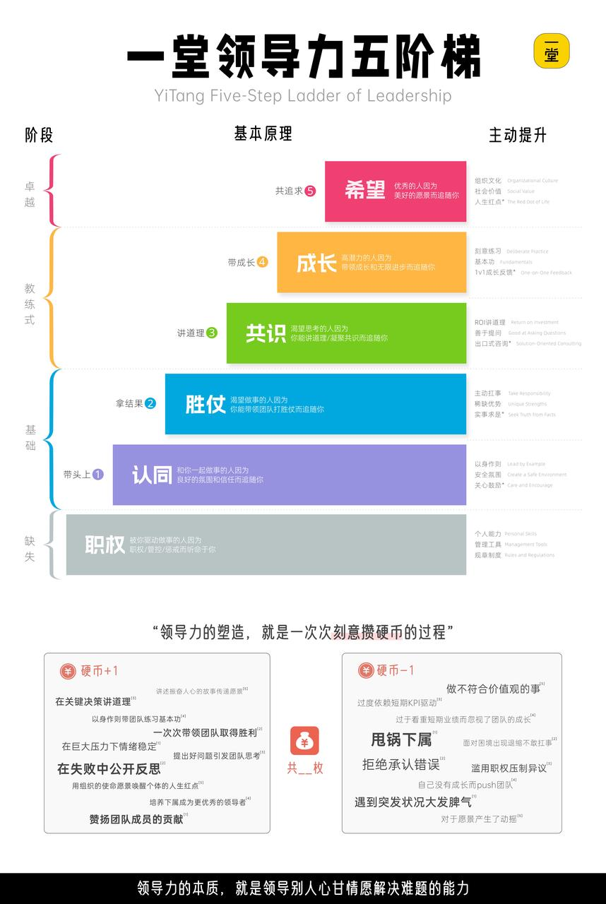

### 课程回顾

好了，到这里，咱们领导力的五关就全部闯完了。咱们一起简单回顾一下：

- **第一关，新手村**，学会建立信任，让别人愿意和你站在一起；
- **第二关，勇者之路**，学会先干再说，用小胜仗点燃团队信心；
- **第三关，歧路森林**，学会凝聚共识，把不同的人拧成一股绳；
- **第四关，霸者之证**，学会助力成长，带着身边的人一起变强；
- **第五关，绝岭雄风**，学会实验精神，在不确定里主动破局，带给人希望。

这五关，刚好对应了AI时代最稀缺的三种能力，也就是“能、省、新”三个字：

> - **能**，就是给团队赋能、带来能量的亲和力，对应第一关和第三关；

> - **省**，就是拿结果、省时间的尽责能力，对应第二关和第四关；

> - **新**，就是敢创新、敢探索的实验精神，对应第五关。

这三种能力，是AI无论怎么发展都替代不了的，也是未来一个人最核心的竞争力。

我也想对在场的家长朋友多说一句：**很多家长总盯着孩子的分数、证书，但长远来看，这些能带着人做事、能主动解决问题的能力，才是孩子未来走得远的真正底气。**