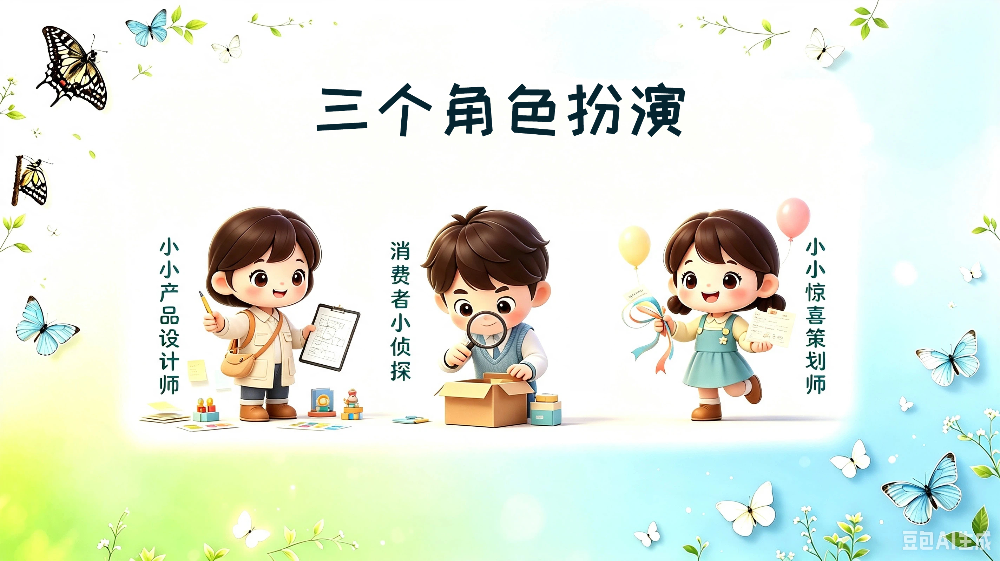

### 开篇：三个角色扮演

同学们好！我是**阿蕊老师**，欢迎大家来到今天的**一堂X探月**课堂。一堂是爸爸妈妈们学习的地方、探月是孩子们的地方，今年暑假，两家联合起来组织了这次特别的学习活动，帮同学们开拓视野~

**在一堂爸爸妈妈学的知识，能不能让小朋友们，听得懂、学得会、用得上呢？**

今天阿蕊老师给同学们带来的这节课，就是爸爸妈妈在一堂的**商业课**学的课程，叫**“产品内核”**课，阿蕊老师讲给同学们听听，看看这门课**有没有趣？**对你们日常生活**是不是有帮助？**

好，我们正式开始上课!

先预告一下，今天的课程为了让同学们能好玩一点，阿蕊老师会让同学们先后扮演**三个不同的角色**，分别在三个例子中和阿蕊老师**一起做分析、一起做判断**。

这**三种不同的身份**——分别是：

- 第一个是一个**小小产品设计师**；
- 第二个是一个**消费者小侦探**；
- 第三个是一个**小小惊喜策划师**。

这三个角色看似完全不搭边——设计产品、买东西、策划生日会。但阿蕊老师要告诉你们一个秘密：**这三个角色用的方法，是完全一样的。** 我们今天一起来找到这个方法。

**【🙋提问】**准备好了吗？准备好上课的同学，在评论区发个**“666”**吧，让阿蕊老师看看按时上课的有谁在呀？

好，让我们开始下面45分钟的**角色扮演之旅**。