### 小小产品设计师：蝴蝶魔法盒的秘密

好，第一个扮演的角色来啦，**小小产品设计师**。

（同学们准备一下笔和本子，用拿笔在本子上写下“小小产品设计师”）

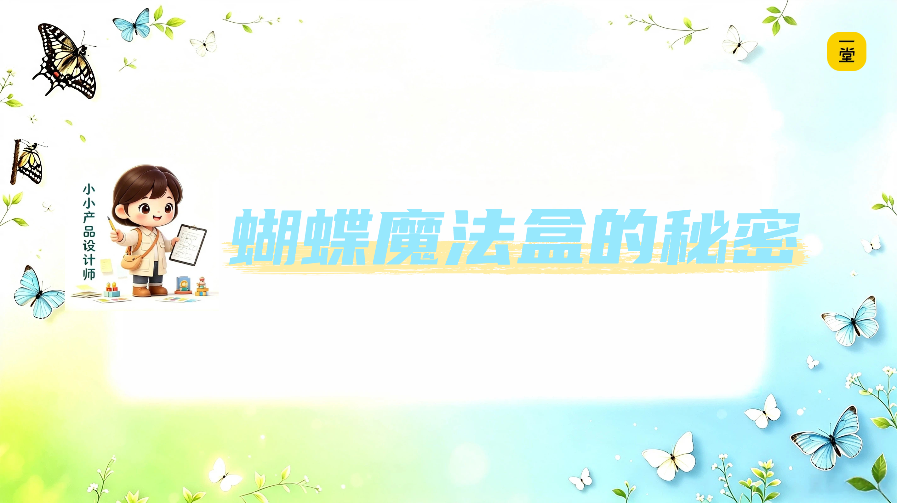

那我们设计什么呢？先带大家看一个有趣的视频。

📹 b447437c034edb3289491f1838176ca8.mp4

**【🙋提问】**所以同学们，视频里这是什么？

**蝴蝶！是真的蝴蝶~**

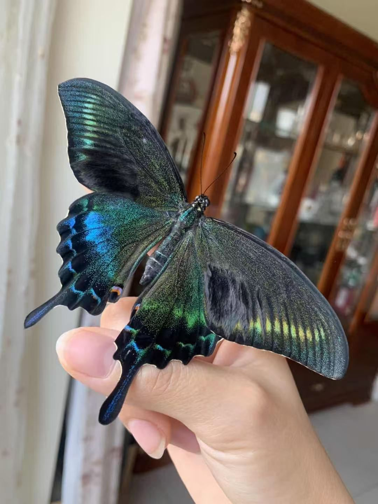

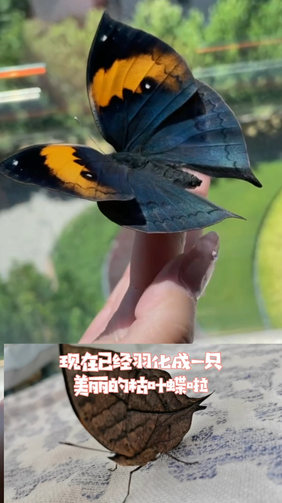

美不美？这些都是真的蝴蝶，阿蕊老师在家**羽化**过很多品种的蝴蝶，而且还拍了很多蝴蝶的视频，给大家选两条播放量最高的~

> 补充个小知识点：蝴蝶从蛹里出来，专业的叫法是‘**羽化**’，不是孵化，羽化是针对带翅膀的，例如蝴蝶、蛾子等。这节课里后面我们统一叫羽化，就是‘变成带翅膀的蝴蝶’的意思。

📹 a5f41348e505331f742d9dbf02e94d85.mp4

📹 c6d4e45655241139a70414e324ca0f7a.mp4

这些蝴蝶在家里用这样的盒子**羽化**出来的出来的。这是4年前阿蕊老师做儿童自然教育的时候（公司的小伙伴）设计的一款**蝴蝶羽化套装的产品——名叫“蝴蝶自然魔法盒”。**

（什么是产品？简单的说就是花钱可以买到的东西或者服务，例如汉堡是买到的东西、书包是买到的东西，旅游出去玩买到的是服务）

简称“蝴蝶魔法盒”

好，现在同学们的角色**小小产品设计师**，要扮演起来了。

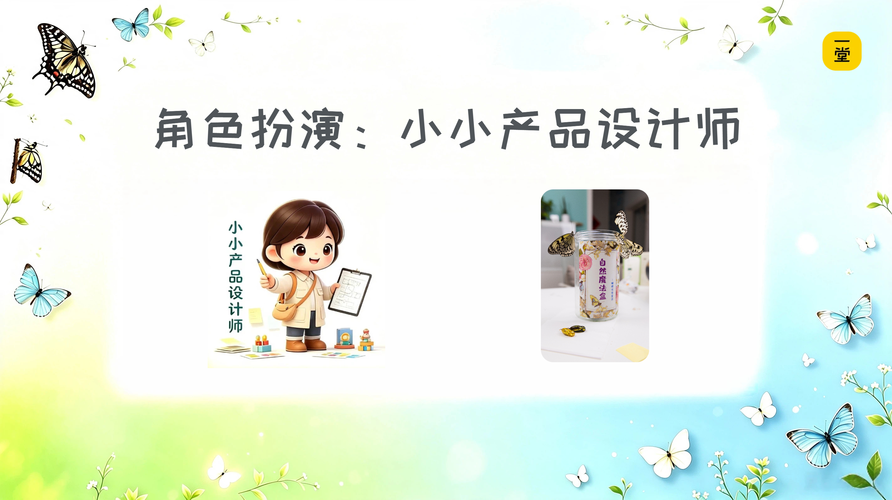

（同学们，观察下面的视频，拿出笔和纸，记录一下“蝴蝶魔法盒”产品套装里都有什么东西？）

📹 35dc424ec096fc6070a500b44a4fdfbd.mp4

为了让大家看得清楚点，阿蕊老师做了几张截图：

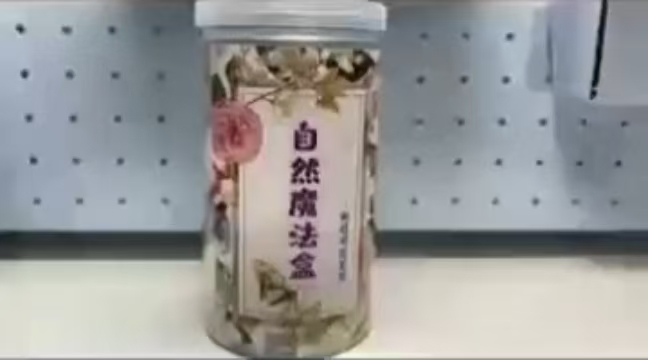

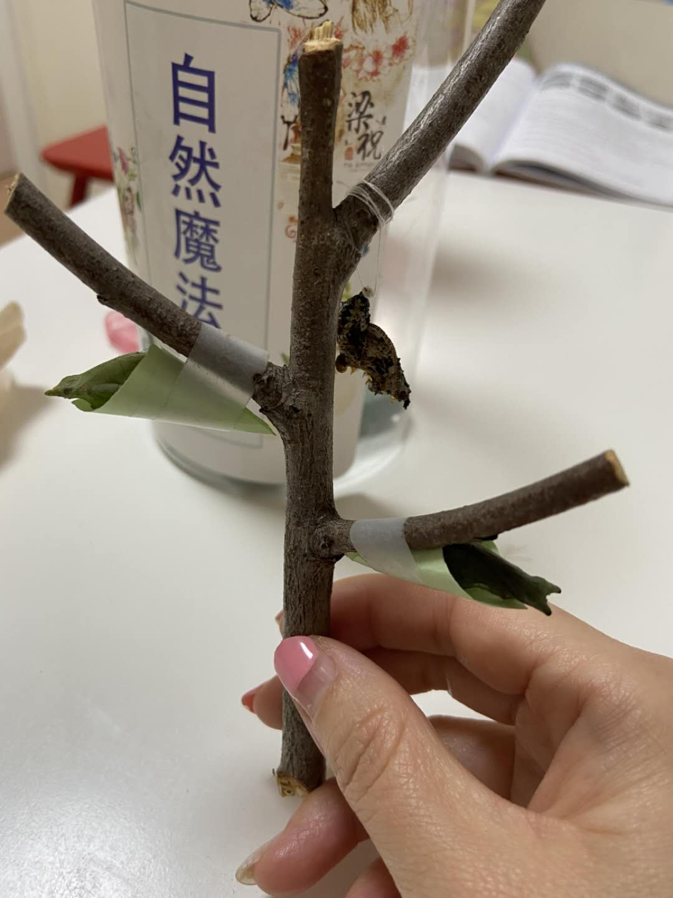

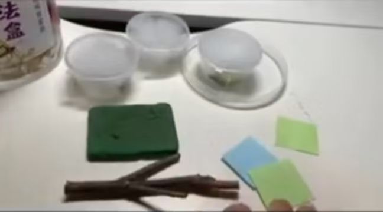

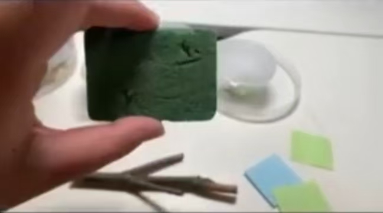

为了讲课简化一下，“蝴蝶魔法盒”里我们只列出主要的**五样东西**，有：

**①圆柱形桶**

**②一根小树枝**

**③一些小纸片**

**④一块吸水花泥**

**⑤还有三只蝴蝶蛹**

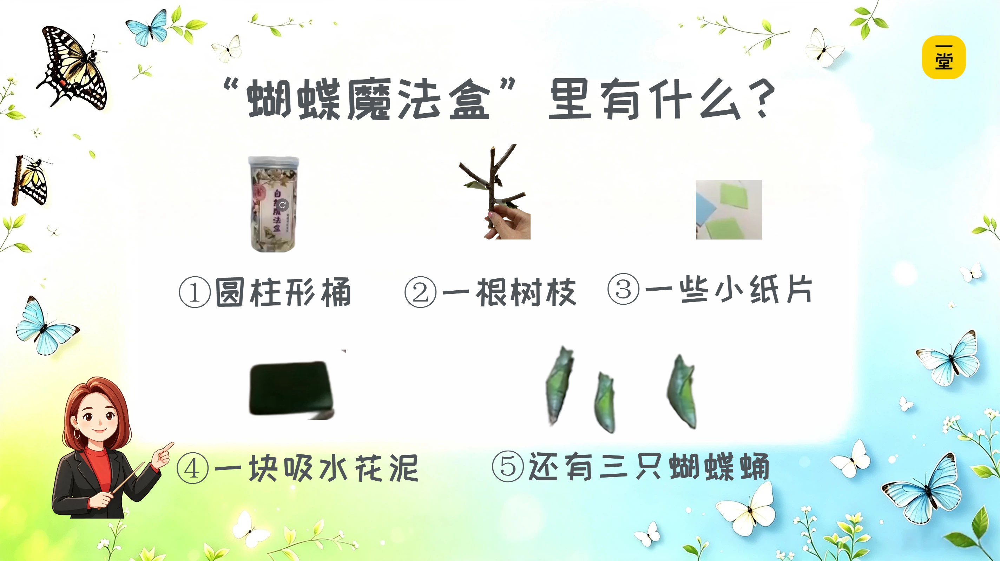

阿蕊老师问**第一个问题**：

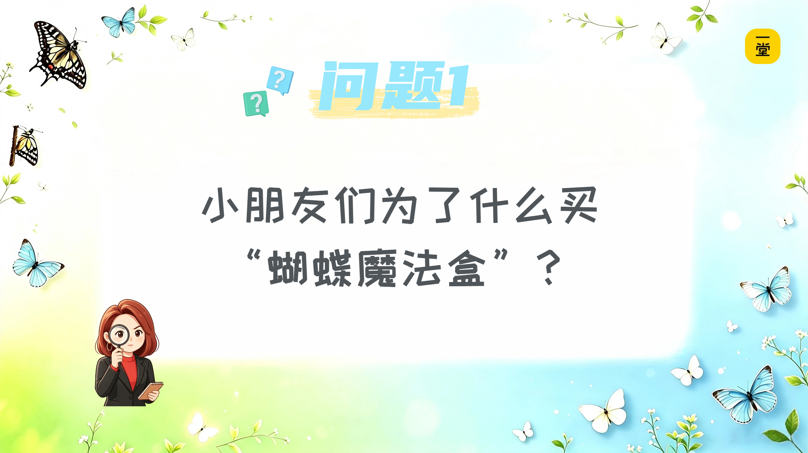

**【🙋提问】**同学作为小小产品设计师，你们**猜猜**小朋友们**为什么会购买这个‘蝴蝶魔法盒’套装呀**——也就是他们图的啥呀？是什么**理由**呀？

我给大家一个选择：小朋友们买的**理由**是什么？

**A. 想看多种漂亮蝴蝶；**

**B. 观察蝴蝶羽化过程；**

评论区同学们请**选择**：**A？B？**

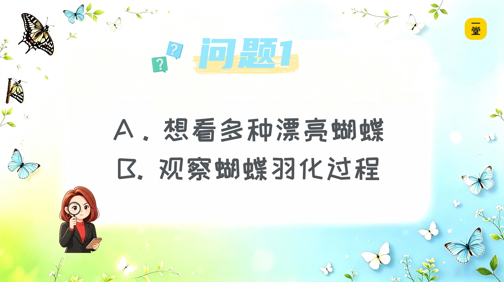

好，大家发现了吗？**同样一个东西（产品），不同小朋友购买的“理由”不一样。**

因为，

**选A**的小朋友，买的**理由**是"能变出各种漂亮蝴蝶"，重点是养**出多种多样**美丽的蝴蝶；

**选B**的小朋友，买的**理由**是"想知道蝴蝶羽化的过程"，重点是要**观察羽化**的全过程；

**【🙋提问】第二个问题**来了，这个问题有点难，小小产品设计师要注意听了哈——

既然，不同购买**理由**的小朋友**看重的**不一样，那我们就可以设计两款“蝴蝶魔法盒”套装：

（前提是，两个套装价格一样）

**①简装版**：装10只蛹，其他都没有。

**②完整版**：装3只蛹 、 一个透明桶、树枝、花泥、小纸片，全套。

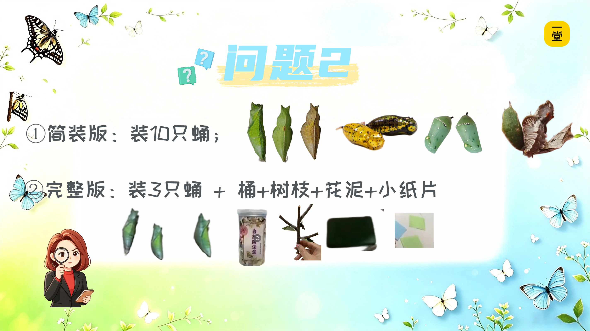

**【🙋提问】问题来了：**A、B两类小朋友**可能倾向于**购买哪一种套装呢？

1.选A的小朋友（想看**多种**蝴蝶）**更可能**选套装①简装版（10只蛹），还是②完整版（工具全）？

评论区写1或者2；

2.选B的小朋友（**观察**羽化过程）**更可能**选套装①还是②？

评论区写1或者2；

好，我们来揭晓——

A→①✓

B→②✓

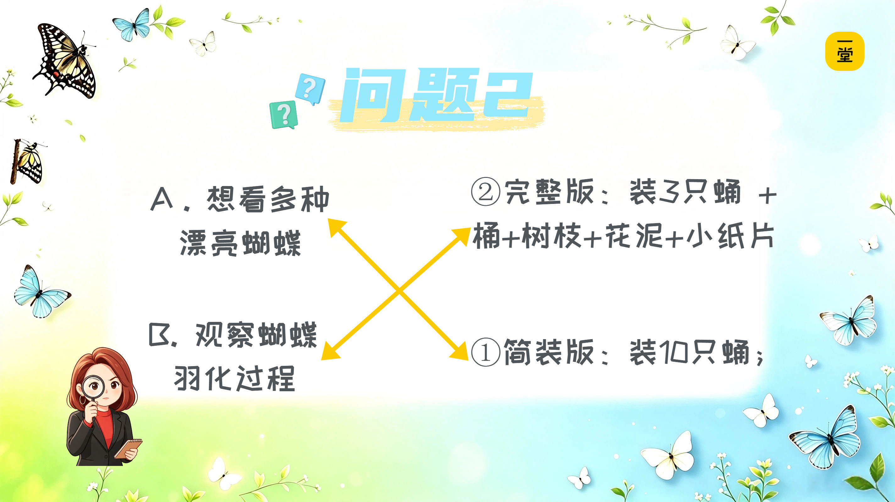

选A的小朋友（想看多种蝴蝶），更可能选**简装版**——10只蛹。因为对他们来说，**蛹的数量多、能变出更多蝴蝶**是重点，其他的辅助工具——桶、树枝、花泥、纸片——可以不要。蝴蝶在家里植物下面也能羽化，只不过不好观察而已。

选B的小朋友（想观察羽化过程），更可能选**完整版**——3只蛹加全套工具。因为对他们来说，**能清楚看到羽化的全过程**是重点，所以桶、树枝、花泥、纸片这些辅助工具最好都有，方便观察。

这里，补充一个课外小知识。

**课外小知识**：

有的同学可能有个疑问，只有10只蝴蝶蛹，其他东西都没有，在家能羽化吗？

这里，我告诉你们一个小秘密：其实这些蝴蝶蛹，放在家里的植物下面**，**只要环境湿度恰到好处，它们羽化出来后，顺着植物的枝干爬到高处，也能晾干翅膀，羽化成蝴蝶哈。只不过会在屋子里到处飞，不方便观察~

好，问题回答完了。

作为我们的**小小产品设计师**，你们有没有发现——**不同的小朋友，买同一个东西，理由不一样，看重的就不一样。**

对于A类小朋友（想看多种蝴蝶）：蝴蝶蛹**多**是重点。

对于B类小朋友（想观察羽化过程）：工具**全**是重点。

**同样的产品，购买的理由不一样，"不能少"的东西就不一样。**

阿蕊老师带着小朋友再来巩固一下，刚才我们分析的过程：

对于**A类小朋友**（喜欢看多种蝴蝶）：

蝴蝶蛹数量多、品类多是重点，所以**10只蛹**是主要的购买原因，其他那些辅助工具（桶、小纸片、小树枝、吸水花泥，有替代方案），有替代方案，可以不需要，所以**蛹多是“不能少”，**辅助工具可有可无，**就是“有更好”，**没有也行的那些东西**。**

当然，如果你想花更多的钱，买10只蛹+辅助工具，也是可以的，但需要额外加不少钱，就不划算**。**

**理由：看多种蝴蝶**

↓

重点：蝴蝶蛹多→**不能少**

非重点：辅助工具→**有更好**，没有也可以

对于**B类小朋友**（想观察羽化过程）：

能方便**观察**蝴蝶羽化过程是重点，蝴蝶蛹3只就够了，但辅助工具（桶、小纸片、小树枝、吸水花泥）**“不能少”**，少了还得自己去找，比较麻烦，所以除了**3只蛹**，其他**辅助工具全**也是购买的主要原因**；**

当然，蝴蝶蛹如果从3只再增加7只，也是可以的，需要额外加不少钱购买，就不划算了。这里就不需要额外增加7只蛹了，**就是“有更好”，**但因为加钱不划算，就没有也可以**。**

**理由：观察羽化过程**

↓

重点：蝴蝶蛹适量+辅助工具→**不能少**

非重点：增加蝴蝶蛹→**有更好**，没有也可以

同样是家养蝴蝶，**理由不一样，不能少的东西就不一样**

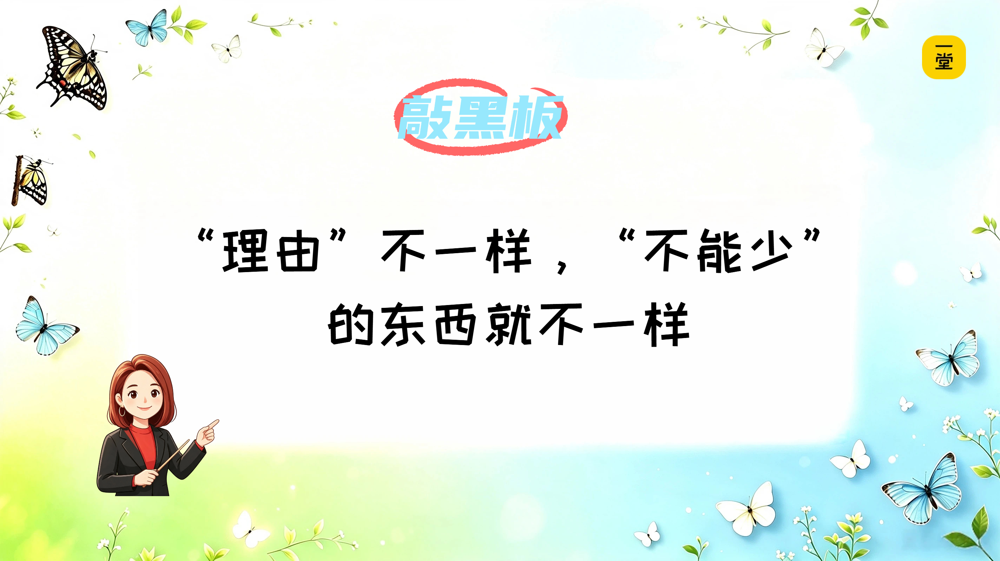

那阿蕊老师问同学们**第三个问题**，也是一个最关键的问题，也是引出最重要的一个概念——

**【🙋提问】不管选哪个套装，①简装版还是②完整版，两个版本的套装里面都有的东西是什么？**

**互动**：同学们评论区敲一个字就行，是哪个字呢？

对——**蝴蝶“蛹”**。

不管是10只还是3只，不管是简装还是完整——**没有蛹，什么都羽化不出来**。

所以，这个产品里"不能少"的东西是什么？——**能羽化成蝴蝶的蛹**。

> 注意，不是"蛹"本身，而是"能羽化的蛹"。一个不会变成蝴蝶的死蛹，没有用。能活、能羽化，才是关键。

产品里不能少的那些东西，在爸爸妈妈听的商业课上，有个专门的名字**，叫**“**产品内核**”。

蝴蝶魔法盒的**产品内核**是什么？——**能羽化成蝴蝶的蛹（活的蛹）**。

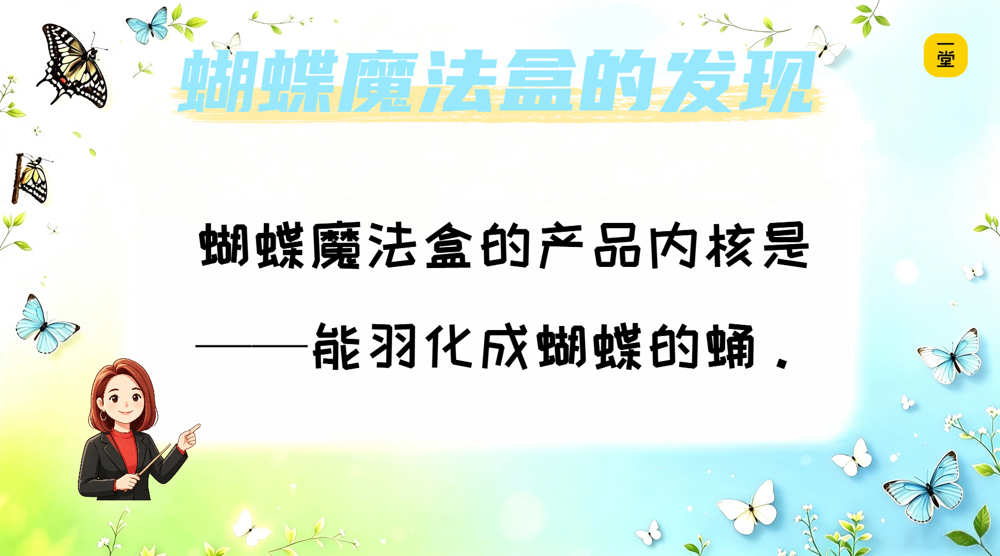

> 阿蕊老师给你们讲一个真实发生的故事。

> 蝴蝶蛹是娇气的‘宝宝’，所以我们的蝴蝶魔法盒全部都需要人工来组装。有一次，一个包装的小姐姐在组装的时候，一个走神，把塑料桶、小树枝、吸水花泥、便签纸都装进去了，唯独忘了装那三只蛹宝宝。

> 小朋友收到盒子，兴奋地打开，发现——咦？所有的东西都在，就是没有蝴蝶蛹。没有蛹，怎么孵蝴蝶呢？小朋友哭笑不得：我买了一个蝴蝶羽化盒子，结果没有蝴蝶！

> 后来我们查原因，发现那个包装的小姐姐其实花了很多时间和精力，桶擦得干干净净，树枝摆得整整齐齐，该干的活一点没少干。但就因为漏掉了最关键的蛹，整个产品就废了——她干了很多活，却做了一件没有价值的事。

> 发现了这个问题后，我们改了一个小小的流程——**所有东西还没动，先把三只蛹宝宝放进去。** 从那以后，出错的情况大大减少了。

所以同学们，**如果不先想清楚"什么不能少"，你的精力可能全花在不重要的地方**。桶再干净、树枝再漂亮——没有蛹，什么都白搭。

**【🙋提问】**下面这行字，同学们在屏幕前和阿蕊老师一起大声念两遍。

讲到这里，第一个角色扮演，小小产品设计师的任务完成了。同学们和阿蕊老师一起，小结一下：

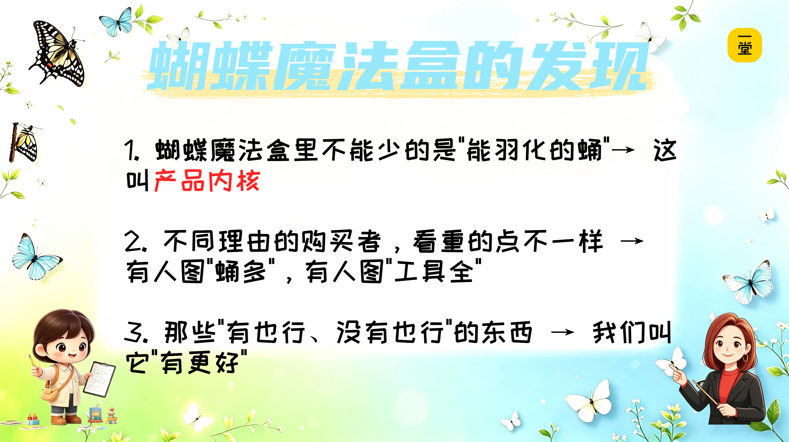

所以，蝴蝶魔法盒的产品故事有没有趣呀？

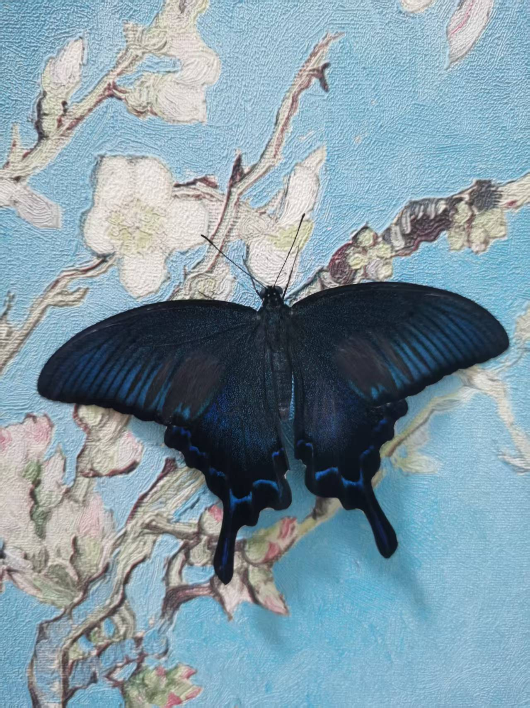

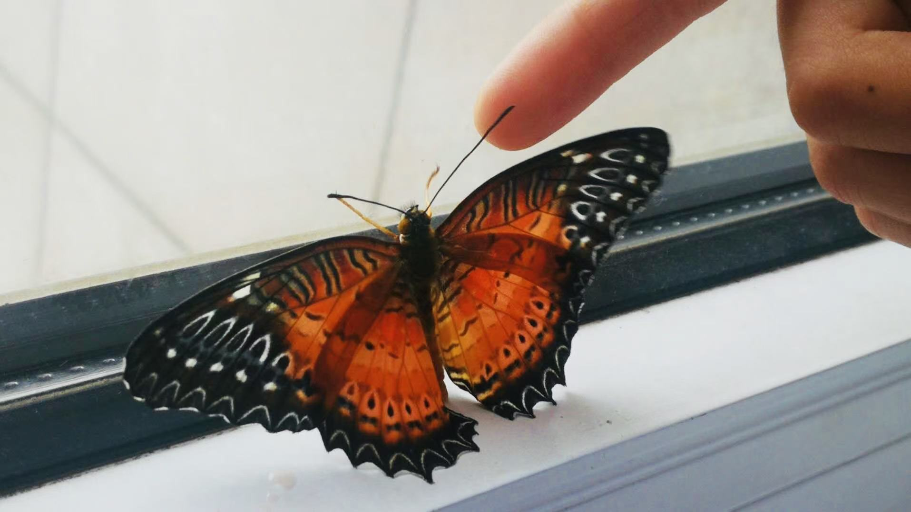

和小蝴蝶们说再见，我们要进入下一个角色扮演了

好，阿蕊老师继续讲下面的内容，带着同学们进入下一个角色“**消费者小侦探**”。