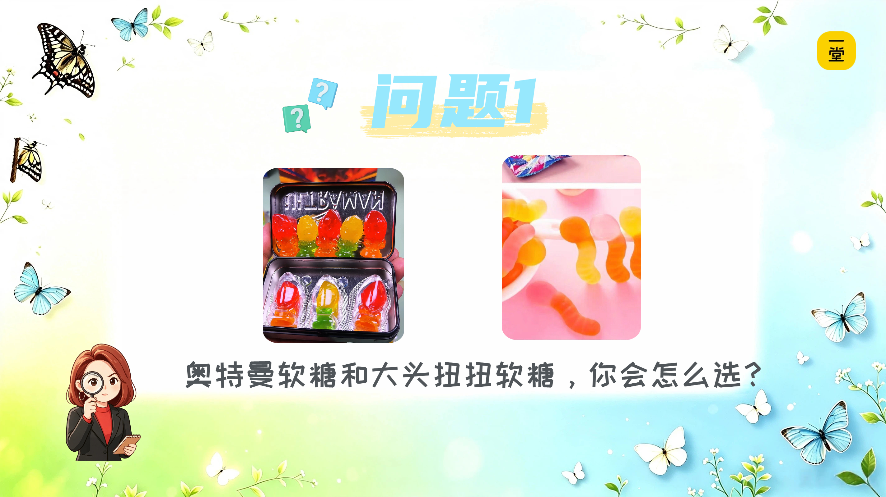
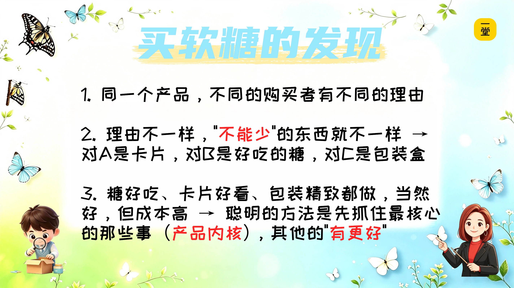

### 消费者小侦探：你为什么会买它？

"消费者"就是买东西的人。你们每一个人都是消费者。为什么叫"小侦探"？就是要从购买者的角度分析一下：**我选了它，背后是什么理由？**

好，阿蕊老师继续讲下面的内容，带着同学们进入下一个角色——**消费者小侦探**。

（用拿笔在本子上写下“消费者小侦探”）

先举个例子。

**【🙋提问】**同学们去超市买软糖，各式各样的软糖，**你会怎么选**？（选择的理由是什么？）

有的软糖，里面会送一张**奥特曼卡片**。

有的同学买它，**不是为了吃糖**，就是为了收集卡片。"什么口味都行，卡片必须拿到！"

那你买的真的是糖吗？——你买的是那张卡，是拆开那一刻的期待。

那对你来说，什么不能少？——**那张卡片**。糖好不好吃——有更好，没有也行，甚至你连吃都不吃。

但有的同学不一样。他买糖，确实为了**吃好吃的糖**。"卡片无所谓，糖要好吃。"

那对你来说，什么不能少？——**糖好吃**。卡片有没有——有更好，没有也行。

还有的同学，买它是因为**包装盒是卡通造型的，很好看**，可以放在书架上当摆件。"糖吃完，盒子我要留着。"

那对你来说，什么不能少？——**好看的包装盒**。糖好不好吃——有更好，没有也行。

同样是这种糖，你发现了吗？

**理由不一样，"不能少"的东西就不一样。**

有的人"图"卡片，有的人"图"好吃，有的人"图"包装盒。这些就是你买的时候最不能少的东西，这些产品里不能少的东西**有个专有名词叫**“**产品内核**”

好，更难的问题来了——

如果这种糖的生产厂家决定对这款糖更新换代，同学们觉得他们**最不能去掉**的是什么？

是不是发现——**没有一个标准答案**？

因为不同的人，要的东西不一样。这就是为什么一个产品可以有很多种"不能少"，**具体看你想满足谁**。

那如果厂家说：我要让所有人都满意，糖做得好吃、卡片做得好看、包装盒也做精致——行不行？**行，但成本高了，价格也贵了。**

所以聪明的厂家会**先想清楚**：**我的产品到底满足了谁的什么理由？** 然后专心把那件事做好，其他的"有更好"，没有也行。

好，第二个角色"消费者小侦探"扮演完了。小侦探们和阿蕊老师一起小结一下：

