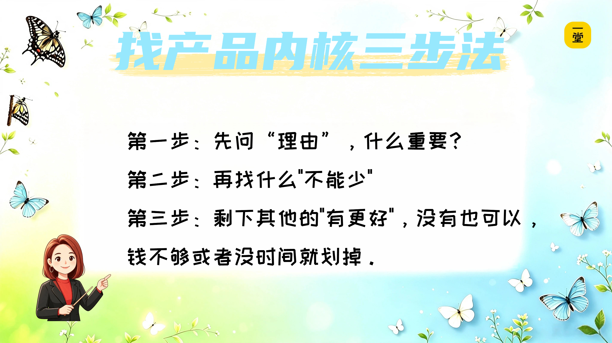
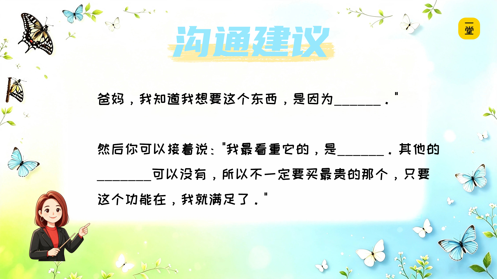
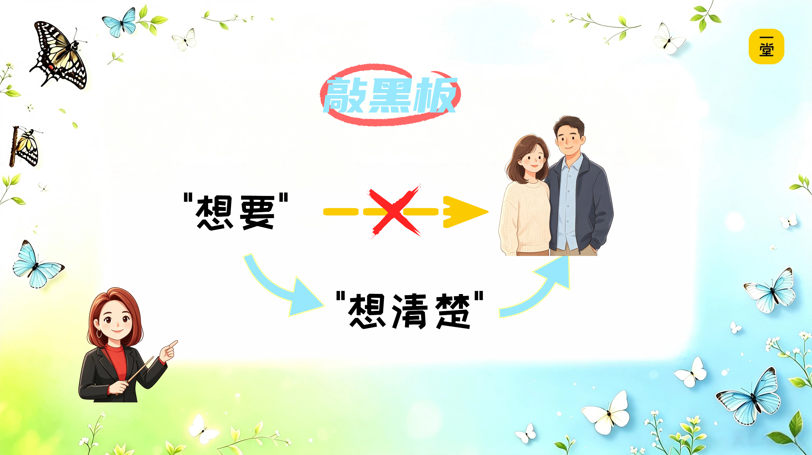

### 咦？原来是一样的！：一个秘密武器

回顾一下我们做的三件事：

- 蝴蝶盒——你是小小产品设计师。
- 买东西——你是消费者小侦探。
- 生日聚会——你是小小惊喜策划师。

三件完全不同的事，但有一个共同的方法：

**先问理由，"什么重要"？**

**再找什么"不能少"**

**剩下其他的"有更好"，没有时间或者钱不够的时候，就划掉。**

这个方法，如果是设计一款产品，在商业课上（就是爸爸妈妈在一堂学习的课），就叫**找“产品内核”的方法**。

好，现在阿蕊老师考考你们——

**【🙋提问】谁能用一句话告诉我：什么叫产品内核？**

给大家三个选项，同学们在评论区选择一下：

A.觉得很重要的东西；

B.最完善、最全的东西；

C.最不能少的，如果没有它，就不会购买的东西；

那阿蕊老师也给你们一个总结——

**【💡划重点】产品内核，就是一个东西里最不能少的那一个或几个点。拿走它，这东西就不成立了。**

蝴蝶魔法盒如果没有可以羽化的蝴蝶蛹，这个产品就没有人买了；

奥特曼软糖如果不是软糖+奥特曼的形象，这个产品就没人买了。

所以这节课，阿蕊老师带给同学们**一个"秘密武器"**——**找产品内核的方法**：

为了方便同学们记忆，阿蕊老师把这三个步骤，凝练成六个字——**理由？清单！划掉！**方便同学们记忆。

**第一步：想理由？**

先问自己：我买这个东西或者做这件事情，**核心理由是什么？**最重要的是什么。

**第二步：列清单！**

把所有可能相关的东西或者事物都列出来，写下来。

**第三步：划掉！**

一个一个问：**少了它，还行不行？**

——如果不行 → **划掉它**（有更好，没有也行）

——如果行行 → **留下它**（不能少，是内核，是决定性要素）

三步走完，就找到了"内核"，找到了对你最重要的东西。

下次你再想要什么东西——不管是游戏机、新书包，还是那双鞋，用这个方法思考后，再和爸爸妈妈沟通

**你可以这样跟爸爸妈妈说**，对照刚才思考的清单：

> "爸妈，我知道我想要这个东西，是因为______。"

> （把那个空填上，比如"因为同学都有，我也想跟他们一起玩"；或者"因为我就是觉得它好看，背着开心"。）

> 然后你可以接着说："我最看重它的，是______。其他的_______可以没有，所以不一定要买最贵的那个，只要这个功能在，我就满足了。"

> （把这个空也填上，比如买鞋，“颜色是橘色的、不用系鞋带比较方便”，其他不重要）

你会发现——爸爸妈妈的眼睛会亮一下。

因为他们听到的不再是"我就要买"，而是"我想清楚了"。

这节课学的不只是设计产品用，是帮你**把"想要"变成"想清楚"**。😊

