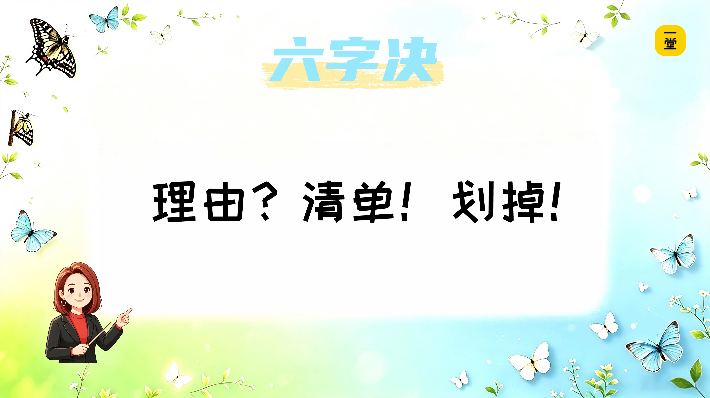

### 结尾：带走你的超能力

好，这节课快结束了。

还记得开头吗？我说把给爸爸妈妈讲的"产品内核"课拿来给你们讲，看你们能不能听懂、能不能用上。

现在我们答案了吗？——**听懂了，而且有用。**

最后送同学们一句话：

**以后遇到任何需要选择的事或者要购买的东西，先别急着动手或者急着买。**

**先问自己：我图什么？再问自己：什么不能少？**找到它，先做好它，其他的慢慢加。

最后，今天的六个字，记在笔记本上——**理由？清单！划掉！**

记住这六个字，你就记住了这节课的全部。

课后有一个**选做小任务**——观察家里的任何一件东西，或者想想最近要做的一件事，用今天的三步法，找找它的"内核"是什么。

我是阿蕊老师，谢谢同学们，再见！