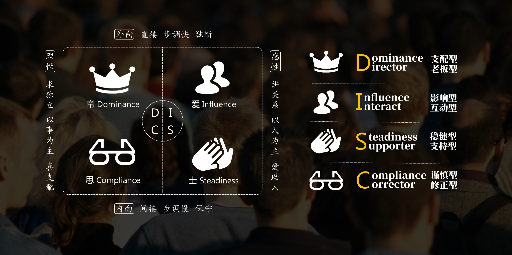

### 模块三：四个动作与实战

#### 3.1 四个动作总览

我先问你们——让别人跟你一起做事，你觉得靠什么？其实只有三种力量。

- **第一，靠身份。** 「因为我是班长。」「不听我的就告老师。」——**这是权力**。
- **第二，靠规则。** 「规定就是这样。」「流程已经定了，照做就行。」——**这是管理**。
- **第三，靠愿意。** 「因为我愿意跟你一起。」——**这是领导力**。

前面两种能让人听话。但只有第三种，**能让人心甘情愿。**

**【💡划重点】在一堂的课里，有一个框架叫「驱动三角」。权力、管理、领导力——三种力量，面对不同的情况用不同的组合。**但越是解决难的事、越是面对厉害的人、越是周期长的挑战——你越需要第三种。

今天这四个动作，全是冲着第三种去的。很简单，你伸出四根手指，跟我一起数——

> - **第一，给对方选择。** 不是「你必须服我」，是「来我家玩吧」。

> - **第二，绝不对立。** 人和问题分开。比赛结束了，对手就不是对手了。

> - **第三，平行思维。** 不争谁对谁错。看两边各有什么道理。

> - **第四，关注下一步。** 不问「为什么输」，问「接下来一起做什么」。

四个动作，一点都不复杂。但连起来用，力量很大。我跟你分享一个例子。

#### 3.2 希希是怎么带大家排好一台话剧的

希希和同学一起排话剧。他是负责人。分配角色的时候，他做了一件我完全没想到的事。我问他：你怎么分的？台词那么多，角色那么杂，每个人都满意吗？他说了一句话——**「我平时对他们有观察啊。」**

他提前做了功课。内向的、不太敢说话的小伙伴，一定给安排台词——别漏了，漏了他就成背景板了。活泼的、爱表现的同学，让他们去耍宝——给他们舞台，他们能把整场戏带活。最难的那个角色，大家都不太想演——他自己认领。如果有人不愿意，他不是硬塞。**他就说：你说出来，我们调。不勉强，不强迫。快速调整，再来。**

最后，老师表扬的时候，他做了一件事——**他把所有人请到台上，一起接受表扬。**

我们回头拆一下，他用四个动作了吗？一个都没漏。

> - **第一，给对方选择。** 「不愿意就说出来，我调整」——不是命令，是邀请。

> - **第二，绝不对立。 **他没把不想演的人当麻烦。人和问题分开了。

> - **第三，平行思维。** 他不是只看到「角色需要什么」，他提前观察了「每个人擅长什么」——两个视角平行看。

> - **第四，关注下一步。 **不纠结谁不愿意、为什么不配合。直接调，调完一起上台。

我想分享一个概念。这个概念挺有意思的——每一次互动，你都在别人心里存钱或者取钱。我管这个叫——**信任硬币。**你做了让人服气、让人安心、让人被看见的事——硬币 +1。你甩锅、发脾气、说话不算话——硬币 -1。

我们来看看希希的硬币账单：

> - **请对手来家——+1**

> - **让内向的同学有台词——+1**

> - **最难角色自己扛，以身作则——+1**

> - **请所有人一起上台接受表扬——不是给自己存，是帮所有人一起存在巨大的压力下情绪不崩——+1。**

一场球输了、一台戏排完了，他自己可能都不知道，他在别人心里存了多少硬币。

这其实就是领导力**第二层——胜仗。** 不是只赢比分，是别人服你。你有长板，你能扛事，你拿结果。希希的观察力就是他的长板——他能看到每个人适合什么。

这也是**第三层——共识。** 他不拍板说「听我的」，他把分配理由摊开：「我观察了你，你觉得对吗？不对我们调。」一堂里有一个说法叫黑盒变白盒——把拍板变成一起看为什么。

这还是**第四层——成长。** 他不只带人把戏演完，他让每个人在适合自己的位置变强。内向的有台词，活泼的有舞台。

#### 3.3 郡郡的一句话：能不能先抱抱我，再分析问题？

刚才说的是带一群人。那如果只对一个人呢？四个动作，还好用吗？跟你分享另外一个例子。希希的妹妹，郡郡。

郡郡跟哥哥完全不一样。她喜形于色。考好了第一时间冲过来汇报，考不好——躲着，不敢说。有一次，她考得不理想。妈妈问了好几次，她才支支吾吾说出来。那天晚上，妈妈正准备严肃地跟她谈一谈。

就那一瞬间，郡郡抢先一步说话了。她说：「妈妈，你现在直接对我用 C——就是那种直奔问题、很严肃的风格——我会很害怕。能不能先给我一点 I，先连接一下，抱抱我，然后我们再一起用 C 分析问题？」

剑拔弩张的气氛，一句话化解了。

那个晚上，她没有哭、没有顶嘴、没有摔门躲进房间。她坐下来，主动写了一整页错题分析——比批评十次都管用。说真的，郡郡不是从容。她是在最害怕、最紧张、最想逃跑的那一刻——挤出了那句话。但就是那句话，让她照顾了自己。**比什么都不会说的孩子，她往前走了一步。**

你们有没有注意到郡郡做了什么？一堂的课里有一个概念叫「出口式咨询」——**不是给别人讲大道理，而是在关键时刻，用一个好问题，让对方自己找到出口。**

郡郡那句话本质上就是一个出口式问题：**「能不能先 I 后 C？」**她没有反抗妈妈，没有沉默忍受。**她提了一个双方都能接受的新路径。**

这就是**第三层——共识。** 在压力最大的时候，不讲对抗，讲道理。提出一个好问题，让对方愿意跟你一起换个方式解决问题。

**她没有取钱，反而存下了一枚硬币**

我们再看一次硬币账单：她在妈妈最可能发火的时候，**没有取钱——反而存了一笔。**

你看，郡郡那句话——先给我一点安慰，再一起分析——就是**先照顾好了自己，才照顾好了关系。**

#### 3.4 DISC 地图回扣

好，郡郡刚才用了两个字母——**C 和 I**。你现在应该猜到了——C，就是那种聚焦问题、讲逻辑、在细节里不断万山的风格。郡郡的妈妈当时就在使用 C 风格比较多，I风格就是先连接人、先给温度、先建立关系的风格。郡郡在请求妈妈——能不能先切换到 I？

**但重点是——不是 C 更好，也不是 I 更好。是不同时刻，你需要不同的风格。** 每种风格郡郡都可以调用。那一刻，她只是调了一下顺序。

四个动作，加上这张地图——就是我特别想分享给你的东西。

