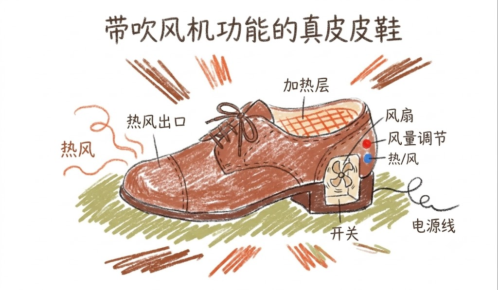
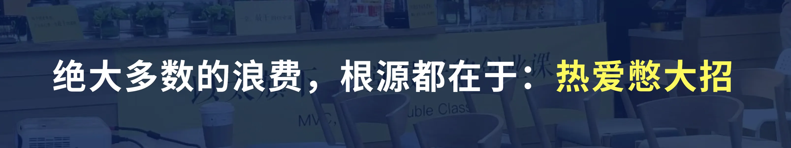

### **低成本验证的起点：从浪费开始**

刚才我们聊的社团招新、写作业工具，或者是黑客松比赛，都在指向一个特别扎心的词——**浪费**。

😭 浪费时间，浪费精力，最惨的是，还浪费了满腔的热情和好心情。

那么，在咱们同学校园生活里，这种浪费到底普遍发生在哪些环节？ 我把它提炼成了两个“最”：

**最可惜的浪费，和最盲目的浪费。**

**【💡思考】**大家可以在弹幕里猜猜，这两个“最”具体指什么？

——————

好，现在我们要来拆解一下：

我见过无数个翻车的学生项目，其中有一类错误，我称它为

#### **最可惜的浪费：需求错误**。

什么叫需求错误？典型的情况就是：你脑子里突然冒出一个极其天才的设想，或者觉得抓住了校园里的某个“痛点”。但是呢，你可能因为内向不敢去问同学，或者太自信觉得自己就是真理，于是关起门来，带上耳机，闷头狂敲代码、做模型。

然后信心满满宣讲，却发现用户根本不需要。

沉浸在“我以为”，不肯去接触用户，验证一些想法，测试一些判断，发现一些错误，但是因为把门关起来了，完全按照自己的美好设想来做产品，最后导致偏离需求，满盘皆输。

我们来看一个探月学校设计工作室的真实案例：

我们有一位同学，观察力很敏锐，他发现设计老师经常在教室里搬桌子调整布局。于是他灵光一闪：“老师总是在搬桌子，太辛苦了！”

于是他想到：我要设计一个搬桌机器人。机器人可以自动识别桌子的位置，用机械臂搬运，再通过APP控制每张桌子的摆放。他很兴奋，开始研究机械臂、编程、建模，甚至还闷头搞出来了一个机器人模型。

几周以后，他第一次去采访设计老师。

结果老师看着机器人，叹了口气说：

> - 我真正累的，不是搬桌子。

> - 而是每次上课前，我要花十几分钟扯着嗓子告诉大家，每一张桌子到底该放在哪个位置。 如果你们自己知道怎么摆。

> -  全班一起动手，其实五分钟就搬完了。

大家听出问题了吗？

 机器人搬桌子，解决的是“搬”的体力问题。而老师真正需要的，**是解决“怎样更快让大家知道桌子该摆在哪”的信息传递问题！**

后来，这个同学果断放弃了机器人。他想了个极其简单的方案：在每张桌腿上贴上不同颜色的标签，在教室地面贴上对应的颜色圆点，再在门口贴一张布局图。 结果呢？每次上课前，同学们看一眼颜色，几分钟就能自己把教室拼好，完全不用老师指挥。 这个方案的成本不到几十块钱，效果却碾压了那个花了几千块的机器人。

所以，需求错误，不是方案做得不好。

而是：

**你以为用户需要A。**

**实际上，他真正需要的是B。**

如果需求没有验证，你越努力，跑得越快，反而离真正的问题越远。这种错误，是不是超级可惜？

———————

讲完了“最可惜”，我们再来看第二个非常高频、被称为

#### **最盲目的浪费：过早细化**。

在所有浪费里，这种错误最容易被大家忽略，甚至还会被自己包装美化成“我在追求极致”、“我有工匠精神”。

具体表现就是：**你的核心点子还没得到任何人的认可，你就开始疯狂抠细节了**。

尤其是咱们很多有“完美主义”倾向的同学，总觉得东西不够完美，就绝对不能拿给别人看，嫌丢人。

举个夸张点的例子，假设你打算发明一双“带吹风机功能的真皮皮鞋”。

你都还没去问问有没有人愿意把脚举到头顶吹头发，你就开始花一个月时间设计鞋子的颜色、研究吹风机的风道、琢磨怎么把鞋面做得更时尚。 同学们，用户的核心诉求是“把头发吹干”。如果这个价值根本不存在，你加再多花边功能，都是多余的！

你花了5个月打磨细节，一旦发现没人买单，你所有的投入瞬间清零。

再说一个咱们探月同学的真实项目。 有个同学家里有个8岁的弟弟，小男孩站着尿尿的时候很容易弄脏马桶边。这个同学就想解决家里卫生间保洁的痛点。

于是，他大开脑洞，设计了一套“强制弟弟清洁马桶的智能流程”。他把这个流程做得极其细致，一共分了6个步骤！他还开始细化每个环节的硬核技术：比如怎么用红外线确保弟弟拿起了马桶刷，怎么倒计时监督弟弟必须刷够15秒，甚至想搞个AI图像识别来验证最终的清洁程度。 他在解决这些技术难题上花了大量时间，觉得自己简直是个天才。

最终的效果是 弟弟小便15秒，清洁2分钟，弟弟很不开心，说：一点也不想在家上厕所了。

但还是到了期末答辩，老师问了一句“那个……让你弟弟坐着小便，或者花一百块钱给他买个儿童小便池，问题不就解决了吗？”

这就是非常典型的过早细化。明明在做一个全新的尝试，还不确定方向靠不靠谱，就拼命打磨细节、增加功能，这其实毫无意义。如果他一开始哪怕用一张纸画个流程图，让弟弟假装演练一遍，就能立刻发现这个方案的反人类之处了。

过早细化，这是大家在做项目时，尤其是越认真的同学，越容易理由这个问题。我们把这两大浪费总结一下，就是：

**方向不对，努力作废；**

**不多验证，纯属自嗨！**

#### 背后的原因

刚才讲了2种致命浪费：**需求错误（最可惜）和 过早细化（最盲目）**。

如果你仔细琢磨，这两种错误的底层逻辑其实是一模一样的。

**【🙋互动】**大家想一想，如果用一个词来总结，这些错误背后到底是因为什么习惯？可以在公屏上敲出你的答案。

我看有同学猜到了。我把这种习惯总结为五个字：**热爱憋大招**。

很多同学打游戏喜欢“攒大招”，做项目也是。大多数早期的惨痛浪费，都源于大家热爱“憋大招”，总想一出场就惊艳所有人。

> - 有的人不肯把一个粗糙的半成品拿给同学看，这实际上是一种**不合理的完美主义**，怕丢面子；

> -  有的人是因为**过于自信**，觉得自己懂AI、懂互联网，自己想的方案绝对天下无敌；

> -  还有些人是因为**太不自信**，担心一拿出来就被大家批评，见光死，所以宁愿拖延，躲在宿舍里修修补补，加点花边功能来掩饰自己的虚心。

但是同学们，马上我们就要迎来探月的黑客松比赛了。在时间极其有限的赛场上，如果你们还敢“憋大招”，结局大概率就是前40个小时沾沾自喜，最后8小时抱头痛哭。

在接下来的项目中，大家必须做到两件事：

**第一，勇敢地把半成品拿出去，听别人的真实反馈；**

**第二，放下玻璃心，接受方案被多次推翻和调整。**

你现在应该理解，为什么“低成本验证”这件事能保命了吧？ 

来，大家一起把这句最核心的通关密码打在公屏上：**克制憋大招**。

