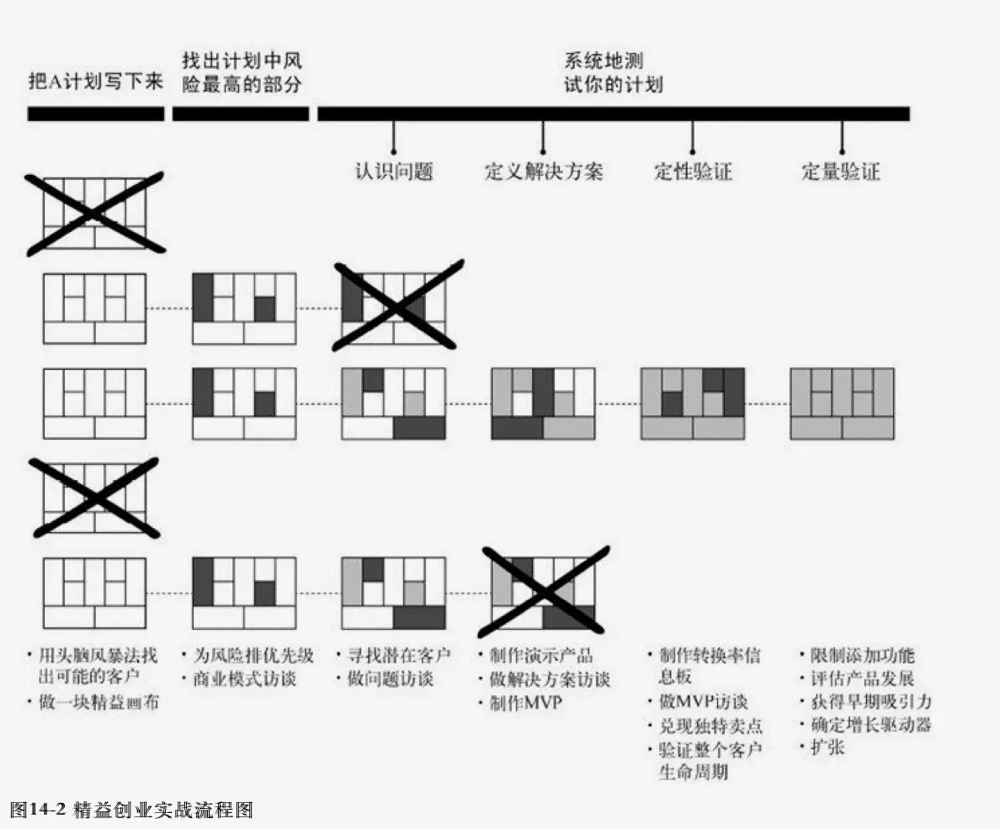
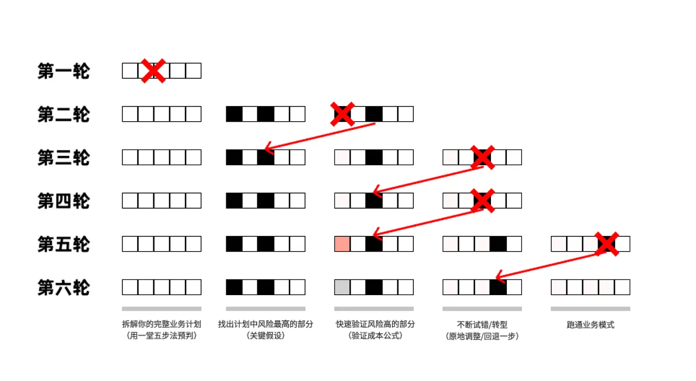

### 基础原则：

要做到克制憋大招，我们需要掌握低成本验证的三个基础原则。

#### 原则一：尽早发布

低成本验证的第一个动作，就是：把你的东西用最快速度弄出来，怼到你的真实用户面前。再说一个去年课上我学生的真实案例。

当时临近期末，大家学习压力都很大。有一个小组特别有爱，决定为同学们开发一款“校园减压神器”小程序。

为了一上线就惊艳全校，他们保密工作做得极好，关起门来苦苦憋了一个多月。他们一拍脑门，觉得大家压力大是因为作业太多、不会管理时间，于是精心研发了一个超级硬核的功能：**“每日作业优先级系统”**。

他们熬夜写代码，把界面做得很精美，最后信心满满地发布了。

结果，不仅没人用，还差点被同学们“网暴”。

**为什么？**

因为大家发现，想要用这个系统减压，你每天放学回家得先花大半个小时，把各科作业是什么、预估要写多久，一条一条录入进去，还要在屏幕上拖拽排序……

同学们，本来作业就写不完，大家已经焦虑得想撞墙了，你居然还让人家每天额外多花大半个小时来做录入作业，哪里减压，简直是**给压力加倍**！

硅谷，曾经流行一个很经典的图。

总结低成本验证的第一个原则，就是：

**尽早发布，拒绝憋招！**

**【🙋互动】**打个“**下次一定**”，争取做到！

#### 原则二：小步快跑

很多同学第一次做大项目，总有一种错觉：以为自己有了一个绝佳的创意，然后只要照着计划表一路高歌猛进，就能拿个金奖，走上人生巅峰。

但只要你真正做过项目就会发现，在最终的成品出来之前，你绝大部分的精力，都是在“挣扎、被打脸、修改、再被打脸”中度过的。

下面这张图，描述了一个"真实世界"的业务推进的过程：

稍微复杂一点的项目，一次就做对，几乎是不可能的。 那么在项目早期，真正值得你骄傲的特质是什么？ 绝对不是你的PPT画得多漂亮，而是：**你多快能拿到同学的反馈，又多快能修改出一个新版本。** 这考验的是你的执行力和纠错速度。

再讲一个今年春天探月中学生黑客松获奖团队的一个 案例：

主题是“我 AI 学习”。有一个特别有意思的小组，他们盯上了“阅读”这个方向。来看看这个团队是怎么在短短几天内，完成神奇的“换脑三连跳”的：

> - **版本1.0（用道理压人）：** 他们一开始做了个PPT去找导师，大半篇幅都在罗列各种官方文件和专家数据，声嘶力竭地论证“阅读到底有多重要，同学们一定要多读书啊！” 结果导师一句话就把他们问懵了：“阅读重要是大家都知道的常识。问题是，你到底怎么让那些一碰书就想睡觉的同学，愿意主动去读？”

> - **版本2.0（用技术自嗨）：** 挨了一棒之后，他们迅速调整，想出了一个“科技狠活”：用AI把纸质图书一键变成线上版，还能根据文字内容自动配图。听起来是不是挺有意思了？结果他们高高兴兴拿着这个想法去跟同学沟通，大家极其冷漠：“这不就是加了插画的电子书吗？网上早就有类似的功能了，没什么新意啊。”

> - **版本3.0（用视角破局）：** 再次被“打脸”后，这组同学没有气馁，反而坐在地上疯狂复盘：既然AI能做电子转化和智能配图，那能不能把读书的“视角”也给转化了？比如读《西游记》，我们能不能用大反派“白骨精”的视角去沉浸式阅读？用AI实时生成白骨精眼中的取经团队是什么样的！

这个创意一出来，全场惊艳！

大家发现了吗？这组同学要是第一天就关起门来，花大量时间去敲代码、做演示文稿，最后拿出来的成品绝对是个没人要的鸡肋。正是因为他们每一次都只花半小时做个最简陋的方案，**快速亮相、快速听反馈、快速被“打脸”、再快速调整**，才在最短时间内，逼近了那个真正好的创意。

现在互联网上那些每天几亿人在玩的爆款游戏、短视频APP，没有一个是第一天就完美的。好的商业模式和作品，全都是靠这样“小步快跑”试出来的。一个以“天”甚至以“小时”为单位去测试和修改的小组，面对一个磨叽了一个月才拿出初稿的小组，前者的进化速度和拿奖概率，绝对是后者的十倍！

总结低成本验证的第二个原则，就是：

**小步快跑，打脸要早！**

**【🙋互动】**同意的打个“**666**”。

#### 原则三：克制设计

听到这里，很多同学可能会产生一个误区：“Keke老师，你一直让我们‘尽早亮相、小步快跑’，意思是让我随便糊弄个粗制滥造的‘丐版’或者‘糙版’就拿去交差吗？”

当然不是！这就引出了低成本验证最本质的第三个原则：**克制设计**。它的核心理念只有八个字：**全局预判，重点执行**

**什么意思呢？**

**全局预判：** 你的脑子里要对这个项目的最终目标（比如想做一个全校最火的平台、拿一个科创一等奖）有一个大致的规划。 

**重点执行：** 在动手的第一步，你要强行克制住自己“什么都想做”的冲动。找出这个项目眼下最关键、最致命的那个“假设”，然后集中所有精力，只用最快的方法去验证这一个点。

千万不要把门关起来，对每一个细节都事无巨细地预判和设计，寄希望于大门打开的一刹那，这十几个环节能一次性全部跑通。 把自己的努力全压在“一次通关”上，这不叫搞创新，这叫上赌桌！一旦失败，你甚至都不知道到底是哪一步搞砸了。

真实世界的定律是：**好的产品和方案，不是在脑子里“憋”出来的，而是在接触同学和用户的过程中，自己慢慢“长”出来的。**

在商业社会，厉害的大牛们会用“精益画布”等高级工具来拆解高风险假设。但在咱们中学生的日常项目里，你只需要学会在动手前，问自己一个问题：“我这个点子要想成立，最核心的那个‘赌注’是什么？”

【**我们来看看身边真正厉害的同学是怎么做的：**】

> - **办校园游园会（社团活动）：** 想要搞一个最火的“沉浸式鬼屋”。 过度设计的同学： 第一天就开始疯狂网购几千块钱的NPC服装、研究复杂的声光电机关。 克制设计的同学： 全局预判是做鬼屋，重点执行是：先找个废弃空教室，拉上窗帘，用手机放点恐怖音效，自己戴个几十块的面具去吓人。如果你用这种“丐版”配置都能把同学吓尖叫（验证了核心假设：你们的惊吓路线设计得对），再根据大家的反馈去买高级道具。道具是根据需求慢慢“长”出来的！

发现了吗？真正的低成本验证，绝不是鼓励你敷衍了事，而是让你**把有限的好钢，全都用在刀刃上。** 只要尽早接触你的“客户（同学/老师）”，不断根据真实反馈调整转型，最牛的细节，最后都会自然而然地“长”出来。

送给大家原则三的8字金句口诀： 

**抓大放小，核心先跑！**