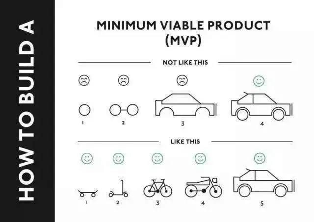
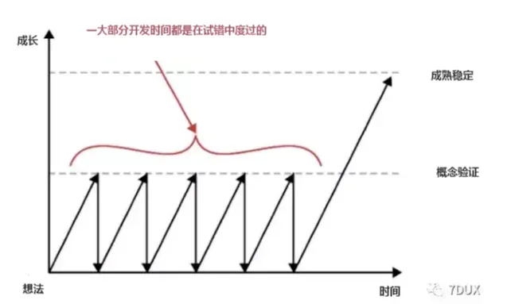

### 回顾和作业

好啦，不知不觉今晚的核心干货已经讲完了，最后我们快速收个尾总结一下：

#### 重新理解"低成本验证"

我们开篇扒开了校园项目里最常见的两种浪费：**需求错误（最可惜）** 和 **过早细化（最盲目）**。

它们背后的罪魁祸首，都是大家心里那个固执的坏习惯——**“热爱憋大招”**。 

为了打破它，我给了大家三件武器：**尽早亮相，小步快跑，克制设计。**

这也引出了我们今天最后，也是最希望大家记住的一句通关口诀，以后做任何大决定前，在心里默念三遍：

 **“风险很大，先测一下！”**

掌握了这个能力，不光是做黑客松、打比赛，哪怕是你制定复习计划、组织班级活动，你都能比同龄人少走无数的弯路。

**【今日作业】**

 光听不练假把式，给大家3个小作业，可选完成：

**1、一句话听课感受** 

用1-2句话，说说这节课给你最直接的冲击。

> - “方向错了，通宵熬夜也是白搭”

> - “别憋大招’精准踩雷，瞎忙活。”

**2、你学到了什么？**

写下一个你以前不知道，今天突然顿悟的认知点。

> - “一上来就死抠细节才是真·大冤种。”

> - “搞项目拿两张草纸就能去测，改得快才是王道。”

**3、刻意练习：低成本验证实战**

**【案例重现】** 期中考后辅导书太贵，死党想搞个“校园二手书漂流”小程序，主打“按斤换书”或“学霸盲盒”。 **【请你推演】** 运用今天学的原则，你会怎么做？

> - **情况 A：** 手握 **5000元** 社团资金，你怎么启动？（提示：千万别一上来就全砸去写代码！）

> - **情况 B：** 兜里只有 **50块** 零花钱，你怎么快速验证这事儿在全校能不能火？

**【公屏互动】**最后，记住咱们的低成本验证通关口诀： **“风险很大，先测一下！”**