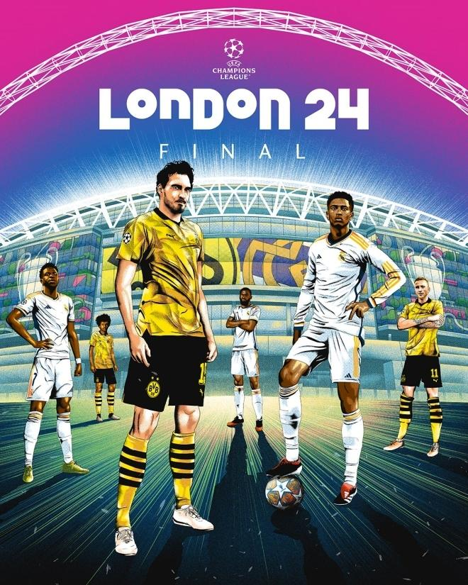
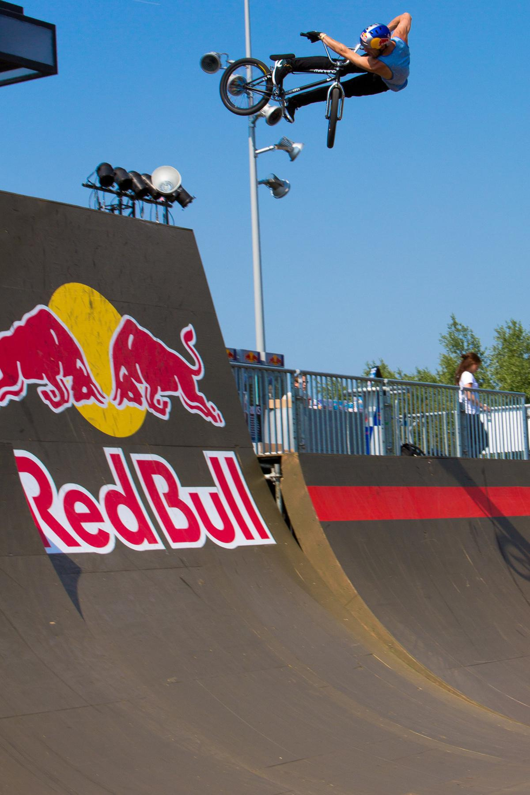
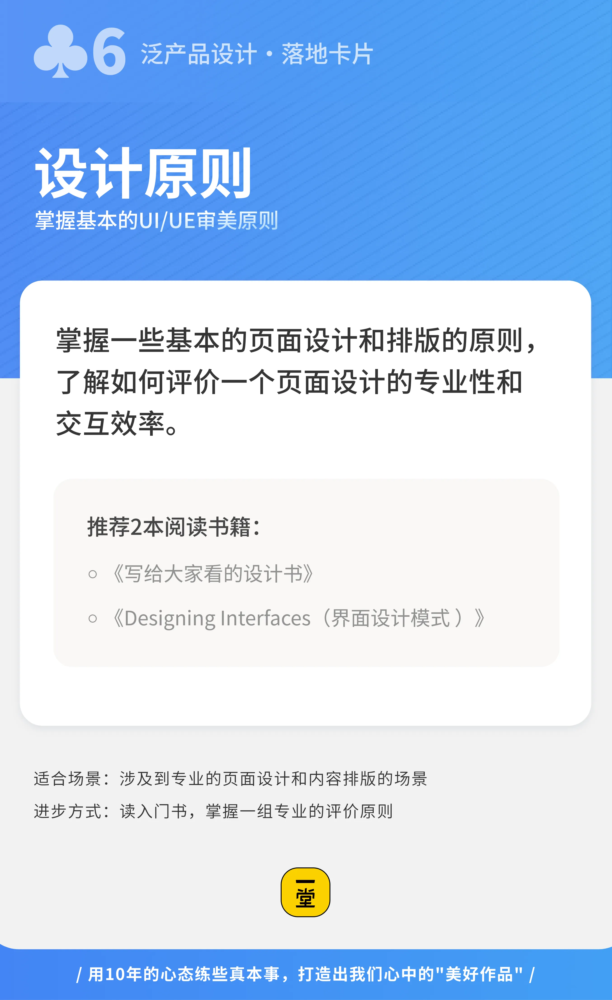

### 第二部分：逐步出牌练习（案例示范）

刚才提到，无论是做一张简单的海报，还是做一个复杂的网站项目，产品设计的底层逻辑是完全一致的。我们先从大家最熟悉的场景看起。

#### **案例示范一：探月飞盘海报设计**

**【案例背景】** 飞盘运动是我们探月学校非常有特色、也极其受欢迎的传统赛事，每年一度的飞盘大赛，全校师生都要组队参加。为了通知大家比赛时间，顺便把全校的狂欢氛围拉满，学校决定在**校门口最显眼的地方**，立一张巨大的宣传海报。

负责设计的同学干劲十足，很快就拎出了第一版。

**📍 迭代第1波：从“自嗨”到“看得懂”**

大家请看这个 **【初版海报 V1.0】**：

**【🙋互动】**来，大家火眼金睛，直接在弹幕里打出来：你觉得这个初版海报有什么问题？

“字太乱了！”“时间写错格式了！”“字和飞盘图案全都拧在一起了！”

> **🎴 此时我们打出第1张牌：【场景推演】（属于“理解用户价值”）**

> 同学们，我们必须做场景推演——全校师生是在什么场景下看这张海报的？是在**早上赶着上课、经过校门口的这短短3秒钟**！如果师生走过去连时间都看不清，这张海报作为产品，它的核心功能就直接报废了。

听了反馈后，同学回去赶紧改，做出了 **【调整版海报 V2.0】**： 他们把文字和图排开了，格式也修正了，信息一目了然。

**【💡思考】**大家再看看，现在字是清楚了，但你觉得这张海报拿出来，能激发你想去赛场上拼杀的冲动吗？弹幕里告诉我，还差了点什么？

“背景怎么还有个奇怪的电线杆啊？”“清晰度不够，图很干！”

**📍 迭代第2波：从“能看”到“不燃”**

虽然信息表达清了，但海报毫无冲击力，主要信息也太干瘪了，根本拉不起任何比赛气氛。

> **🎴 此时我们打出第2张牌：【最佳实践收集】（属于“学习最佳实践”）**

> 做体育海报，不能闭门造车！去看看耐克、红牛、或者顶级联赛的赛事海报是怎么做的？去收集那些顶级的“最佳实践”。你会发现，好的体育海报从来不只是“传达信息”，它是在“传达情绪”！它需要动态感、需要视觉冲击力、需要那种随时要破屏而出的张力！

**📍 迭代第3波：降维打击，破框而出！**

被顶级的最佳实践“洗脑”之后，设计小组开窍了。大家开始疯狂思考：除了在二维平面上改字体、换图片，我们还能做什么？

他们搞出了 **【终极版海报 V3.0】**！

他们做了一个惊人的举动：**直接把飞盘从海报里“飞”了出去！** 破框而出，贴在了学校的墙面上，配合海报背景上炸裂的动态撕裂线条！

那一瞬间，所有经过校门口的同学全都惊呼“太酷了！”

从废稿到惊艳全校的爆款，这个同学并不是靠死磕画图软件，而是靠**不断出牌**！

#### **案例示范二：复杂项目与《家书万金》官网 2.0**

看完了海报，我们再来看第二个案例示范。当面对黑客松或者资源投入更大、需要团队协作的复杂任务时，这套卡牌同样是保命神器。

我先快速插播一个【黑客松48小时极限挑战】的反面与正面典型：

> **【案例：黑客松48小时极限挑战】**

> **不出牌的团队：** 想到一个“AI智能书包”，一拍脑门就开始闷头写代码。到了第40个小时发现Bug满天飞。

> **出牌的团队：** 第一天打出【需求评估】**和**【场景推演】**确认痛点真伪；第二天打出**【内核和边界】**砍掉伪需求；全程打出**【里程碑拆解】**和**【复盘迭代】，没跑通立刻换方案。最终拿出一个完美演示的MVP，拿下大奖。没有边界感和里程碑拆解，努力只会变成灾难！

接下来我们看一个重量级实战项目：**《家书万金》官网 2.0**。

探月学校有个特色课程《家书万金》，融合了历史、语文、传媒和设计。同学们追溯家族故事，制作出一本沉甸甸的纸质“家书”，记录大时代下普通家庭的真实温度。

这个项目做了几年，感人的纸质家书越来越多。但负责项目沉淀的同学遇到了麻烦。

> **🎴 团队敏锐地打出了牌：【问题洞察】（属于“理解用户价值”）**

>  同学们发现：资料太多，纸质书极难妥善留存；且对外宣传传播能力受限。痛点极度清晰——我们需要做一个线上的《家书万金》官网！

需求有了，怎么动手？

> **🎴 团队绝不闭门造车，立刻打出牌：【最佳实践收集】（属于“学习最佳实践”）** 

> 他们查阅了市面上的“口述历史”网站，发现绝大多数年代久远、体验极差。

> **🎴 继续出牌：【最佳实践池子】**

> 既然直接竞品拉胯，他们立刻转变思路，去搜集全球顶级的泛设计类网站找参考。

> **看着酷炫的网页，团队打出牌：【美好作品想象】（属于“学习最佳实践”） **

> 脑洞大开：“家书讲历史，历史就是时光穿梭！我们能不能把网站设计成‘时光机’体验？用最炫的动效带用户穿越！”

**【🙋互动】**大家在公屏上告诉我，如果真的做一个赛博朋克感爆棚的“时光机”网站，来承载爷爷奶奶那一辈充满苦难与温情的家族历史，你们觉得对味吗？

没错！设计团队兴奋几天后，看着炫技的草图也觉得“不对劲”。如果强行上线，这又是一次偏离核心的“用技术自嗨”。

> **🎴 于是，团队果断踩刹车，打出牌：【复盘迭代】与【产品内核】（理解用户与反复打磨）** 

> 他们重新把当年泛黄的《家书万金 1.0》摆在桌上反思：大家当年为什么会被这些粗糙但真实的纸质书打动？时光机只是“壳”，家书真正的“灵魂”是时代的眼泪，是个体在岁月里留下的真实温度！

> **🎴 抓住了灵魂，团队郑重打出收官王牌：【设计原则】（属于“反复打磨”）** 

> 他们重新定义了最高行动标尺，纸质版最宝贵的特质必须延续到线上，三大原则死死钉在黑板上：**精美的包装设计、独特的创意想法、历史的真实质感。与此同时，遵守一个线上产品应该具有的最基础的设计原则（专业&效率）。**

最终做出来的官网，没有浮夸的特效，而是完美还原了翻阅旧信件的厚重感和纸张的肌理感。在一个复杂项目中，多出一张卡，你的项目就能在关键时刻避开大坑，质量直接拔高一个段位！

