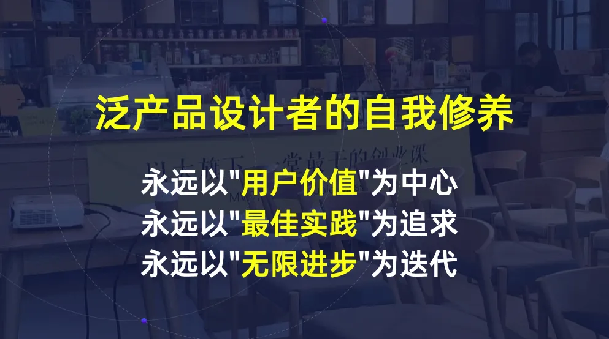

### 第三部分：重新理解课题 —— 产品设计的三层思维

今天我们看了两个跨度极大的案例，但大家会发现，无论任务大小，我们都在反复刻意练习产品设计的“三层核心思维”。这里我们做一个全局收拢：

- **第一层：理解用户价值** 

我们不能沉浸在自嗨里。通过打出【用户视角】、【场景推演】卡牌，我们要像狙击手一样，精准搞清楚：我们的用户是谁？他们在什么场景下？他们真正的痛点和产品的灵魂到底是什么？

- **第二层：学习最佳实践** 

永远不要闭门造车。通过打出【最佳实践收集】、【最佳实践池子】、【美好作品想象】等卡牌，我们要强迫自己去拉高眼界，看看世界上最顶级的方案是什么样的，站在巨人的肩膀上去寻找解法。

- **第三层：落地执行与反复打磨** 

好的产品不是一蹴而就的。通过打出【设计原则】、【复盘迭代】等卡牌，我们要学会在极端的限制下做取舍，砍掉伪需求，一次次推翻重来，直到无限逼近那个最好的答案。

带过这么多届学生，我时常提醒大家养成“打牌”的习惯。但很多同学进入状态很慢，总是嫌麻烦，没意识到这套工具箱真正的价值。

带过这么多届学生，我时常提醒大家养成“出牌”的习惯。今天课程的最后，我想和大家分享一个非常底层的价值观。

**在这个没有标准答案的世界里，你怎么判断自己努力的方向，到底是不是正确的？**

很多时候，我们以为自己走在正确的道路上，其实只是因为最后恰好成功了，才回头给自己贴上一个“眼光真好”的标签。

在1995年的《遗失的访谈》中，主持人问了苹果创始人乔布斯这个问题。

乔布斯沉默了差不多10秒钟，说出了一句意味深长的话：

> **“通过品味（Taste）。通过让自己暴露在人类做过的最美好的事物面前（Expose yourself to the best things humans have done），然后把它带进你正在做的事情里。”**

这不只是一个商业层面的回答，而是一个更本质的产品哲学思考。

我们把它放大到人生的尺度：把主要的注意力放在**用户和产品价值**上，然后长期不断地感知、不断输入高价值的信息，从而反复打磨提升自己的判断力和审美。

“做出一款好产品”、“把一件事情做到极致”的能力，是属于你整个人生旅程中的核心资产。

我们其中有同学会参加黑客松，希望今天交给大家的三步思路和几张卡片，能够给黑客松助力，也记得尝试出牌。

其他同学，也非常鼓励大家试试这个思维，无论是策划与朋友一起的暑期旅行，还是做海报，做社团，“泛产品设计”的思维都能切实帮助大家。

**【互动】 **公屏“下次一定”，期待明天的相见，希望能真正帮助到大家的日常学习和生活！