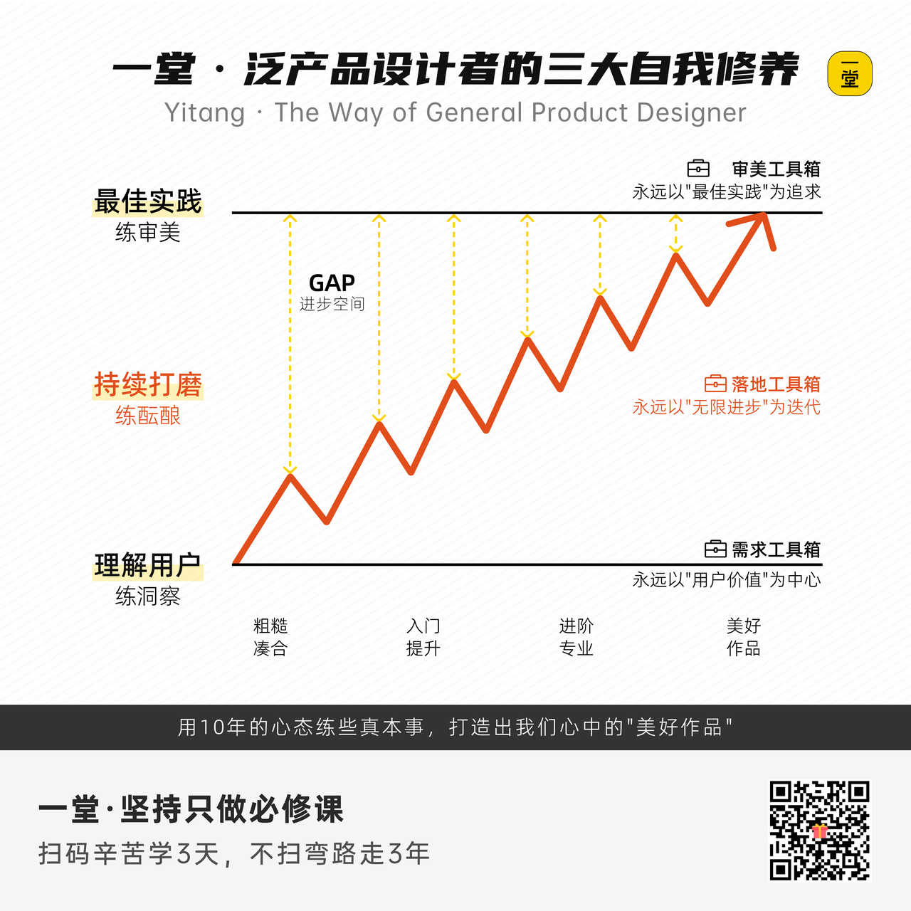

### 初步认识：完整练习框架

在正式发牌前，我们要先植入这套工具箱的“操作系统”。一个真正的高手，不管他在做什么项目，脑子里永远在后台运行着**三层核心心法**：
1. **永远以“用户价值”为中心**（你到底在帮谁解决什么痛点？）
2. **永远以“最佳实践”为追求**（不要闭门造车，看看世界上最牛的人是怎么做的？）
3. **永远以“无限进步”为迭代**（没有完美，只有“下一版更好”。）

基于这三层心法，我们提炼出了几十个实用的“泛产品设计工具”，并且把它们做成了“扑克卡牌”。考虑到咱们高中生和黑客松的真实学情，我把最硬核、最常用的几张牌，精简成了**三大卡组**：

🃏 **第一组牌：理解用户价值（瞄准靶心）**

包含卡牌：用户视角、用户分层、场景推演、问题洞察、项目背景分析、多视角思考、需求评估。

🃏 **第二组牌：学习最佳实践（站在巨人的肩膀上）**

包含卡牌：最佳实践收集、最佳实践池子、最佳实践建模、美好作品想象。

🃏 **第三组牌：落地执行迭代（把事干成）**

包含卡牌：内核和边界、设计原则、里程碑拆解、复盘迭代。

大家不用着急说，老师，这些卡到底是什么？怎么用呢？

今天一节课就能把这些牌全部打得行云流水，这不现实。

但我希望在你们脑海里勾勒出一张“泛产品设计地图”。

你每掌握一张卡，学会一个工具，你的战斗力就会直接飙升一个Level！建议大家课后截图收藏，长期有意识地去用。

为了让大家更好理解，我们还是先保持些耐心，我给大家讲两个例子，从小到大，大家试着带入案例。

同时思考2个问题:

思考的原则，有什么一致性规律么?

背后的方法，用了什么专业的策略和技术?

大家听完这两个案例，应该就能充分理解我们设计这套相架的初心和目标了。