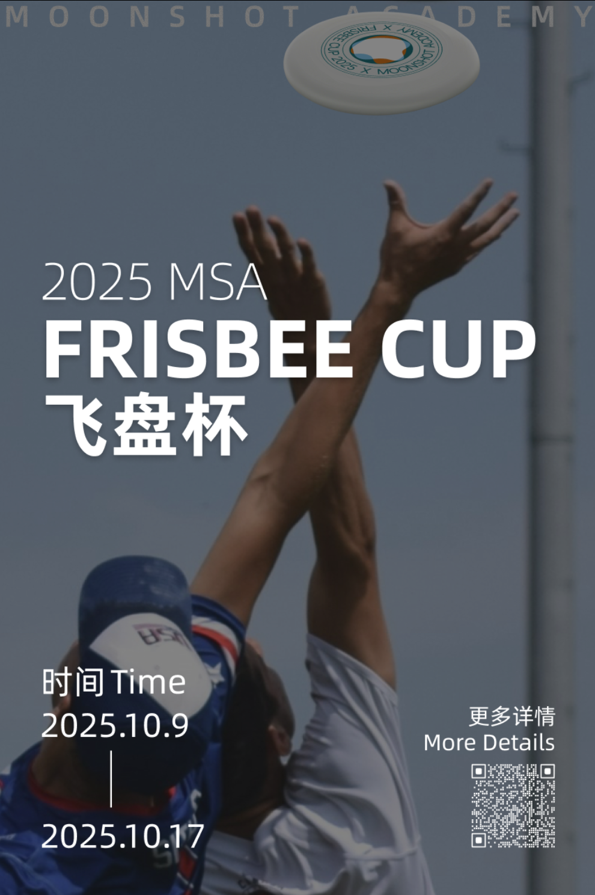
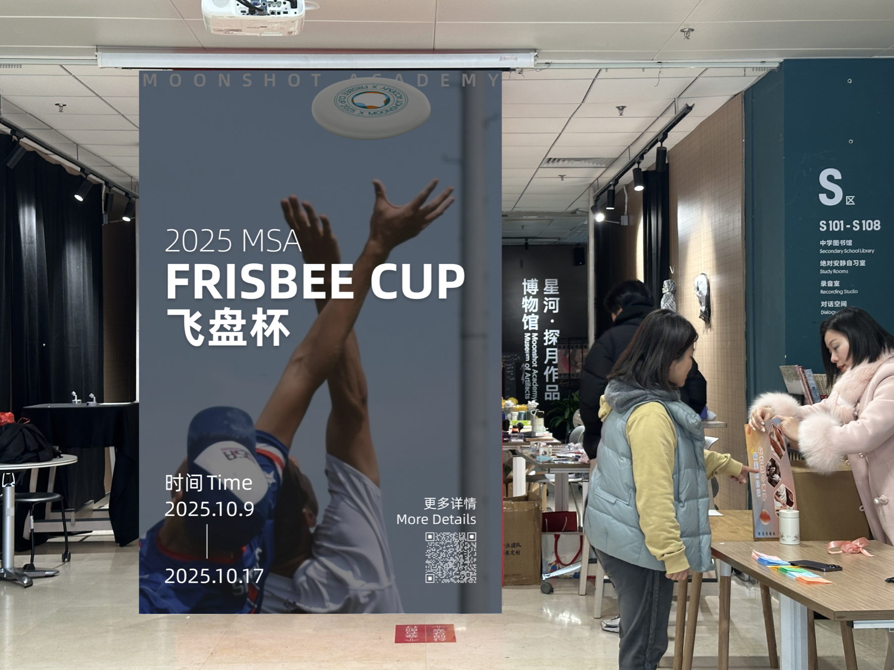
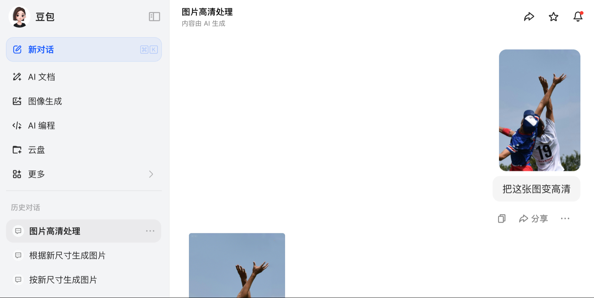
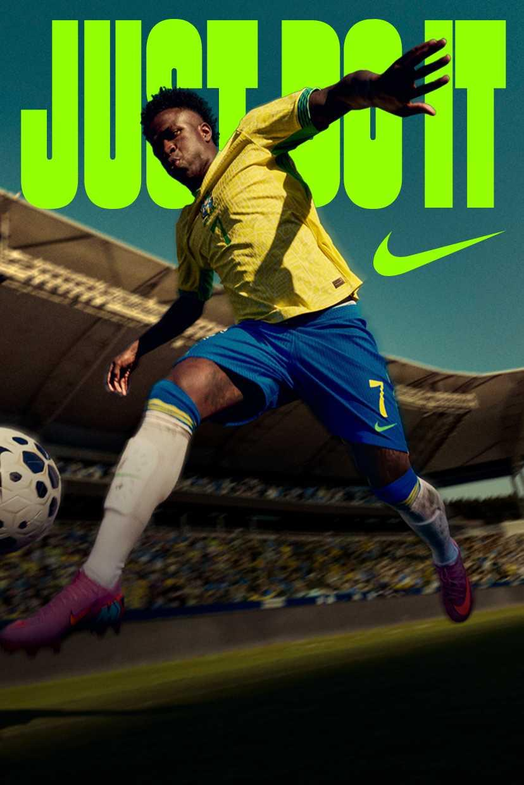
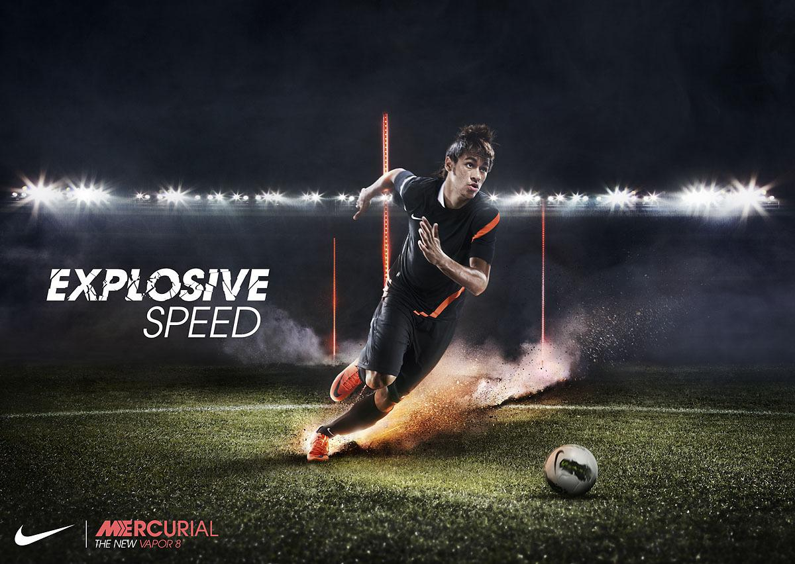
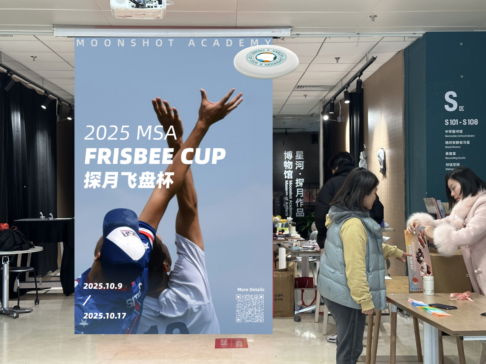
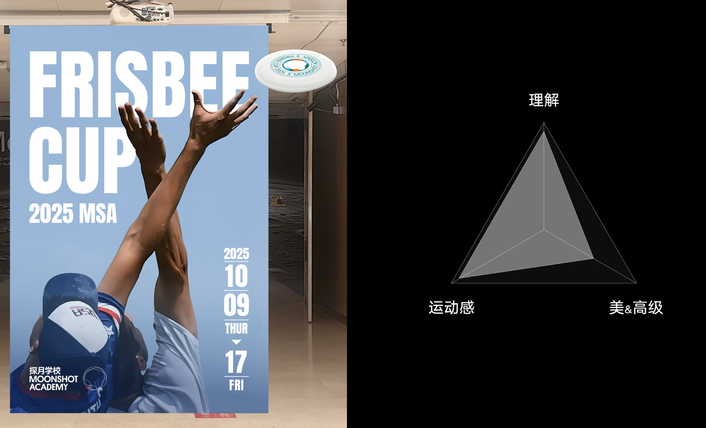
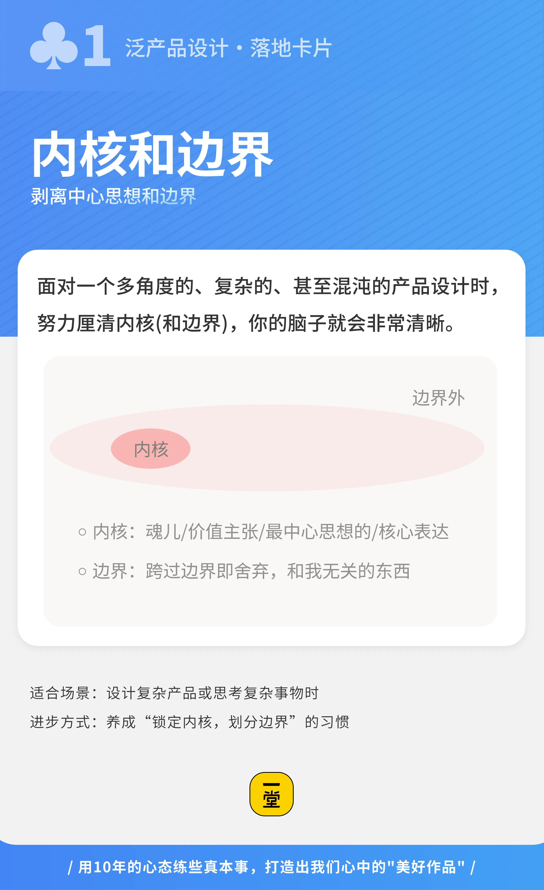

### 第一阶：小产品设计

**什么是小产品？**

 比如短平快的任务、一次性的PPT演讲、一张海报、一个简单的社团招新文案。

**【案例：做一张“社团招新”海报】**

- **不出牌的同学：** 随便找个模板，把社团介绍、历史荣誉、招新要求密密麻麻写满几百字，用酷炫的荧光色一渲染，觉得“太帅了”。结果贴在走廊，同学们扫一眼就走了，根本没人看。
- **出牌的同学：**
- **打出【用户视角】&【场景推演】：** 同学们是在什么场景下看海报？是在课间匆匆忙忙走过的走廊上！他们只有 **3秒钟** 的时间。密密麻麻的字根本看不清！
- **打出【最佳实践收集】：** 赶紧去搜苹果发布会的Keynote是怎么做的，或者去看顶级电影海报。发现共性：大大的视觉冲击图 + 一句极简的核心Slogan + 一个巨大的二维码。
- **结果：** 海报极简，一秒抓人，扫码率提升5倍。

发现了吗？做海报不只是排版问题，而是“用户在什么场景下接收信息”的产品设计问题！

我们通过一个实战案例：《探月飞盘海报设计》，来深入理解。

**【案例背景】** 飞盘运动是我们探月学校非常有特色、也极其受欢迎的传统赛事，每年一度的飞盘大赛，全校师生都要组队参加。为了通知大家比赛时间，顺便把全校的狂欢氛围拉满，学校决定在**校门口最显眼的地方**，立一张巨大的宣传海报。

负责设计的同学干劲十足，很快就拎出了第一版。

📍 迭代第1波：从“自嗨”到“看得懂”

大家请看这个 **【初版海报 V1.0】**：

**【🙋互动】**来，大家火眼金睛，直接在弹幕里打出来：你觉得这个初版海报有什么问题？

（我看弹幕里有同学说了：“字太乱了！”“时间写错格式了！”“字和飞盘图案全都拧在一起了！”）

> **🎴 此时我们打出第1张牌：**

> **【场景推演】（属于“理解用户价值”）** 同学们，我们必须做场景推演——全校师生是在什么场景下看这张海报的？是在**早上赶着上课、经过校门口的这短短3秒钟**！如果师生走过去连时间都看不清，这张海报作为产品，它的核心功能就直接报废了。

**📍 迭代第2波：从“能看”到“不燃”**

听了反馈后，同学回去赶紧改，做出了 **【调整版海报 V2.0】**： 他们把文字和图排开了，格式也修正了，信息一目了然。

**【💡思考】**大家再看看，现在字是清楚了，但你觉得这张海报拿出来，能激发你想去赛场上拼杀的冲动吗？弹幕里告诉我，还差了点什么？

（有同学说：“感觉像个冷冰冰的通知单。”“背景怎么还有个奇怪的电线杆啊？”“清晰度不够，图很干！”）

没错！虽然信息表达清了，但海报毫无冲击力，主要信息也太干瘪了，根本拉不起任何比赛气氛。

> **🎴 此时我们打出第2张牌：【最佳实践收集】（属于“学习最佳实践”）**

> 做体育海报，不能闭门造车！去看看耐克、红牛、或者顶级联赛的赛事海报是怎么做的？去收集那些顶级的“最佳实践”。你会发现，好的体育海报从来不只是“传达信息”，它是在“传达情绪”！它需要动态感、需要视觉冲击力、需要那种随时要破屏而出的张力！

**📍 迭代第3波：降维打击，破框而出！**

被顶级的最佳实践“洗脑”之后，设计小组开窍了。

大家开始疯狂思考：除了在二维平面上改字体、换图片，我们还能做什么？

他们搞出了 **【终极版海报 V3.0】**！

他们做了一个惊人的举动：**直接把飞盘从海报里“飞”了出去！** 破框而出，贴在了学校的墙面上，配合海报背景上炸裂的动态撕裂线条！

那一瞬间，所有经过校门口的同学全都惊呼“太酷了！”纷纷拍照发朋友圈。大赛还没开始，全校的气氛就已经彻底被点燃了！

> **🎴 这一波，同学连续打出了2张王牌：**

> - **第3张牌：【内核和边界】（属于“落地执行迭代”）** 他们看清了海报的**内核**是“传递飞盘破空而来的力量感和狂欢氛围”，而那张矩形的纸张边缘，根本就不是设计的**边界**！

> - **第4张牌：【灵感闪现】（属于“落地执行迭代”）** 打破思维定式，把平面设计升级成了“三维装置艺术”，用极低的成本（多粘半个塑料飞盘），拿下了满分的视觉效果！

**【Keke老师小结】**

大家发现了吗？ 从 **V1.0（图文遮挡的废稿）** → 到 **V2.0（平庸乏味的通知单）** → 再到 **V3.0（惊艳全校的立体爆款）**

这个同学并不是靠死磕画图软件，而是靠**不断出牌**——用【场景推演】修正基础逻辑，用【最佳实践收集】拉高审美天花板，用【内核与边界】和【灵感闪现】完成降维打击！

这就是**泛产品设计卡牌**在小产品上的巨大威力！