### 第二阶：泛产品创新

**什么是泛产品？** 这类开始上难度了。资源投入大，项目复杂，需要团队协作，比如你们即将迎战的 **48小时黑客松**。它不是一个小作品，而是一个独立的项目。

**【案例：黑客松48小时极限挑战】**

- **不出牌的团队：** 想到一个“AI智能书包”的点子，大家一拍脑门开始干。有人去搞硬件传感器，有人去写AI算法，有人去画APP界面。到了第40个小时，发现传感器连不上APP，AI识别全是Bug。最后答辩时，拿出了一个稀巴烂的半成品。
- **出牌的团队：**
- **第一天，打出【需求评估】&【场景推演】：** 这个痛点真的存在吗？赶紧用上节课学的“低成本验证”，跑去问问真实同学。
- **第二天，打出【内核和边界】：** 这一张牌极其关键！团队必须明确：在短短几十个小时里，什么是我们**必须要有**的（内核：比如实现重量超载报警），什么是我们**坚决不做**的（边界：比如APP里的社交功能、花里胡哨的动画）。砍掉一切不必要的伪需求！
- **打出【里程碑拆解】&【复盘迭代】：** 把48小时切分成几个核心节点（比如今晚8点必须跑通第一个电路）。没跑通，立刻复盘换方案，绝生死磕。
- **结果：** 虽然最后只有一个外观简陋但核心功能完美演示的MVP（最小可行性产品），但评委全票通过，拿下大奖。

同学们，在复杂的团队项目里，**没有边界感和里程碑拆解，你们的努力只会变成灾难。** 这就是高级卡牌的威力。

**【案例实战：《家书万金》官网 2.0】**

探月学校有个特色课程“登舱项目”——《家书万金》，这是一个非常有厚度的跨学科项目，完美融合了历史、语文、传媒和设计。同学们要去追溯自己家族的故事，了解中国近现代史，并最终亲手制作出一本沉甸甸的纸质“家书”。项目的愿景，就是记录大时代背景下，咱们普通家庭个体的真实故事。

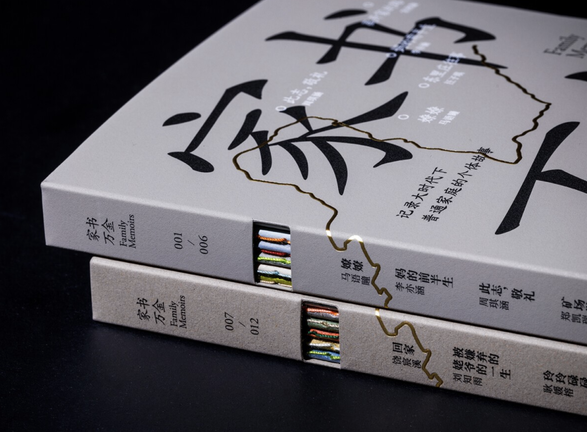

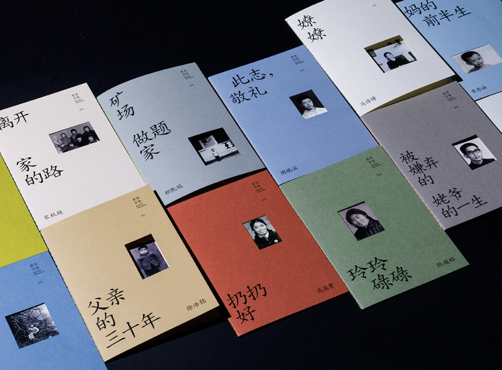

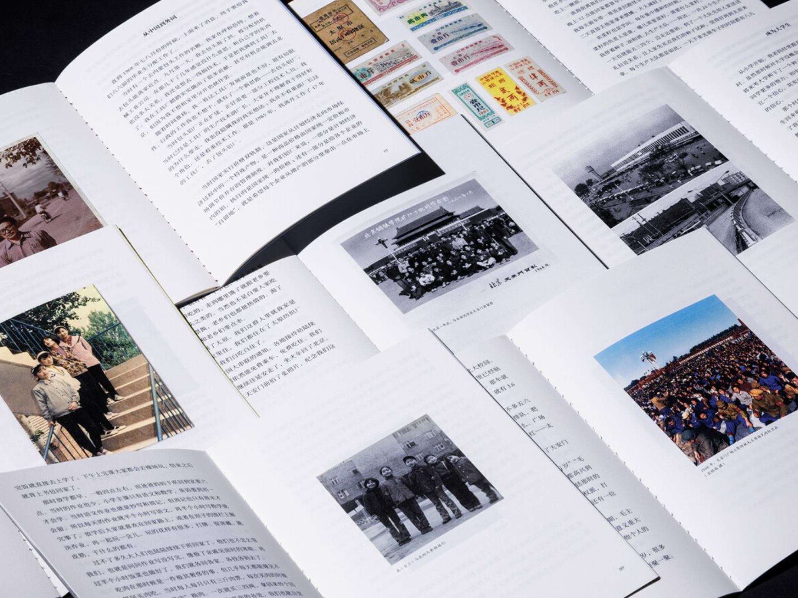

这个项目做了几年，极其感人的纸质家书越来越多。但负责项目沉淀的同学，遇到麻烦了。

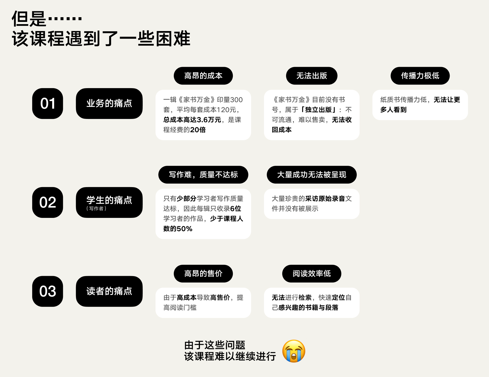

> **🎴 此时，团队敏锐地打出了第1张牌：【问题洞察】（属于“理解用户价值”）** 同学们发现：资料实在太多了，纸质书极难妥善留存；而且如果想对外宣传咱们这么牛的项目，纸本的传播能力也极其受限。痛点极度清晰——我们需要做一个《家书万金》的线上官网！

需求有了，怎么动手呢？

> **🎴 团队绝不闭门造车，立刻打出了第2张牌：【最佳实践收集】（属于“学习最佳实践”）** 他们疯狂查阅了市面上现存的各种“口述历史”网站。结果大失所望：绝大多数网站年代极其久远，浏览体验极差，毫无创新，甚至部分网页全是乱码根本无法使用。这意味着，基本无法从直接竞品中找到任何可供参考的“好榜样”。

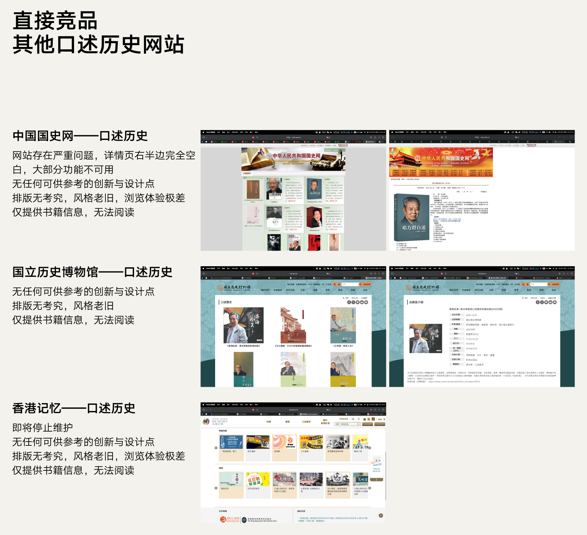

直接竞品拉胯怎么办？同学们没有死磕，立刻转变思路，去搜集全球顶级的泛设计类网站找参考。

> **🎴 看着酷炫的顶级网页，团队打出了第3张牌：【美好作品想象】（属于“学习最佳实践”）** 同学们的脑洞被打开了：“家书是在讲历史，历史不就是时光穿梭吗？我们能不能把网站设计成类似哆啦A梦的‘时光机’体验！用最炫的网页动效，带用户穿越回过去！”

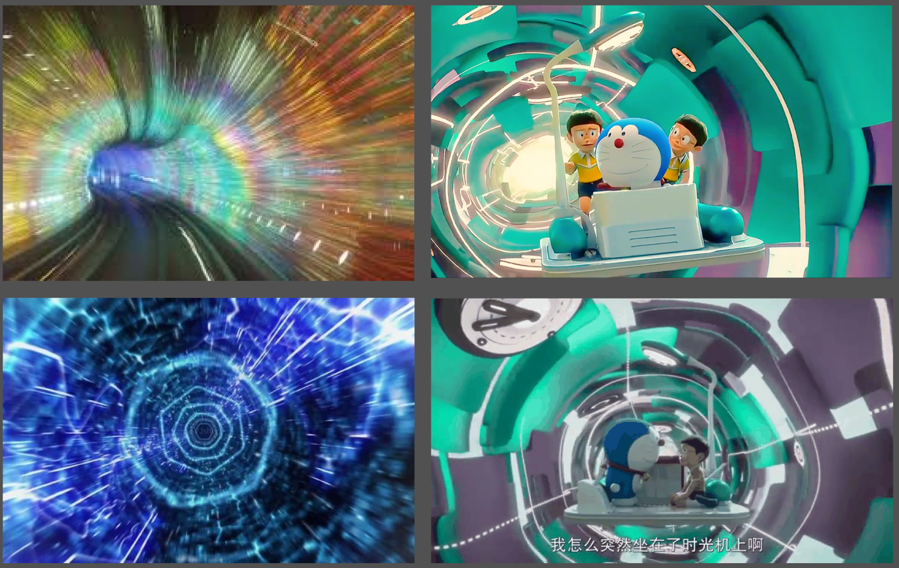

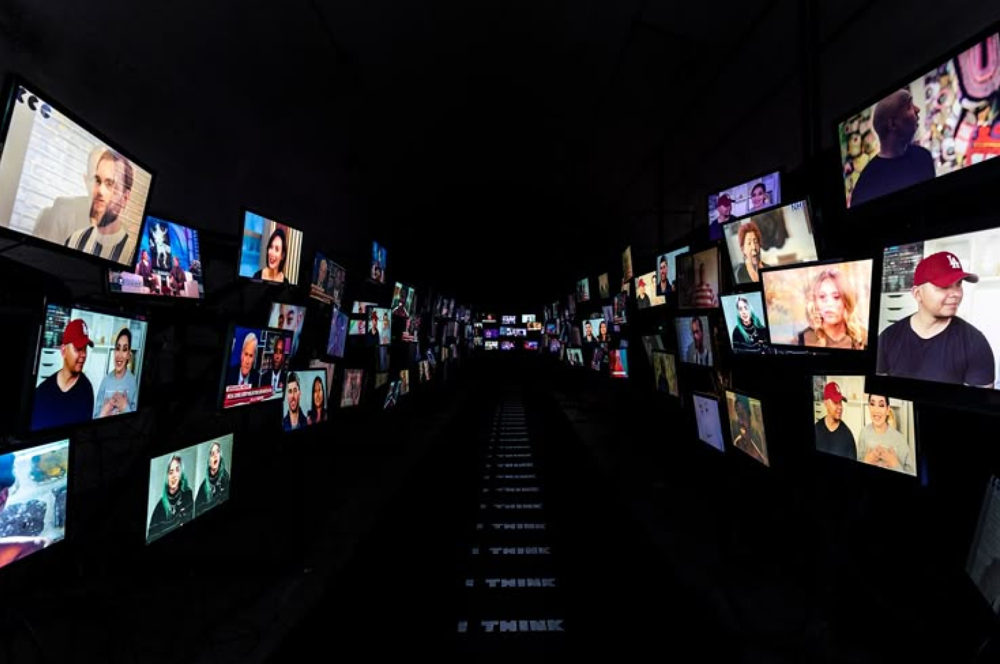

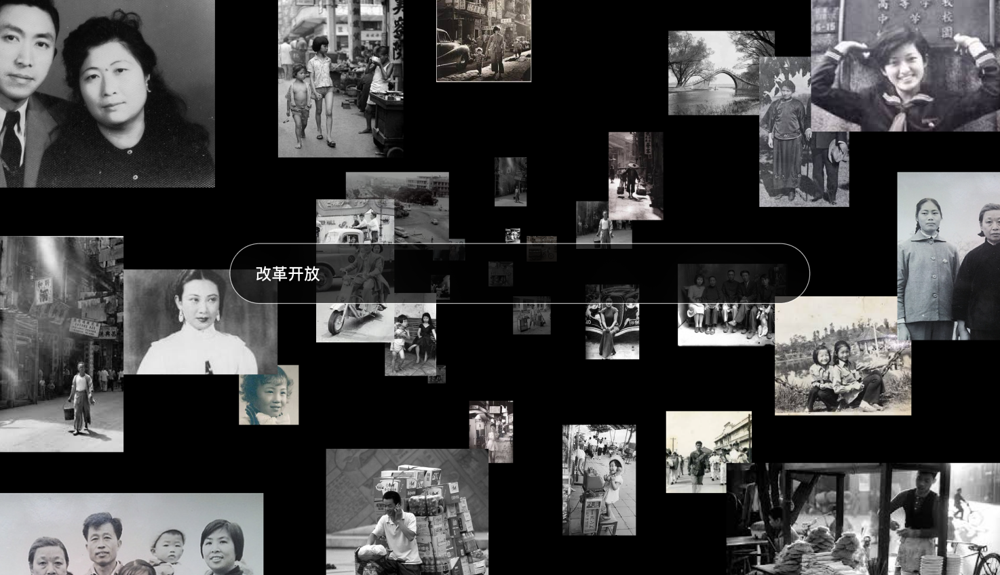

**【💡互动】**大家在公屏上告诉我，如果真的做一个科技感、赛博朋克感爆棚的“时光机”网站，来承载爷爷奶奶那一辈极其厚重、充满苦难与温情的家族历史，你们觉得对味吗？

没错！设计团队在兴奋了几天后，看着那些炫技的草图，也觉得“不对劲，好像还是少点什么东西”。如果强行上线，这大概率又是一次偏离核心的“用技术自嗨” 。

> **🎴 于是，团队果断踩下刹车，打出了第4张牌：【复盘迭代】（属于“落地执行迭代”）** 他们停下写代码的手，重新把当年那一本本泛黄的纸质版《家书万金 1.0》摆在桌子上。去反复摩挲、去反思：大家当年为什么会被这些粗糙但真实的纸质书深深打动？

> **🎴 这一反思，直接逼出了极其致命的第5张牌：【产品内核】（属于“理解用户价值”）** 时光机只是一个“壳”，家书真正的“灵魂”是什么？是时代的眼泪，是个体在岁月里留下的真实温度！

> **🎴 抓住了灵魂，团队郑重地打出了第6张牌，也是收官之战的王牌：【设计原则】（属于“落地执行迭代”）** 他们重新定义了官网 Web Design 的最高行动标尺：曾经《家书万金 1.0》（纸质版）所拥有的最宝贵的特质，必须被完美延续到 2.0 版本的线上网站里！这三大设计原则被死死钉在了黑板上：
> 1. **精美的包装设计**
> 2. **独特的创意想法**
> 3. **历史的真实质感**

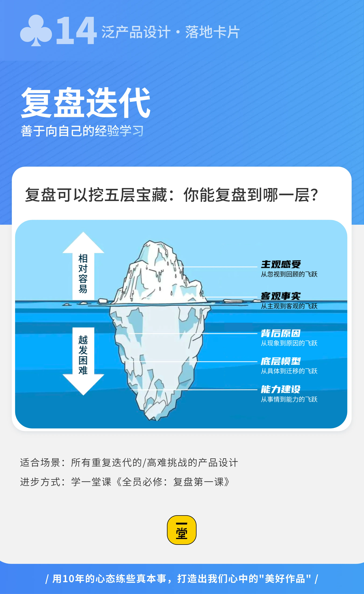

最终做出来的官网，没有浮夸的时光穿梭特效，而是完美还原了那种翻阅旧信件的厚重感、颗粒感和纸张的肌理感。

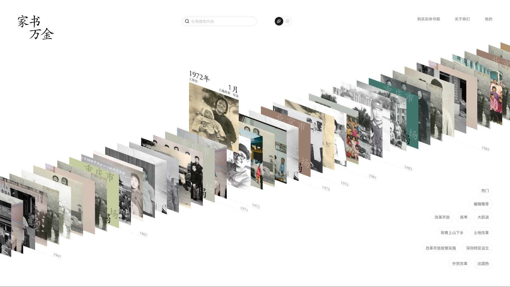

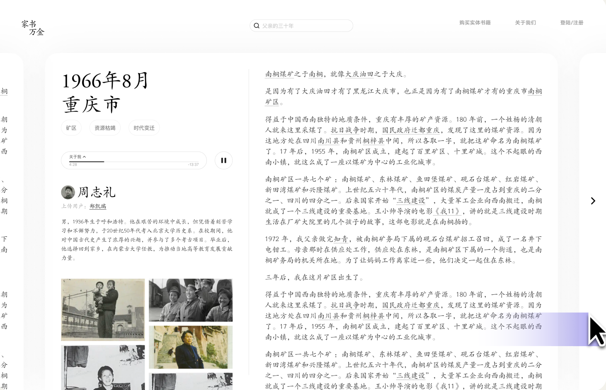

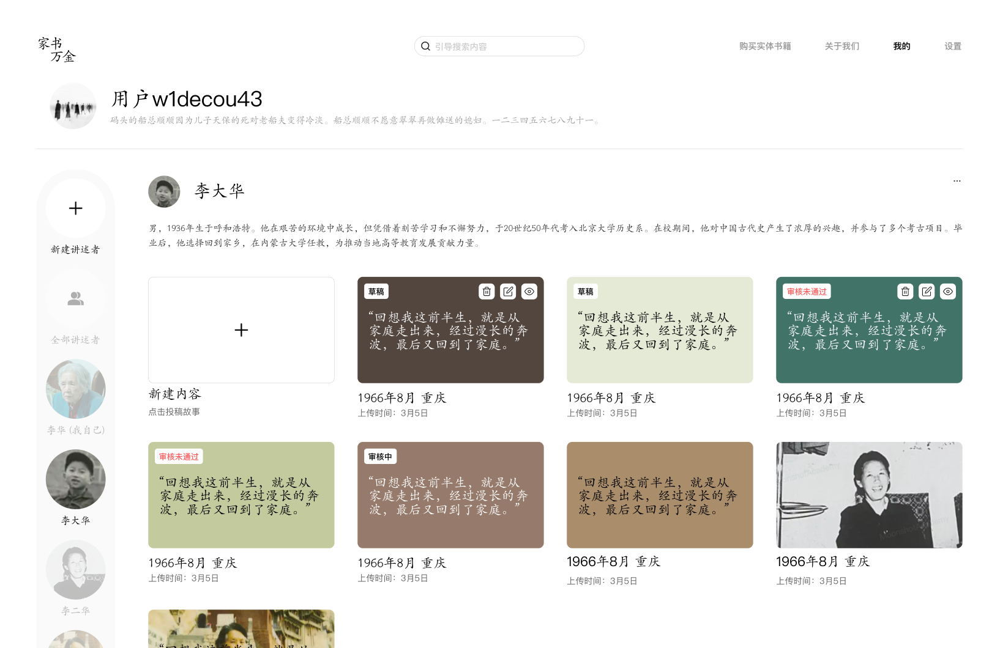

同学们，这就是一套专业的高阶卡牌，在一个复杂项目中发挥的威力！从发现问题、搜寻榜样，到差点走偏，再到向内挖掘内核，最终确立不可撼动的设计原则。

**多出一张卡，你的项目就能在关键时刻避开一个大坑，质量就能直接拔高一个段位！** 