### 重新理解课题 —— 泛产品设计

#### 第一层：泛产品的三大追求

#### 第二层：两种设计分类

大家进入真实场景“打牌”之前，我们得先认清咱们今天面临的“战场”到底有哪几种。

很多同学一听到“产品设计”，脑子里浮现的就是互联网大厂里写代码、做APP。其实远不止于此。根据任务的体量和复杂度，我把大家在校园和生活中会遇到的设计任务，精准地分成了两大类。

我们刚才分别学习了下面两类：

什么是小产品？说白了，就是**短平快的个人单点任务**。

- **核心目标：** 主要是为了表达一个**想法**、完成一个**作品**，或者进行一次**艺术创作**。
- **典型场景：** 比如你周末在家录制了**一份播客**、为社团画了**一个海报**，或者给班级活动做了**一个视频剪辑**。
- **三大特征：** 1.  **资源：少。** 基本不需要拉赞助或申请巨额经费。 2.  **项目：简单。** 流程清晰，不需要复杂的系统架构。 3.  **角色：单人主导。** 你自己就是大Boss，一个人就能单枪匹马把活儿干完。

面对小产品设计，你要做的是快、准、狠地击中痛点，把个人的才华发挥到极致。

这类开始彻底上难度了！这也是咱们即将在**48小时黑客松**里要面临的真实挑战。

它不再是你可以躲在被窝里一个人搞定的小玩意儿，而是**长期、复杂的多人系统任务**。

- **核心目标：** 打造一个跑得通的**独立产品**，或者建立一套完整的**闭环系统**。
- **典型场景：** 咱们接下来要死磕的**黑客松项目**、策划并落地一场上百人参与的**探月招新**活动，甚至放眼未来，你去线下开**一家实体门店**。
- **三大特征：** 1.  **资源：多。** 需要资金、场地、技术、设备等多方支持。 2.  **项目：复杂。** 牵一发而动全身，有无数个需要权衡的细节。 3.  **角色：多人协作。** 绝对不可能单打独斗，必须要有懂技术的、懂设计的、懂表达的人配合默契。

面对泛产品设计，个人的才华不再是唯一的决定因素，**团队如何运用正确的方法论和工具箱**，才是决定成败的关键。

**【🙋互动】**来，考考大家，快速测一下你们的“网感”： 假设你要帮同桌策划一场有50人参加的18岁成人礼派对，需要租场地、写流程、排节目、算预算……请问这属于哪一类？在公屏上打出你的答案！

弄清楚了这两个不同的战场，然后看看咱们手里的“泛产品设计卡牌”到底该怎么打！

#### 第三层：三组卡片

用户视角、用户分层、场景推演、产品内核、问题洞察、多视角思考

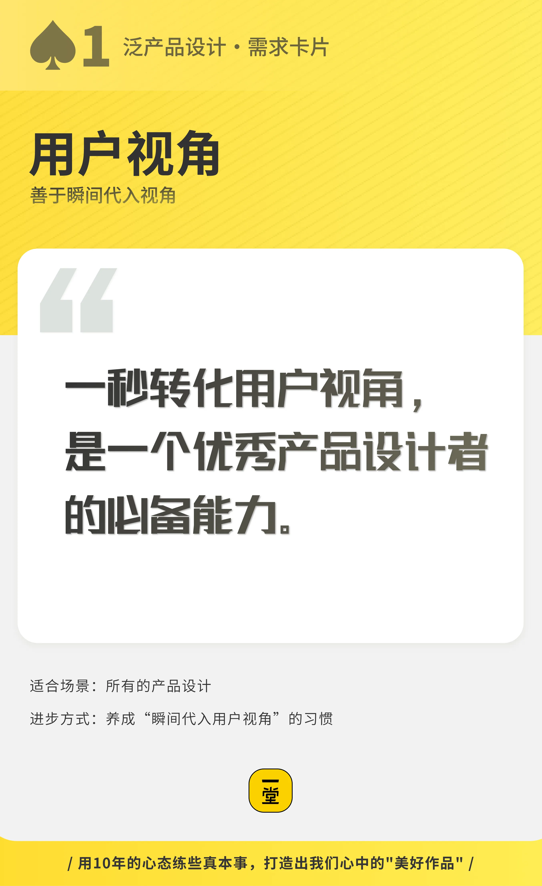

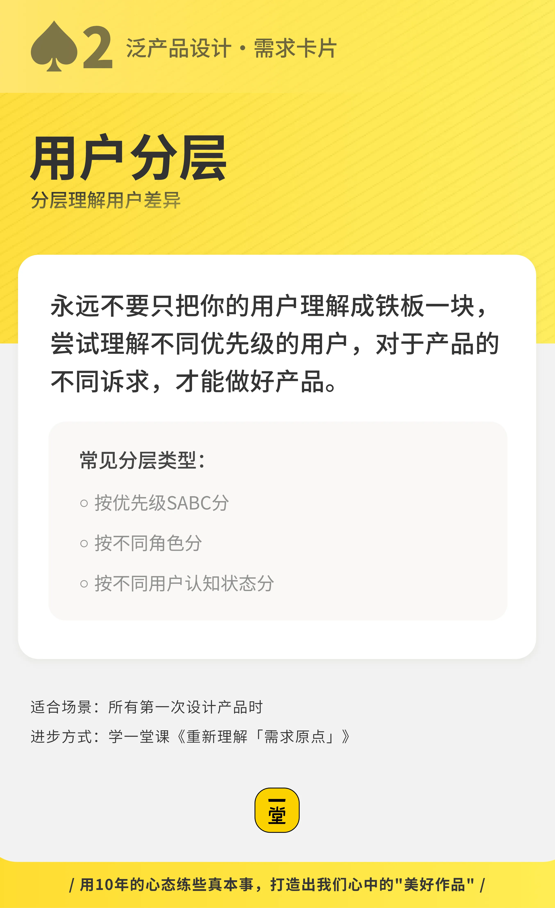

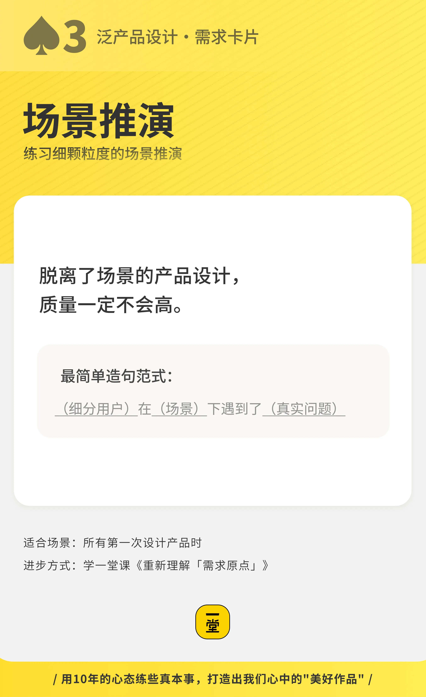

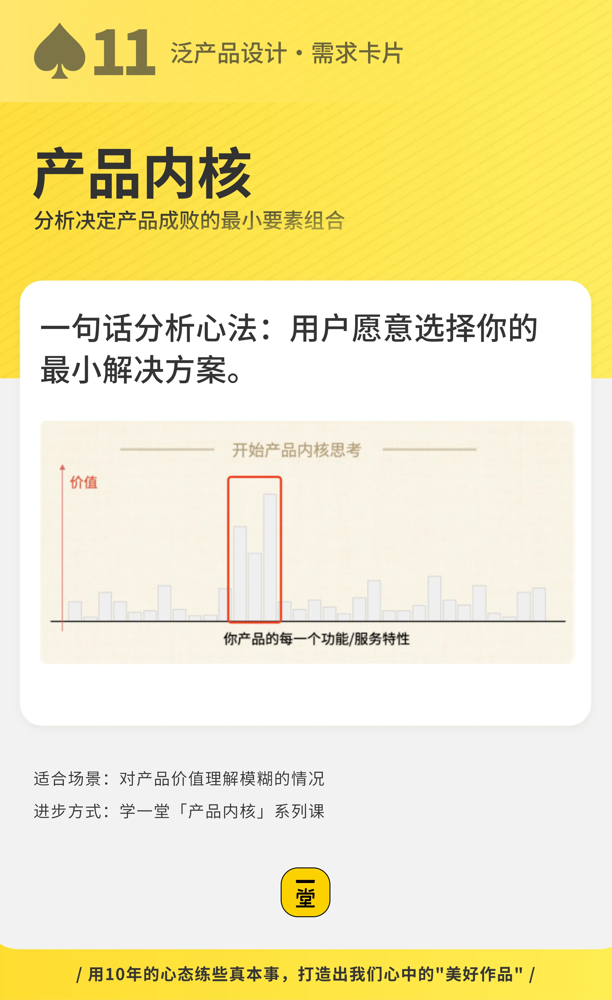

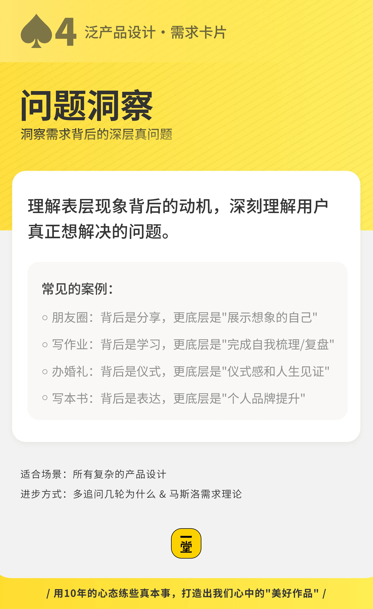

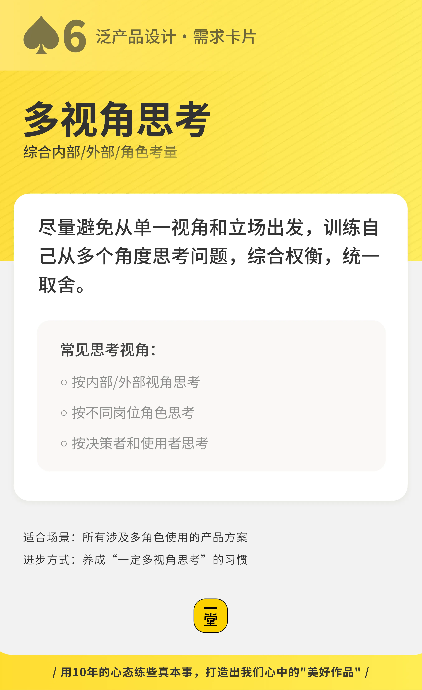

最佳实践收集、最佳实践池子、最佳实践建模、美好作品想象

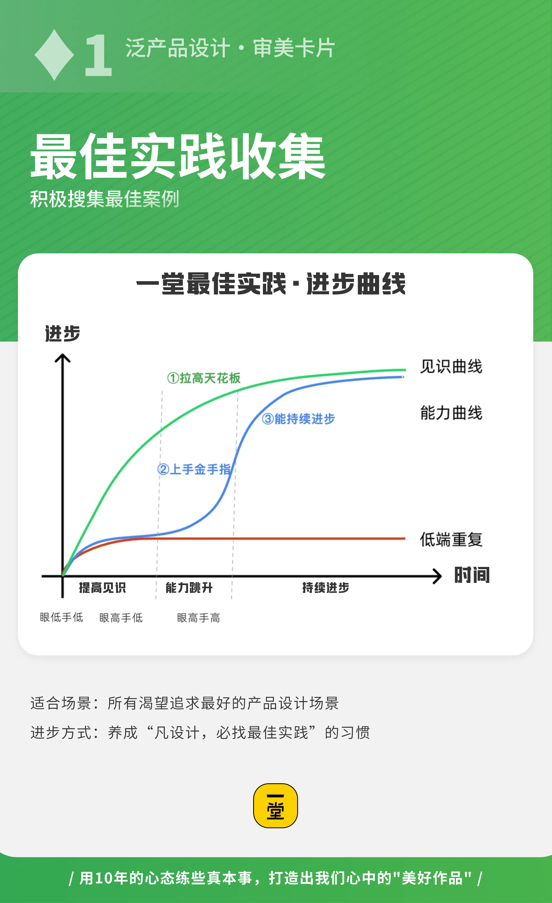

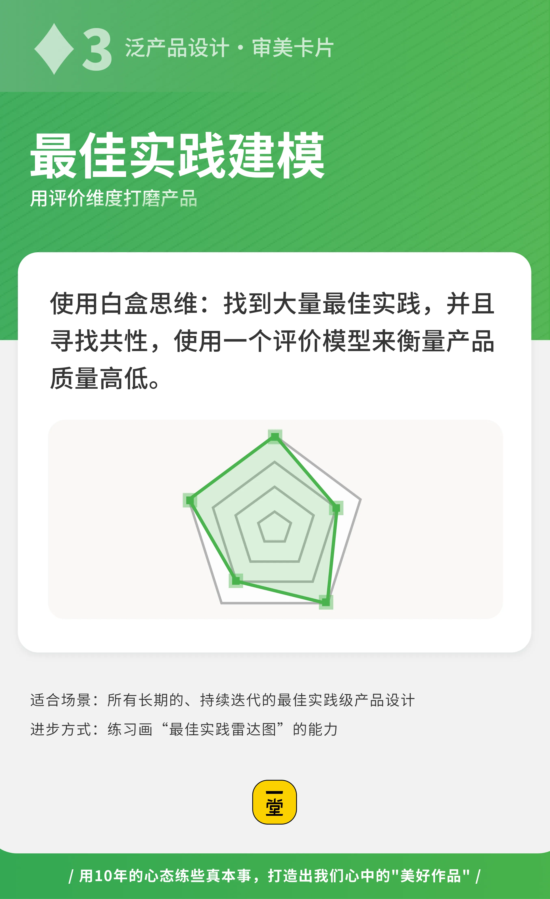

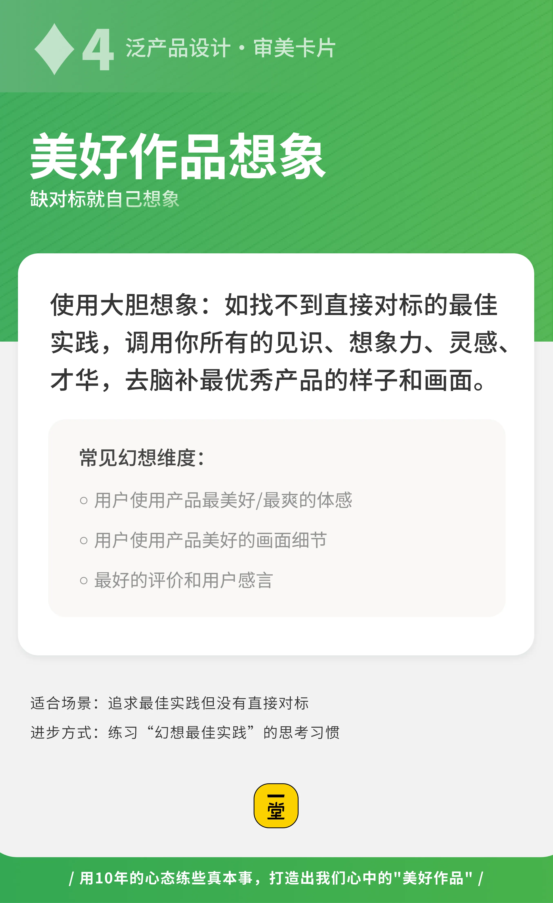

内核和边界、设计原则、复盘迭代、灵感闪现

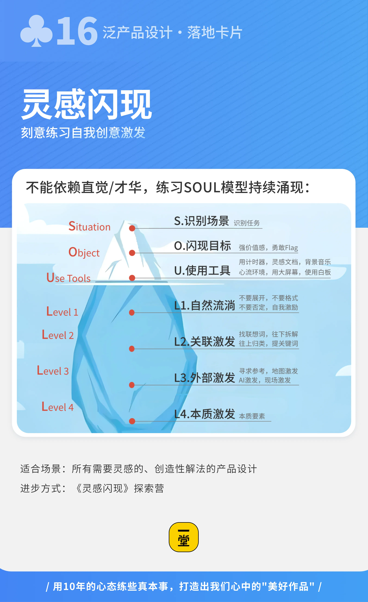

带过这么多届学生，我时常提醒大家养成“打牌”的习惯。但很多同学进入状态很慢，总是嫌麻烦，没意识到这套工具箱真正的价值。

今天课程的最后，我想和大家分享一个非常底层的价值观。

不知道大家有没有想过一个问题：**在这个没有标准答案的世界里，你怎么判断自己努力的方向，到底是不是正确的？**

很多时候，我们以为自己走在正确的道路上，其实只是因为最后恰好成功了，才回头给自己贴上一个“眼光真好”的标签。

关于这个问题，我想送给大家一段话。在1995年的《遗失的访谈》(Lost Interview) 中，主持人问了苹果创始人乔布斯一个直击灵魂的问题：

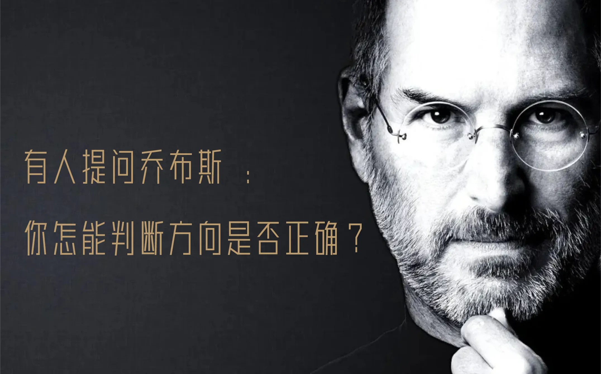

> **“你怎能判断方向是否正确？”**

乔布斯听到这个问题时，没有立刻回答。他差不多整整沉默了10秒钟。 然后，他说出了一句意味深长的话：

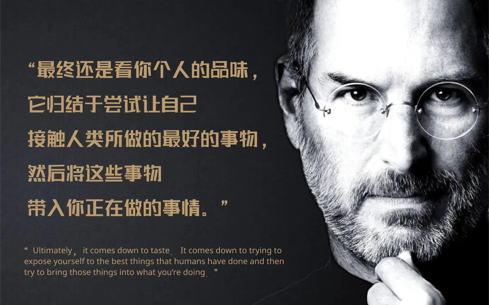

> **“通过品味（Taste）。通过让自己暴露在人类做过的最美好的事物面前（Expose yourself to the best things humans have done），然后把它带进你正在做的事情里。”**

这不只是一个商业层面的回答，而是一个更本质的、产品哲学层面的思考！

我们换一个视角来看，这其实是一个**人生尺度**的答案。它超越了你当前在学校里的成绩，超越了黑客松的奖项，甚至超越了未来的行业红利。它是一个长期追求的核心做事价值观：

我们把主要的注意力放在**用户和产品价值**上，然后长期不断地感知、**不断输入高价值的信息（打出【最佳实践】牌）**，不断去感受世界上最顶级的东西，从而**不断提升自己的判断力和审美**。

商业是有阶段性和周期性的，但“做出一款好产品”、“把一件事情做到极致”的能力，是属于你整个人生旅程中的核心资产。

与其蜻蜓点水，不如十年磨一剑。

从泛产品设计开始，从这节课开始，从你**敢于在下一次任务中打出一张卡牌**开始，请用十年的心态，一步步来练习吧！