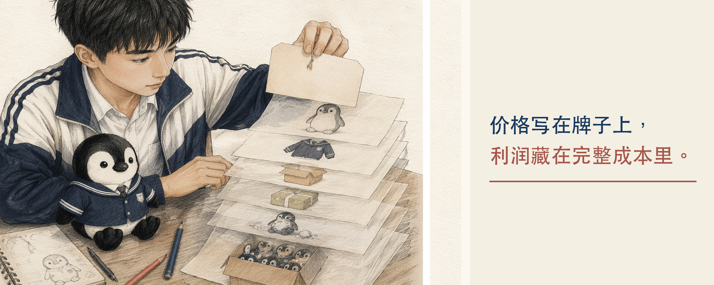
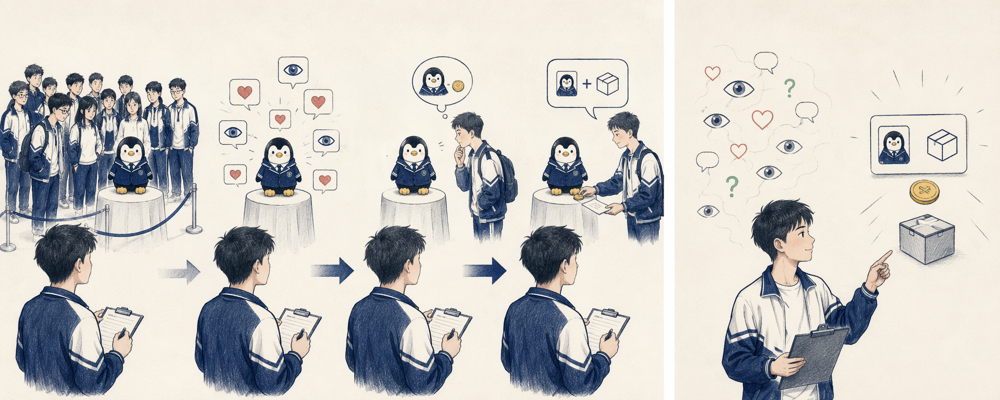
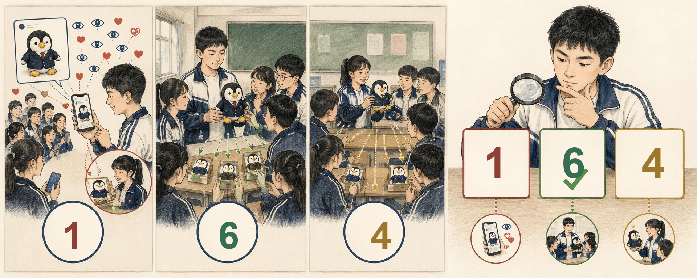
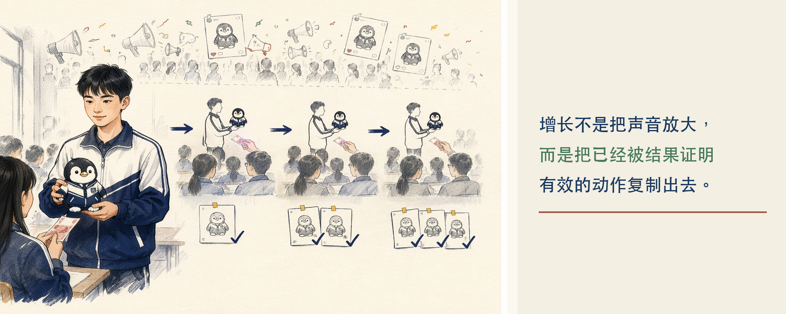
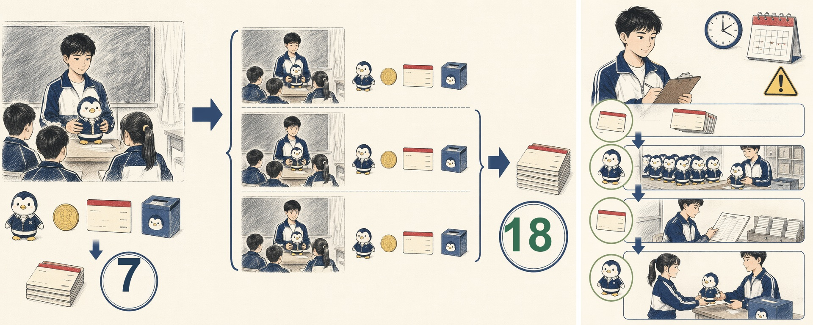
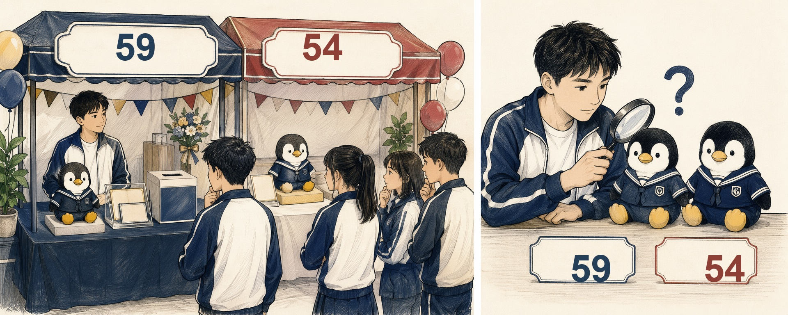
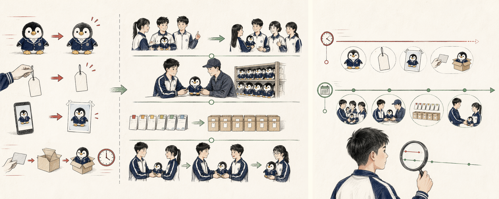
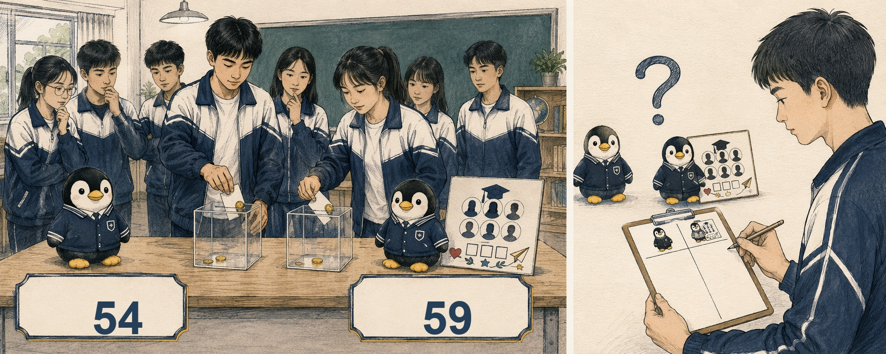
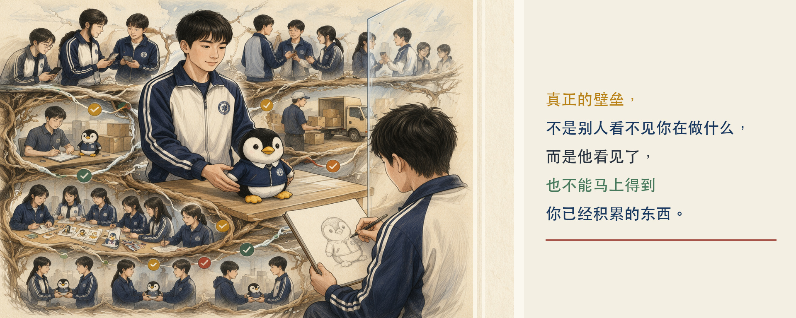

## 第三部分｜完整实战：用500元走完一次五步法

同学们，刚才我们已经打开了五步地图。现在，那500块钱还放在桌上。距离毕业典礼只剩七天。我们还没有进货，没有发朋友圈，也没有决定到底卖什么。

有人可能已经开始着急了：

> “再不买东西，就来不及了。”

但是先别急。**做商业很危险的一件事，就是因为时间紧，随手抓住一个自己喜欢的产品**，然后告诉自己：“我喜欢，大家应该也会喜欢吧。”这样真的就很危险了，哈哈

所以，我们现在正式进入第一关。**不是选择产品，而是寻找需求**。

### 第一关｜需求原点

如果我现在问大家：“毕业生需不需要纪念品？”

很多同学可能会说：“当然需要。”

但是，“毕业生”这三个字里面，可能装着几百个完全不同的人。

> - 有人马上就要离开学校，希望留下一件带有学校印记的东西。

> - 有人对纪念品没有太大感觉，只想赶快结束典礼回家。

> - 有人原来没准备买，但到了现场，看见大家拍照、签名、挑选纪念品，突然也觉得：“我是不是也应该留下点什么？”

还有人想给自己的同学，或者陪伴了大家几年的老师，准备一份毕业礼物。所以，“所有毕业生都需要纪念品”，这句话太大了。我们需要继续往下拆。

**【🙋互动】**现在给大家四类学生：谁更可能购买学校纪念品？

> - A. 马上要离开学校，想留下一件带有学校印记物品的学生。

> - B. 对纪念品没什么感觉，只想赶快结束典礼回家的学生。

> - C. 原来没准备买，但现场看到大家拍照、签名、挑选纪念品后，也突然想留下点什么的学生。

> - D. 想给同学或者老师准备一份毕业礼物的学生。

**你觉得谁更可能在毕业典礼现场购买纪念品？可以多选，把你的答案打在评论区。**

选完以后，我们还要再回答一个问题：“他为什么会在这个时候产生购买的想法？”

**【💡划重点】**不能只说：“因为他喜欢。”我们需要继续问：**“他是在什么时间、什么地方，看到什么、发生了什么，才突然想要这件东西？”**

这就叫需求场景。**用户不是“所有人”这个大词，而是某一类人在某一个时刻产生的具体需要。**

#### 把时间拨到毕业典礼当天

现在，我们把时间拨到毕业典礼那一天。早上，阳光照进教学楼。同学们穿着校服，背着书包，像平时一样走进学校。但是大家心里都知道：“今天和平时不一样。”

> - 有人站在教学楼前拍照。

> - 有人拿着笔，追着同学在校服上签名。

> - 有人抱着毕业册，从教室前排走到最后一排，请每个人留下一句话。

典礼快结束时，广播里的音乐响起来。大家开始收拾东西。教室里的桌椅还是原来的样子，但以后坐在这里的，可能就是另一群学生了。就在这个时候，**大家突然意识到：“今天离开以后，我可能不会再每天走进这个校门了。”**

以前每天都能看到的校门、操场和教学楼，在这一天突然变得有点不一样。一些学生会希望带走一件东西。它不一定昂贵，也不一定很大。

但几年以后再看到它，他能够马上认出来：

> - “这是我的学校。”

> - “这是我毕业那一年留下来的。”

> - “这是我在这里生活过的印记。”

**【🙋互动】**普通物品怎样变成学校纪念品？现在还是先不要决定我们到底卖什么。

假设桌上摆着三件非常普通的东西：

> - 一个没有图案的卡套。

> - 一本普通笔记本。

> - 一只随处都可以买到的毛绒玩具。

旁边还摆着另外三件东西：

> - 卡套上印着学校名称和毕业年份。

> - 笔记本使用了学校建筑和校服颜色。

> - 毛绒玩具穿着这所学校的校服。

两组东西的基础功能可能完全相同。卡套还是用来装卡，笔记本还是用来写字，毛绒玩具还是用来摆放或者拥抱。

但是，第二组多了什么？大家可以把自己的答案打在评论区。

可能有人会说：

> - “多了学校名称。”

> - “多了校服。”

> - “多了毕业年份。”

> - “多了只有这所学校的学生才熟悉的东西。”

**现在继续想：“如果两组商品价格相同，你更愿意选择哪一组？”**

如果带有学校元素的那一组贵一点呢？你愿不愿意为这些学校元素多付一点钱？这里没有统一答案。

我们真正要发现的是：**用户买到的不只是物品的使用功能，还可能有物品所承载的身份、经历和意义。**

#### 现在仍然不能急着进货

到这里，**有人可能会很兴奋地说：“我知道了，大家想留下学校印记**。”先别急着下结论。这仍然只是我们坐在课堂里作出的推测。

如果真的准备花掉500块钱，我们需要验证：

> - 到底有多少学生这样想？

> - 他们更在意哪些学校元素？

> - 他们愿意购买哪类物品？

> - 他们愿意为这份学校印记支付多少钱？

我们可以先找20位同学，问几个问题：
> 1. 毕业时，你最想留下一件什么东西？
> 2. 你希望它和学校有什么关系？
> 3. 卡套、纪念册、明信片和毛绒玩具，你更愿意选择哪一种？
> 4. 你大概愿意花多少钱？
> 5. 如果现在需要先付一部分钱预订，你愿意吗？

最后一个问题非常重要。一个人说：“这个想法挺好的。”**和他真的拿出10块钱预订，是两种不同的证据。**

**【🙋互动】**现在有三位同学：哪一种回答更可信？

> - 第一位说：“这个想法挺好的。”

> - 第二位说：“如果不超过30块钱，我可能会买。”

> - 第三位说：“这是10块钱订金，毕业典礼当天我来取。”

你觉得哪一种回答，更能证明需求真实存在？不是第一位同学不真诚，也不是第二位同学在说谎。

**只是当一个人愿意付出真实成本时，他的选择更接近真实需求。这个成本可能是钱，也可能是时间、行动，或者愿意留下联系方式。**

#### 第一关小结

所以，第一关真正要完成的，不是写下一句：“毕业生需要纪念品。”

而是把它拆成：

> - “哪一类毕业生，在毕业典礼的哪个时刻，想留下一种什么样的学校印记？”

> - “这个愿望有多强？”

> - “他愿不愿意为此付出真实成本？”

刚才，我们一共做了四件事：
> 1. 从“所有毕业生”缩小到更可能购买的人。
> 2. 找到他们产生需求的具体场景。
> 3. 区分普通物品和物品背后的学校印记。
> 4. 用真实行动验证，而不是把猜测直接当成事实。

现在，我们可以先提出一条等待验证的需求假设：“在毕业典礼前后，一部分即将离校、对学校生活有认同感的学生，希望留下一件带有学校身份印记的物品，让自己几年以后看到它时，仍然能够想起这段校园经历。”

**【💡划重点】这是一条需求假设，不是已经确认的事实。**

而且，到现在为止，我们仍然没有决定最终卖什么。学校印记可以放在卡套上，可以放在纪念册上，也可以放在明信片、毛绒玩具或者现场合影上。**到底用什么产品来承载这份学校印记，才最能满足刚才找到的需求？**

这就进入第二关：解决方案。

### 第二关｜解决方案

同学们，刚才我们完成了第一关。我们找到了**一条等待验证的需求假设：**在毕业典礼前后，一部分即将离校、对学校生活有认同感的学生，希望留下一件带有学校身份印记的物品。

现在问题来了。我们已经知道他们想留下“学校印记”，是不是就可以马上去买企鹅了？还不行。**因为“想留下学校印记”是一种需求，企鹅只是满足这种需求的一种办法。**

**同一个需求，可以有很多解决方案。**

可以做一只穿着本校校服的企鹅，可以做印有学校建筑的卡套，可以做一本全班签名册，也可以在毕业典礼当天拍照并现场打印。

所以，进入第二关以后，我们要问的不是：**“我最想卖什么？”**

而是：**“哪一种办法，更能满足刚才找到的需求？”**

**【🙋互动】**你会选哪一种方案？现在桌上有四种方案：

> - A. 穿本校校服的企鹅玩偶。

> - B. 印着学校名称和毕业年份的卡套。

> - C. 可以让全班同学留言的签名册。

> - D. 毕业当天拍摄并马上打印的合影。

如果只能选一种，你会选哪一种？先把答案打在评论区，再说说你的理由。

——————————

这里暂时没有标准答案。

> - 有人会觉得企鹅更有纪念感；

> - 有人会觉得卡套每天都能用；

> - 有人认为签名册里有同学亲手留下的话，更难替代；

> - 还有人会觉得现场合影记录的是毕业当天真实发生的那个时刻。

我们真正要比较的，不是谁看起来最可爱，而是谁更能承载用户想留下的那份学校印记。至于它的成本是多少、卖多少钱、能不能赚钱，我们先不急着算。

那是下一关“商业模式”要解决的问题。**这一关先只看：这个办法，到底能不能把用户的问题解决好？**

#### 少了什么，用户就不想买了？

我们先拿校服企鹅做一次实验。

> - 假设这只企鹅有一个漂亮的包装盒。拿掉包装盒，用户还会不会买？可能还会。

> - 再假设它胸前有一颗装饰纽扣。拿掉这颗纽扣，用户还会不会买？可能也会。

但是，如果我们把企鹅身上的校服脱掉，把学校标志、校服颜色和毕业年份全部拿掉，它就变成了一只随处可以买到的普通企鹅。这时，原来想买它的毕业生还会不会愿意花更多的钱？这就不一定了。

所以，对这个产品来说，真正重要的可能不是“它是一只企鹅”，而是：**这只企鹅带有只有这所学校的学生才能认出来的身份印记。这就是我们要寻找的产品内核。**

产品内核不是“产品有什么”，而是：**“这里面哪一样东西不能少？少了它，用户就不想买了。”**

**【💡划重点】**“**学校身份印记是内核”目前仍然只是一条假设，还不是事实。**

**【🙋互动】**我们的对手只有别的摊位吗？假设我们真的做了一只校服企鹅，它的对手是谁？可能是网上更便宜的普通企鹅，也可能是其他学校纪念品摊位。但还不止这些。

学生可以用手机保存照片，可以请同学在校服上签名，可以保留毕业册，也可以什么都不买。这些原来就在使用的办法，都是我们的替代方案。

**所以，第二关还要继续问：**

> - “用户现在用什么办法解决这个问题？”

> - “我们的方案，为什么比他原来的办法更值得选择？”

如果一只校服企鹅既不能承载更特别的学校记忆，也不能比照片、签名册或普通玩偶提供更多价值，用户为什么要买它？

**解决方案成立，不是因为我们把产品做出来了，而是因为它给了用户一个选择它的具体理由。**

#### 不要先做100只，先做一个实验

现在，我们认为校服企鹅可能是一个不错的方案。

接下来应该怎么做？

> - A. 直接把500块钱全部拿去进货。

> - B. 先做一个样品，给目标学生看，并尝试收取订金。

> - C. 做一张很漂亮的海报，问大家觉得好不好看。

我更建议选择B。我们可以先做一个简单样品，甚至先用普通企鹅加一件临时制作的校服，模拟最终效果。

然后把它拿给真正可能购买的学生看：

> - “如果毕业典礼当天能够拿到，你愿意买吗？”

> - “你更在意校服、学校标志，还是毕业年份？”

> - “如果需要先付10块钱订金，你愿意预订吗？”

**如果很多人说“真可爱”，但没有人愿意预订，我们就不能急着生产。**

**如果有人愿意付出真实成本，我们才获得了一条更强的证据。**

这就是最小验证：**不用先把产品做得很完整，先用最小成本验证最重要的那部分价值。**

#### 第二关小结

刚才，我们在解决方案这一关做了四件事：

> - 第一，围绕同一个需求，提出多个候选方案。

> - 第二，用用户的需求来比较方案，而不是只看自己喜欢什么。

> - 第三，用“拿掉以后还会不会买”寻找产品内核。

> - 第四，先做最小样品，用真实行动验证，而不是直接大量生产。

现在，我们得到了一条新的方案假设：对一部分希望留下学校印记的毕业生来说，穿着本校校服的企鹅，可能是一种值得选择的纪念品；**它真正的内核不是普通玩偶，而是只有本校学生才能认出来的学校身份和毕业记忆。**

但即使有人愿意预订，我们仍然不能马上说：“这门生意已经成立了。”因为接下来还要打开账本：

> - 一只企鹅做出来要多少钱？

> - 准备卖多少钱？

> - 订多少只才能不亏？

> - 如果有人临时不要了怎么办？

这就进入第三关：商业模式。

### 第三关｜商业模式

同学们，刚才我们完成了第二关。我们没有直接买100只企鹅，而是先做了一个样品，拿给真正可能购买的学生看。

假设有人看完以后说：“这只企鹅穿的是我们学校的校服，我想要一只。”甚至还有同学愿意拿出10块钱订金。**现在是不是可以宣布：“这门生意做成了！”**

**还不行。**有人愿意买，只能说明我们的解决方案可能有价值。但是一件产品卖得出去，不等于卖出去以后一定能赚钱。

接下来，**我们要进入第三关：商业模式。**商业模式这个词听起来有点大。在这个项目里，我们先把它翻译成三个最简单的问题：

> - 钱从哪里来？

> - 每卖一只企鹅，到底赚不赚钱？

> - 投进去的500块钱，最后能不能收回来？

**【🙋互动】**成本30元，卖60元，就赚30元吗？假设一只企鹅的进货和制作成本是30块钱，准备卖60块钱。请大家快速判断：卖出一只，是不是就能赚30块钱？

> - 觉得“是”的打1。

> - 觉得“还不能确定”的打2。

————————

答案是：还不能确定。

因为我们现在只算了一笔最容易看见的账。除了企鹅本身，可能还有校服定制、包装、运输、损坏、退款，以及没有卖掉的库存。所以，算账不能只算自己第一眼看到的成本。**价格写在牌子上，利润藏在完整成本里。我们要尽量把这件事里发生的每一笔钱都找出来。**

#### 打开第一本账

**下面使用一组课堂模拟数据。**

**【💡划重点】这不是现实中的真实报价，只是帮助大家练习计算。**

假设我们准备先订10只校服企鹅。

> - 每只普通企鹅25块钱。

> - 每套校服定制5块钱。

> - 每个包装盒2块钱。

10只企鹅一共还需要40块钱运输费。现在我们一起来算：

> - 企鹅本身：25元 × 10只 = 250元。

> - 校服定制：5元 × 10只 = 50元。

> - 包装：2元 × 10只 = 20元。

再加上40元运输费。一共需要：250 + 50 + 20 + 40 =** 360元。**

所以，我们不是只花了250块钱，而是先拿出了360块钱。如果平均放到每只企鹅上，一只企鹅占用的成本大约是**36块钱**。

#### 一只企鹅到底赚多少钱？

假设我们的售价是59块钱。如果卖出一只，收到59块钱。平均成本大约是36块钱。在企鹅全部卖完，并且暂时不考虑我们的时间、损坏和退款时，一只企鹅大约可以留下：**59 - 36 = 23元。**

这23块钱，可以先理解成这只企鹅给我们留下的空间。但注意，这里有两个非常重要的前提。

- 第一，用户真的愿意接受59块钱。
- 第二，我们准备的企鹅能够基本卖完。

**只要其中一个前提不成立，这个结果就会变化。**

**【🙋互动】**卖多少只才能把钱收回来？我们刚才一共拿出了360块钱。每卖出一只，能够收到59块钱。如果只卖出5只，我们能收到多少钱？**59 × 5 = 295元。**

但是我们已经付出了360元。这时还有65块钱没有回到手里，而且桌上还剩下5只企鹅。这些企鹅并不是立刻消失了。但是毕业典礼结束以后，它们还能不能继续卖出去，就不确定了。**所以，剩余库存也是一种风险。**

**如果卖出6只：59 × 6 = 354元。**

**距离360元还差6块钱。**

如果卖出7只：59 × 7 = 413元。

这时，我们投入的360块钱基本已经回来了。

所以，**在这组模拟数据里，我们至少需要卖出7只，才能比较有把握地把前期投入收回来。**

**这就叫回本数量。不是产品有人喜欢，我们就已经赚钱了**。我们还要知道：到底卖到第几件，投进去的钱才真正回来？

#### 为什么卖得越多，有时亏得越多？

现在换一种情况。假设我们重新计算以后发现，每卖一只企鹅，不但没有赚，反而要亏1块钱。

这时，如果我们卖10只，会亏多少钱？

> 亏10块钱。

如果卖100只呢？

> 亏100块钱。

所以，销量增加不一定是好事。如果每卖一件都在亏，卖得越多，只是在更快地把钱亏掉。

**⚠️ 在考虑增长之前，必须先确认：最小的一笔生意，到底是不是成立的？**

对我们的摊位来说，最小的一笔生意，就是卖出一只企鹅，或者完成一张订单。**如果一张订单都算不明白，就不能急着想卖给全校。**

**【🙋互动】**现在给大家三个选择：500块钱应该怎样花？

> - A. 把500块钱全部花完，尽可能多进货。

> - B. 先根据已经收到的预订数量进货，再准备少量现场库存。

> - C. 一只都不准备，等毕业典礼当天有人想买了再临时制作。

你觉得哪一种方式更稳妥？**我更建议选择B。**

如果已经有7位同学愿意预订，我们可以先围绕这7张订单准备产品，再多做少量企鹅，满足现场临时产生的需求。

这样做不能保证我们一定赚钱。但它可以减少两种风险：

> - 第一，钱全部压在卖不出去的库存里。

> - 第二，因为完全没有现货，错过现场突然产生的购买需求。

**商业模式不是追求完全没有风险。而是尽量把风险算出来，再选择一种自己承受得起的做法。**

#### 价格越高，就一定赚得越多吗？

有人可能会说：“既然36块钱一只，那我卖100块钱，不就赚得更多了吗？”从计算上看，价格提高以后，每卖一只留下的钱可能会更多。但是，价格不是我们想写多少就写多少。

如果59块钱有10个人愿意买，100块钱只剩下1个人愿意买，最后哪一种定价更合适，仍然需要验证。

所以，定价要同时看两件事：

> - 用户愿意付多少钱？

> - 这个价格能不能覆盖我们的完整成本？

**只看用户，可能卖得热闹却一直亏钱。**

**只看成本，把价格定得很高，又可能根本没人买。**

**商业模式要做的，就是在两边之间找到一个能够成立的位置。**

#### 第三关小结

刚才，我们在商业模式这一关做了四件事。

> - 第一，把一件产品相关的成本尽量找全。

> - 第二，算清楚每卖一件，到底能留下多少钱。

> - 第三，算出至少卖多少件才能收回投入。

> - 第四，用预订和小批量进货，降低库存风险。

在这组课堂模拟数据里，我们暂时得到一条商业模式假设：一只校服企鹅的平均成本约为36元，尝试以59元出售；首批准备10只，至少卖出7只收回前期投入，并优先根据真实预订安排生产。

**【💡划重点】**这仍然是一条等待验证的假设。**成本可能变化，用户愿意接受的价格也可能变化。**

**商业不是算一次账就永远不变，而是不断用真实结果修正这本账。**

现在，**我们已经找到了可能存在的需求，设计了一个值得验证的解决方案，也初步算清了这笔生意。**为了继续这个课堂实验，我们把时间向前推一步。

假设我们拿着样品进入一个毕业班，向真正可能购买的同学展示。最后，**有7位同学愿意各自支付10元订金，并留下姓名和毕业典礼当天的取货信息。**

按照刚才的模拟数据，7张真实预订达到了首批10只企鹅的预计回本数量。但现在每人只支付了10元订金，一共收到70元，并不代表投入的360元已经回到手里。只有完成交付、收齐尾款以后，预计回本才会变成真实回本。但是，一个班里拿到7张订单，**不等于我们已经找到了稳定的增长方法。**

接下来还要问：

> - “这7张订单究竟是怎么来的？”

> - “是因为同学看到了真实样品，还是因为有人在班里推荐？”

> - “同样的办法换到另一个班，还能不能继续带来订单？”

我们不是马上面向全校进1000只企鹅，而是要先找到：**哪个动作真正带来了订单？这个动作能不能被继续复制？**

接下来，我们进入第四关：业务增长。

### 第四关｜业务增长

同学们，刚才我们已经完成了第三关。我们没有把500块钱全部花完，也没有凭感觉大量进货。我们先算清楚了完整成本、售价和回本数量，然后拿着样品去收集真实预订。

现在，我们已经有了7个真实预订。每一位预订的同学，都支付了10元订金，并留下了自己的姓名和取货信息。按照刚才的模拟数据，这7个订单达到了首批10只企鹅的预计回本数量。**但现在收到的只是70元订金；真正回本，还要等完成交付并收齐尾款以后。**

接下来，**是不是只要把同样的企鹅做得更多、把宣传发得更多，就可以了？**还不能这么快。

**因为现在，我们只知道一个结果：有7位同学愿意预订。**

**但是，我们还不知道：这7张订单究竟是怎么来的？**

**【🙋互动】**这7张订单为什么会出现？假设我们回头看这7位同学。

> - 第一位同学说：“我在班里看到真实样品，觉得校服做得很像，所以预订了一只。”

> - 第二位同学说：“我的同桌已经预订了。他拿给我看以后，我也想要一只。”

> - 第三位同学说：“我在班级群里看到了图片，但一直没决定。后来看到真实样品，我才交了订金。”

> - 还有几位同学，是在课间看到其他同学围着样品讨论，才过来了解的。

**现在请大家判断：真正推动这些同学支付订金的，可能是什么？**

> - 1，是朋友圈里的一个点赞？

> - 2，是班级群里的一张图片？

> - 3，是亲眼看到真实样品？

> - 4，还是已经预订的同学向他推荐？

大家可以把自己的判断打在评论区。

————————

这里不能只靠猜。我们需要给每一张新订单，记录一个最重要的信息：**“你是从哪里知道这只企鹅的？”**

#### 什么才算一张真实预订？

在开始记录之前，我们先统一标准。

> 有人看到照片以后说：“挺可爱的。”这算不算一张预订？不算。

> 有人说：“毕业典礼那天我可能会买。”算不算？也还不算。

> 有人留下联系方式，说想再考虑一下。这是一条可能继续跟进的线索，但还不是一张真实预订。

只有当一位同学支付了10元订金，并留下姓名和取货信息时，我们才把它记作：**一张真实预订。**

**为什么一定要统一标准？**因为如果有人把点赞算成订单，有人把口头说喜欢算成订单，还有人只计算真正付过订金的人，我们最后得到的数字就无法比较。

所以，在这个项目里，我们先使用一个统一口径：**真实预订数，就是已经支付订金并留下取货信息的预订数量。**

#### 找到增长的第一指标

现在，我们进入业务增长这一关。增长可以观察很多数字：

> - 有多少人看过图片？

> - 有多少人给朋友圈点赞？

> - 有多少人询问价格？

这些数字都可能有用。但是，如果现在只能选择一个最重要的数字，我们应该看哪一个？**建议先看：每个增长动作带来的新增真实预订数。**

这里有两个关键词。

- **第一个是“新增”。**原来已经有的7张订单不能反复计算。我们要看采取一个新动作以后，又增加了多少张订单。
- **第二个是“真实预订”。**不是多了多少点赞，也不是多了多少人说喜欢，而是多了多少真正支付订金、留下取货信息的同学。

**这就是当前阶段的增长第一指标。**

**【🙋互动】**哪一个动作真正带来了订单？

**下面继续使用一组课堂模拟数据。**

**【💡划重点】这些数字不是现实中的真实结果，只是帮助我们练习判断。**

- **第一种做法：**我们把企鹅的照片发到朋友圈和班级群。一天以后，有80个人看过，20个人点赞，最后新增1张真实预订。
- **第二种做法：**我们拿着真实样品，进入三个毕业班，在课间给同学们查看。一共有30位同学认真看过样品，最后新增6张真实预订。
- **第三种做法：**我们请已经预订的同学，把样品拿给自己的同桌和朋友看。最后新增4张真实预订。

现在请大家判断：**哪一种动作，在这次实验里更值得继续测试和复制？**

**【💡划重点】**我们不是在判断朋友圈有没有用，也不是说同学推荐一定永远有效。

我们只能根据这一次得到的数据说：在当前这个毕业纪念品项目里，让目标学生看到真实样品，比只看到一张图片，更容易产生真实预订。**这就是记录数据的价值。**

它不会替我们保证答案永远正确，但它能帮助我们知道：**下一步应该优先把时间和精力放在哪里。**

#### 把有效动作复制到更多班级

现在，我们已经发现：拿着真实样品进入毕业班，可能是当前最有效的动作。下一步是不是马上在全校开10个摊位？

**还不是。**

我们可以先把这个动作，从一个班复制到另外班级。复制的时候，尽量保持几个关键条件相同：**使用同一只样品。讲清楚同样的学校身份元素。使用同样的59元价格。收取同样的10元订金。记录同样的姓名和取货信息。**

最后再比较：**“在不同班级里，这个动作分别带来了多少张新增真实预订？”**

如果在一个班有效，换到另外两个班仍然能够带来真实订单，我们才获得了更强的证据：**这个增长动作可能具有一定的可复制性。**

**增长不是把声音放大，而是把已经被结果证明有效的动作复制出去。**

**当这个动作换到相似的用户和场景里，仍然能够产生结果，我们才获得了更强的增长证据。**

#### 订单增加以后，还能不能正常交付？

假设我们把样品带进更多班级以后，真实预订从7张增加到了18张。这当然是一个好消息。

**但是，我们还要继续检查：**

> - 供应商能不能在毕业典礼前完成18只企鹅？

> - 校服定制会不会来不及？

> - 姓名和取货信息会不会记错？

> - 毕业典礼当天，18位同学能不能顺利拿到自己的企鹅？

如果订单增加了，但是产品无法按时交付，前面的增长就可能变成新的问题。所以，**复制一个增长动作时，不只是前面要能够获得订单，后面的生产和交付也要跟得上。**这里不是重新计算一次商业模式。

而是在检查：第三关已经核对过的成本、价格和交付条件，在订单增加以后有没有发生变化？

**如果条件变了，就要重新核对。**

**如果条件没有变化，而且能够正常完成交付，我们才可以继续复制。**

#### 第四关小结

刚才，我们在业务增长这一关做了四件事。

> - 第一，回头寻找：第一批订单是从哪里来的。

> - 第二，统一标准：什么才算一张真实预订。

> - 第三，用“新增真实预订数”比较不同增长动作。

> - 第四，把有效动作复制到更多相似的班级，同时检查生产和交付能不能跟上。

在这组课堂模拟数据里，我们暂时得到一条增长假设：**拿真实样品进入目标毕业班，并通过已经预订的同学进行推荐，可能比只发图片更容易带来真实预订；这个动作可以先复制到更多毕业班继续验证。**

**【💡划重点】这仍然是一条需要验证的增长假设**。我们不能因为一个班有效，就直接假设全校、其他学校，甚至所有毕业生都会有效。

**但是现在，新的问题又出现了。**假设校服企鹅真的越来越受欢迎。有人看到以后，也买来普通企鹅，给它穿上相似的校服，价格还比我们便宜5块钱。用户为什么还要继续选择我们？

别人可以模仿产品，也可以模仿展示样品和收取订金的方法。那么，有什么东西是别人不容易马上拿走的？

接下来，我们进入第五关：项目壁垒。

### 第五关｜项目壁垒

同学们，刚才我们完成了第四关。我们从第一批7张真实预订出发，开始记录订单来源。

通过一组课堂模拟数据，我们发现：

> - 只在朋友圈和班级群发图片，新增了1张真实预订。

> - 拿着真实样品进入毕业班，新增了6张真实预订。

> - 已经预订的同学向朋友推荐，新增了4张真实预订。

于是，我们把“展示真实样品”这个动作复制到更多毕业班。**真实预订从7张增加到了18张。生产、订单登记和取货流程也基本能够跟上。**

现在，这门小生意是不是就没有问题了？还剩最后一关。假设有其他同学，他们也买来了普通企鹅，也给企鹅穿上了和我们相似的校服。

我们的企鹅卖59元，他们只卖54元。他们也告诉大家：“**我们也可以收订金，也可以毕业典礼当天取货。”**

如果你是一位准备购买毕业纪念品的学生，你会不会换到更便宜的摊位？

**【🙋互动】**便宜5元，你会换吗？现在有两个选择。

> - A摊位：校服企鹅59元。你已经看过样品，知道毕业典礼当天可以取货。

> - B摊位：外观很相似，价格54元，也承诺毕业典礼当天交付。

你会选择哪一个？

- **选择A的同学**，可以说说你为什么愿意多付5元。
- **选择B的同学**，也可以说说为什么你为什么选择B

这里没有统一答案。但是这个问题会逼着我们继续思考：**如果别人能够做出相似的产品，价格还比我们便宜，用户为什么继续选择我们？**

这就进入第五关：项目壁垒。

#### 哪些东西一天就能被抄走？

我们先看看，对方可以模仿什么。

> - 企鹅的外形能不能模仿？可以。

> - 校服的颜色能不能模仿？也可以。

> - 我们卖59元，对方改成54元，难不难？不难。

> - 我们拿样品进入毕业班展示，对方能不能学习？可以。

> - 我们收取10元订金、记录姓名和取货信息，对方能不能照着做？也可以。

**所以：“这是我最早想到的。”并不等于：“别人做不出来和不能做。”**

先做出来，可能让我们获得一段时间的领先。但是**如果别人一看就会、一学就能做，它还不能成为很强的壁垒。**

#### 回头看看，我们已经积累了什么

虽然企鹅本身容易被模仿，但是走完前四关以后，我们积累的已经不只是一只企鹅。

> - **第一关，我们访谈了真正可能购买的毕业生。**我们知道：哪些学生更想留下学校印记，以及他们会在什么场景下产生需求。

> - **第二关，我们比较了多种解决方案。**我们发现：用户真正看重的可能不是普通玩偶，而是学校身份和毕业记忆。

> - **第三关，我们算清楚了成本、售价和回本数量。**我们还建立了：预订、生产和少量现货相结合的方式。

> - **第四关，我们开始记录订单从哪里来，并把有效动作复制到更多班级。**

在这个过程中，我们已经积累了三类东西。

- **第一类，是已经支付订金的学生，以及同学之间的推荐关系。**
- **第二类，是已经跑过一次的供应商、定制、登记和取货流程。**
- **第三类，是我们对目标学生、购买场景和订单来源的了解。**

这些东西可能还不够强。但是，**别人即使看到了我们的企鹅，也不能在同一天立刻拥有完全相同的用户关系、经验和交付记录。**

#### 现在的积累，够不够？

假设模仿者也慢慢找到了供应商，也学会了收订金，还能够按时交货。这时，我们现在的优势还够不够？不一定。所以，项目壁垒不是找到一个词以后就结束了。

我们还要继续问：**“我们能不能在现有产品上，再增加一层别人无法直接买到的内容？”**

**【💡划重点】**接下来不是回顾前面已经完成的事情。**而是进入第五关以后，我们新提出的一条壁垒假设。**

**【🙋互动】**下来做什么，更可能形成壁垒？现在有四种做法。

> - A. 不断强调：“校服企鹅是我们最早想到的。”

> - B. 把价格从59元降到49元，比所有人都便宜。

> - C. 邀请每个班共同完成一张属于自己班级的毕业纪念卡，再和校服企鹅一起交付。

> - D. 在更多班级群里重复发送同一张宣传图片。

你觉得哪一种做法，更有可能让别人难以马上复制？

————————

**我更建议先验证C。**为什么？因为一只普通的校服企鹅，其他摊位可以找到相似的供应商。但是，一张由本班同学共同完成的毕业纪念卡，可能包含：

> - 本班共同选择的纪念元素。

> - 毕业年份和班级编号。

> - 同学们共同留下的一句话。

> - 或者只有这个班的同学才理解的校园记忆。

这些内容不是供应商直接进货就能得到的。它需要真实班级参与，也需要同学们愿意共同完成。

但是注意：**“班级共同完成的毕业纪念卡能够形成壁垒”，现在仍然只是一条假设。**我们还没有证据证明，用户真的在意它。

#### 壁垒也需要做最小验证

既然还是假设，我们就不能直接给18只企鹅全部制作复杂的纪念卡。我们可以先做两个简单版本。

- **第一个版本：**54元的普通校服企鹅，没有班级专属内容。
- **第二个版本：**59元的校服企鹅，附带一张由本班共同确认的毕业纪念卡，并承诺毕业典礼当天准确交付。

然后拿给真正可能购买的学生看。可以问：

> - “如果便宜5元，你会选择普通版本吗？”

> - “如果多付5元，可以得到本班共同完成的纪念内容，你更愿意选择哪一个？”

> - “这里面哪一项最重要？班级内容、按时交付，还是你已经看过真实样品？”

更重要的是，不能只听口头回答。**我们仍然可以使用前面学过的方法：请学生用真实预订作出选择。**

如果多数学生因为便宜5元就更换，说明我们现在的壁垒还不够强。

如果不少学生仍然选择59元的班级专属版本，我们才获得了一条新的证据：**班级共同完成的内容、已经建立的信任和确定交付，可能比单纯低价更不容易被替代。**

#### 壁垒不是一道永远不会倒的墙

项目壁垒并不代表：“别人永远不能模仿我们。”只要一件事情有价值，别人就可能学习。

壁垒真正争取的是：当**别人开始模仿时，我们已经积累了他不能马上得到的东西，并且还在继续向前走。**

> - 今天可能是第一批真实用户。

> - 明天可能是同学之间的信任和推荐。

> - 再往后，可能是每个班共同完成的专属内容，以及稳定准确的交付能力。

**壁垒不是项目做大以后才突然出现的。它来自前面每一步留下来的积累。**

#### 从小项目的优势，到真正的商业壁垒

刚才，我们在校服企鹅项目中积累了学生关系、跑过一次的供应和交付流程，以及每个班共同完成的专属内容。更准确地说，**它们目前只是这个小项目的优势，或者壁垒的雏形。**

**只有当一种优势很难被复制、很难被替代，而且能够随着项目发展不断变强时，它才可能逐渐成为真正的壁垒。**

如果一个项目将来发展成一家大公司，可以先用三类常见优势来理解结构性壁垒。

- **第一类，是网络优势：**使用的人越多，产品对每个人越有价值。有的平台还连接两类用户，例如校园二手平台里，卖家越多会吸引买家，买家越多也会吸引更多卖家。
- **第二类，是规模和成本优势：**业务扩大以后，采购、生产和交付可能变得更便宜、更稳定。
- **第三类，是品牌、信任和独特资源：**长期稳定的体验，会让用户即使看到相似产品，仍然愿意优先选择你。

除此之外，技术、专利、数据、稀缺资源和较高的更换成本，也可能成为壁垒。

今天不用记住所有名词，只需要记住一个判断：**真正的壁垒，不是别人看不见你在做什么，而是他看见了，也不能马上得到你已经积累的东西。**

回到校服企鹅项目，它现在还没有形成强网络、规模优势或者强品牌。**学生关系、供应流程和班级专属内容，仍然只是一条需要继续验证和积累的壁垒假设。**

#### 第五关小结

刚才，我们在项目壁垒这一关做了四件事。

> - 第一，判断哪些东西容易被模仿。

> - 第二，回看前四关已经积累的用户关系、供应流程和业务认知。

> - 第三，在原有产品上提出新的专属内容假设。

> - 第四，用用户的真实选择验证，这些内容能不能降低被低价替代的可能。

在这组课堂模拟里，我们暂时得到一条壁垒假设：校服企鹅本身不是壁垒；已经建立的学生关系、稳定准确的交付，以及由班级共同完成的专属毕业内容，可能让这个项目不容易被低价模仿者立即替代。

**【💡划重点】这仍然是一条需要继续验证和积累的假设。**

对当前的小项目来说，这些只是壁垒的雏形；如果项目继续发展，**还要观察它能否形成更难复制、并且会随着时间和规模不断增强的结构性优势。**

### 回到最开始的500元

现在，我们再回到故事开始的那一天。桌上只有500块钱。距离毕业典礼还有七天。我们没有先去找最便宜的商品，也没有因为自己喜欢企鹅，就马上进货100只。

我们依次走过了五道关。

- **第一关，需求原点：**哪一类学生，在什么场景下，想留下一种什么样的学校印记？
- **第二关，解决方案：**用什么产品承载这份学校印记？少了什么，用户就不愿意选择？
- **第三关，商业模式：**完整成本是多少？准备卖多少钱？至少卖出多少只才能把投入收回来？
- **第四关，业务增长：**第一批订单从哪里来？哪个动作真正带来了新增真实预订？这个动作能不能复制？
- **第五关，项目壁垒：**当别人模仿产品和方法时，我们靠什么继续被选择？

五步法不是保证我们做的每一个项目都一定成功。它真正帮助我们做到的是：**不因为一个感觉，就把所有的钱和时间压进去。**先做取舍。再算数字。然后用真实行动验证。

**如果证据支持我们，就继续向前走。**

**如果证据不支持，我们就及时调整，而不是用更大的投入证明自己原来的猜测。**