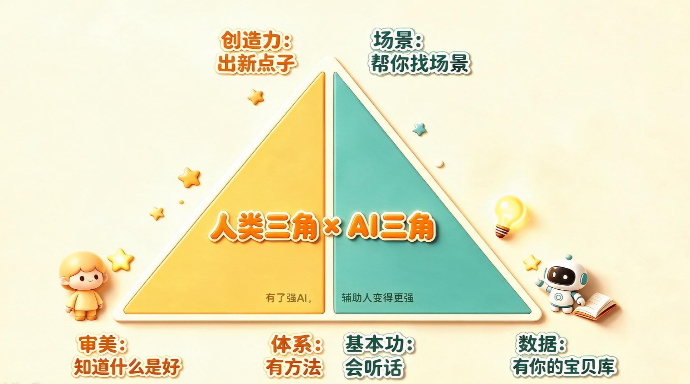

### 第五关：闯关任务——画出自己的组合+找2个帮忙场景

第四关闯过！进终极关——**动手闯关！**

#### 任务一：画出你的超级组合

闯关到这里，我们可以看到大名鼎鼎的一堂超级武器的全貌啦：

**一堂双三角**，也就是（人类xAI）**能力合体双三角**！

为了进一步了解一堂双三角的威力，请小朋友们拿出一张纸，参考下面这张一堂双三角图，在纸上画出两个三角形；

（手边没有纸笔的小朋友，可以对照双三角图形，在心里画一下~~~）

我来透露一个小秘密，这个能力合体双三角的六个顶点呢，可以标注上当前的段位小星星，从一颗星到五颗星。它显示你和AI配合的水平，是你们和AI一起解决实际问题的战力级别哦~~~

面对不同的任务，我们来看看自己每个三角顶点的星星有几颗呢~

**左边的三角形——你的三个超能力。**

> - 知道什么是好——给自己打1-5颗星⭐。1=不太能判断，5=一眼就知道好不好

> - 有方法——给自己打1-5颗星⭐。1=做事凭感觉，5=每次有固定步骤

> - 出新点子——给自己打1-5颗星⭐。1=总照着做，5=总能想出新花样

**右边的三角形——AI的三个能力：**

> - 会听话（你会跟AI说清楚吗）——1-5颗星⭐

> - 有你的宝贝库（你攒了好东西吗）——1-5颗星⭐

> - 帮你找场景（你知道什么时候找AI帮忙吗）——1-5颗星⭐

咱们可以粗略估算一下，假设我们要做一个周末出门旅游的小任务，你请AI帮忙做几个方案备选，你可以评估一下你的六个角分别可以放几颗星吗？想一想哪个角的星是最少的呢？

**星星少的哪个角呀就是你下一步要补的。星最少的角=你最弱的地方=下一步要练的。**

#### 任务二：找2个帮忙场景

写下2件你想让AI帮忙的事情——记得你是主角，AI是帮手：
> 1. ________________（比如：周末爸爸妈妈要带你出去玩，但是还没想好去哪里。)
> 2. ________________（比如：科学课要交一个小实验视频，做一个"自制降落伞"的实验，看看怎么让降落伞落得更慢）

看看每个怎么写出一句话：你想让AI小助手帮你做什么？，咱们可以一起看一下示例需要帮忙的情况怎么说哈~
> 1. 周末爸爸妈妈要带你出去玩，但是还没想好去哪里。
> 1. "AI你是一个旅游规划师。我们住在武汉，周末两天想去户外玩，
> 2. 要有地方跑跑跳跳，最好还能学到东西，不要太远（开车 1 小时内）。
> 3. 我 10 岁，喜欢动物和大自然。请给我 3 个推荐，
> 4. 每个推荐写清楚：去哪里、玩什么、大概要多少钱、需要注意什么。  
> 5. 你最推荐哪一个？但最后去哪，要我和爸爸妈妈一起商量决定哦；
> 6. 另外如果周末下雨，这3个地方哪个还能去呢？" 
> 7. 科学课要交一个小实验视频，做一个"自制降落伞"的实验，看看怎么让降落伞落得更慢？
> 1. "AI你是小学科学老师。
> 2. 我要做'自制降落伞'实验，想研究不同条件下降落伞落下来的速度。
> 3. 请帮我：① 解释为什么大伞面降落伞落得慢？② 列出我需要测量的数据（伞面大小、绳子长度、落下时间等）③ 设计一个记录表格，让我每次实验记录下来。 
> 4. 你给的步骤里，有没有哪个环节我一个人做不安全、需要大人陪的？
> 5. 还有，如果我做出来降落伞没有慢慢落，最可能是什么原因？ "

#### 任务三：用四句话写一条指令

选你想请AI帮忙的1个或者2个场景，用四句话公式写：

> - 第1句（希望AI是谁）：________________

> - 第2句（帮我做什么）：________________

> - 第3句（要什么样子）：________________

> - 第4句（做完后想想）：________________

**【🔍诊断】**可以写在纸上，也可以在心里默念哦~~~如果身边有小朋友或者家长，可以帮忙从这些角度看一下或者听一下——

> - 你的超级组合卡片画了吗？6个角有星了吗？最弱的角做标记了吗？

> - 你的1-2个帮忙场景是真实的需要吗？是“帮我做麻烦的事儿或者做有意思的事儿”对吧？

> - 你的四句话指令写全了吗？