## 初步认识：一堂推崇的笔记
### 各种记笔记困扰

**【体检🙋🏻‍♀️】**我先试着问大家三个问题，大家可以直面自己，回答一下：
1. 你有记笔记的习惯吗？一年大概会记多少篇笔记？
2. 你真的相信笔记的价值吗？还是就是一种随便记记，随便抄抄？
3. 你对自己的笔记水平满意吗？能记出来高水平的笔记么？
你们的答案是什么？
————
调研过程中，我发现大家的笔记记得五花八门，各有各的道道：
有人来不及记，一边听课一边疯狂截图：

还有各种各样的手写、脑图笔记：

再自动化一点的，就是拿个录音笔把课程录下来，整理成逐字稿or大纲，几万字，扫一扫基本就觉得差不多会了，存到知识库。
各种各样的困扰和心态：
- **学生心态：**喜欢抄课程，好看，贴纸，各种五颜六色的排版。
- **跟不上记：**前面跟不上，就像小时候做英语听力填空，为了听第一个填空，后面的没听见。
- **自己琢磨：**笔记很私密，没见过别人的，就自己琢磨，**自己发明笔记方法**。
- ....
怎么破呢？
### 市场上的各种"笔记法"

有各种书，教大家各种"记笔记的技巧"：

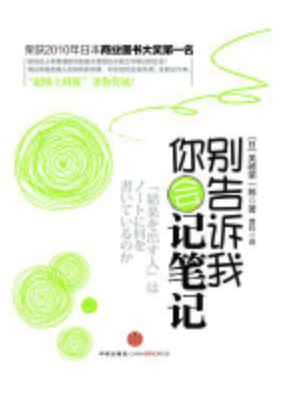

**市场上，各种笔记的工具：**纸张，笔记本，电子文档，脑图，拍照片，大纲图，手绘，动态手绘。

我们收到了大量的漂亮的笔记：

> 一堂笔记大赛pk高分作品：付豪，黑马，Lisa，阿禾，莫非。
我们还发现很多同学的经典笔记：

这些笔记都很好看，而且很适合分享、传播，但是场景有些窄，公司内部往往用的很少。
当然，听说不少人用的是“截图大法”：

**市场上各种笔记方法论**：康奈尔笔记法，方格笔记法，埃森哲笔记法，两轮笔记法，麦肯锡笔记法，子弹笔记法，达芬奇笔记法，四色笔记法，卢曼卡片笔记法。

这各种笔记，各有各的特色，各有各的优势，百花齐放，都很知名。但往往目光所及，身边人真正能长期坚持的，凤毛麟角。
你们有正在稳定使用笔记工具吗，还是随机选择？
你们有正在坚持使用什么笔记模板吗，还是用野路子？
到底是我们的自律、学习水平不行？还是工具不行？
我自己说实话，我工作前几年，试过各种笔记方法，从脑图，到康奈尔，从一页纸手绘，到手写本子，但是都没坚持下来：要么效率太低，要么就是很难持续。
怎么办呢？
**【思考🙋🏻‍♀️】**本着解放思想的原则，我们尝试回答一个**底层逻辑**：所有的笔记，我们记笔记的本质目标有哪些呢？

> 从读书到工作，从面向业务，到面向自己学习。
> 会议笔记，思考笔记，学习笔记，听课笔记，做事笔记，整理笔记。
————
**【划重点💡】**我尝试写了一个价值公式：**不困 < 加深印象 < 备忘回顾 < 多人协作 < 内化吸收 < 实时建模**
一方面自己快速学习吸收，另一方面成为未来的知识和数据资产。
我们从读书到工作，各种场景记的笔记，基本都是这些价值的排列组合。
### 我这些年的练习
这些年，我一直在探索如何用**一套范式**，来长期不断练习笔记水平，比如"现场速记"，"现场整理"，"现场洞察"，"现场萃取"的能力，经历了大概10年，1500+篇笔记的刻意练习，经常让大家感受到"哇偶"的惊讶。

比如六年前，我想学习产品设计的最佳实践，曾经花了2个晚上，对乔布斯做了一篇"专题学习笔记"，读了传记+大量文章，做了全量的信息整理。

这篇笔记我先整理了客观事实（大事记和产品线），然后观察规律，尝试去形成背后的洞察和经验，然后一步步形成对自己有用的关键认知。

比如两年前，我们考虑做一堂的私董会小组（for MBA），但是缺少基本的常识和认知，于是我们做了一次专家访谈，用2个小时，做了一次专家挖掘。
我一边提问，一边记笔记（私下），一边追问，一边挖掘，对方零散着讲了很多商业认知，一会儿说商业，一会儿说数据，一会儿说故事，一会儿说给一堂的建议。
两个小时访谈结束，我给他们投屏，讲了一遍我的笔记，包含了：自上而下（Topdown）的故事线，每个环节的要点和执行策略，甚至我顺便把一堂的关键策略都整理完了。

在访谈结束后，我给他们反向讲了讲我的笔记，一方面二次确认，另一方面探讨一下我提出的策略的可行性，现场就把备忘录、整理、萃取和策略都做完了。

哈哈，比如这节课的磨课笔记。
第一次综合磨课，我们5-7个课题组的同学在一起开会，采用垂帘听政的模式（线下一起但线上文档协作），课题组的同学第一次跟我汇报了记笔记的全网调研，各自的问题，各自的建议，各自的疑问。
我一边听，一边整理，一边灵感闪现，一边复盘自己的工作，一边尝试整理成故事线，大概2个小时的碎片分享和讨论，最后我形成了这节课的第一版内容大纲：
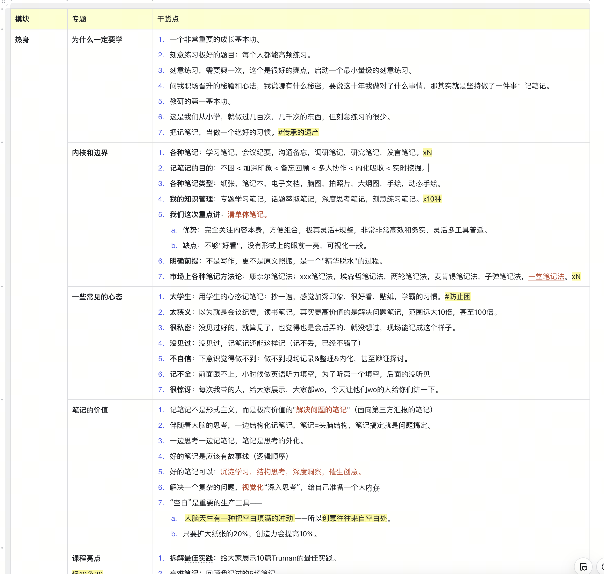
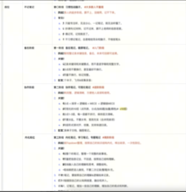
等到他们给我的碎片信息讲完，我基本上就能给他们串讲一遍这个课程的1.0版本了，有50%是他们的内容，20%是他们带来的启发，30%是我自己的案例、灵感和经验。
哈哈，每次我开会结束，当别人可能记录都跟不上，记不全，而我给了一个完整版本、有创新的故事线，逻辑清晰，而且有很多自己的分析和模型，甚至可以给专家or案主，反向讲一个更好更专业的版本时，大家都很惊讶。
大家问我怎么做到的？我就一句话：**唯手熟尔。**
### 背后的笔记方法
回到前面的困扰，面对各种各样的工具、笔记范式，我一直想找一种尽量简洁的，务实的，高效的，能够灵活调整和训练自己的方法。
于是我找到了一种"**特别朴素**"的笔记方法：**清单体笔记。**

什么是清单体呢？我尝试写了一个对比Demo，你可以感受一下：
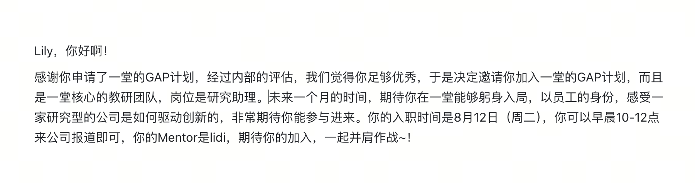
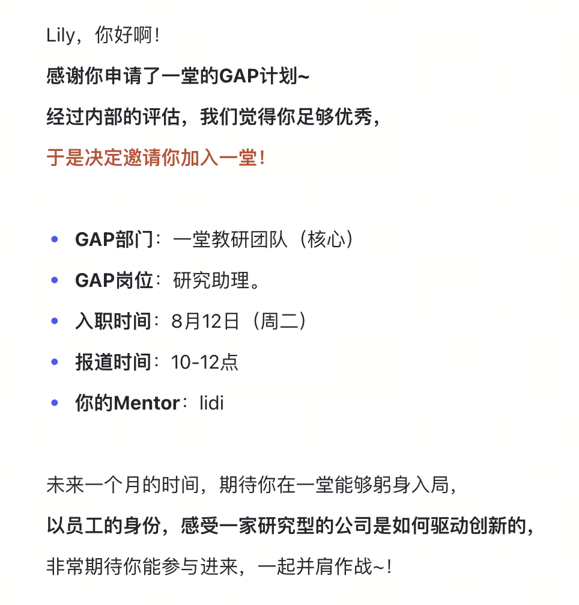
**【划重点💡】**一个清单体笔记，典型的特点是：**专注，独立，分点，分层。**

1. **专注：**专注内容本身，不刻意追求好看。
2. **独立：**分解独立逻辑要点。
3. **分点：**一条一个要点。
4. **分层：**视觉层级即信息层级。
配套工具：电子文档（飞书/印象笔记/Flomo等等都行）
这个清单体，是不是看上去特别简单（陋）？哈哈哈。
正是因为简单，它有着极强的**普适性**和**迁移性**，可以在各个项目、各个场景里反复练习。于是这些年，我每年至少会记100-200篇清单体笔记，我的笔记能力获得了一轮轮显著的提升：
从最早的简单备忘笔记，到沟通笔记，再到项目思考笔记，专题学习笔记，到这两年的灵感闪现笔记，磨课笔记等等。
一个看似简单的动作，我这10年里刻意练习过至少1500+次，我发现自己的逻辑段位、思考段位、顶层分析段位、灵感激发段位，拉了一个大的档次。
### 理解优点和缺点
为了辩证地理解工具，来给大家解释一下我理解的清单体笔记长短板吧。

相对于脑图，纸质笔记，可视化图形笔记，手写电子笔记，"清单体"是一个非常独特的存在。
**我先说缺点：**样式单一，不够好看，可视化手段单一，乍一看土土的。
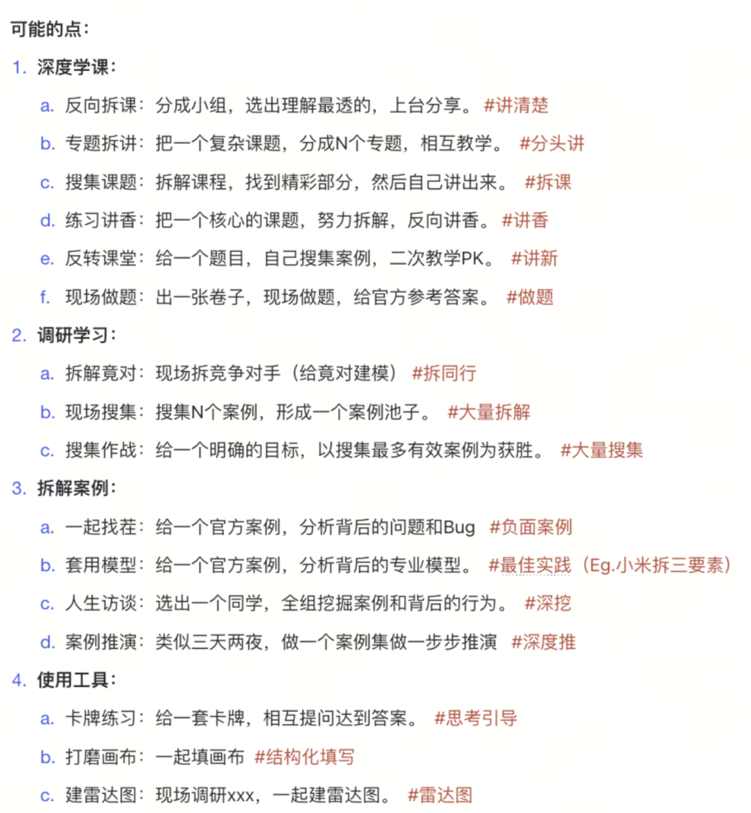
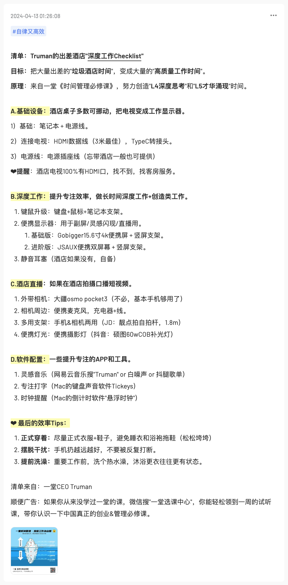
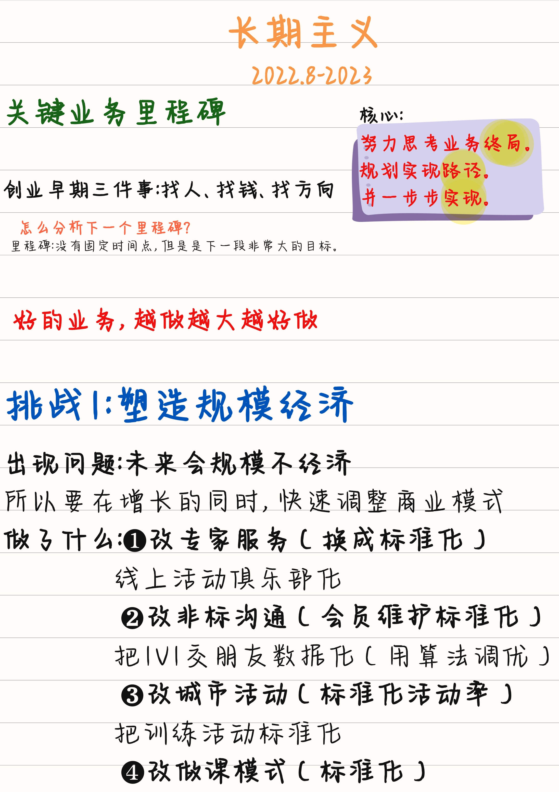
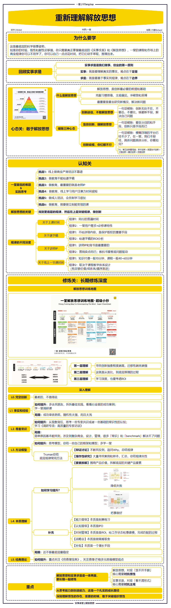
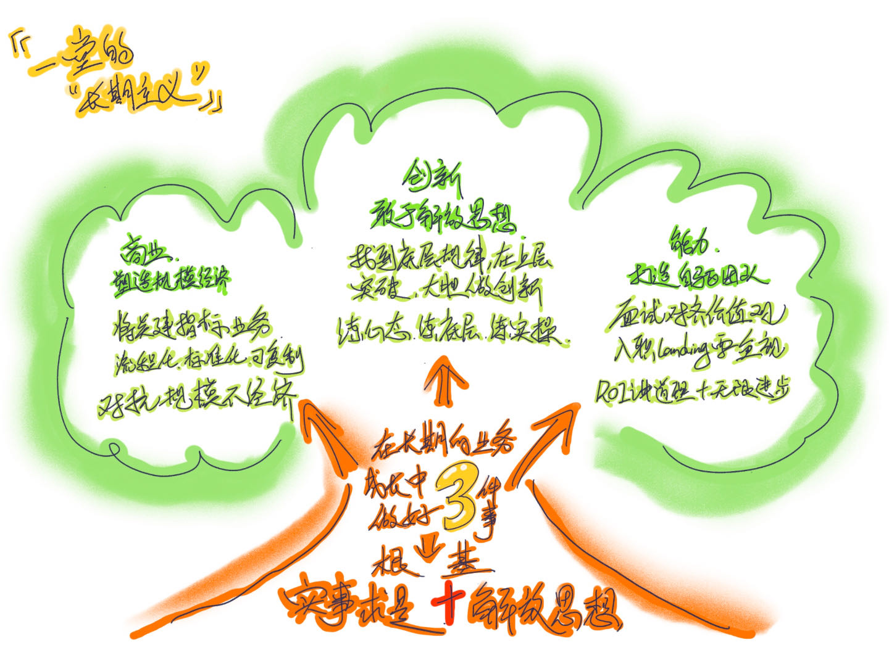

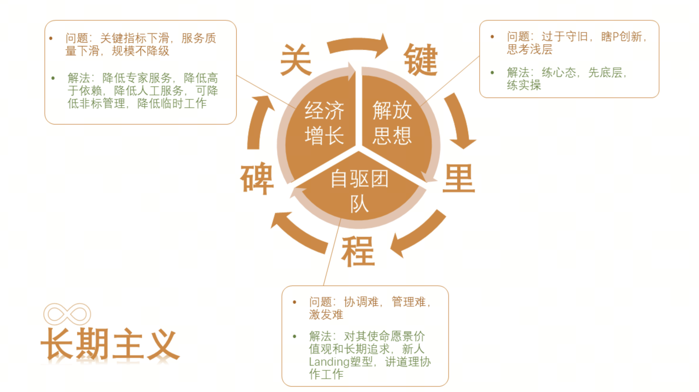
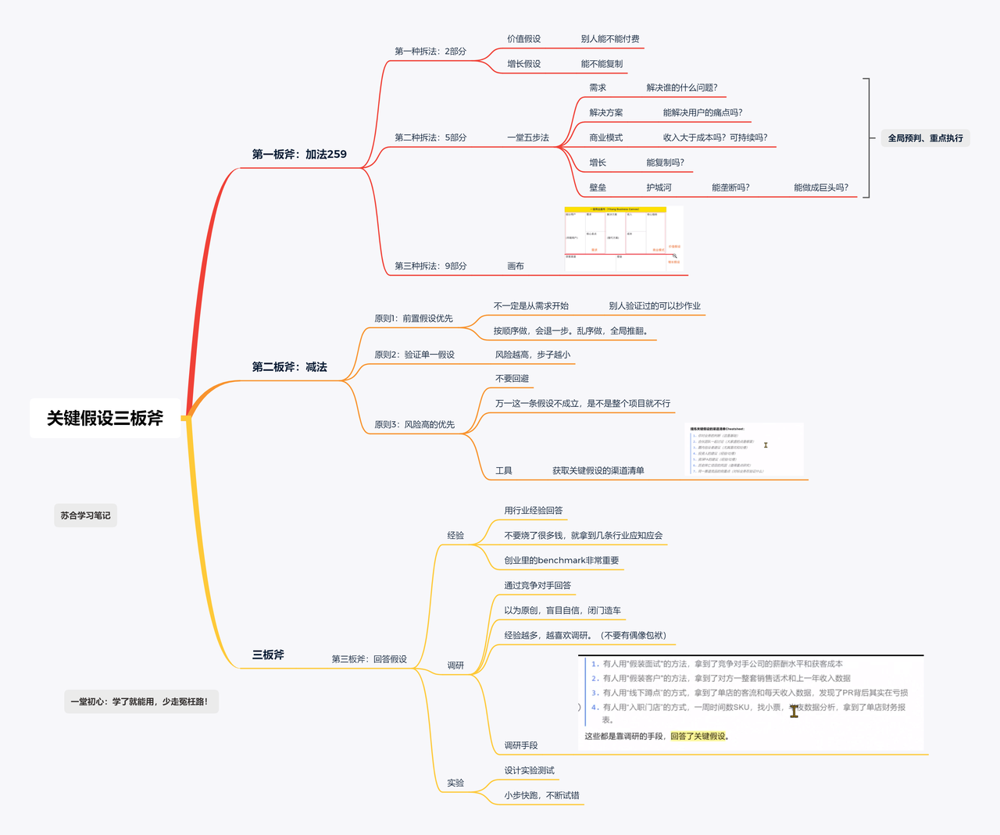
> 清单体的极简样式：对齐，换行，加粗，荧光底色，文字颜色，基本没了==。
> 左侧的清单体基本上是巅峰了，跟右边比，完全不是一个视觉美观层级的。
**【提问🙋🏻‍♀️】**那么反过来说，大家发现，清单体有哪些显著的优点呢？
————
哈哈，除了这**一些外在的缺点**，剩下的**全是显著的内在优势**。

**【划重点💡】**相对于各类笔记，"**清单体笔记**"拥有巨大的优势：
1. **简单上手：**非常简单，学习和上手几乎没有门槛。
2. **专注内容：**几乎不用关心样式，专注内容和问题本身。
3. **支持扫读：**面对海量信息和高信息密度，支持快速扫读。
4. **容易迁移：**各种平台，各种设备，各种环境随便迁移。
5. **灵活升级：**方便随时调整，重排，划重点。
6. **上限极高：**想记到Top水平极难，有10年的无限练习空间。
补充：清单体笔记具有极强的AI协作优势，先按下不表，最后一起讲。
尤其是「2专注内容」不要小看，我们可以把90-100%的精力在内容本身，这是一个非常务实的精神。甚至有几年，我做培训讲课，就是用**清单笔记**+演示模式，直接讲的课，全部都在打磨内容和逻辑，没有花一秒钟在PPT的样式、字体、排版和花边上。
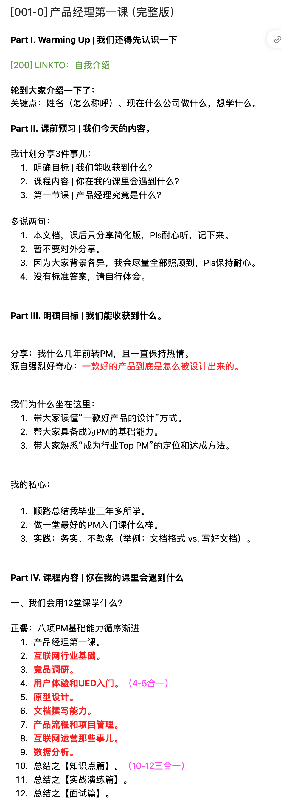
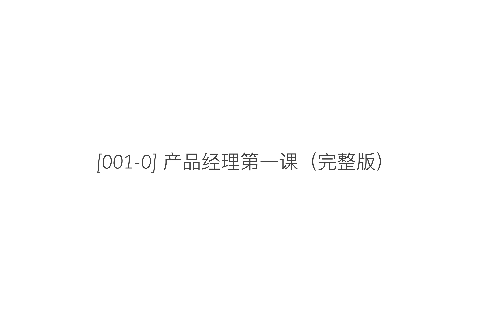
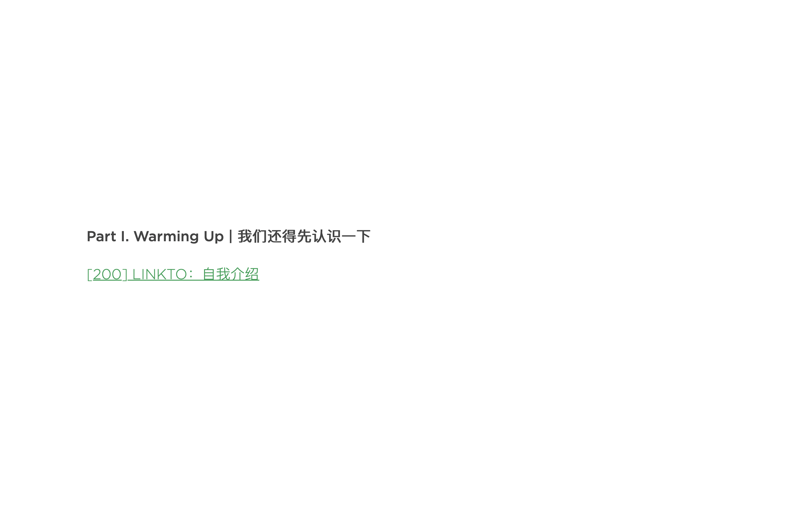
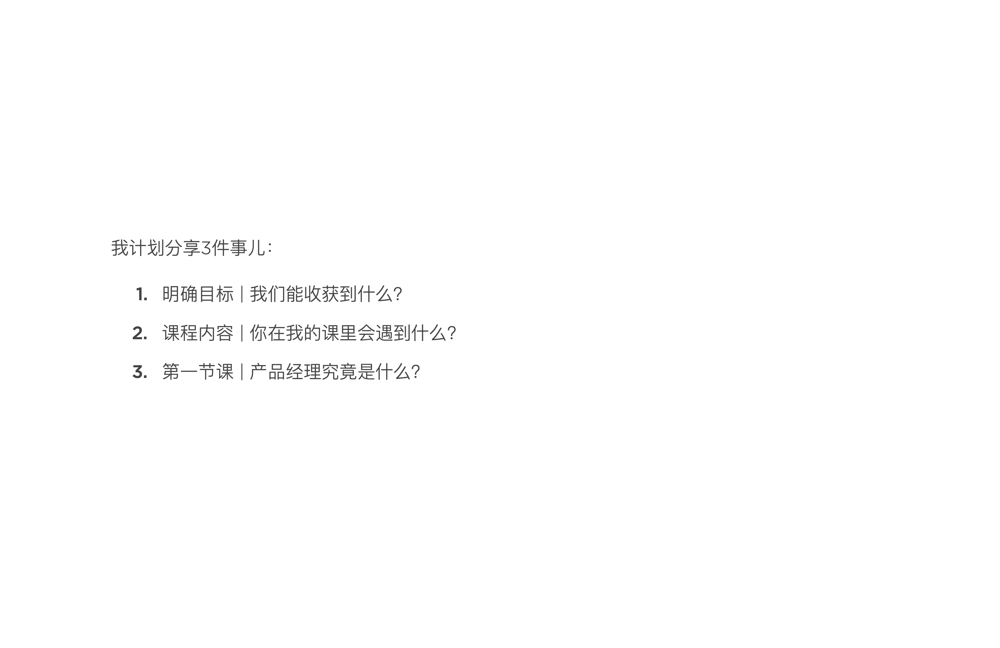
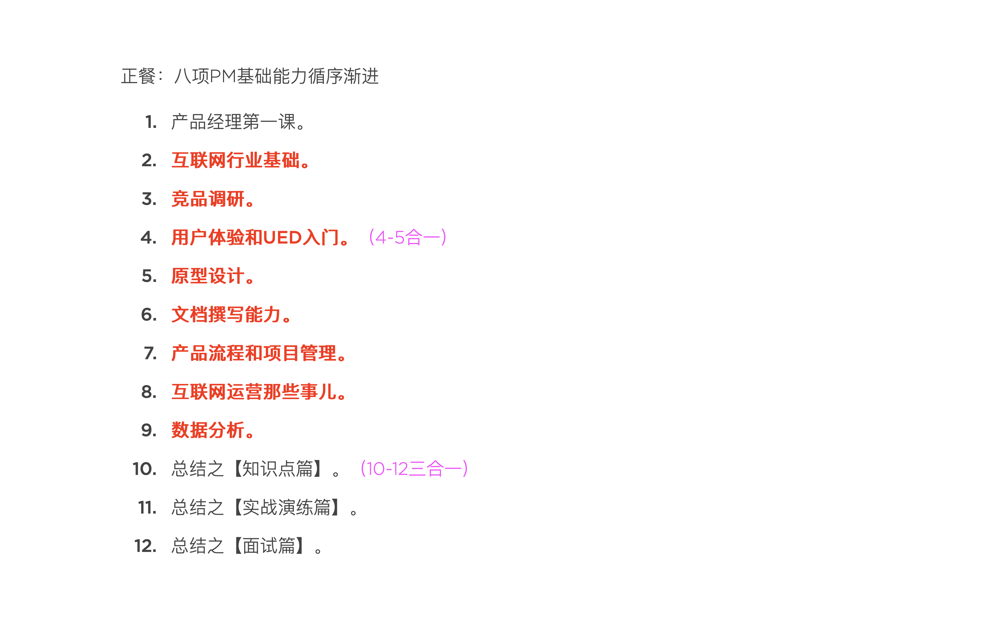

> 工具：印象笔记的【演示功能】，加一些页面断点就行。
今年我做一些培训，已经开始自己搓了一个“**Feishu2Slide**”的工具，直接把飞书的清单笔记，自动变成一个“极简版本”的HTML PPT：
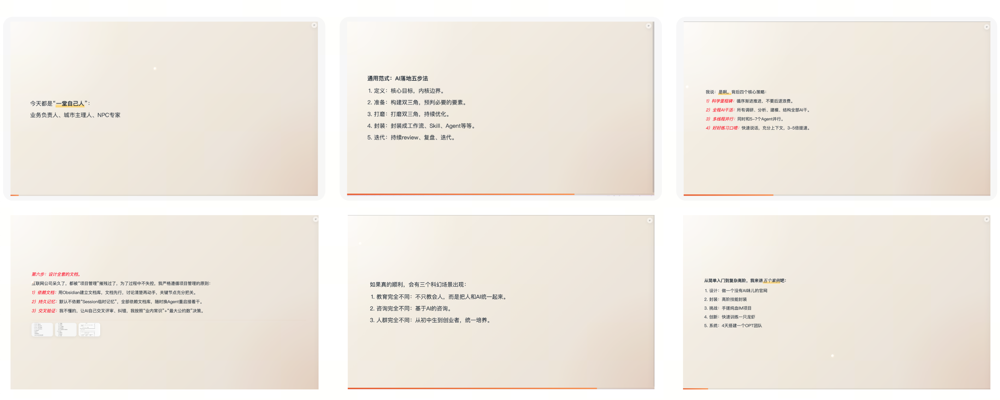
这些条件都很重要，是其他笔记本很难满足的：
- 所有手写笔记(纸质/电子)：不满足4,5。
- 所有可视化笔记（绘图）：不满足1,2,3,4,5。
- 所有的脑图笔记（头脑风暴）：不满足3,4。
- 所有的PPT笔记（或者画板）：不满足2,4,5。
因为有1-5优点，导致了优点6，这种笔记上手很容易，真正做好极难，天花板极高，可以用一辈子来修炼。

我们磨课过程中发现，这种笔记有些书略有提及，但国内竟然没有系统阐述"**清单体笔记**"的介绍和完整的刻意练习升级路径，那好，我们一堂就来补全吧。
下面，我给大家讲讲我这些年的故事，回顾一下我这些年学习的过程。你们可以带入真实的**第一人称视角**，体会记笔记的能力到底有多重要。