## 重新理解“清单体笔记”
终于到收尾了，大家听累了吧，是不是笔记感觉越来越难了？
一堂有一个系列的课程，是我最喜欢的情节：听之前"**不以为然**"，开始听"**我去原来还可以这样**"，听到后面"**好难学不会**"，学完以后"**我好像又行了**"。
课程听到这，你们感受到"记笔记"对于长期成长的巨大价值了么？
很多人觉得我们一堂的笔记水平厉害，这节课终于可以说答案了：因为我们真的在努力刻意练习啊，我练习了10年，在非舒适区里练了1000次。而你或许100次甚至10次刻意练习都没有，**以有心打无心，以强风吹薄云，你自然觉得很厉害。**
无他，唯手熟尔。
最后我想讲一讲，记笔记，为什么在我个人的成长里，在内部带人上，被提到了一个这么重要的第一基本功的位置？
### 硬币一面：人的最小成长单位
我总结了两个原因：

首先**横向**，我讲了IPO、学习、时间管理、深度思考、关键假设、建模、动力阻力、灵感闪现各个课程，如果你没有"一个随进随出"的大内存，单纯靠纸笔，靠脑子，靠手绘图，这些课题很难真正成为专家。
笔记能力，给了我们一个几乎可以无限延伸的基础能力，让我们的各项能力，在这个底座长出来。
然后**纵向**，"记笔记"是一个**极好的刻意练习题目**，轻量级，独立可完成，极高频，很容易体验到爽感。
如果你过去没有体验过"高水平刻意练习"的爽，你可以从记笔记开始，启动一个最小量级的刻意练习，而且天花板足够高，可以一直练到你退休的那一天。
所以当你把两句话放**在一起看**的时候，就会发现，你记笔记一旦能力拉起来了，他会拉动你的各个思考能力、决策能力、学习能力全面提升。
一旦一个人的笔记完成一个飞跃，瞬间就把他的思考段位&带宽，拉升到更高的层次上去，特别像玩游戏开了挂，会有一种跳升式的爽感。
好啦，如果你也打算慢慢接受这个理念，并且准备好提升的话，最后送给大家一个礼物吧。
记笔记这件事，眼睛会了很容易，真正的动手学会，得靠一次又一次的刻意练习。
我们讲了刻意练习的1+4个要素，要做的就是努力把这些要素凑齐，然后让自己的持续待在"无限进步区"里，不断重复，不断重复，不断重复。

哈哈，当我们把这两张图和这节课讲的所有精华放一起的时候，你就得到了一张超级地图：

**【点燃🙋‍♂️】**现在来看，练习记笔记甚至成为高手，对你来说重要么？
1. 没感觉：关系不大，我不需要留存/训练
2. 有兴趣：用AI就够了，偶尔记一下
3. 很重要：是一个长期值得关注的能力
4. 非常重要：是一个帮我突破天花板的技能
5. 必经之路：我想成为的人/公司一定需要笔记专家
————
过去，我对于刻意练习无比笃定，也大概前前后后辅导了小几十个下属和业务负责人，帮助大家意识到，并且完成了刻意练习从姿势到能力的重构，核心能力进步速度提升了2-10倍。
但是苦于一直没办法提供更多1v1辅导，所以一直很亏欠，最近我们验证AI Partner，终于摸出了一种可能性，如果你选了34尤其是5，那么一堂的AI来辅导一轮你的进步。
我们先看一份结果，这是我们内部，一个清单体笔记练得还不错，也觉得清单体笔记【非常渴望非常重要】的同学，经过大概30min的诊断和彼此讨论，最后AI给生成了一份**《清单体笔记10倍速练习行动报告》：**

> 提醒：如果你真的个人追求L56才去用（至少L4），如果长期只是满足于L23可以省省时间，这个对你太难了。
我们内部这个同学测试完表示让自己直面了自己的一个问题：
> 一直以为自己「清单体笔记」段位还不错，但其实也一直**卡在 L3、L4**，提升得很缓慢。
> 今天通过对话让我明确意识到，自己想要提升，萃取建模上面是绕不开的，但是练得很少。
> 我很多努力还是**没有走出舒适区**，更多的是在自己熟悉、有体感的课题上更容易去重复练习。**对于不熟悉的、没体感的课题有时候差不多就行，甚至AI来了，反而让渡给AI。**
> 这一点上，如果未来想成为顶尖的教研专家，确实有很大的提升空间。
回到《刻意练习》课题，科学练习一共有1+5个要素，每增加一个要素，成长速度翻倍，每缺少一个要素，成长速度减半，而这个Partner教练，就是帮你完成一次高水准的1v1练习反馈。
**提醒♥️：**过程很有趣且深度，不透题了，大家如果想练习，自己试用这个**刻意练习教练Partner**吧。
### 硬币另一面：AI最大的协作杠杆
刚才一直忍着没提AI，最后一部分，终于可以讲讲硬币的这一面了。
**【提问🙋‍♂️】**先问大家一个基础问题：你真的相信未来AI可以代替大家记笔记么？代替到哪一步？

————
我说我这两年实践下来的答案啊：得分情况看。
- **L2 备忘：AI记擅长，全量记忆，纠错，全量整理（完全ok）**
- **L3 协作：基本也行，整理排版、美化调整格式（提炼/分类）**
- **L4 内化：偶尔辅助，可以帮助重新整理故事线（补漏）**
- **L5 思考：勉强参与，主要靠人的思考和建模（提供角度）**
- **L6 萃取：完全不行，全靠人的能力（难）**
不知道跟大家的一不一样？
总之：**AI 让 L2 备忘记录变便宜，反而让 L3-L6 更稀缺了。**
因为本质上，我们讲的“记笔记”不是单纯记下来，而是一个高水平的建模和解题过程。
大家很多人上过《AI数据第一课》，我给过大家一个模型：

清单体，几乎是最轻量级、最友好的从收集、处理到使用的一个**轻量级范式**。
**它不只是启动“人类刻意练习飞轮”的最小动作，也是启动“AI数据飞轮”的最小要素。**
1. 没有清单体，很多人的思考停留在脑子里，难以稳定外化。
2. 没有外化，AI拿不到高质量上下文、判断过程和反馈数据。
3. 没有数据沉淀，AI应用很难形成飞轮。
4. 没有AI飞轮，人类三角和AI三角就很难互相增强。
从这个角度看，清单体笔记不再是一种排版方法，而是一种**认知加工方法**：
1. 把混乱信息拆成可处理单元。
2. 把长文本压缩成结构关系。
3. 把被动接收改成主动生成。
4. 把个人理解变成可复盘材料。
5. 把经验和判断变成 AI 可调用的数据。
所以由此可以推出一个结论：

- 这是一个很美好的时代：AI可以全面接管人类的基础工作，不用再劳神费力了。
- 这是一个很糟糕的时代：过度依赖AI，从不练习，可能永远也无法达到高阶能力了。
一堂AI时代的竞争力不是来自「买了哪个AI工具」，而是来自：
> 有没有一套低阻力机制，把人的高质量思考、业务过程、案例经验和AI反馈持续沉淀下来，并转化为AI可用、组织可复用、未来可迭代的数据资产。
而清单题笔记，刚好是大家都可以用，都可以积累长期复利的一种方式。

比如，你遇到一个需要优化的文字素材，丢给他，他就直接给你按照**L3（协作美化）**的方式整理出来。

看一个典型的场景，每年有各种发布会、各种大佬的演讲，很多自媒体都会去做一些拆解，但是这些动辄就是几个小时，有自媒体会去扒演讲的全文，但是基本上都是几万字的内容篇幅。
这个时候**你想细颗粒度的去理解，但是又不想全文读**怎么办？你就可以把全文直接丢给我们的笔记官，甚至都可以不告诉他以什么逻辑来整理，他自己就会判断一个逻辑，把清单体笔记吐给你。

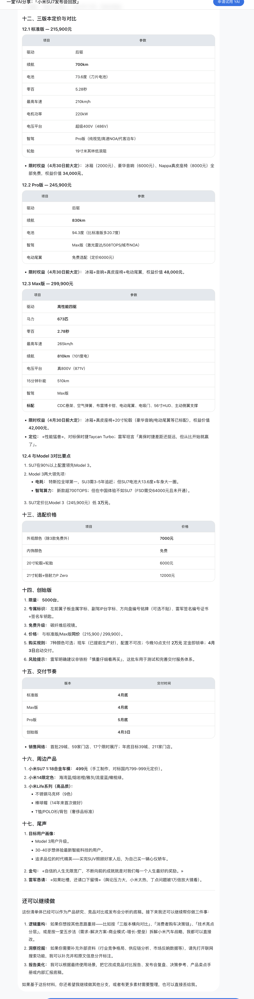
类似的场景还有很多：
比如，**你有一个录音逐字稿、对标短视频的逐字稿**，想要快速转成清单体笔记。
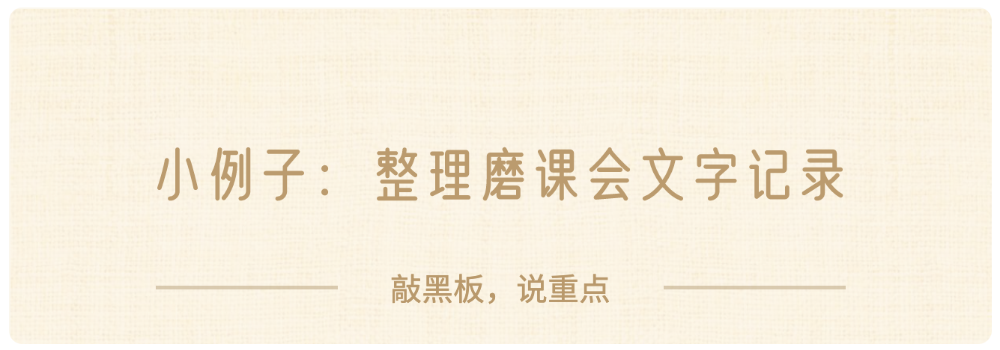
前两天我们尝试用AI辅助做复盘，把数据第一课磨课的录音逐字稿丢给了AI。
> 案例展示截图说明：当时丢给AI的是文档，具体内容见第二章截图（内容太多，只截了局部）
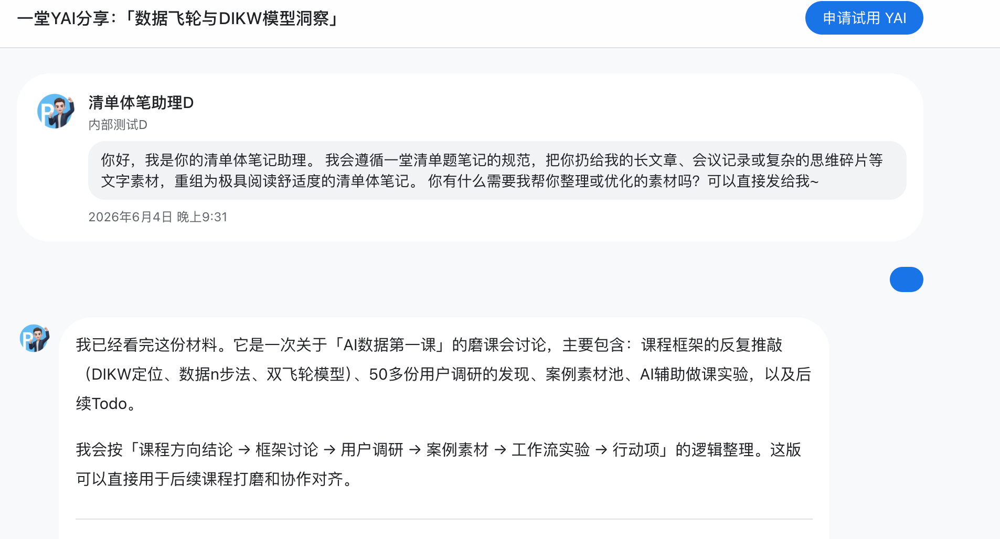
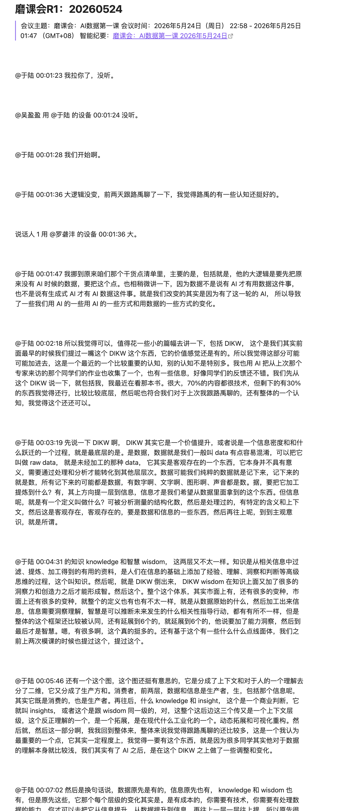
最后他就还给我一个清单体笔记，而且给我解释他的构建逻辑：
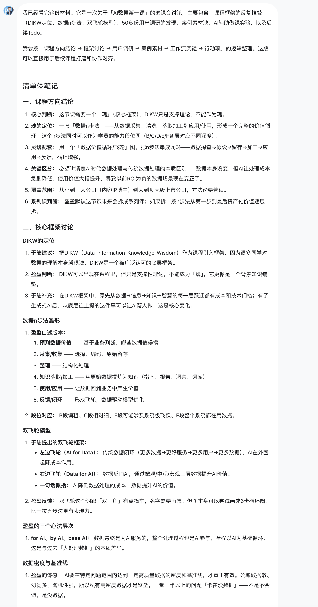
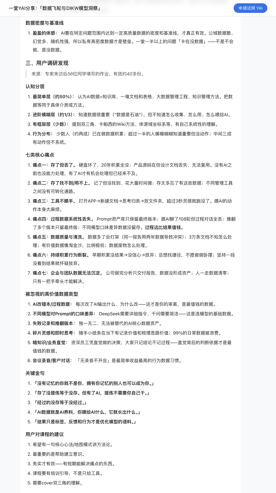
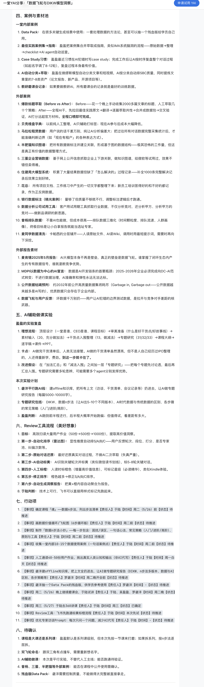
比如，你**看到一篇爆款长文，想快速提炼文章的大纲**，也可以让笔记官帮你整理。
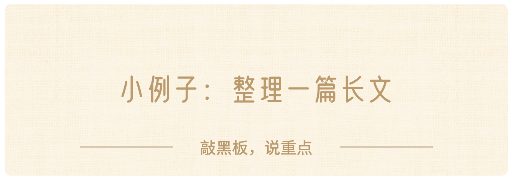
我们的一个同学，看到一篇深度长文，想整理下大纲：
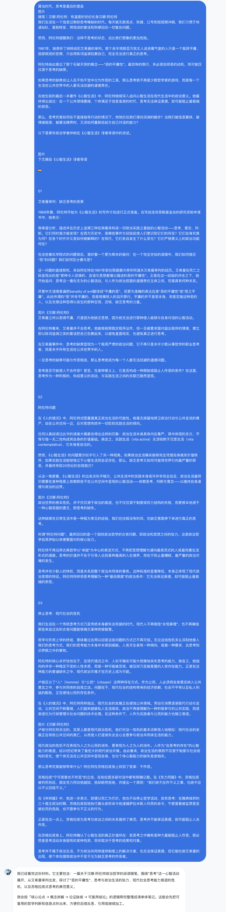
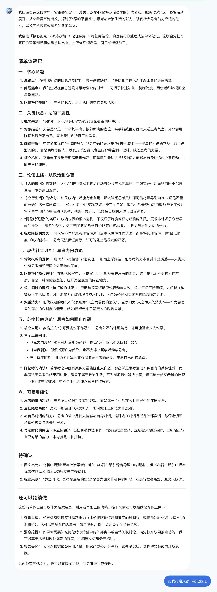
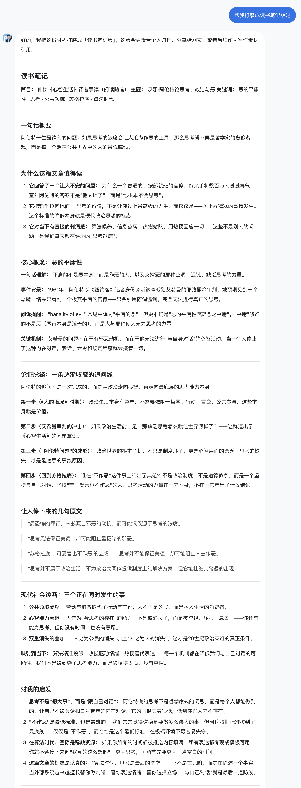
如果你还想提升到**L4（内化）**，你可以给他思路，跟他讨论，一步步提升到L4:
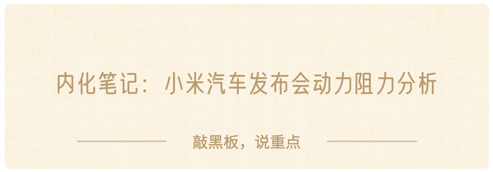
回到前面雷军小米汽车发布会的逐字稿，内容非常多，但是其实你就想看看他某个角度的内容：
- 比如具体不同版本的车差别是什么
- 比如整体的发布会节奏是怎么安排的
- 比如雷军是怎么提动力消阻力的
- ……
你可以换各种逻辑让笔记官助理来帮你重构笔记。
我们选择了让笔记官用动力阻力分析来重构笔记：
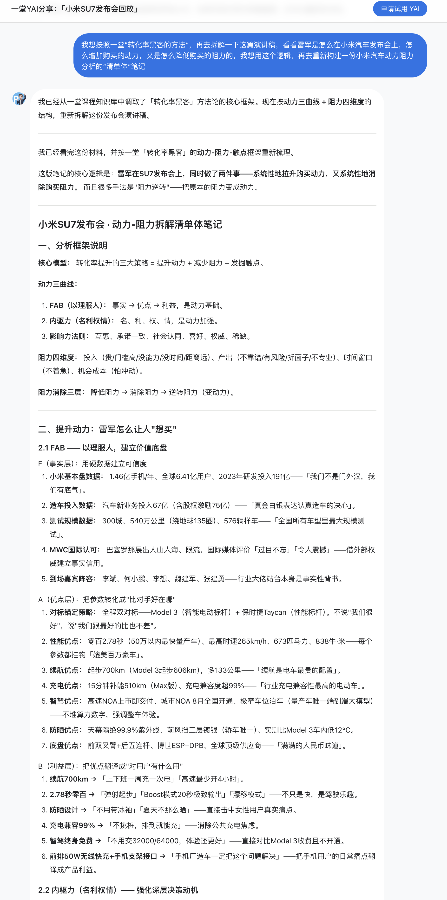
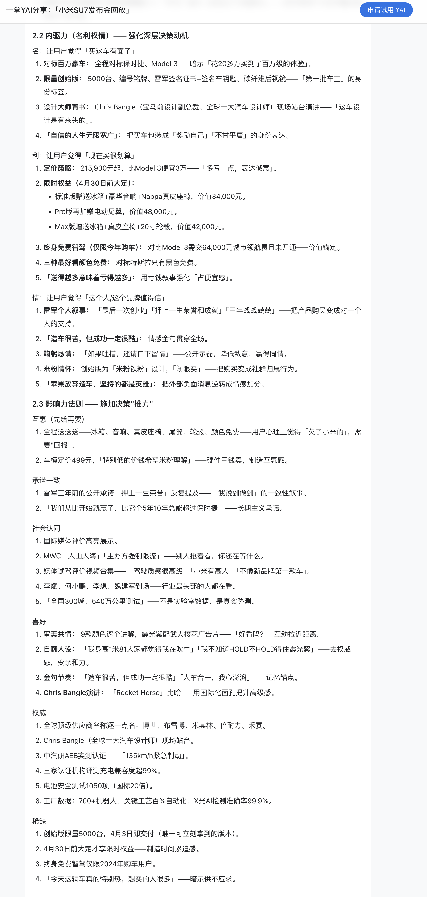
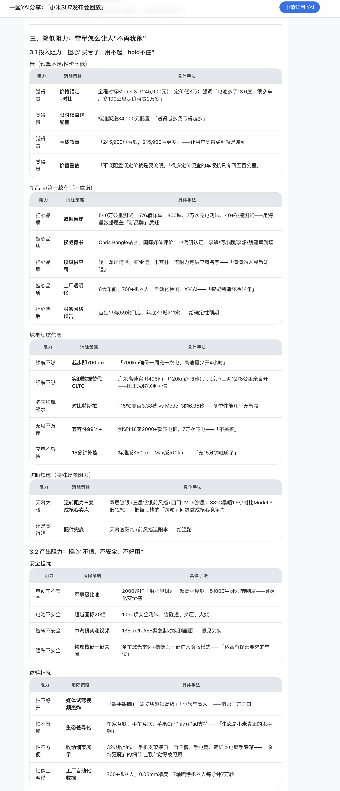
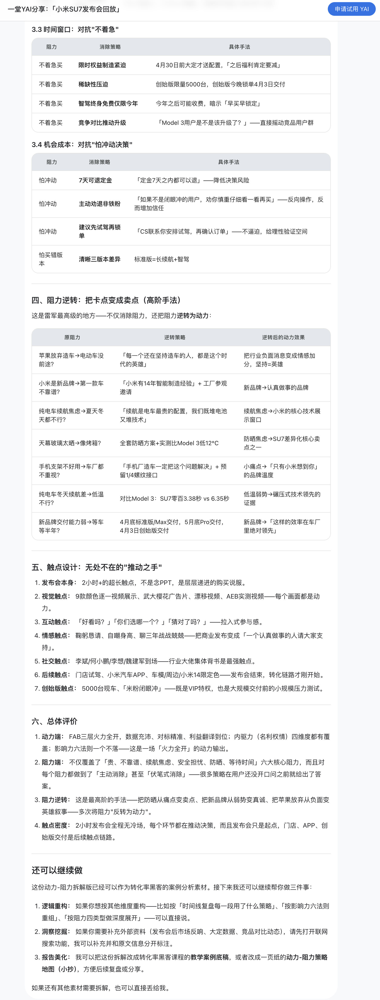
我们这个P Partner还可以给你做进一步的加工，比如你想把你的笔记用到**向上汇报、对外分享、沉淀到知识库等等**的**高价值场景**里，你可以直接提要求，他来帮你做相应的调整和美化。
还是以这个小米汽车发布会为例，我们想拿这个案例做一次转化率课程的串讲，我们让他做了一个教学案例底稿：
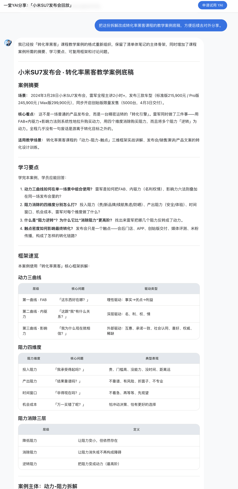
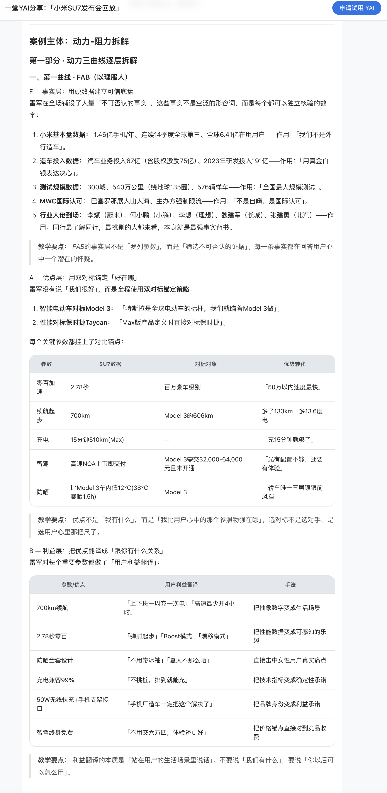
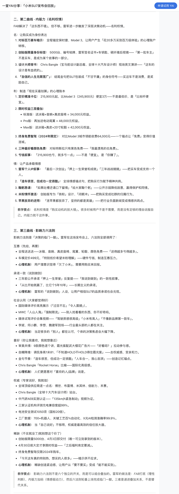
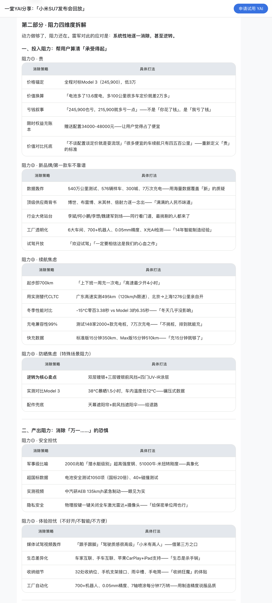
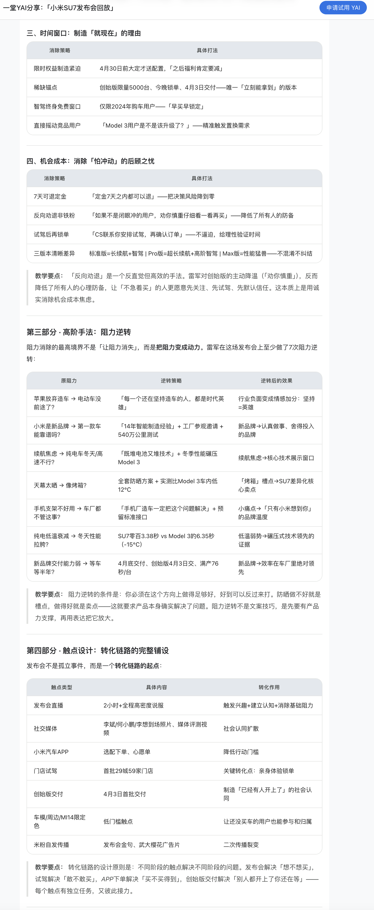
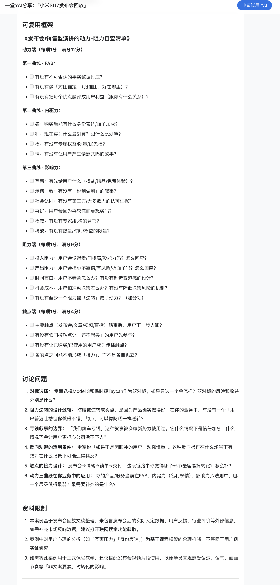
哈哈哈，怎么样，有没有很想要这个AI助理？
好啦，**这周末限时免费使用**（到6月7日24:00），希望你们能找到和这个P和C的协作信任和快乐。
好了，最后送给大家一句话吧：**努力训练你的"剩余脑力"，持续挑战更高水平笔记。**

未来路很长，难题不会断，练好清单题笔记，练好最小最基本的基本功，
你未来所有的思考能力，判断能力，审美能力，系统能力，都会以一种“**无限复利**”的方式一路长出来。
诸位加油，一起共勉～～～