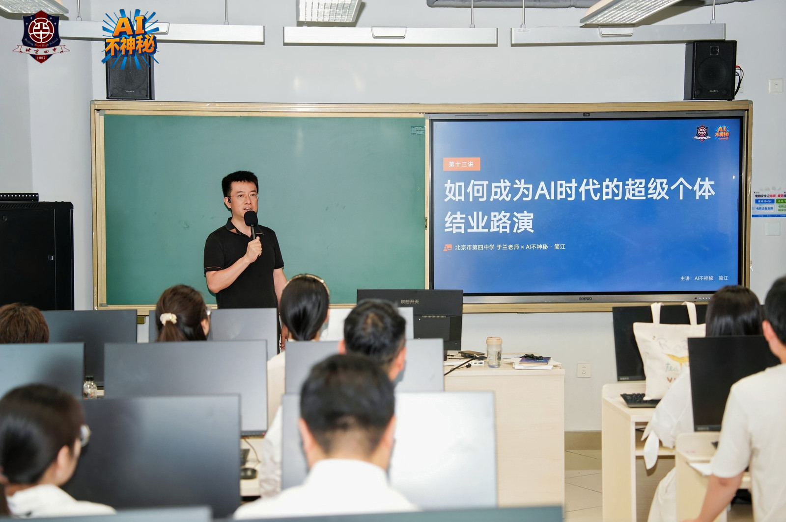

回放入口： https://air.yitang.top/live/KfJVnp4eeL 

我叫简江，你们可以叫我简老师，我加入一堂已经两年了。

> - 本科学计算机，毕业后当过一年老师。

> - 后来去了搜狐，是搜狗的第一个产品经理。

> - 再后来做了五年创业投资，见证过上百家初创公司的成败起伏。

> - 自己也创了十年业——踩过的坑、交过的学费，都是第一手的。

这两年，我在“AI不神秘”做课程设计。上学期给北京八十中、实验二附中国际部开过 AI 课程，给四中高二的同学上了一整个学期的“AI 时代的超级个体”选修课。最近，我在给芳草地和日坛中学的老师们做暑期 AI 训练营。

顺便说一句，我也是一位爸爸。女儿在牛津读大三，这个暑假我把她也邀请来参加咱们的课程。儿子小学三年级，正跟着我，学做 AI 时代的原住民。

