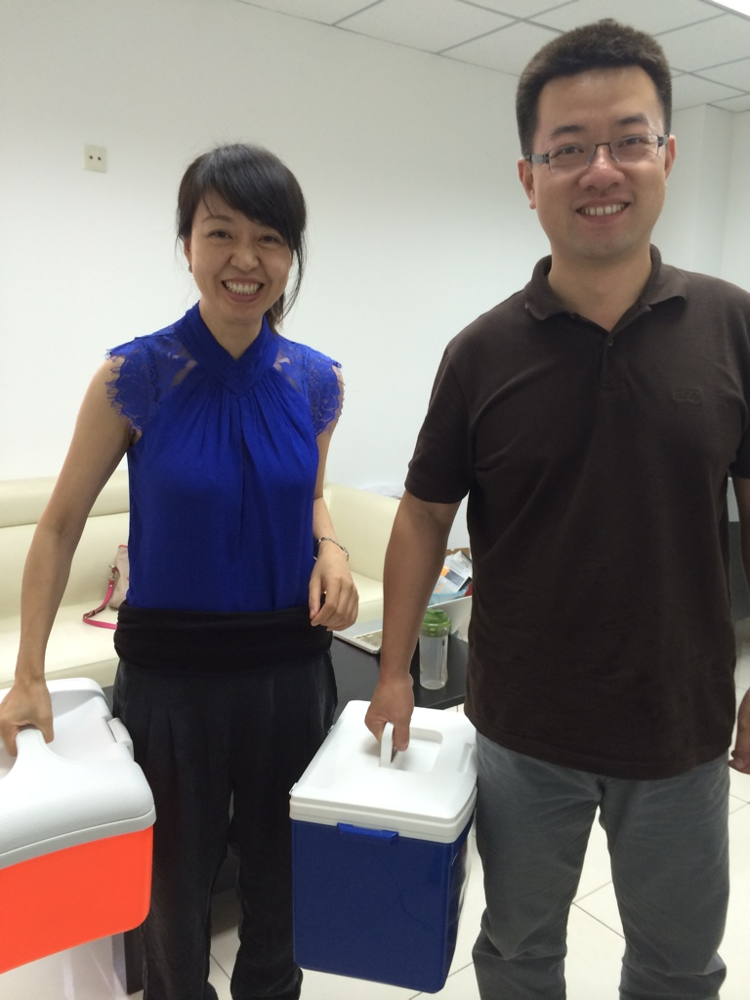
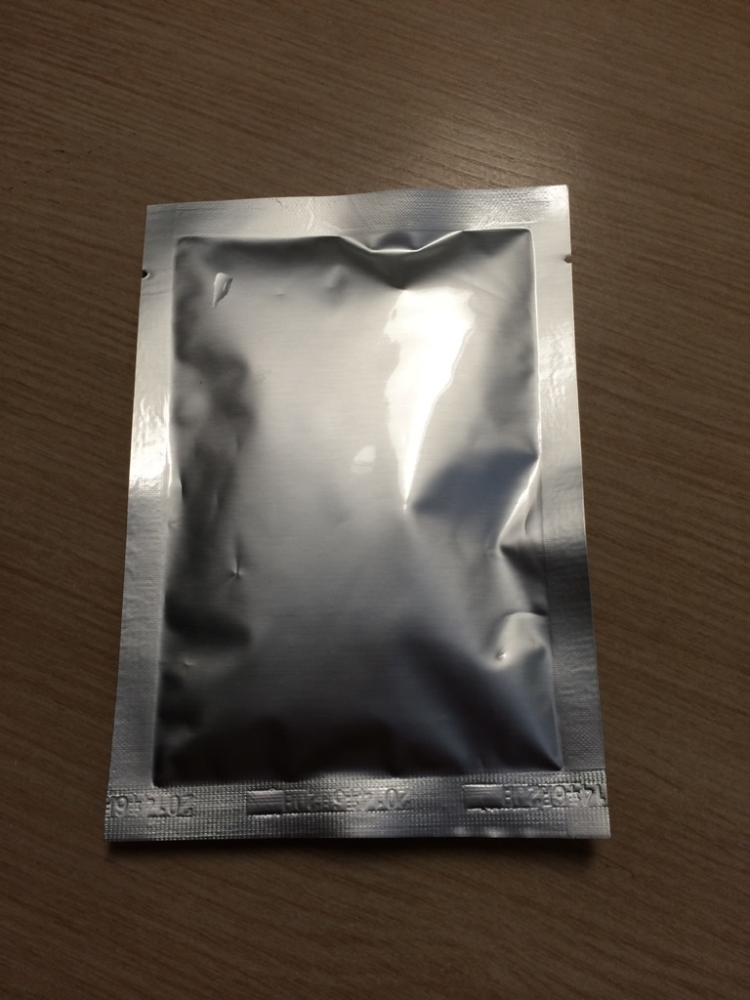

### 五、道理不难，为什么不愿意做？

我们来试几个场景。

> - 你写了一篇特别得意的文章，发出去之前，愿不愿意先发给三个同学，听他们挑挑毛病？

> - 你准备了一个要上台的演讲，正式讲之前，愿不愿意先讲给同桌听一遍，让他给你打个分？

> - 你想好了社团招新的方案，公布之前，愿不愿意先找五个同学问问，他们到底会不会来？

讲到这里，请你诚实地感受一下自己：面对“多做一步验证”这件事，你的内心，是不是有那么一点点抗拒？

如果有，很正常。我做过五年天使投资，接触过几百个创业者，一多半的成年人同样不愿意接受负面反馈，不听劝，也不去验证。我把背后的心态总结成五种，你们对照一下，看自己中了几条。

#### 心态一：怕幻象破灭

我们有了想法，不仅会一厢情愿地认为他会成功，还会把成功后的画面想象得无比美好。

> - 想买件衣服，幻想穿上多好看：实一上身，发现一般般。

> - 那很多家长都会幻想，孩子考上清华，一辈子飞黄腾达了。

> - 想到买了这只股票，就觉得财富自由了。

这时候让我去验证，等于亲手戳自己梦想的泡泡。一想到可能被现实打脸，整个人就泄了气，干脆不验了。就像不向喜欢的姑娘表白，就永远不用承受失恋。

但我从一个跟踪过几百个项目的投资人视角的观察：**几乎没有哪个成功的创业者，最后做成的事和一开始想的一模一样。**

- 小米最早做的是米聊，今天赚钱靠手机和汽车。
- 九号公司最早做平衡车，最后靠电动自行车做成了百亿市值。
- 美团最早做团购，真正撑起它的是外卖。

**大多数的成功，都是一圈一圈试错转出来的。**真正的成功之道，是把每次验证的成本压到最低，让手里始终有足够的弹药，转够足够多的圈，直到碰到对的方向。

优衣库创始人柳井正写过一本书，书名四个字：《一胜九败》。失败是常态，成功是偶然。关键是控制好每次失败的成本，保证九败之后，还打了第十枪。

二十年前，行业里一位大佬跟我说过一句话，我记到今天：**相信事实，不要相信愿望。**

#### 心态二：完美执念

有些人做什么都力求完美，每个细节面面俱到。但大多数产品，真正值钱的是内核。内核原型可能一天就做完了，把边边角角打磨“完美”，还要一周，万一方向不对，这一周全打了水漂。

更关键的是：**一个没人需要的东西，打磨得再完美，也还是没人需要。**

2014 年我创业做生物面膜。包装粗糙得像实验室样品，我拎着个小保温箱，发圈约朋友去卖。

一个暑假卖了十几万，定价、卖点、功效全部初步验证通过。反过来想，如果这些都不验证，先去印一大批精美的包装盒，那才是真正的浪费。

所以**糙一点没关系。把内核做出来，赶紧拿去试；验证过了，再慢慢完善，不迟。**

#### 心态三：太着急抓机会

有些朋友觉得抓住了好方向，就忙不迭往前冲，生怕慢一步机会被人抢走。我有个朋友开便利店，第一家店还没盈亏平衡，一口气开了五家，每家精装修，最后赔光两千万。

他想的是：虽然第一家还不赚钱，多开几家，努努力，慢慢就赚钱了。可第一家都没证明能赚钱，**复制出去的不是五倍的利润，是五倍的亏损**。

**我们总以为创业是跑步，比谁跑得快。实际上，跑得最快的人，未必能冲到最后。**

创业更像盖楼——拼的不是谁盖得快，而是谁的地基稳。地基越稳，楼越坚固，能盖的层数越多。而这些地基，就是一个个经过 MVP 验证的关键假设。

**单元模型没跑通之前，不要轻易扩张。**

#### 心态四：觉得多余，怕麻烦

还有人嫌麻烦，觉得验证多余：直接做出来看结果不就行了？总想一次性憋个大招。

我们绝大多数的想法，天生带着偏差。**验证，就是在前进中不断修正偏差**。你不修正，偏差不会消失，它只会在最后，用更大的损失来找你算账。

所以说，用MVP来验证，它不是浪费，而是把风险扼杀在萌芽之中，不让它在一次一次的迭代中被不停的放大，直到最后没法收场。

#### 心态五：怕犯错，怕丢人

> “做得这么粗糙就拿出去，同学会不会Diss，笑话我？”

于是想着，等准备充分点再拿出来。结果等待的时间全成了你没有办法挽回的机会成本。

你去看看那些做成大事的老板，哪一个不是踩着无数的挫败和弯路，甚至顶着嘲笑和白眼，一路走过来的？在老板的字典里，可以有很多个怕——唯独不怕的，就是丢人和丢脸。

**做学生的时候，还有刚工作的头几年，是人一生中试错成本最低的阶段。**

现在错一次，付出的不过是一个周末、几百块零花钱；等三十岁再错，押上的可能是职业和积蓄。同样一份认知，现在买，是全场最低价。

**【💡划重点】**而且犯错最重要的收获，不是“错了”这个结果，而是你在和真实世界碰撞中拿到的底层认知。错误会过去，认知会留下来，跟你一辈子。这句话有点抽象，后面我用一个完整案例讲透它。