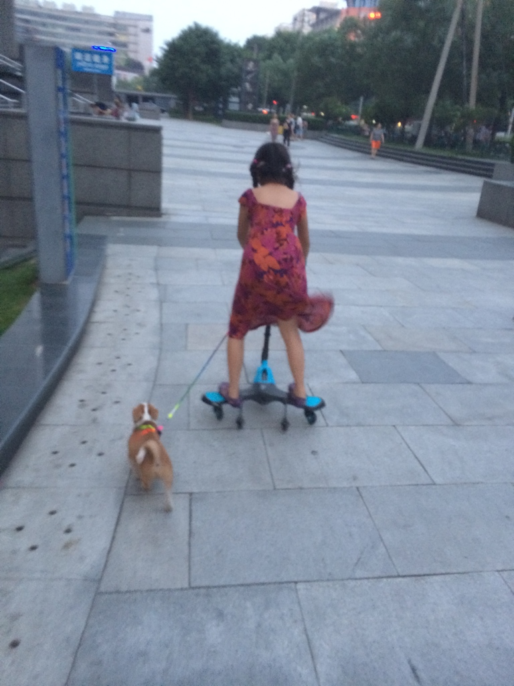
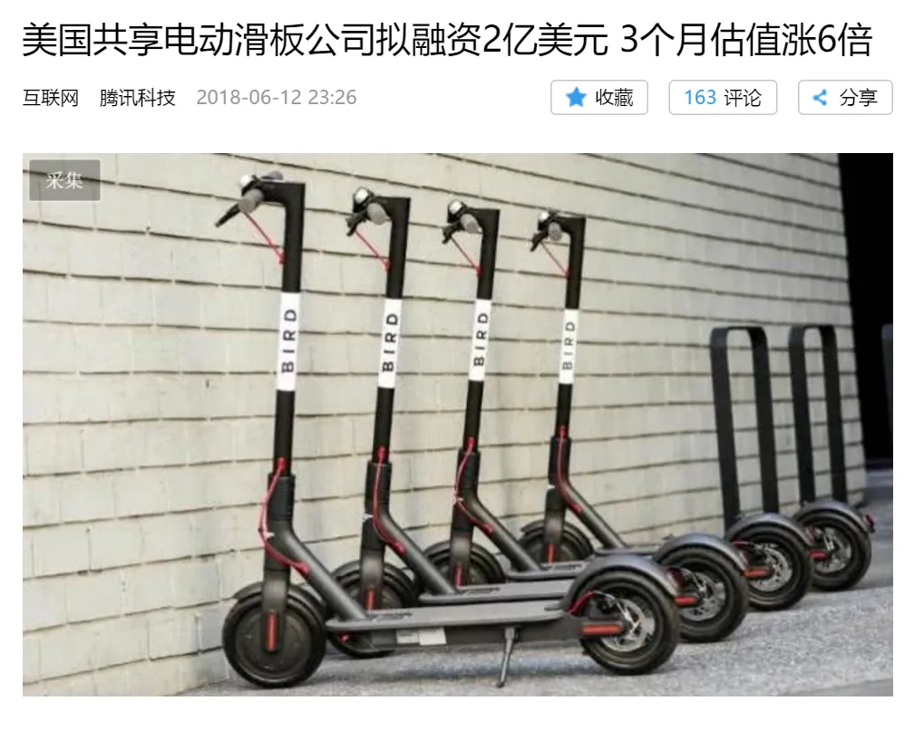
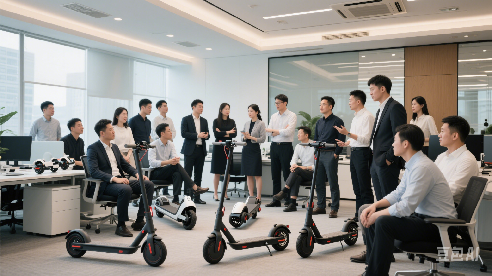
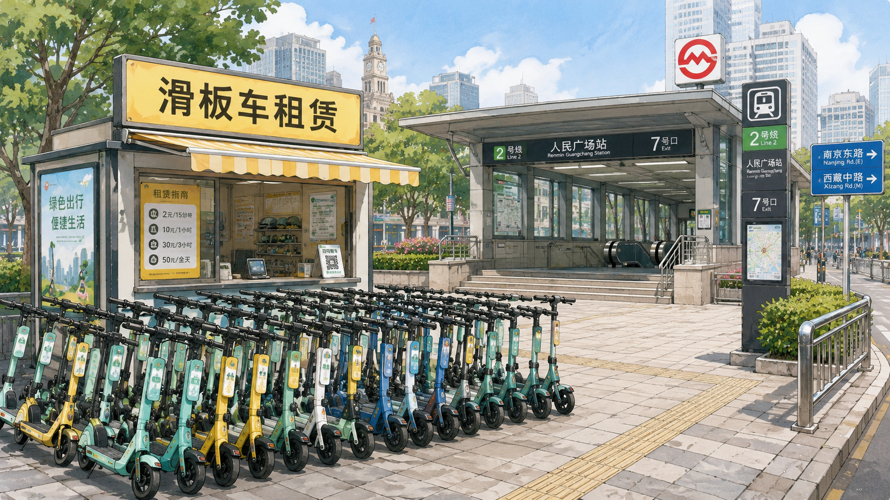
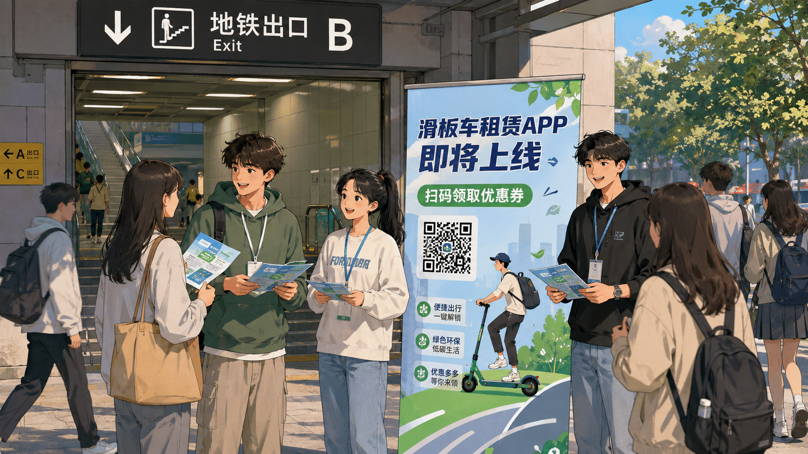
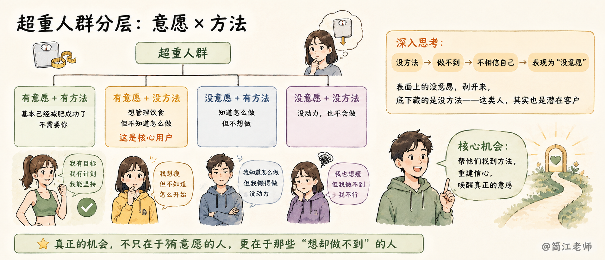
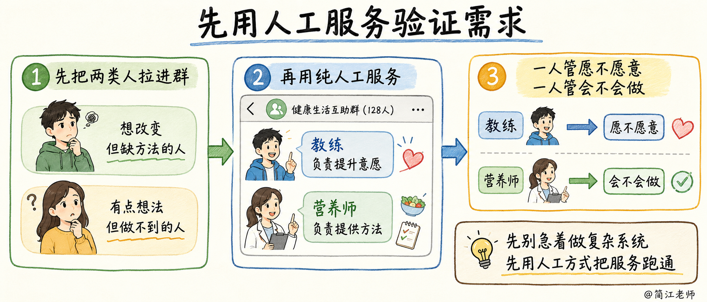

### 六、怎么做一个 MVP

心态这关过了，我们来看具体怎么做。先从生活里练起。

#### 我们家的养狗故事

我女儿小时候特别想养狗，看到别人家的小狗，能跟着走半条街。凑巧她妈妈也这么想。有一天娘俩下楼遛弯碰到有人卖小狗，卖狗的说是吉娃娃。才300块一只，俩人一激动，当场抱了一只回家。

先是发现这条狗有病，花了两三千治病。然后这条傻狗又吃了半个玉米棒子，拉不出来，卡住了。做手术取出来又花了两三千。

病是治好了，但很快就发现又有新的不对劲了。

> - 第一，这狗很臭，身上常年一股臭汗味。

> - 第二，每天得带下楼遛。我女儿学习忙，她妈妈工作忙，遛狗很快从乐趣变成了负担。

家里养狗的同学可能会说，这不是很正常吗？对，你说得没错。但问题是，我女儿和她妈妈，事先并没有为这些做好心理准备。

养了几个月实在扛不住，把狗送给了一位住在郊区的老师。我女儿伤心了好一阵，但我私下估计，她这辈子大概不会再养第二条狗了。

**【🙋互动】**那么问题来了：如果用 MVP 的思维，怎么在一开始就预见到这些？同学们有什么办法？打在聊天区。

对。可以找养狗的同学聊聊，去他家体验一下；更进一步，借一条狗养两天，或者去闲鱼找需要寄养的狗，帮人家养一个礼拜。这些办法花不了几个钱，但任何一个，都足够让她在买狗之前看清楚，养狗的真实生活是什么样。不至于在花了大几千块钱之后。又把狗给送人了。

#### 四个 CEO 的差距

再来一个特别经典的商业案例，你们当评委来打分。一个从硅谷回来的创业者，发现国外共享电动滑板车很火，已经有公司融了好几亿美金。他凑了一百多万，拉上几个大厂朋友，准备启动。

**【🙋互动】**如果是你：

> - 你会怎么起步？

> - 要不要买车？

> - 买多少？

> - 要不要开发 App、招人？

> - 一百万够不够？

有人可能说，这事儿一听就不太靠谱。好，那假设这个创业者是你的好朋友，铁了心要干，谁劝都不听。现在你要帮他，用最低的成本证明这事到底行不行，你怎么做？

现在有四位 CEO 来做这件事，给他们打打分。

- **CEO-A**，正规军打法。招人、组团队、研发定制滑板车。干着干着发现一百万根本不够，起码三五百万，开发周期半年起。于是一边烧钱，一边到处找融资。**这个做法你打几分？如果是你，你会这么干吗？**

- **CEO-B**，谨慎一点。不定制车了，买现成的滑板车贴牌，找小团队快速开发一个简陋的 App。一百万勉强够，两三个月上线。**好一点了吧？那我问一句——还能更小吗？**
- **CEO-C** 想明白了：这个项目的生死，就系在一个问题上——大家到底愿不愿意花钱租滑板车代步。所以团队不招，App 不做，买二三十辆现成的车，找十个大学生兼职，周末在地铁口摆摊出租。**几万块，两三个礼拜，验证完成。还能更小吗？**

- **CEO-D**：车不买，App 也不做。找个兼职做个简单的小程序，印一张海报，周末派两个大学生站在地铁口：“扫码就能租电动滑板车。”看有多少人停下来、扫码、咨询，还能跟用户聊聊真实想法。**几百块钱，一个周末，搞定。**

从 CEO-A 到 CEO-D：三五百万的投入变成几百块，半年验证变成一个周末就知道结果。这里面的思路是：你剥离出来的内核越小、越锋利，验证就越快、越便宜。**精益的高手，就是剥离的高手。**

如果这个想创业的人，就是你的好朋友——你学会了 MVP，只花几百块，就帮他证了伪，帮他躲开了一个上百万的大坑。对你来说，这是不是大功一件？

#### 人工先上，系统后补

还记得那个饮食管理软件吗？我一个朋友做同样的方向，他没急着写代码。

**第一步，先把亲戚朋友里体重偏大的人拉了个群聊。**

聊着聊着他发现，可以按“意愿”和“方法”把这群人分成几类。

- 有意愿、有方法的，基本已经减肥成功了，不需要你。
- 有意愿、没方法的，想管理饮食但不知道怎么做——**这是核心用户。**

那没意愿的呢？往深处想一层：他们很多是因为没方法。没方法，所以做不到；做不到，所以不相信自己；不相信自己，表现出来的就是“没意愿”。

表面上的没意愿，剥开来，底下藏的是没方法——**这类人，其实也是潜在客户。**一行代码没写，用户画像已经拆清楚了。

**第二步，他把这两类人拉进群，找来教练和营养师，用纯人工的方式提供服务。**教练提升意愿，营养师提供方法。一个管“愿不愿意”，一个管"会不会做”。

服务了一段时间，摸清了用户到底卡在哪儿，他才动手开发 App。**这个 App 本质上就是把跑通的人工服务做成工具，所以一上线，用的人就很多。**

#### 低成本验证的套路

把这些套路总结一下，抛砖引玉：

> - 能用现成的软件，绝不自己开发；

> - 能借现成的装备，绝不自己买；

> - 能用免费的凑合，绝不花钱买；

> - 能借别人的场子，绝不自己搭；

> - 能借来代销的货，绝不自己进；

> - 能用临时工，绝不招正式员工。

验证也不需要精致的工具。一个微信群、一条朋友圈，再不济马路边发张传单，蹭个现成的市集摆摊资源，就够用了。

**【💡划重点】**说到底就一个态度：**能蹭就蹭，能借就借，能租就租，能用就行**。主打一个**凿壁偷光，借鸡生蛋**。有人觉得这样显得“抠”，我告诉你们，这不叫抠，这叫真正的精明。

#### 小试身手

四个真实案例，挑一个你最有感觉的，想想如果是你，你会怎么设计一个 MVP 来避免损失？
> 1. 一个高中女生，进了几千块的手办周边摆摊卖，全砸在手里。
> 2. 一个初中男生，报了很贵的编程夏令营，去了两天发现根本不喜欢，钱退不了。
> 3. 一个社团社长，花一个月策划活动，当天只来了三个人。
> 4. 你姑妈想加盟一家奶茶店，让你出主意，你怎么用事实证明这事行不行？

**【🙋互动】**想到方案的同学，打在聊天区。

比方说第一个，手办姑娘：先在同学群里发个预订接龙，有多少人订就进多少货，甚至先收预售款再进货——几千块的库存损失，还会发生吗？

这四个故事里的人，不是不努力，也不是不聪明。他们只是——**把全部的弹药，一次性砸在了一个没有验证过的判断上。**