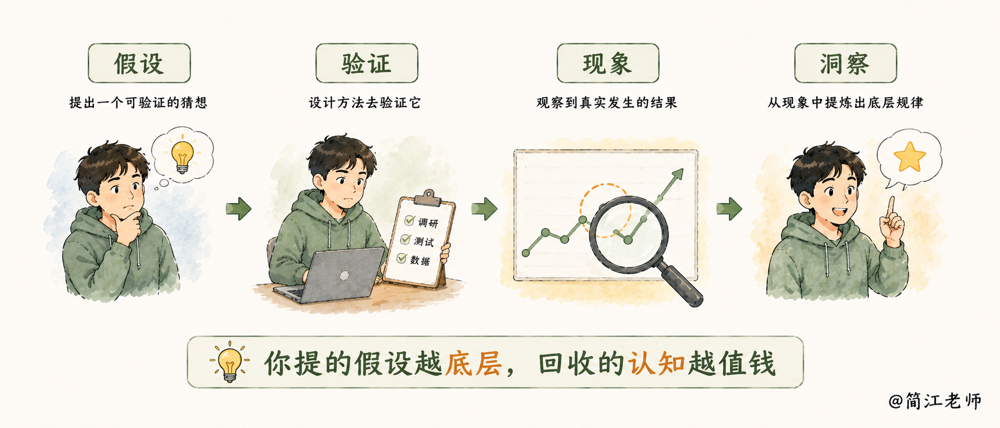

### 七、错了也不亏：把失败换成认知

最后一个问题：万一验证下来，失败了呢？这钱和时间，是不是白花了？我用一个自己的完整案例回答。

#### 一瓶洗发水的四轮验证

2015 年，我们开发了一款防脱发的洗发水。

**第一轮。我们觉得脱发主要是男性问题，把目标锁定在中关村熬夜脱发的程序员身上。**结果呢？还记得那两个信条吗——他们确实脱发，一开始也感兴趣。但真想防脱，得坚持做头皮护理，比洗头麻烦得多。

他们嫌麻烦，坚持不下来，所以只买一次，几乎没有复购。而对消费品来说，最要命的不是没人买，是没人**复购**——没有复购，营销成本永远摊不平。

**第二轮。快绝望的时候，出现一个神奇的现象：帮我们推销的女性合作伙伴，自己反倒用上了。**一问才知道，女性也有很深的脱发困扰——发缝变宽、发际线上移，只是平时不说。

于是我们调转方向，投美妆自媒体。转化还行，复购依然不理想：她们觉得产品不错，但嫌贵。

**第三轮。我们没有放弃，开始拆数据，把不同公众号的转化率和复购率一个个摆出来对比。**结果发现，并不是所有渠道都差，有一类号一枝独秀：母婴号。

**第四轮。顺着这条线索做深度访谈，真正的洞察浮出水面。**刚生完孩子的宝妈，才是核心用户：产后脱发厉害，又正处在容貌焦虑最强的阶段。

更妙的是花钱逻辑变了——单身女生给自己花钱挺省的，但当奶粉两百块一罐、一个月吃四五罐的时候，宝妈给自己买瓶两百块的洗护产品，心安理得。拿到这个洞察，我们把宝妈定为主攻方向，之后的一系列产品都围绕这个人群设计。

你们可能都知道特斯拉电动车，SpaceX的创始人马斯克，他就是一个不断愿意承担风险，面对挑战的人，但是我们看，他每一次冒险，其实把得失都算的很清楚。

他测试星舰，虽然中途爆炸了很多次，每一次爆炸，都是一次成本可控的验证，拿到了新的认知，去争取下一次的成功。

#### 假设 → 验证 → 现象 → 洞察

现在回头看：四轮验证，前三轮都"失败"了。白测了吗？没有一轮是白费的。每一轮，都把"想象"和"事实"之间的差距，一步一步的缩小。

提炼成一个公式：

> **假设 → 验证 → 现象 → 洞察。**

**你提的假设越底层，回收的认知越值钱。**

从这里，我再给你们一个可以实际操作的方法：以后设计 MVP 的时候，不要只设计"怎么测"，还要**事先设计好——如果这次验证失败了，我要通过什么方式，拿到什么认知？**

比方说，没人买，我要问清楚他们为什么不买；买了不复购，我要搞明白他们卡在哪一步。把这些问题提前列出来，失败的那一刻，恰恰是收集答案的最好时机。

这样一来，实验成功，你赚到结果；实验失败，你赚到认知。无论哪种结局，都没有白费力气。这不是自我安慰，这是事先就设计出来的。

一句话总结：**低段位的 MVP 帮你省钱。高段位的 MVP，帮你在这件事上比别人看得更明白。**