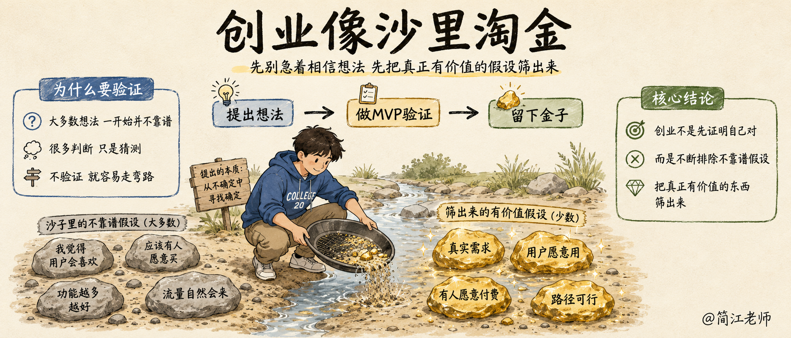
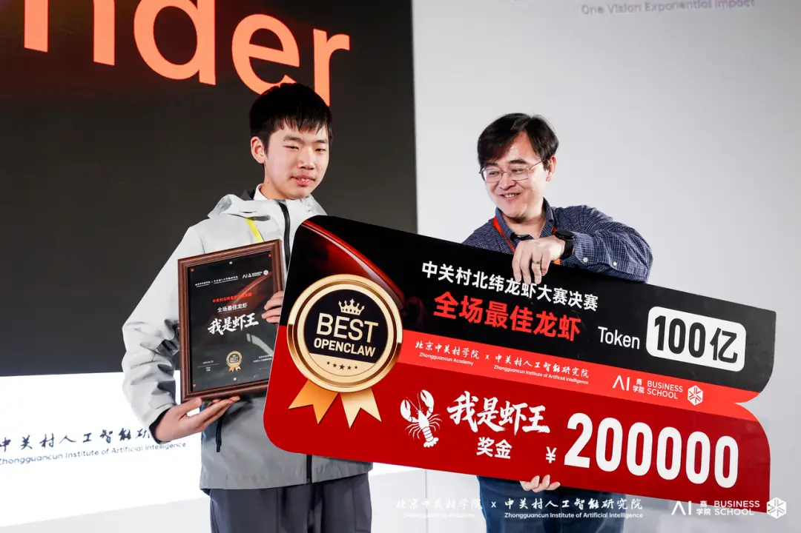
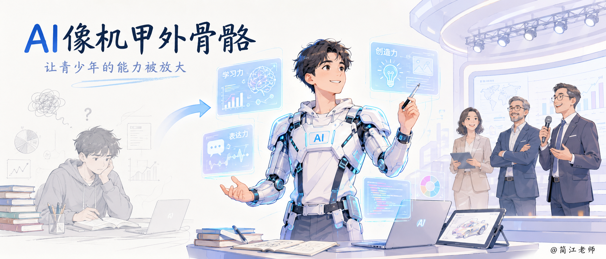

### 八、课程总结

课程接近尾声了。今天讲了不少东西，把它捋一下。

#### 整条线，从头捋一遍

咱们首先分析了现实世界中的问题往往是**没有标准答案的**。这个答案书本上没写，也很难靠拍脑袋拍出来。我们只有**通过测试才能拿到真实的反馈**。

而这个**测试大多数时候也是要失败的**，所以说我们就需要**控制好试错成本**。这个就是**精益思维**。

然后我们提到精益思维，不光老板需要，创业的人需要，我们做学生的人也需要。

因为人生无处不面临选择。有些选择代价很小，但有些选择代价很大。那对于那些代价很大的选择，一旦选错了，你可能就会承受非常多的损失。这个时候我们就要想办法**用MVP的方式去降低风险**。

所以我们提出了一个关键的概念：**所有还没有成为事实的东西，都需要验证。**

找出那个“如果错了，整件事就不靠谱了”的关键假设，用最小的成本去测——**能蹭就蹭，能借就借；人工先上，系统后补；尽早发布，别憋大招**。

测错了也不亏。**假设、验证、现象、洞察，每转一轮，想象和事实的距离就靠近了一截。**洗发水转了四轮撞见宝妈，小米转到手机，美团转到外卖——手里留着弹药，不停尝试下去，就能撞见对的方向。

#### 一把尺子，一个反例

**代价小的，不验证也无所谓；代价大到承受不起的——先测。**

也别以为钱多就可以不测。小黄车 ofo，资本砸了上百亿，在单车模式还没验证清楚能不能赚钱的时候，就把车铺满了全国。

结局你们知道：一千多万人排队退押金，很多人的九十九块钱到今天没退回来。**钱越多，砸在没验证的判断上，摔得越重。**

#### 为什么低成本验证的概念值得伴随你一生。

一个人这一辈子，时间、精力、金钱，都是有限的。尤其是时间和精力——它们是你的不可再生资源，花掉一分，就少一分。

怎么让这些有限的资源，产生最大的收益？靠的就是今天讲的**低成本验证的思维。**它能大幅提高你做任何一件事的 ROI。学习上用它，少走弯路；做事业用它，少踩大坑。日积月累，它会变成你人生的乘数和复利。

#### 你们可能比大人还厉害

前段时间办活动，我认识了一个北京中学初二的学生，叫姜睦然。他二月份参加了海淀区的“龙虾大赛”，一群人比赛用 AI 智能体做项目，看谁做得更厉害。这个小哥哥，拿了第一名。奖金，二十万。

**【💡划重点】**这不是中学生比赛，这是成人比赛。他的对手是海淀区的专业程序员、产品经理，里面不乏清华北大毕业的、大厂出来的人。一个十四岁的初中生，赢了他们所有人。

这种事放在 AI 出现之前，几乎不可能。但现在，AI 就像给孩子装上了一副**外骨骼**：写代码、做设计这些吃经验的活儿，AI 都能替你补上。

经验的差距被抹平之后，大人和孩子站上了同一个赛场——**拼的不再是技术和经验，而是你对真问题的理解，和你敢不敢动手去试。**

**【🙋互动】**说到敢试，我再讲一个我观察到的现象。我给小学生、初中生、高中生都上过课，你们猜，**哪个年龄段的学生冲劲最足？**

> 是小学高年级的学生。他们敢尝试，不怕犯错。反而越往上，越想先找到“正确答案”再动手。那份敢试的劲儿，你们小时候都有，是一路长大，慢慢收起来的。今天，把它拿回来。

**想象力，你们本来就有。AI 外骨骼，就在手边。试错的方法，今天也学到了。**这三样凑齐——你们真的有可能，比大人还厉害。

#### 最后用三句话做总结

- 柳井正说：一胜九败。失败是常态，成功是偶然。
- 而 MVP 不做别的，它只保证一件事：让你每一次失败之后，手里还有子弹。
- 一堂说：我大概率会失败，但我一定会成功。因为每一次小成本的失败，都在把我推向那次成功。

**MVP，能大幅度降低我们的试错成本，成倍提升我们的成功率。**

下课之前，别忘了今天的约定，各位总——从今天起，用老板的眼睛，去看你要做的每一件事。