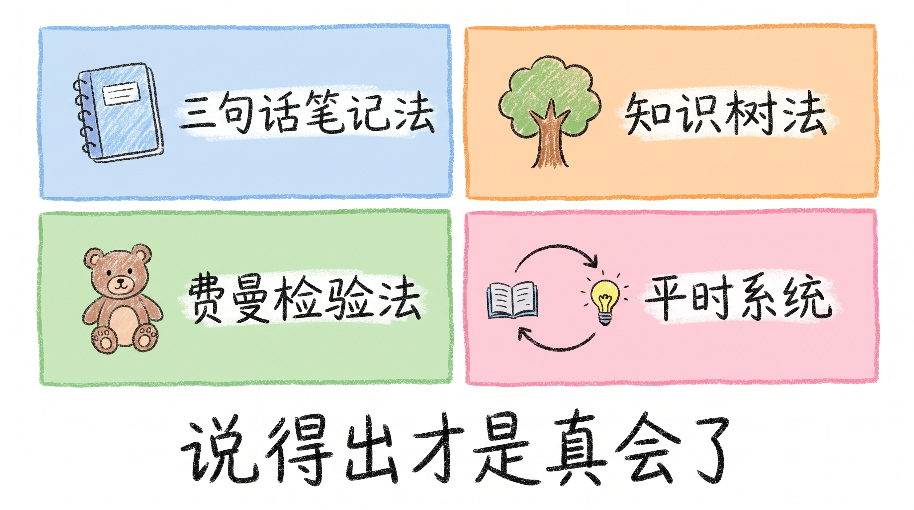

### 五、深度讲解：三个工具

好，侦探当完了。补补的故事里藏着三个工具。现在我一个一个给你们讲清楚。这三个工具有一个共同的特点：**它们不是让你学更多，是让你发现自己哪里没学会。**

#### 工具一：三句话笔记法，「做备忘」

> **核心问句：如果只能说三句话，我最先说什么？**

第一个工具，叫三句话笔记法。它对应的是"做备忘"这一步。怎么做？每次学完一个东西，上完一节课、看完一个视频、搞懂一道题，合上书，拿出一张纸，写三句话：

> - 第一句：这个知识点最重要一个例子是什么？

> - 第二句：它和你之前学过的什么有关？

> - 第三句：它什么时候用得上？

就三句。不许超。为什么是三句？因为三句话逼你必须**提炼**。你不能把一整段话抄上去，那不叫提炼，那叫抄写。你必须从一堆信息里挑出最核心的那一条。还记得开场那个光合作用实验吗？你觉得你懂了，但让你说一句话说不出来。**三句话笔记法，就是逼你把"说不出来"变成"说得出来"。**

补补复习的第一步就是这个。他合上书写三句话，写完一对照，发现漏了"去分母"，**这个漏洞不是翻书能发现的，是"说"出来的。**

这一步看上去很小，但它有一个巨大的作用：**它让你不满足于"看过了"。**以前你学完一个东西，大脑告诉你"我懂了"，你就信了。现在你逼自己说三句话，大脑就必须真的去翻箱倒柜，把那个知识点从角落里拽出来。拽不出来？那就是没学会。

#### 工具二：知识树法，「建体系」

第二个工具，叫知识树法。它对应的是"建体系"这一步。

怎么做？拿出一张白纸，画一棵树。先画主干，这个单元最核心的概念是什么。然后长出几根枝，这个概念下面分了几个子类别。每根枝上再长出小枝，每个子类别下面有什么具体的知识点。画的时候有一个规则：**不许看书。** 合上书画。画不出来、卡住的地方，就是你脑子里的空洞。卡住了，翻书看一眼，补上，继续画。

还记得小美吗？她也画了图。但她的图是看着书画的，画得特别漂亮。小美的图是"摆/抄"出来的，把知识点摆在了纸上。补补的树是"长"出来的，从脑子里长出来的。**区别在哪？** 小美画完之后，脑子里记住的是"右上角是蓝色的"。补补画完之后，脑子里记住的是"这根枝连着那根枝，因为……"。

知识树的价值不在"画得好看"，在画的时候你**追问了连接关系**，这个知识点为什么在这根枝上？它和旁边那根枝什么关系？你必须回答这些问题，才能把树画出来。

你想啊，如果你脑子里的知识是一个一个散落的点，考试的时候题目变个花样，你就找不到对应那个点了。但如果你脑子里是一棵树，题目怎么变，你都能顺着枝找到对应的位置。

#### 工具三：费曼检验法，「练能力」

第三个工具，叫费曼检验法。它对应的是"练能力"这一步。这个名字听着唬人，其实就一件事，

**合上书，讲给别人听。**

补补讲给谁听？讲给他桌上的小熊。为什么是小熊？因为小熊不会嘲笑你。小熊不会说"这你都不懂"。小熊就坐在那，安静地听你讲。你讲到卡住的地方，小熊不会催你。**你可以停下来，翻笔记，看懂了，重新讲。**

费曼是一位物理学家，拿过诺贝尔奖。他说过一句话，大意是：**如果你不能把一个东西讲给一个外行听，让外行听懂，那你就是没真懂。**这就是费曼检验法，**用"能不能讲清楚"来判断"是不是真会了"。**

你想想看，开场那个光合作用实验，不就是费曼检验法吗？你觉得你懂了，让你讲，讲不出来。那就是没懂。

有人可能说："老师，我讲不出来怎么办？会不会很丢人？"不会。**说不出来等于还没学会，不用不好意思，这是你找到盲区的证据。** 你不是不行，你只是找到了一个还没补上的洞。找到洞，你就知道该补哪里了。比那些以为自己没有洞、到了考场上才发现满身是洞的人，强太多了。

#### 补补的「平时系统」

三个工具讲完了。但有一个东西我还没讲，补补那个**"待搞懂"备忘录。**你们回忆一下，补补考完说的那句话："不是我临时抱佛脚。"他的三个工具不是到了考前才用的。他平时就在跑一个微型系统：

> - **存入**：遇到想不通的东西，丢一句话进备忘录。

> - **暂存**：不急着整理。

> - **回看**：翻的时候有些已经懂了，有些还需要补。需要补的，就成了下次复习的靶心。

这个系统特别简单。一句话，手机备忘录就行。但它做到了一件事：**补补考前不用"重新学"了，他其实是在"查漏补缺"。**而看看、刷刷、小美三个人考前是在"重新学"，从零开始翻、从零开始刷、从零开始画。你们说，谁更累？谁效果更好？