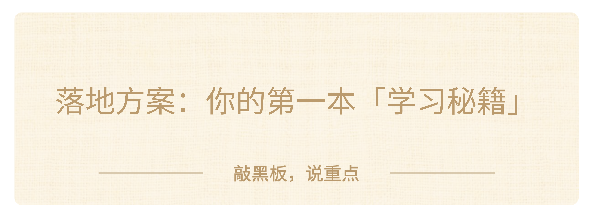

### 六、落地方案：你的第一本「学习秘籍」

好，道理讲完了，工具也给了。你们可能会想："老师，道理我都懂了，但具体怎么开始？我到底要做什么？"

很简单。**四步。我只讲一遍。**

#### 第一步：存

遇到一个搞懂了的东西，写一句话，存起来。什么叫"搞懂了"？，你合上书能讲出来，或者你之前卡住的地方现在通了。**什么叫"一句话"？，不是抄书，不是做笔记。就是你自己的话。**

比如：

> - "去分母其实就是在方程两边同时乘以分母的最小公倍数。"，这是你自己琢磨出来的。

> - "光合作用不是植物吃饭，是植物用光把水和二氧化碳变成糖和氧气。"，这是你用自己的话重新说的。

> 工具？手机备忘录就行。微信发给自己也行。一张纸一个本子也行。

**规则只有一个：一句话。多了不写。**

#### 第二步：翻

存了不急着整理。周末拿出来翻一遍。叫它"杂货铺"也好，叫它"待搞懂"也好，跟补补一样。名字不重要。

**翻的时候，有些已经懂了，划掉或打个勾。有些还是不太懂？那条就是你下周该优先搞定的东西。**

这一步的价值：**你不是在"整理"，你是在给自己定制复习清单。**

#### 第三步：挑

一学期下来，你大概存了三五十条。挑出你觉得最有用的十条。标准很简单：哪十条让你觉得"这个东西让我变强了"？这十条就是你的"学习秘籍 Top 10"。考前看一遍，比翻整本书有用得多，因为这是你自己一个字一个字攒出来的，每一条你都真正搞懂过。

#### 第四步：养

每次考完试，回来加一条。加什么？加一条这次考试让你最深刻的一个教训或者一个发现。

比如："考前我以为自己会了，合上书讲的时候发现只记得一半。以后复习第一件事不翻书，先默写。"你看，这就是一条从考试里长出来的经验。这篇东西会慢慢长大。初一十条，初二二十条，初三，你手里有三十条你自己一个字一个字攒出来的东西。

它不是老师发的，不是网上抄的。它是你“养”出来的。**"养"这个字，就是它的魂。它不是一次写完的，是你养大的。**

#### **关于工具**

有同学问：用什么存？

> - 如果你有手机：备忘录最简单。不建分类、不建文件夹。就一个页面，往下堆。

> - 如果你没有手机：一个小本子。只写正面，背面留着以后补充。

关键不是用什么存。关键是，**存了以后你会回来看。**一年后如果你存了 100 多条，觉得自己需要更好的工具了，那时候你再去找。不是现在。现在，你只需要一个打开就能写的地方。